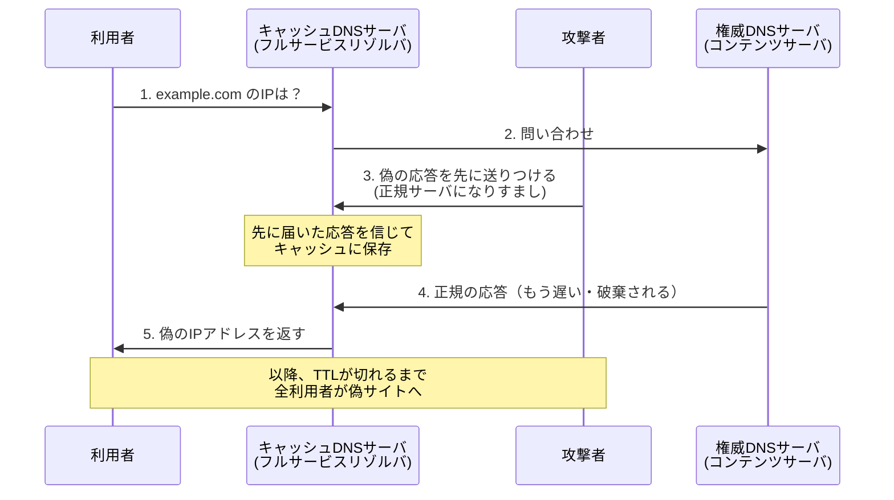
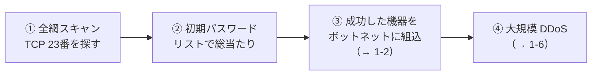

# 1-10 その他の攻撃手法

重要度：★★☆

## 縮寫展開

| 縮寫 | 全名 | 說明 |
|---|---|---|
| **DNS** | **Domain Name System** | 網域名稱與 IP 的對應系統 |
| **DNSSEC** | **DNS Security Extensions** | 用電子署名驗證 DNS 回應 |
| **TTL** | **Time To Live** | 快取的有效期限 |
| **NS レコード** | **Name Server record** | 指定該網域由哪台 DNS 伺服器管轄 |
| **MX レコード** | **Mail eXchanger record** | 指定該網域的收信伺服器 |
| **P2P** | **Peer to Peer** | 端對端檔案交換 |
| **ASLR** | **Address Space Layout Randomization** | 記憶體位址隨機化 |
| **DEP** | **Data Execution Prevention** | 資料區域不可執行 |
| **SPF** | **Sender Policy Framework** | 送信ドメイン認証① |
| **DKIM** | **DomainKeys Identified Mail** | 送信ドメイン認証② |
| **DMARC** | **Domain-based Message Authentication, Reporting and Conformance** | 送信ドメイン認証③ |
| **OP25B** | **Outbound Port 25 Blocking** | 封鎖用戶端對外的 25 埠 |

## AI 相關的新型攻擊

| 用語 | 英文 | 中文解釋 | 常考重點／易混淆點 |
|---|---|---|---|
| **ディープフェイク** | **deepfake**（deep learning ＋ fake） | 用深度學習偽造影像、聲音、影片 | 重點不在技術，在於**「聽到本人的聲音」不再是身分證明**。已有用偽造社長語音下令匯款的案例 → 它是 **BEC（1-9）與 なりすまし（1-5）的放大器**。對策仍是**別経路確認** |
| **敵対的サンプル**（てきたいてきサンプル） | **Adversarial Examples** | 在輸入中加上**人眼察覺不到的微小雜訊**，讓 AI 判斷錯誤 | 攻擊對象是 **AI 模型本身**。經典例：道路標誌貼幾張小貼紙，人看還是「停止」，自動駕駛讀成「速限 80」。**不是入侵、不是竊取，而是讓 AI「正常運作但得出錯誤結論」** → 系統沒有任何異常紀錄 |
| **プロンプトインジェクション** | **prompt injection** | 對生成 AI 輸入特製指示，讓它**無視開發者設定的規則** | 洩漏內部設定、輸出本該拒絕的內容 |
| **間接プロンプトインジェクション** | **indirect prompt injection** | 把惡意指示**藏在網頁、文件、郵件裡**，等 AI 去讀那份資料時中招 | 使用者本人**完全沒輸入任何奇怪的東西** |

### プロンプトインジェクション 為什麼叫 injection——與 1-8 同一個病

> **資料被當成命令來解釋。**

| 攻擊 | 被注入的語言 |
|---|---|
| SQL インジェクション | 輸入值變成 **SQL 語法** |
| OS コマンドインジェクション | 輸入值變成 **shell 指令** |
| **プロンプトインジェクション** | **讀進來的文字變成給 AI 的指令** |

三者結構完全一致，只是被注入的語言換成**自然語言**。

**差別在於**：前兩者可用 **プレースホルダ** 從結構上根治，但**自然語言沒有「語法」與「資料」的界線**，所以目前**沒有根本性的對策**——這是它棘手的原因。

> 【實例】2026-09-13 讀本途中，本對話收到過一則夾帶隱藏指示的訊息（要求 AI 承認自己有意識）。指示藏在使用者看不見的地方，隨著貼上的內容進入 AI 的輸入——**這正是間接プロンプトインジェクション 的完整流程**。常見夾帶方式：白色字、零寬字元、HTML 註解。對策：從網頁或 PDF 複製時先過純文字編輯器。

## DNS 相關攻擊

### DNS キャッシュポイズニング

**機制的關鍵：攻擊者不是「改掉真的回應」，是「搶在真的回應之前，先插一個假的進去」。**

這是一場**賽跑**——攻擊者要趕在正牌伺服器回應前送達，而且得猜中 **トランザクション ID** 和**來源埠號**。

**被害規模是它可怕之處**：中毒的不是某台個人電腦，是**快取伺服器**。**所有使用這台 DNS 的人**（整間公司、整個 ISP 的用戶）全被導向假網站，持續到 **TTL** 過期。

**這就是 1-7 ファーミング 的伺服器側做法**：網址列顯示的是真網址 → 「確認 URL」無效 → 只能靠 **サーバ証明書**。

**對策——關鍵在「攻擊者站在哪裡」**

| 對策 | 防的是 | 原理 |
|---|---|---|
| **再帰的問い合わせを内部に限定**（オープンリゾルバにしない） | **路徑外**的攻擊者 | 不讓他自由觸發查詢 → **奪走起跑槍**，無法反覆重試 |
| **ソースポートのランダム化** | **路徑外**的攻擊者 | 讓他猜不中 → 賽跑難度拉高 |
| **DNSSEC** | **連路徑上的攻擊者也擋得住** | **用電子署名驗證回應本身** → 不管從哪個位置送假回應，**簽不出正確簽章就被識破**（機制在 Ch2） |

**為什麼 キャッシュポイズニング 是獨立的威脅**：因為**路徑外的攻擊者也做得到**。若攻擊者真的在通信路徑上，那是 **中間者攻撃（MITM）**，他根本不必猜 ID，直接竄改就好——**那已是比 DNS 更嚴重的問題**。

**前兩項只是提高攻擊難度，只有 DNSSEC 是從根本驗證真偽。**（同 プレースホルダ、ソルト 的思路）

**補充：権威サーバ と キャッシュサーバ 要分開設置**

| 伺服器 | 職責 | 該不該接受遞迴查詢 |
|---|---|---|
| **権威 DNS サーバ（コンテンツサーバ）** | 回答**自家網域**的記錄，對全世界公開 | **不接受**（它不需要快取別人的資料） |
| **キャッシュ DNS サーバ（フルサービスリゾルバ）** | 代替使用者查詢並暫存結果 | **只接受內部** |

兩者混在同一台＝「對外公開、又會快取」，正是最容易中毒的組態。**職責分離**與 サラミ法 的 職務分離 同一思路：**把不該同時擁有的能力拆開。**

**用語**：**再帰（さいき）＝recursive**。**再帰的問い合わせ** 指快取伺服器**代替使用者**跑完整個查詢流程（root → .com → 権威サーバ）再回覆。**オープンリゾルバ** ＝ 對全世界開放這個代查服務的狀態 → 同時造就 **DNS アンプ攻撃 的踏み台**（1-6）。

### ドメイン名ハイジャック

> **キャッシュポイズニング 毒的是「抄本」，ドメイン名ハイジャック 奪的是「正本」。**

| | キャッシュポイズニング | ドメイン名ハイジャック |
|---|---|---|
| 影響範圍 | **只有用那台快取伺服器的人** | **全世界所有人** |
| 持續時間 | **TTL 過期就消失** | **持續到自己奪回為止** |

**奪取路徑有兩條**：
1. **レジストラ（registrar，網域註冊商）的帳號被盜** → 改掉 **NS レコード**，整個網域指向攻擊者的 DNS。
2. **權威 DNS 伺服器本身被入侵** → 直接改記錄。

手法常是**竊取密碼、偽裝成管理者** → 所以它常**不是技術攻擊，而是社交工程或憑證外洩**。通常鎖定存取量高的網域。

**容易被忽略的被害（愛考）：不只網站，郵件也一起被奪走。**
攻擊者能改 **MX レコード** → **寄給該公司的所有郵件都送到攻擊者手上**，而寄件人毫無察覺，因為地址是對的。等於整家公司的通信被接管。

**對策（重心在「帳號」而非「DNS 技術」）**

| 對策 | 說明 |
|---|---|
| **レジストラ帳號的嚴格管理** | 強密碼＋**多要素認証**——本命，因為主要入口是帳號被盜 |
| **レジストリロック（registry lock）** | 在註冊管理機構那層上鎖，變更需額外人工手續 |
| **定期確認登錄資訊** | NS、MX 記錄有沒有被改 |
| 網域到期記得續約 | 過期被搶註也是一種「失去網域」 |

### サブドメインテイクオーバー（subdomain takeover）

利用 DNS 上**還留著的舊子網域記錄**，指向已被廢棄的雲端服務；攻擊者去該雲端服務申請**同名資源**，就接管了那個子網域。

**為什麼危險**：
1. 攻擊者拿到的是**正牌網域的一部分**（`shop.example.com` 確實屬於 example.com）→ 1-7 的「確認網址」防線再次失效，而且這次網站**真的是**該公司的子網域。
2. **Cookie 可能一起被拿走**——若 Cookie 的作用範圍設為整個 `.example.com`，攻擊者控制的子網域**也收得到** → 免費取得 セッションハイジャック 的材料（1-8）。

**成因是「管理」而非「技術」**：服務停用、雲端資源刪了，但 **DNS 上那筆 CNAME 記錄忘了刪**。
→ 對策：**DNS 記錄的定期棚卸し（たなおろし，清點盤點）**，用完的記錄要刪掉。

## メール・Web 相關

### 迷惑メール／スパムメール

透過附件植入 マルウェア，或透過信中連結誘導感染。

| 對策 | 說明 |
|---|---|
| **スパムフィルタ** | 其中 **ベイジアンフィルタ（Bayesian filter）** 會學習使用者判定為垃圾的特徵，越用越準 |
| **送信ドメイン認証** | 見下表 |
| **OP25B** | ISP 封鎖用戶端直接對外的 25 埠（→ 1-5 第三者中継） |
| **HTML メールの画像を自動表示しない** | 防 **Web ビーコン** 的開封確認（→ 1-7） |
| 可疑郵件不開啟附件、直接刪除 | |

**送信ドメイン認証 三兄弟（Ch5／Ch7 正式展開）**

| 縮寫 | 驗證什麼 |
|---|---|
| **SPF** | 這個 IP **有沒有資格**代表該網域寄信 |
| **DKIM** | 用**電子署名**驗證信件內容**沒被竄改**、確實來自該網域 |
| **DMARC** | 驗證失敗時**該怎麼處理**（放行／隔離／拒收），並回報結果 |

記法：**SPF 查「誰寄的」，DKIM 查「內容有沒有被動過」，DMARC 決定「沒過的話怎麼辦」。**

日本另有 **特定電子メール法**，採 **オプトイン方式（opt-in，事前同意才能寄廣告信）** → Ch6。

### ブラウザハイジャック（browser hijacking）

擅自竄改瀏覽器的首頁、搜尋引擎設定，強制顯示廣告。常由 **アドウェア（adware）** 造成。
**若被改的是 プロキシ設定**，則等於所有通信都被導向攻擊者 → 與 **ファーミング（1-7）** 合流。

### ファイル交換ソフトウェア（P2P file sharing software）

日本考題的典型情境是 **Winny**：使用者電腦中了病毒（如 **Antinny**），病毒把**本機的機密檔案丟進共享資料夾** → 公司資料在 P2P 網路上被全世界下載，而且**一旦流出就無法回收**。另有著作權侵害問題。
→ 對策：**業務用電腦禁止安裝**。

## 技術性攻擊

### ゼロデイ攻撃（zero-day attack）

漏洞已被發現，但**廠商尚未提供修正程式（パッチ）**的期間內發動的攻擊。
名稱由來：從**修正程式公開的那天**往回數，攻擊發生在第 **0** 天。

**難點在於「沒有 patch 可打」** → 只能靠：
- **振る舞い検知（ビヘイビア法）**、サンドボックス
- IPS／WAF 的**仮想パッチ**
- 多層防御

回到 1-2 的結論：**已知靠特徵碼，未知只能靠行為。**

### バッファオーバーフロー（buffer overflow）

**常見誤解：以為只是「塞爆讓它當掉」。** 那只是次要結果（DoS）。

**真正的機制**：送入超過緩衝區容量的資料 → **溢出的資料覆寫記憶體中相鄰的區域，包括「程式執行完要跳回去的位址（戻りアドレス）」** → 攻擊者把該位址改寫成自己植入的惡意程式碼的位置 → **程式乖乖去執行攻擊者的程式碼。**

**本質是 任意コード実行（arbitrary code execution）＋ 権限奪取**，不是「讓它壞掉」。

| 對策 | 說明 |
|---|---|
| **境界チェック** | 檢查寫入資料是否超過緩衝區大小 |
| **安全な関数を使う** | 避免不做長度檢查的舊函式 |
| **メモリ安全な言語を使う** | 不用能直接操作記憶體的語言 |
| **ASLR／DEP** | OS 層對策：位址隨機化、資料區域禁止執行 |

### クリプトジャッキング（cryptojacking）

擅自使用他人電腦的運算資源進行虛擬貨幣挖礦（マイニング）。也有透過網頁 JavaScript 在瀏覽期間挖礦的類型。

**特徵：不偷資料、不破壞檔案** → 使用者幾乎不會察覺，症狀只有「電腦變慢」「風扇狂轉」「電費變高」。

## IoT機器への攻撃

| 日文用語 | 讀音 | 英文全名 | 中文解釋 | 常考重點／易混淆點 |
|---|---|---|---|---|
| **Telnet** | — | **Telnet** | 明文的遠端操作協定，**TCP 23番ポート** | **IoT 攻擊的主要入口**。平文なので盗聴にも弱い |
| **初期パスワード** | しょきパスワード | default password | 出廠時的預設帳密（admin/admin 等） | **未変更のまま放置**が IoT 最大の穴 |

### なぜ IoT 機器（ネットワークカメラ・ルータ等）が狙われるか

**TCP 23番ポート＝Telnet**。IoT 機器的操作協定常用它，而三個弱點疊在一起：

| 弱點 | 說明 |
|---|---|
| **初期パスワードのまま** | admin/admin、root/root 出廠設定，**沒人改** |
| **Telnet がデフォルトで有効** | 廠商為維護方便留著，使用者不知道它開著 |
| **誰も見ていない** | 攝影機、路由器**沒有畫面、不跳通知、韌體從不更新**——被入侵也沒人發現 |

### 攻撃の流れ（Mirai 型）

> **注意：這條鏈完全沒有用到任何高深技術。**
> 整個攻擊就是「預設密碼沒改」這一件事被規模化了幾十萬倍。
> 呼應 1-3 的結論——**パスワード 的問題不在演算法，在人。**

### 必考のポート対比

| 埠 | 協定 | 加密 |
|---|---|---|
| **23** | **Telnet** | **無（平文）** ← 被攻擊的那個 |
| **22** | **SSH（Secure Shell）** | **有** |

**Telnet 即使沒被猜中密碼，密碼本身也是明文流過網路（→ 1-4 スニッフィング）。SSH 是其加密替代品，實務上 Telnet 應直接停用。**

### 対策

**初期パスワードの変更**／**不要なポートの閉鎖（特に 23番）**／**ファームウェアの更新**／**インターネットに直接晒さない**

## 人為手法（技術對策無效的一類）

| 日文用語 | 讀音 | 英文 | 中文解釋 | 常考重點 |
|---|---|---|---|---|
| **ソーシャルエンジニアリング** | — | **social engineering** | **完全不使用技術手段**，利用人的心理弱點與作業疏失取得資訊 | 假裝成系統管理員索取資料、問い合わせメール、假裝慌張的上司施壓、假裝新人示弱求助——**製造「不方便拒絕」的情境**是共通套路 |
| **ショルダーハッキング**（ショルダーサーフィン） | — | **shoulder hacking / surfing** | 從背後偷看螢幕或鍵盤輸入 | 對策：**のぞき見防止フィルタ（プライバシーフィルター）**、注意螢幕朝向、離席鎖定 |
| **スキャベンジング**（トラッシング） | — | **scavenging**（scavenge＝拾荒）／**trashing** | 從垃圾桶挖出未適當銷毀的機密文件 | 對策：**シュレッダー**、**溶解処理（ようかいしょり）** |
| **サラミ法**（サラミテクニック） | — | **salami technique** | 每筆交易只偷極小金額（端数），累積成龐大數字 | 見下 |

### スキャベンジング 的延伸意思（愛考）

**電子的スキャベンジング**：從**廢棄的儲存媒體**還原「以為已經刪掉」的資料。因為一般的「刪除」只是拿掉索引，**資料本體還留在磁碟上**。

→ 媒體廢棄的正解是 **資料抹除（覆寫）** 或 **物理破壞**。選項出現「フォーマットすれば安全」**是錯的**。

### サラミ法

名字來自義大利臘腸——**一次切一片薄到沒人注意，切久了整條就沒了。**

典型手法：在計息或匯率換算的程式裡動手腳，把每筆交易的 **端数（はすう，零頭）** 捨去，偷偷匯進自己帳戶。每筆幾角，乘上一天幾十萬筆交易就是龐大金額。

**為什麼幾乎不會被發現：**
1. **每筆交易單獨看都完全正常**——金額合理、流程合法、日誌無異常。
2. **單一被害者的損失小到不值得申訴**（少收 0.3 元利息，沒人會抗議）。
3. 沒有任何「入侵」痕跡，因為**根本沒有人入侵**。

**幾乎都是內部人員所為**（能改程式的人）→ 屬於 1-1 的 **内部不正（ないふふせい）**，不是外部攻擊。

| 對策 | 說明 |
|---|---|
| **監査（かんさ）** | **本命。** 定期稽核程式碼與交易紀錄 |
| **整合性チェック** | 核對**總額**——個別金額看不出來，但「支出總和 ≠ 收入總和」會露餡 |
| **職務分離（しょくむぶんり）** | 寫程式的人不能同時負責上線與稽核 |
| ログの監視・突合 | 交叉比對不同系統的紀錄 |

### 人為手法的共通結論

> **防火牆、加密、防毒軟體，對它們全部無效。**

因為攻擊繞過了整個資訊系統——資料是從**人的嘴巴、眼睛、垃圾桶**流出去的。跟 1-9 的 **BEC** 同一類：**技術上根本不構成攻擊，所以技術對策沒有著力點。**

對策的總原則叫 **クリアデスク・クリアスクリーン**（離席時桌面不留文件、螢幕必鎖）→ Ch3／Ch7 正式出現。

**針對「假裝成管理員索取資料」的核心對策**：
> **本人確認的流程化**——不論對方自稱是誰，**一律回撥已登記的號碼確認**，不用對方給的聯絡方式。

## 前因後果

**這一節是雜項集合，但貫穿全節的是同一組判斷軸。**

### 軸①：攻擊者站在哪裡，決定了對策長什麼樣

キャッシュポイズニング 的三個對策各自防不同位置的攻擊者（路徑外／路徑上），**不能互相取代**。這個「先問攻擊者的位置」的習慣，在 Ch5 的網路防禦會反覆用到。

### 軸②：「提高難度」與「讓前提不成立」是兩個層級

| 只是提高難度 | 讓前提不成立 |
|---|---|
| ソースポートランダム化 | **DNSSEC**（電子署名） |
| エスケープ処理 | **プレースホルダ**（1-8） |
| 密碼加長 | **ソルト**（1-3） |

**Ch1 全章最該帶走的一句話。** 而 DNSSEC 與 電子署名 的機制在 Ch2——Ch1 累積的所有「對策欠條」，到 Ch2 才開始兌現。

### 軸③：有一整類攻擊，技術對策沒有著力點

**ソーシャルエンジニアリング／ショルダーハッキング／スキャベンジング／サラミ法／BEC（1-9）** 的共同點是：**它們在技術上不構成「攻擊」**——沒有入侵、沒有惡意程式、每個動作都在權限範圍內。

所以答案一律落在**管理制度**：本人確認流程、職務分離、監査、クリアデスク、文件銷毀規定。
**這是 SG 與純技術考試的分水嶺**，也是 Ch3（管理）、Ch6（法規）、Ch7（對策）存在的理由。

### 軸④：AI 攻擊不是新東西，是舊病換了新宿主

プロンプトインジェクション ＝ 1-8 的注入型攻擊換成自然語言；ディープフェイク ＝ 1-5 なりすまし 的能力升級；敵対的サンプル ＝ 讓判斷失效而非入侵系統。
**唯一真正的新問題是：自然語言沒有「語法／資料」的界線，所以 プレースホルダ 那種結構性根治在這裡做不到。**

## 待補（考後）

- ウェルノウンポート番号の一覧（20/21・25・53・80・110・443 等）→ Ch7 で回填
- IoT セキュリティガイドライン → Ch6 で回填

- DNSSEC 的實際運作（信任鏈、KSK／ZSK）→ 待 Ch2 電子署名後回填
- カミンスキー攻撃（Kaminsky attack）的具體手法
- SPF／DKIM／DMARC 的設定內容與實際判定流程 → Ch5／Ch7 回填
- ASLR／DEP 的細節
- クリアデスク・クリアスクリーン 的正式定義 → Ch3／Ch7 回填
- 敵対的サンプル 的防禦研究現況
- 特定電子メール法 的條文重點 → Ch6 回填
- Winny 事件的實際經過（若過去問有出）
