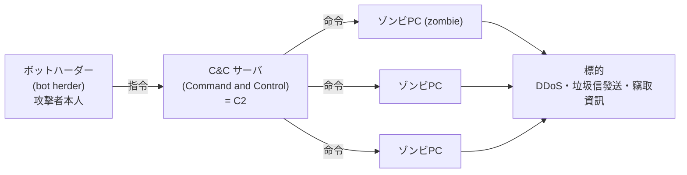

# 1-2 マルウェア

重要度：★★☆

> 依導讀順序重寫，不收錄書上原文、原表與練習問題原文。
> **本節依導讀順序分為 ①〜⑩。**

## 縮寫展開

| 縮寫／外來語 | 英文全名 | 說明 |
|---|---|---|
| **マルウェア** | **malware**（malicious ＋ software） | 惡意軟體總稱 |
| **コンピュータウイルス** | **computer virus** | 寫法是ウ**イ**ルス（大的イ），不是ウィルス |
| **ワーム** | **worm** | 不需宿主、自己擴散 |
| **トロイの木馬** | **Trojan horse** | 偽裝成正常軟體 |
| **ダウンローダ** | **downloader** | 進來後才下載本體 |
| **ドロッパ** | **dropper** | 內部藏著本體 |
| **バックドア** | **backdoor** | 繞過正規認證的入口 |
| **RAT** | **Remote Access Trojan** | 遠隔操作ウイルス |
| **マクロウイルス** | **macro virus** | 利用 Office 巨集 |
| **VBA** | **Visual Basic for Applications** | Office 的巨集語言 |
| **ボット** | **bot**（robot） | 可被遠端操控的惡意程式 |
| **ゾンビPC** | **zombie PC** | 被 bot 感染的電腦 |
| **C&C サーバ／C2** | **Command and Control server** | 下命令的中繼伺服器 |
| **テイクダウン** | **takedown** | 切斷 C&C 使 botnet 瓦解 |
| **P2P** | **Peer to Peer** | 對等式 |
| **DDoS** | **Distributed Denial of Service** | 分散式阻斷服務攻擊（→ 1-6） |
| **ランサムウェア** | **ransomware**（ransom ＋ software） | 加密檔案索贖 |
| **RaaS** | **Ransomware as a Service** | 勒索軟體出租分潤 |
| **ファイルレスマルウェア** | **fileless malware** | 不留檔案、在記憶體執行 |
| **WMI** | **Windows Management Instrumentation** | Windows 內建管理機制 |
| **スパイウェア** | **spyware** | 偷偷蒐集並外送資訊 |
| **アドウェア** | **adware** | 強制顯示廣告 |
| **キーロガー** | **keylogger** | 記錄鍵盤輸入 |
| **ルートキット** | **rootkit**（root ＋ kit） | 維持管理者權限並隱藏痕跡的工具組 |
| **カーネルモード** | **kernel mode** | OS 核心層級的執行權限 |
| **ポリモーフィック型ウイルス** | **polymorphic virus** | 每次感染改變外觀 |
| **メタモーフィック型ウイルス** | **metamorphic virus** | 連程式結構都改寫 |
| **エクスプロイトコード** | **exploit code** | 攻撃コード，針對特定漏洞 |
| **PoC** | **Proof of Concept** | 実証コード |
| **エクスプロイトキット** | **exploit kit** | 多個 exploit 打包的自動攻擊工具 |
| **ゼロデイ攻撃** | **zero-day attack** | 修補程式公開前的攻擊 |
| **パッチ** | **patch** | 修正プログラム |
| **ドライブバイダウンロード** | **drive-by download** | 瀏覽網頁就被植入 |
| **スタンドアロン** | **stand-alone** | 未連網的單機 |
| **USB** | **Universal Serial Bus** | — |
| **パターンマッチング法** | **pattern matching**（signature） | 特徵碼比對 |
| **ヒューリスティック法** | **heuristic** | 從程式碼特徵靜態推測 |
| **ビヘイビア法** | **behavior** | 執行並觀察行為 |
| **サンドボックス** | **sandbox** | 隔離執行環境 |
| **チェックサム法** | **checksum** | 檔案被改就報警（＝インテグリティチェック法，integrity check） |
| **ソフトウェアキーボード** | **software keyboard** | 螢幕鍵盤 |
| **ワンタイムパスワード** | **one-time password** | 一次性密碼 |
| **オフラインバックアップ** | **offline backup** | 離線備份 |

## 讀音

| 用語 | 讀音 |
|---|---|
| 自己伝染機能 | じこでんせんきのう |
| 潜伏機能 | せんぷくきのう |
| 発病機能 | はつびょうきのう |
| 宿主 | しゅくしゅ |
| 感染 | かんせん |
| 自己増殖 | じこぞうしょく |
| 可搬媒体 | かはんばいたい |
| 遠隔操作 | えんかくそうさ |
| 正規の認証手続き | せいきのにんしょうてつづき |
| 偽セキュリティ対策ソフト | にせセキュリティたいさくソフト |
| 身代金 | みのしろきん |
| 二重脅迫 | にじゅうきょうはく |
| 実証コード | じっしょうコード |
| 修正プログラム | しゅうせいプログラム |
| 権限昇格 | けんげんしょうかく |
| 踏み台 | ふみだい |
| 感染経路 | かんせんけいろ |
| 媒体 | ばいたい |
| 閉域網 | へいいきもう |
| 誤検知 | ごけんち |
| 定義ファイル | ていぎファイル |
| 最小権限の原則 | さいしょうけんげんのげんそく |
| 出口対策／入口対策 | でぐちたいさく／いりぐちたいさく |
| 多層防御 | たそうぼうぎょ |

---

## 本節的位置

1-1 講了「誰、為什麼攻擊」，本節講攻擊者最主要的**武器**。整節回答：**惡意程式怎麼進來、進來後做什麼、為什麼越來越難抓、該怎麼防？**
分類有兩個軸——**怎麼傳染**（②③）與**感染後做什麼**（④〜⑥）——這是讀懂本節的鑰匙。偵測方式在 Ch5 正式展開，本節先看「為什麼需要它們」。

---

## ① 定義：什麼算 ウイルス

マルウェア（malware）＝進行非使用者意圖動作的惡意軟體總稱。

IPA 的コンピュータウイルス対策基準 把 ウイルス 定義為：具備下列三種機能**其中一個以上**者。

| 機能 | 意思 |
|---|---|
| **自己伝染機能** | 把自己複製到其他程式或系統 |
| **潜伏機能** | 發病前完全無症狀，可由時間或條件觸發 |
| **発病機能** | 破壞檔案、執行非使用者意圖的動作 |

因為門檻是「一個以上」，所以 ウイルス 一詞有兩種範圍：

| | 範圍 |
|---|---|
| **廣義のウイルス** | ＝マルウェア 全體（ワーム、トロイの木馬 也被包含） |
| **狹義のウイルス** | 寄生**宿主**檔案、自我複製的類型 |

> 「**感染**了但還沒發病」是成立的狀態——潜伏機能 就是在描述這段期間。

---

## ② 怎麼傳染：ウイルス・ワーム・トロイの木馬

狹義的三大類型，用三個問題就能分開：

| | 需要宿主檔案 | 自己増殖 | 自律擴散（不需人操作） | 擴散靠什麼 |
|---|---|---|---|---|
| **ウイルス** | **要** | 會 | 不會 | 人去執行宿主檔案（傳檔、USB、開附件） |
| **ワーム**（worm） | 不要 | 會 | **會** | **脆弱性**，經網路／可搬媒体自動擴散 |
| **トロイの木馬**（Trojan horse） | 不要 | **不會** | 不會 | **偽裝**，騙使用者自己安裝 |

> **判別軸有兩組，看清題目問哪一組：**
> ワーム vs トロイ → 分水嶺是**會不會自己増殖**
> ワーム vs ウイルス → 分水嶺是**需不需要宿主**

**擴散方式不同，對策方向就完全不同：**

| 類型 | 對策方向 |
|---|---|
| ウイルス（靠人擴散） | **使用者行為**：不亂開附件、不插來路不明的 USB |
| ワーム（靠漏洞擴散） | **パッチ適用・脆弱性管理**；教育使用者幾乎無效 |

> **題型**：ワーム 的副作用是**塞爆網路頻寬**。題目描述「全公司網路突然爆量變慢」→ 往 ワーム 走。

**ウイルス 的現代代表：マクロウイルス（macro virus）**
利用 Office 的巨集功能（VBA，Visual Basic for Applications）。寄生在**文書檔**（.docm／.xlsm）而非執行檔 → **副檔名檢查擋不掉**；有 Office 就會中，跨平台。例：**Emotet**。

---

## ③ トロイの木馬 的種類，與 バックドア 的兩種意思

トロイの木馬 靠偽裝進門。進門後怎麼把惡意本體帶進來，分兩種：

| | ダウンローダ（downloader） | ドロッパ（dropper） |
|---|---|---|
| 本體在哪 | **不帶本體**，進來時是乾淨小程式，之後才從網路下載 | **本體藏在內部**（加密／壓縮），感染後解出落地 |
| 弱點／特色 | 進來那一刻沒有惡意碼 → **特徵碼比對抓不到** | **不需連外網，斷網環境也能發作** |

進門後的常見目的是留後路：

| 用語 | 內容 |
|---|---|
| **バックドア**（backdoor） | 留下後門，供攻擊者日後持續存取 |
| **RAT（Remote Access Trojan）／遠隔操作ウイルス** | 後門＋整套遙控介面（截圖、開麥克風、抓檔案） |
| **偽セキュリティ対策ソフト**（rogueware／scareware） | 假防毒。跳出「已偵測到 300 個病毒！」**煽動恐懼**，誘導付費或安裝真惡意程式 |

### ⚠️ バックドア 的兩種脈絡（過去問考過）

考法是問「哪一個**屬於** バックドア」——要你挑**符合定義的東西**，所以常以惡意程式以外的形式出現。

| | **① 惡意程式留下的後門** | **② 設計・實裝上的後門** |
|---|---|---|
| 誰弄的 | **攻擊者**（入侵成功後留下） | **開發者**（多為無意或圖方便） |
| 目的 | **日後不必再入侵一次就能進來** | 除錯、維護用的捷徑，**忘了拿掉** |
| 典型形態 | RAT、トロイの木馬 留下的常駐通道 | **不經正規の認証手続き（せいきのにんしょうてつづき）就能存取的 URL**、隱藏的管理畫面、寫死的帳密 |

在本節脈絡下容易只記得 ①，但考題常用 ② 的形式出題——用「URL」這種聽起來完全不像惡意程式的方式描述。

> **共通本質：能繞過正規認證手續的存取路徑。**
> **誰弄出來的、有意還是無意，都不影響它是 バックドア。**

---

## ④ 感染後做什麼：偷資訊、藏自己

②③分的是「怎麼進來」，這裡分的是「進來後做什麼」。

| 用語 | 做什麼 |
|---|---|
| **スパイウェア**（spyware） | 偷偷**蒐集＋外送**使用者資訊。不破壞、不加密 |
| **アドウェア**（adware） | 強制顯示廣告。**不必然違法** |
| **キーロガー**（keylogger） | 記錄鍵盤輸入，竊取帳密、卡號 |
| **ルートキット**（rootkit） | 取得管理者權限後，**維持權限並隱藏痕跡** |

### 惡意的光譜

マルウェア（惡意明確）→ スパイウェア（偷資訊，可能藏在同意條款中）→ アドウェア（僅顯示廣告，部分合法）。

> **考點在最下層：アドウェア 不必然違法。** 判斷基準是**有無取得使用者的同意（承諾，しょうだく）**——安裝時已告知並同意顯示廣告＝正規軟體；未告知而擅自蒐集行為資料＝跨線。

### キーロガー 的對策：各擋哪一種

| 對策 | 有效範圍 |
|---|---|
| ソフトウェアキーボード（software keyboard，用滑鼠點螢幕鍵盤） | 只擋**軟體型**。網銀常見 |
| 實體檢查 | **ハードウェアキーロガー**（hardware keylogger，插在鍵盤與主機之間）防毒軟體偵測不到，只能靠實體檢查 |
| ワンタイムパスワード（one-time password） | **最根本**：密碼被記下來也已失效。同時破解 キーロガー 與 盗聴（Ch2） |

### ルートキット：名字就是定義

root（管理者帳號）＋ kit（工具組）＝**取得管理者權限後，用來「維持」權限並隱藏痕跡的工具組合。**

- **兩者綁定**：沒有管理者權限就藏不了東西——藏行程、改核心、竄改日誌都需要 カーネルモード（kernel mode）或系統層級權限。「取得並維持管理者權限」是手段，「隱蔽」是目的。
- **権限昇格（けんげんしょうかく，privilege escalation）**：從一般權限爬到管理者權限。
- 攻擊標準流程：**侵入 → 権限昇格 → 設置 ルートキット → 長期潛伏**（接 1-1 的 APT）。

> 因為跑在系統層級，**OS 回報的資訊本身已不可信** → 偵測極困難，**最確實的處置是 OS 重灌**。

---

## ⑤ ボット：把你的電腦變成別人的兵

ボット（bot，來自 robot）＝被植入後**可被遠端操控**的惡意程式。被感染的電腦叫 ゾンビPC（zombie PC）。



| 角色 | 一句話 |
|---|---|
| ゾンビPC | 被 bot 感染、聽命他人的電腦 |
| ボットハーダー（bot herder） | 操控整群 bot 的攻擊者（herder＝牧人，→ 1-1） |
| C&C サーバ（Command and Control server） | 下命令的中繼點，也寫作 **C2**；轉發命令、回收竊得資料（司令塔） |
| ボットネット（botnet） | 被同一 C&C 操控的 zombie 群；執行 DDoS、垃圾信、竊取（實戰部隊） |

**為何隔一層 C&C，而不直連 zombie？**
1. **隱藏攻擊者身分**——追查只追得到 C&C。
2. **一齊控制**——幾萬台一次下令。

> **對策的正解：遮斷與 C&C 的通信**（出口対策（でぐちたいさく）／通信日誌監視）。C&C 一斷，botnet 即失去指揮 → **テイクダウン（takedown）**。
> **進階**：**P2P（Peer to Peer）型ボットネット** 沒有單一 C&C，bot 互相傳令，**無法靠切斷單一伺服器瓦解**。

### 踏み台：受害者同時是加害者

**踏み台（ふみだい）**＝被拿來當攻擊中繼的機器。**你是受害者，同時也成了攻擊別人的加害者**——攻擊來源 IP 是你，責任可能算到你頭上。

> **題型**：問「感染了但自家沒有直接損失，可以放著嗎？」→ 永遠是不行。

日本實例：2012 年 **PC遠隔操作事件（PCえんかくそうさじけん）**，真兇用他人電腦當跳板發犯罪預告，造成**無辜者被誤逮**。

---

## ⑥ ランサムウェア：從加密到雙重勒索

ランサムウェア（ransomware），ransom＝**身代金（みのしろきん）**，贖金。加密檔案後索贖。

| 用語 | 重點 |
|---|---|
| **WannaCry（WannaCryptor）** | 2017 年全球災情。**是 ランサムウェア，卻用 ワーム 方式靠 Windows 漏洞自動擴散**，不需人點任何東西——兩個分類軸並存的好例子 |
| **二重脅迫（にじゅうきょうはく，double extortion）** | 加密之外再加一招：不付錢就**公開竊得的資料** |
| **RaaS（Ransomware as a Service）** | 勒索軟體做成服務出租分潤，**開發者與實行者分離** |

**對策：オフラインバックアップ（offline backup）**——**必須離線保存**，連網或常時掛載的備份會被一起加密。

> **不付贖金**的理由不是道德而是實務：付了不保證能解密、不保證資料不外流，而且會被標記成「會付錢的客戶」，招來下一次攻擊。

> **⚠️ 二重脅迫 推翻了舊的標準答案。** 以前「有備份就不用怕」；現在**備份救得回可用性，救不回機密性**——資料已被偷走，還原再快對方照樣能公開。正解是「**備份＋資訊外洩對策兩者都要**」，只答備份不完整。

---

## ⑦ 漏洞與攻擊工具：ゼロデイ 是時間問題

ワーム、WannaCry 都靠漏洞擴散。把漏洞變成攻擊的東西：

| 用語 | 重點 |
|---|---|
| **エクスプロイトコード**（exploit code）／攻撃コード | 針對特定脆弱性的攻擊程式碼 |
| **PoC（Proof of Concept）／実証コード（じっしょうコード）** | 原本用來**證明脆弱性存在**、推動廠商修補，後被惡用 |
| **エクスプロイトキット**（exploit kit） | 多個 exploit code 打包成工具，自動挑漏洞下手 → **把攻擊門檻降到零** |
| **ゼロデイ攻撃**（zero-day attack） | 在**修正プログラム（パッチ，patch）公開之前**發動的攻擊 |

### ゼロデイ 的時間軸

```
脆弱性存在 → 被發現 → (公表/PoC 公開) → パッチ公開 → 套用完成
        └──── ゼロデイ攻撃 的期間 ────┘  └─ 未套用（放置）─┘
```

> **陷阱**：パッチ 公開**後**的攻擊不叫 ゼロデイ，那叫「未套用」——責任在使用者，不在廠商。

---

## ⑧ 感染経路：從哪裡進來

| 路徑 | 關鍵詞 |
|---|---|
| 郵件 | 附件開啟、本文連結（→ 1-7 フィッシング、1-9 標的型攻撃メール） |
| Web | **ドライブバイダウンロード（drive-by download）**——只是瀏覽被竄改的正常網站，什麼都沒點就中招 |
| 網路 | 共用資料夾、檔案共享軟體；ワーム 靠脆弱性自動擴散 |
| 媒体（ばいたい）／可搬媒体 | USB 隨身碟、DVD-ROM |

> **媒体專屬考點：完全未連外網的隔離環境（スタンドアロン（stand-alone）／閉域網）也會經 USB 感染。**
> 題目問「沒連網卻感染的理由」→ 就是這個。所以工控、製造現場的重點是**物理封住 USB 埠／管理帶入媒體**，不是防火牆。

---

## ⑨ 躲避與偵測：從「看長相」到「看行為」

攻擊者知道防毒軟體在比對特徵碼，於是讓自己沒有固定長相：

| 躲避技術 | 做法 |
|---|---|
| **ポリモーフィック型ウイルス**（polymorphic virus） | 每次感染就**改變自身程式碼樣貌**（換金鑰重新加密自己），功能不變、長相每次不同 |
| **メタモーフィック型ウイルス**（metamorphic virus） | 更進一步，**連程式碼結構本身都改寫** |
| **ファイルレスマルウェア**（fileless malware） | 不在硬碟留檔，直接在**記憶體**執行，借用 PowerShell、WMI（Windows Management Instrumentation）等 OS 內建工具 → 無檔案可比對，鑑識困難 |

偵測方式因此分成四種（Ch5 正式展開）：

| 方式 | 怎麼判斷 | 弱點 |
|---|---|---|
| パターンマッチング法（signature） | 比對已知病毒的特徵碼 | **未知病毒抓不到**；需不斷更新定義檔 |
| ヒューリスティック法（heuristic） | 不執行，從程式碼特徵靜態推測 | 誤検知（ごけんち）多 |
| **ビヘイビア法（behavior）** | 實際執行（通常在 **サンドボックス（sandbox）** 隔離環境）觀察行為 | 耗時耗資源；有些惡意程式偵測到沙箱就裝乖 |
| チェックサム法（checksum）／インテグリティチェック法（integrity check） | 檔案被改動就報警 | 只知「被改了」，不知是什麼 |

> **為何需要行為型偵測**：ポリモーフィック型（每次長相不同）與 ファイルレス（根本沒檔案）讓特徵碼比對失效 → 偵測必須從「**看長相**」轉向「**看行為**」。

---

## ⑩ 對策總整理

| 對策 | 重點 |
|---|---|
| 導入マルウェア対策ソフト | **光裝沒用，定義ファイル（パターンファイル，pattern file）必須保持最新**——最高頻標準答案 |
| 停用巨集功能 | **組織層級統一設定**，不交給個別員工判斷。進階：只允許可信來源／附電子署名的巨集 |
| パッチ適用・脆弱性管理 | 對付 ワーム 與 エクスプロイトコード 的正解 |
| 不開可疑郵件（教育） | 對付 ウイルス、マクロウイルス |
| 限制可搬媒体的帶入・帶出 | 對付隔離環境經 USB 感染 |
| **オフラインバックアップ** | 對付 ランサムウェア，必須離線 |
| 最小権限の原則 | 限縮感染後的破壞範圍與 権限昇格 空間 |

> **前提已經改變：感染無法完全防住。**
> 所以框架是 **入口対策**（不讓進來）＋**出口対策**（不讓資料出去、不讓它連上 C&C）＋**多層防御（たそうぼうぎょ）**（假設單一防線一定會破）。重心其實在出口対策與早期發現——與直覺相反，是 SG 愛考的觀念。

---

## 前因後果

- **動機產業化 → 攻擊分工化**（接 1-1）：ボットハーダー 出租攻擊能力、エクスプロイトキット 讓不懂技術的人也能攻擊、RaaS 讓開發者與實行者分離——同一條產業鏈的不同環節，也解釋了近年攻擊量暴增：**門檻沒了**。
- **二重脅迫 推翻了舊答案**：備份救可用性、救不了機密性。CIA 三要素（機密性・完全性・可用性，Ch3）在實戰中各有分工，只顧一個不夠。
- **躲避技術逼出偵測典範轉移**：ポリモーフィック、ファイルレス 讓比對長相失效，逼出 ビヘイビア法 與 サンドボックス。Ch5 マルウェア対策ソフト 正式算帳；1-10 ゼロデイ 也落在同一結論——**已知靠特徵碼，未知只能靠行為**。
- **分類有兩個軸，不互斥**：ウイルス／ワーム／トロイ 分「**怎麼傳染**」；スパイウェア／アドウェア／キーロガー／ルートキット 分「**感染後做什麼**」。一隻惡意程式可以是「用トロイ方式進來的キーロガー」，WannaCry 就是「用 ワーム 方式擴散的 ランサムウェア」。選項把兩軸混在一起時別被騙。
- **侵入は防げない → 多層防御**：入口擋不完，所以要出口対策與早期發現。這條線接 1-4 サイバーキルチェーン、4-3 ① 入口・内部・出口対策。
- **踏み台 是「被害者也是加害者」的起點**：接 1-5 踏み台 與 ゾンビPC 的區別、4-3 OP25B。

## 待補（考後）

- 各マルウェア的具體歷史案例與年份（Emotet、WannaCry、Mirai 等）
- サンドボックス回避技術的細節
- ランサムウェア 的三重・四重脅迫（DDoS、直接聯絡受害企業的交易對象施壓）
- IPA「情報セキュリティ10大脅威」中マルウェア相關項目的排名
- 検出方式各法的實際產品對應（Ch5 展開後回填）
- マルウェア感染時的インシデント対応手順（Ch3／Ch4 展開後回填）
