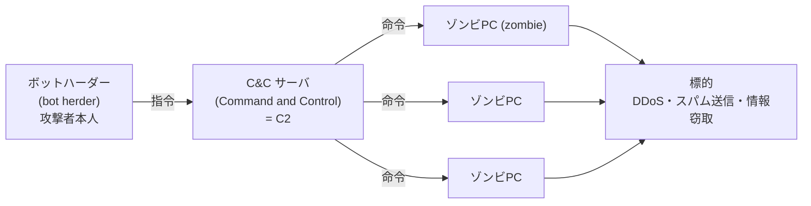

# 1-2 マルウェア

重要度：★★☆

## 定義と分類の枠組み

| 日文用語 | 讀音 | 英文 | 中文解釋 | 常考重點／易混淆點 |
|---|---|---|---|---|
| マルウェア | — | malware（malicious + software） | 進行非使用者意圖動作的惡意軟體總稱 | — |
| コンピュータウイルス | — | computer virus | 見下方廣義／狹義 | **寫法是ウイルス（大的イ）**，不是ウィルス |
| 自己伝染機能 | じこでんせんきのう | self-propagation | 把自己複製到其他程式或系統 | ↓ |
| 潜伏機能 | せんぷくきのう | latency | 發病前完全無症狀，可由時間或條件觸發 | ↓ |
| 発病機能 | はつびょうきのう | payload / activation | 破壞檔案、執行非使用者意圖的動作 | ↓ |
| 宿主 | しゅくしゅ | host file | 病毒寄生的既有檔案 | ウイルス 必須有宿主，ワーム／トロイ 不需要 |
| 感染 | かんせん | infection | 入侵並寄生成功 | 「感染了但還沒發病」是成立的狀態 |

**IPA 定義（コンピュータウイルス対策基準）**：具備 自己伝染機能・潜伏機能・発病機能 **其中一個以上** 者即為ウイルス。

- **廣義のウイルス**＝マルウェア 全體（因為門檻是「一個以上」，ワーム 與 トロイの木馬 也被包含）
- **狹義のウイルス**＝寄生宿主檔案、自我複製的類型

## 三大類型の判別

| | 需要宿主檔案 | 自己増殖 | 自律擴散（不需人為操作） | 擴散依賴 |
|---|---|---|---|---|
| **ウイルス** | **要** | 會 | 不會 | 人去執行宿主檔案（傳檔、USB、開附件） |
| **ワーム（worm）** | 不要 | 會 | **會** | **脆弱性**，經網路／可搬媒体自動擴散 |
| **トロイの木馬** | 不要 | **不會** | 不會 | **偽裝**，騙使用者自己安裝 |

判別軸有兩組，題目要看清問的是哪一組：
- ワーム vs トロイ → 分水嶺是 **自己増殖するか**
- ワーム vs ウイルス → 分水嶺是 **宿主が必要か**

**對策方向因此完全不同**：
- ウイルス 靠人擴散 → 對策偏 **使用者行為**（不亂開附件、不插來路不明的 USB）
- ワーム 靠漏洞擴散 → 對策偏 **パッチ適用・脆弱性管理**，教育使用者幾乎無效
- ワーム 的副作用是 **ネットワーク帯域を圧迫**。題目描述「全公司網路突然爆量變慢」→ 往ワーム走

## トロイの木馬の種類

| 用語 | 英文 | 重點 |
|---|---|---|
| ダウンローダ | downloader | **本体を持たない**。進來時是乾淨小程式，惡意本體之後才從網路下載 → **パターンマッチングで検出できない** |
| ドロッパ | dropper | **本体を隠し持つ**（加密／壓縮包在內部），感染後解出落地 → **不需連外網，斷網環境也能發作** |
| バックドア | backdoor | 留下後門，供攻擊者日後持續存取（→ 下方「二つの文脈」） |
| RAT ／ 遠隔操作ウイルス | Remote Access Trojan（えんかくそうさウイルス） | 後門＋整套遙控介面（截圖、開麥克風、抓檔案） |


### ⚠️ バックドア の二つの文脈（過去問で問われる）

問われ方は「情報セキュリティにおいて**バックドアに該当するもの**はどれか」——
**定義に当てはまる「もの」を選ばせる**ので、マルウェア以外の形で出てくる。

| | **① マルウェアが仕掛ける裏口** | **② 設計・実装上の裏口** |
|---|---|---|
| 誰弄的 | **攻撃者**（入侵成功後留下） | **開発者**（多為無意或圖方便） |
| 目的 | **日後不必再入侵一次就能進來** | 除錯、維護用的捷徑，**忘了拿掉** |
| 典型形態 | RAT、トロイの木馬 が残す常駐通路 | **正規の認証手続きを経ずにアクセスできる URL**、隱藏的管理畫面、寫死的帳密 |

**在マルウェア 這一節的脈絡下容易只記得 ①，但考題常以 ② 的形式出現**——用「URL」這種聽起來完全不像惡意程式的方式描述。

> **共通の本質：正規の認証手続きを迂回できるアクセス経路。**
> **誰弄出來的、有意還是無意，都不影響它是 バックドア。**

## 主要なマルウェア

| 用語 | 英文 | 重點 |
|---|---|---|
| マクロウイルス | macro virus | 利用 Office 的マクロ機能（VBA）。寄生在**文書檔**（.docm/.xlsm）而非執行檔，副檔名檢查擋不掉；跨平台，有 Office 就會中。例：**Emotet** |
| ボット | bot | 被植入、可被遠端操控的惡意程式（名稱來自 robot） |
| 偽セキュリティ対策ソフト | rogueware / scareware | 假防毒。跳出「已偵測到 300 個病毒！」**煽動恐懼**，誘導付費或安裝真惡意程式 |
| ランサムウェア | ransomware | ransom＝**身代金（みのしろきん）**。加密檔案索贖 |
| WannaCry（WannaCryptor） | — | 2017 全球災情。特別處：**是ランサムウェア，卻用ワーム方式靠 Windows 漏洞自動擴散**，不需人點任何東西 |
| 二重脅迫 | にじゅうきょうはく / double extortion | 加密之外再加一招：不付錢就**公開竊得的資料** |
| RaaS | Ransomware as a Service | 勒索軟體做成服務出租分潤，開發者與實行者分離 |
| ファイルレスマルウェア | fileless malware | 不在硬碟留檔，直接在**記憶體**執行，借用 PowerShell、WMI 等 OS 內建工具 → 無檔案可比對，鑑識困難 |
| スパイウェア | spyware | 偷偷**蒐集＋外送**使用者資訊。不破壞、不加密 |
| アドウェア | adware | 強制顯示廣告。**不必然違法** → 見下方「惡意光譜」 |
| キーロガー | keylogger | 記錄鍵盤輸入，竊取帳密、卡號 |
| ルートキット | rootkit | root（管理者帳號）＋ kit（工具組） → 見下方專節 |
| ポリモーフィック型ウイルス | polymorphic virus | 每次感染就**改變自身程式碼樣貌**（換金鑰重新加密自己），功能不變、長相每次不同 |
| メタモーフィック型ウイルス | metamorphic virus | 更進一步，連程式碼結構本身都改寫 |
| エクスプロイトコード | exploit code | 攻撃コード。針對特定脆弱性的攻擊程式碼 |
| PoC ／ 実証コード | Proof of Concept（じっしょうコード） | 原本用來**證明脆弱性存在**、推動廠商修補，後被惡用 |
| エクスプロイトキット | exploit kit | 把多個 exploit code 打包成工具，自動挑漏洞下手 → **把攻擊門檻降到零** |
| ゼロデイ攻撃 | zero-day attack | 在**修正プログラム（パッチ）公開之前**發動的攻擊 |

### 惡意光譜（テキストの逆三角形）

マルウェア（惡意明確）→ スパイウェア（偷資訊，可能藏在同意條款中）→ アドウェア（僅顯示廣告，部分合法）。

**考點在最下層：アドウェア 不必然違法。** 判斷基準是 **有無取得使用者的同意（承諾）**——安裝時已告知並同意顯示廣告＝正規軟體；未告知而擅自蒐集行為資料＝跨線。

### ルートキット

- 名字即定義：**取得管理者權限後，用來「維持」該權限並隱藏痕跡的工具組合。**
- 兩者綁定：沒有管理者權限就藏不了東西（藏行程、改核心、竄改日誌都需 **カーネルモード／kernel mode** 或系統層級）。「取得並維持管理者權限」是手段，「隱蔽」是目的。
- 相關詞：**権限昇格（けんげんしょうかく，privilege escalation）**——從一般權限爬到管理者權限。
- 攻擊標準流程：**侵入 → 権限昇格 → ルートキット設置 → 長期潛伏**（接 APT）。
- 因為跑在系統層級，**OS 回報的資訊本身已不可信** → 偵測極困難，**最確實的處置是 OS 重灌**。

### ゼロデイ攻撃の時間軸

```
脆弱性が存在 → 発見 → (公表/PoC公開) → パッチ公開 → 適用完了
        └──── ゼロデイ攻撃の期間 ────┘  └─ 未適用（放置）─┘
```

**陷阱**：パッチ 公開**後**的攻擊不叫ゼロデイ，那叫「未適用」——責任在使用者，不在廠商。

### キーロガーの対策

| 對策 | 有效範圍 |
|---|---|
| ソフトウェアキーボード（畫面上用滑鼠點） | 只擋**軟體型**。網銀常見措施 |
| 實體檢查 | **ハードウェアキーロガー**（插在鍵盤與主機之間）防毒軟體偵測不到，只能靠實體檢查 |
| ワンタイムパスワード（one-time password） | 最根本。密碼被記錄下來也已失效。同時破解 キーロガー 與 盗聴（Ch2） |

## ボットネットの構造



| 日文 | 英文 | 一句話 |
|---|---|---|
| ゾンビPC | zombie | 被 bot 感染、聽命他人的電腦 |
| ボットハーダー | bot herder | 操控整群 bot 的攻擊者（herder＝牧人） |
| C&C サーバ | Command and Control server | 下命令的中繼點，也寫作 **C2** |
| ボットネット | botnet | 被同一 C&C 操控的 zombie 群 |

**分工**：C&C＝司令塔（轉發命令、回收竊得資料）；ボットネット＝實働部隊（執行 DDoS、スパム、窃取）。

**為何隔一層 C&C 而非直連 zombie？**
1. **隱藏攻擊者身分**——追查只追到 C&C。
2. **一斉制御**——幾萬台一次下令。

**對策的正解**：遮斷與 C&C 的通信（出口対策／通信ログ監視）。C&C 一斷，botnet 即失去指揮 → **テイクダウン（takedown）**。
**進階**：**P2P型ボットネット** 沒有單一 C&C，bot 互相傳令，**無法靠切斷單一伺服器瓦解**。

**踏み台（ふみだい）**：**自分が被害者であると同時に、他人への加害者になる。** 攻擊來源 IP 是你，責任可能算到你頭上。題目問「感染しても自社に直接の被害がないから放置してよいか」→ 永遠是不行。
日本實例：2012 年 **PC遠隔操作事件**，真兇用他人電腦當跳板發犯罪預告，造成**無辜者被誤逮**。

## 感染経路（かんせんけいろ）

| 路徑 | 關鍵詞 |
|---|---|
| メール | 附件開啟、本文連結。接 1-3 フィッシング／標的型攻撃メール |
| Web | **ドライブバイダウンロード（drive-by download）**——只是瀏覽被竄改的正常網站，什麼都沒點就中招 |
| ネットワーク | 共有フォルダ、ファイル共有ソフト；ワーム 靠脆弱性自動擴散 |
| 媒体（ばいたい）／可搬媒体 | USB メモリ、DVD-ROM |

**媒体專屬考點**：**即使是完全未連外網的隔離環境（スタンドアロン／閉域網）也會經 USB 感染。** 題目問「ネットワークに接続していないのに感染した理由」→ 就是這個。所以工控、製造現場的重點是 **USB ポートを物理的に塞ぐ／持込媒体の管理**，不是防火牆。

## 検出方式（Ch5 で本格展開）

| 方式 | 怎麼判斷 | 弱點 |
|---|---|---|
| パターンマッチング法（signature） | 比對已知病毒的特徵碼 | **未知病毒抓不到**；需不斷更新定義檔 |
| ヒューリスティック法（heuristic） | 不執行，從程式碼特徵靜態推測 | 誤検知多 |
| **ビヘイビア法（behavior）** | 實際執行（通常在 **サンドボックス／sandbox** 隔離環境）觀察行為 | 耗時耗資源；有些惡意程式偵測到沙箱就裝乖 |
| チェックサム法／インテグリティチェック法 | 檔案被改動就報警 | 只知「被改了」，不知是什麼 |

**為何需要行為型偵測**：ポリモーフィック型（每次長相不同）與 ファイルレスマルウェア（根本沒檔案）讓特徵碼比對失效 → 偵測必須從「**看長相**」轉向「**看行為**」。

## マルウェアへの対策

| 對策 | 重點 |
|---|---|
| マルウェア対策ソフト 導入 | **光裝沒用，定義ファイル（パターンファイル）必須保持最新**——最高頻標準答案 |
| マクロ機能の無効化 | 組織層級統一設定，不交給個別員工判斷。進階：信頼できる発信元のみ／電子署名付きマクロだけ許可 |
| パッチ適用・脆弱性管理 | 對付 ワーム 與 エクスプロイトコード 的正解 |
| 不審なメールを開かない（教育） | 對付 ウイルス、マクロウイルス |
| 可搬媒体の持込・持出制限 | 對付隔離環境經 USB 感染 |
| **オフラインバックアップ** | 對付 ランサムウェア。**必須離線保存**，連網或常時掛載的備份會被一起加密 |
| 最小権限の原則 | 限縮感染後的破壞範圍與 権限昇格 空間 |

**身代金は支払わない**：理由不是道德而是實務——付了不保證能解密、不保證資料不外流，且會被標記為「會付錢的客戶」招來下一次攻擊。

## 前因後果

**① 動機產業化 → 攻擊分工化。**
接 1-1：動機從愉快犯轉為金錢後，攻擊變成生意，有生意就有分工。ボットハーダー 出租攻擊能力、エクスプロイトキット 讓不懂技術的人也能攻擊、RaaS 讓開發者與實行者分離——這三個是同一條產業鏈的不同環節，也解釋了近年攻擊量暴增：**門檻沒了**。

**② 二重脅迫 推翻了原本的標準答案。**
以前「有備份就不用怕」是標準對策。二重脅迫 之後這句破功：**備份救得回可用性，救不回機密性**——資料已被偷走，還原再快對方照樣能公開。所以現在正解是「**バックアップ＋情報漏えい対策の両方**」，只答備份不完整。這正是 CIA 三要素（機密性・完全性・可用性，Ch3）在實戰中的分工。

**③ 躲避技術 → 偵測典範轉移。**
ポリモーフィック型、ファイルレスマルウェア 讓「比對長相」失效，逼出「觀察行為」的ビヘイビア法與サンドボックス。這條線 Ch5 マルウェア対策ソフト 正式算帳。

**④ 分類有兩個軸，不互斥。**
ウイルス／ワーム／トロイ 分的是「**怎麼傳染**」；スパイウェア／アドウェア／キーロガー／ルートキット 分的是「**感染後做什麼**」。一隻惡意程式可以是「用トロイ方式進來的キーロガー」。題目把兩軸混在選項裡時別被騙。

**⑤ 前提已經改變：感染は防ぎきれない。**
所以對策框架是 **入口対策**（不讓進來）＋**出口対策**（不讓資料出去、不讓它連上 C&C）＋**多層防御（たそうぼうぎょ）**（假設單一防線一定會破）。重心其實在出口対策與早期発見——這跟直覺相反，是 SG 愛考的觀念。

## 待補（考後）

- 各マルウェア的具體歷史案例與年份（Emotet、WannaCry、Mirai 等）
- サンドボックス回避技術的細節
- ランサムウェア 的三重・四重脅迫（DDoS、取引先への連絡）
- IPA「情報セキュリティ10大脅威」中マルウェア相關項目的排名
- 検出方式各法的實際產品對應（Ch5 展開後回填）
- マルウェア感染時的インシデント対応手順（Ch3／Ch4 展開後回填）
