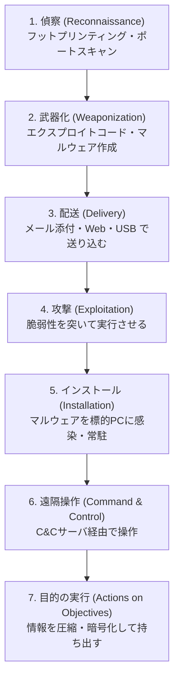

# 1-4 不正アクセス・盗聴

重要度：★★☆

## 不正アクセス（ふせいアクセス）

定義：**利用脆弱性侵入**，或**偽裝成他人**進行操作。兩條路徑都算。

## 事前調査（攻撃前の準備）

| 日文用語 | 讀音 | 英文 | 中文解釋 | 常考重點 |
|---|---|---|---|---|
| フットプリンティング | — | footprinting | 攻擊前的資訊蒐集：whois、DNS、公開網站、SNS、員工資訊 | **不接觸系統也能做**，所以很難偵測 |
| ポートスキャン | — | port scan | 掃描目標開了哪些通訊埠、跑什麼服務、有無漏洞（抜け穴＝ぬけあな，漏洞） | 比喻貼切：小偷下手前先觀察哪扇窗沒關 |
| ダークウェブ | — | dark web | 一般搜尋引擎搜不到、需特殊軟體才能存取的網路空間 | 外洩個資、惡意工具、RaaS 的交易場所 |
| Tor | — | **The Onion Router** | 讓通信經過多層中繼節點、每層各自加密，使來源難以追蹤的匿名化網路 | 名稱由來是「洋蔥」＝**多層加密**。存取 ダークウェブ 的代表工具 |

**Tor 補充**：通信被包成多層，每個中繼節點只知道「上一站」與「下一站」，沒有任何單一節點同時知道發送者與接收者。因此攻擊者用它藏身，記者與異議人士也用它自保——**技術本身中立**，這與 1-1 ハッカー／クラッカー 是同一個邏輯。

## 盗聴（とうちょう）

| 日文用語 | 讀音 | 英文 | 中文解釋 | 常考重點 |
|---|---|---|---|---|
| スニッフィング | — | sniffing | 監看網路上流動的封包以竊取內容 | 工具本身叫 **スニッファ（sniffer）** |
| ウォードライビング | — | war driving | 開車／騎車四處移動，用**高感度アンテナ（antenna，天線）**搜尋防護薄弱的無線 LAN | **無線LAN親機（おやき）＝アクセスポイント（access point）**；子機＝連上去的裝置 |
| テンペスト | — | TEMPEST | 接收電腦顯示器、鍵盤、纜線洩漏的**微弱電磁波**，還原出畫面或輸入內容 | 完全不接觸設備、不經網路的盜聽 |
| サイドチャネル攻撃 | — | side-channel attack | 不攻擊演算法本身，而是觀測**暗号装置**運作時洩漏的物理訊息（處理時間、消耗電力、電磁波、發熱、聲音）來推出金鑰 | 見下方專節 |

### ウォードライビング 補充

- **無線LAN親機** 就是 **アクセスポイント（AP）**，也就是無線基地台／分享器。
- 成立原因：**設定疏漏**（用預設密碼、用已破解的 WEP、SSID 與電波外洩到建築物外）。
- 被害：竊取公司內部資訊、**免費盜用他人網路（可能被當成犯罪的踏み台）**、通信內容被竊聽。
- 相關詞：**ウォーチョーキング（war chalking）**——把找到的無線點以記號標示在牆上、地上分享給同夥。

**對策**：
- 使用 **WPA3 或 WPA2（AES）**；**WEP 已被破解，選項出現就是錯的**
- 事前共有鍵（PSK）要**長**（20 字以上）且隨機
- 調整電波強度、不讓訊號外洩到建物外
- SSID ステルス、MAC アドレスフィルタリング 是**輔助**，本身容易被繞過，不能當主要對策

### サイドチャネル攻撃 補充

**暗号装置（あんごうそうち）** 指的是實際執行加解密運算的硬體或模組——**IC カード（智慧卡）、SIM、HSM（Hardware Security Module）、TPM** 這類東西。

攻擊的精妙處：**演算法在數學上是安全的，但「實作」會漏訊息。** 例如處理位元 1 和 0 時耗電量略有不同，量夠多就能還原金鑰。

| 類型 | 觀測對象 |
|---|---|
| タイミング攻撃 | 處理時間差 |
| 電力解析攻撃（SPA／DPA） | 消耗電力波形 |
| 電磁波解析攻撃 | 洩漏的電磁波 |
| 故障利用攻撃（fault injection） | 故意施加異常電壓／溫度使其出錯，從錯誤結果推金鑰 |

**對策**：讓處理時間與耗電量**與資料內容無關（一定化）**、加入雜訊、物理防護。

## 対策

| 對象 | 對策 |
|---|---|
| ポートスキャン | **關閉不使用的通訊埠**；不安裝不必要的軟體（有些會自行開埠）；ファイアウォール、IDS/IPS |
| フットプリンティング | 減少公開資訊、注意員工在 SNS 的發文 |
| ウォードライビング | WPA3／WPA2、長 PSK、控制電波範圍 |
| スニッフィング | **通信の暗号化**（TLS、VPN）——就算被聽到也讀不懂 |
| テンペスト | **電磁シールド**：シールドルーム、防電磁波材質的牆面；纜線改用**遮蔽型**（見下方） |
| サイドチャネル | 處理時間／耗電一定化、加入雜訊 |

### ケーブル（cable）補充

| 種類 | 全名 | 特徵 |
|---|---|---|
| **UTP ケーブル** | Unshielded Twisted Pair | 無遮蔽雙絞線。一般辦公室常用，便宜但**會洩漏電磁波** |
| **STP ケーブル** | Shielded Twisted Pair | **有金屬遮蔽層**的雙絞線，可抑制電磁波外洩與外來干擾 → **TEMPEST 對策** |
| **光ファイバケーブル** | optical fiber | 用光傳輸，**完全不產生電磁波**，且物理竊聽極困難 → 最強的盜聽對策 |

## サイバーキルチェーン

把攻擊者的思考流程拆成 7 個階段來分析。（chain＝鏈，只要斷掉其中一環，整條攻擊就中止）

**這個模型的意義（考點）**：**階段越早切斷，被害越小。** 但現實是入口很難完全擋住（1-2 的「感染は防ぎきれない」），所以防禦重心放在 **5～7 階段的偵測**——監控異常的對外通信（C&C 連線）、監控大量資料的壓縮與外送。這正是 **出口対策** 存在的理由。

第 7 階段「壓縮、加密後帶出」也有考點：**攻擊者會刻意加密以躲過 DLP 與內容檢查**，所以偵測要看「通信量與行為模式」而非內容。

## 前因後果

**盜聽的三個層次，防禦方式完全不同：**

| 層次 | 手法 | 對策的本質 |
|---|---|---|
| **網路層** | スニッフィング | **暗号化**——聽得到但看不懂 |
| **物理層（電磁波）** | テンペスト | **遮蔽**——讓訊號根本出不去 |
| **實作層（物理副作用）** | サイドチャネル | **一定化**——讓運算的物理表現不洩漏內容 |

加密能解決第一層，但**對第二、三層無效**——テンペスト 聽的是顯示器發出的電磁波，那是「你看到畫面的當下」，資料早已解密；サイドチャネル 攻擊的正是加密運算的過程本身。**「只要加密就安全」是錯的**，這是這節最重要的一句。

**事前調査 為什麼要獨立成一節？**
因為它幾乎無法偵測——フットプリンティング 只是查公開資料，連封包都沒送到你這裡。這說明資安的防線必須從「減少可被蒐集的資訊」開始，而不是從防火牆開始。也解釋了為什麼組織要管制員工在 SNS 上揭露公司系統、職稱、信箱格式。

## 待補（考後）

- ポートスキャン 的具體種類（TCP SYN スキャン、ステルススキャン 等）
- 無線 LAN 加密規格的演進細節（WEP → WPA → WPA2 → WPA3）與各自弱點 → Ch5／Ch7 回填
- IDS／IPS／ファイアウォール 的差異 → Ch5
- サイバーキルチェーン 與 MITRE ATT&CK 的關係
- 不正アクセス禁止法 的法條內容 → Ch6
