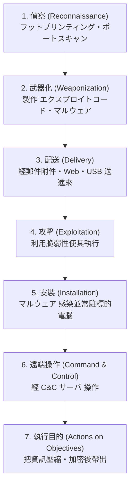

# 1-4 不正アクセス・盗聴

重要度：★★☆

> 依導讀順序重寫，不收錄書上原文、原表與練習問題原文。
> **本節依導讀順序分為 ①〜⑥。**

## 縮寫展開

| 縮寫／外來語 | 英文全名 | 說明 |
|---|---|---|
| **フットプリンティング** | **footprinting** | 攻擊前的資訊蒐集 |
| **ポートスキャン** | **port scan** | 掃描開了哪些埠與服務 |
| **ダークウェブ** | **dark web** | 需特殊軟體才能存取的網路空間 |
| **Tor** | **The Onion Router** | 多層加密的匿名化網路 |
| **RaaS** | **Ransomware as a Service** | 勒索軟體出租服務（→ 1-2） |
| **SNS** | **Social Networking Service** | 社群網站 |
| **スニッフィング／スニッファ** | **sniffing / sniffer** | 監看封包／監看工具 |
| **ウォードライビング** | **war driving** | 移動中搜尋無線 LAN |
| **ウォーチョーキング** | **war chalking** | 在牆上地上標記無線點 |
| **アンテナ** | **antenna** | 天線 |
| **アクセスポイント（AP）** | **access point** | ＝無線LAN親機 |
| **LAN** | **Local Area Network** | 區域網路 |
| **WEP** | **Wired Equivalent Privacy** | 已被破解的舊無線加密 |
| **WPA2／WPA3** | **Wi-Fi Protected Access 2 / 3** | 現行無線加密規格 |
| **AES** | **Advanced Encryption Standard** | WPA2 使用的加密方式 |
| **PSK** | **Pre-Shared Key** | 事前共有鍵 |
| **SSID ステルス** | **Service Set Identifier stealth** | 不廣播網路名稱 |
| **MAC アドレスフィルタリング** | **Media Access Control address filtering** | 只允許登錄的網卡位址 |
| **テンペスト** | **TEMPEST** | 接收電磁波還原畫面／輸入 |
| **シールドルーム** | **shield room** | 電磁遮蔽室 |
| **ケーブル** | **cable** | 纜線 |
| **UTP** | **Unshielded Twisted Pair** | 無遮蔽雙絞線 |
| **STP** | **Shielded Twisted Pair** | 有遮蔽雙絞線 |
| **光ファイバ** | **optical fiber** | 光纖 |
| **サイドチャネル攻撃** | **side-channel attack** | 從物理副作用推金鑰 |
| **IC カード** | **Integrated Circuit card** | 智慧卡 |
| **SIM** | **Subscriber Identity Module** | 手機用戶識別卡 |
| **HSM** | **Hardware Security Module** | 硬體安全模組 |
| **TPM** | **Trusted Platform Module** | 主機板上的安全晶片 |
| **タイミング攻撃** | **timing attack** | 觀測處理時間 |
| **SPA／DPA** | **Simple / Differential Power Analysis** | 單純／差分電力解析 |
| **フォールトインジェクション** | **fault injection** | ＝故障利用攻撃 |
| **TLS** | **Transport Layer Security** | 通信加密協定 |
| **VPN** | **Virtual Private Network** | 虛擬私人網路 |
| **IDS／IPS** | **Intrusion Detection / Prevention System** | 入侵偵測／防禦系統 |
| **ファイアウォール** | **firewall** | 防火牆 |
| **サイバーキルチェーン** | **cyber kill chain** | 攻擊流程 7 階段模型 |
| **C&C** | **Command and Control** | 遠端指揮伺服器（→ 1-2） |
| **DLP** | **Data Loss Prevention** | 防資料外洩 |

## 讀音

| 用語 | 讀音 |
|---|---|
| 不正アクセス | ふせいアクセス |
| 脆弱性 | ぜいじゃくせい |
| 事前調査 | じぜんちょうさ |
| 抜け穴 | ぬけあな |
| 盗聴 | とうちょう |
| 無線LAN親機 | むせんLANおやき |
| 子機 | こき |
| 高感度 | こうかんど |
| 事前共有鍵 | じぜんきょうゆうかぎ |
| 踏み台 | ふみだい |
| 暗号装置 | あんごうそうち |
| 電力解析攻撃 | でんりょくかいせきこうげき |
| 電磁波解析攻撃 | でんじはかいせきこうげき |
| 故障利用攻撃 | こしょうりようこうげき |
| 電磁シールド | でんじシールド |
| 通信の暗号化 | つうしんのあんごうか |
| 出口対策 | でぐちたいさく |

---

## 本節的位置

1-2、1-3 是武器與鑰匙，本節把鏡頭拉遠：**攻擊者下手前做什麼準備、怎麼偷聽、整個攻擊流程長什麼樣？**
① 先定義 不正アクセス → ② 下手前的偵察 → ③〜⑤ 盜聽的三個層次（網路、電磁波、實作）→ ⑥ 用 サイバーキルチェーン 把前面所有手法串成一條線。盜聽的對策大多是加密，機制在 Ch2；無線 LAN 與網路設備在 Ch5。

---

## ① 不正アクセス 的定義

不正アクセス（ふせいアクセス）有兩條路徑，**兩條都算**：

| 路徑 | 例 |
|---|---|
| **利用脆弱性（ぜいじゃくせい）侵入** | 打沒修補的漏洞 |
| **偽裝成他人**進行操作 | 用偷來的帳密登入（→ 1-3、1-5） |

> 第二條沒有任何技術性入侵，但一樣是 不正アクセス——法律面在 Ch6 不正アクセス禁止法。

---

## ② 下手前的偵察：事前調査

小偷下手前會先觀察哪扇窗沒關。攻擊者也一樣：

| 用語 | 做什麼 | 重點 |
|---|---|---|
| **フットプリンティング**（footprinting） | 蒐集資訊：whois、DNS、公開網站、SNS（Social Networking Service）、員工資訊 | **不接觸系統也能做 → 很難偵測** |
| **ポートスキャン**（port scan） | 掃描目標開了哪些通訊埠、跑什麼服務、有無漏洞（抜け穴，ぬけあな） | 會送封包過來，可被 IDS 看到 |

| 對象 | 對策 |
|---|---|
| ポートスキャン | **關閉不使用的通訊埠**；不裝不必要的軟體（有些會自行開埠）；ファイアウォール（firewall）、IDS／IPS（Intrusion Detection／Prevention System） |
| フットプリンティング | 減少公開資訊、注意員工在 SNS 的發文 |

> フットプリンティング 連一個封包都沒送到你這裡，所以防線必須從「**減少可被蒐集的資訊**」開始，而不是從防火牆開始。這也是組織要管制員工在 SNS 揭露系統、職稱、信箱格式的原因。

### 攻擊者藏身與交易的地方

| 用語 | 內容 |
|---|---|
| **ダークウェブ**（dark web） | 一般搜尋引擎搜不到、需特殊軟體才能存取的網路空間。外洩個資、惡意工具、RaaS 的交易場所 |
| **Tor（The Onion Router）** | 通信經過多層中繼節點、每層各自加密，使來源難以追蹤的匿名化網路。存取 ダークウェブ 的代表工具 |

**Tor 的原理**：名稱來自「洋蔥」＝**多層加密**。每個中繼節點只知道「上一站」與「下一站」，**沒有任何單一節點同時知道發送者與接收者**。
因此攻擊者用它藏身，記者與異議人士也用它自保——**技術本身中立**，與 1-1 ハッカー／クラッカー 同一個邏輯。

---

## ③ 盜聽之一：網路上流動的資料

盗聴（とうちょう）的第一層：資料在線上或空中流動時被聽走。

| 用語 | 做什麼 | 重點 |
|---|---|---|
| **スニッフィング**（sniffing） | 監看網路上流動的封包以竊取內容 | 工具本身叫 **スニッファ（sniffer）** |
| **ウォードライビング**（war driving） | 開車／騎車四處移動，用**高感度アンテナ（antenna）**搜尋防護薄弱的無線 LAN | 目標是無線LAN親機 |

**スニッフィング 的對策：通信の暗号化**（TLS（Transport Layer Security）、VPN（Virtual Private Network））——**就算被聽到也讀不懂**。

### ウォードライビング 細節

- **無線LAN親機（むせんLANおやき）＝アクセスポイント（access point，AP）**，也就是無線基地台／分享器；子機（こき）＝連上去的裝置。
- 成立原因：**設定疏漏**——用預設密碼、用已破解的 WEP（Wired Equivalent Privacy）、電波外洩到建築物外。
- 被害：竊取公司內部資訊、**免費盜用他人網路（可能被當成犯罪的踏み台（ふみだい））**、通信內容被竊聽。
- 相關詞：**ウォーチョーキング（war chalking）**——把找到的無線點用記號標在牆上、地上分享給同夥。

| 對策 | 定位 |
|---|---|
| 使用 **WPA3 或 WPA2（AES）** | 主要。**WEP 已被破解，選項出現就是錯的** |
| 事前共有鍵（PSK，Pre-Shared Key）要**長**（20 字以上）且隨機 | 主要 |
| 調整電波強度，不讓訊號外洩到建物外 | 主要 |
| SSID ステルス、MAC アドレスフィルタリング | **只是輔助**，本身容易被繞過，不能當主要對策 |

---

## ④ 盜聽之二：設備洩漏的電磁波

加密能解決③，但如果攻擊者聽的根本不是網路呢？

**テンペスト（TEMPEST）**：接收電腦顯示器、鍵盤、纜線洩漏的**微弱電磁波**，還原出畫面或輸入內容。**完全不接觸設備、不經網路。**

> 加密對它無效：它聽的是螢幕發出的電磁波，那是「你看到畫面的當下」，資料早已解密。

**對策：電磁シールド（でんじシールド）**——シールドルーム（shield room）、防電磁波的牆面材質，以及把纜線（ケーブル，cable）換成遮蔽型：

| 種類 | 特徵 |
|---|---|
| **UTP（Unshielded Twisted Pair）** | 無遮蔽雙絞線。一般辦公室常用，便宜但**會洩漏電磁波** |
| **STP（Shielded Twisted Pair）** | **有金屬遮蔽層**，抑制電磁波外洩與外來干擾 → **TEMPEST 對策** |
| **光ファイバケーブル**（optical fiber） | 用光傳輸，**完全不產生電磁波**，物理竊聽也極困難 → **最強的盜聽對策** |

---

## ⑤ 盜聽之三：運算時的物理副作用

**サイドチャネル攻撃（side-channel attack）**：不攻擊演算法本身，而是觀測**暗号装置（あんごうそうち）**運作時洩漏的物理訊息（處理時間、消耗電力、電磁波、發熱、聲音）來推出金鑰。

**暗号装置**＝實際執行加解密運算的硬體或模組：**IC カード（Integrated Circuit card，智慧卡）、SIM（Subscriber Identity Module）、HSM（Hardware Security Module）、TPM（Trusted Platform Module）** 這類東西。

> **精妙處：演算法在數學上是安全的，但「實作」會漏訊息。** 例如處理位元 1 和 0 時耗電量略有不同，量夠多就能還原金鑰。

| 類型 | 觀測對象 |
|---|---|
| タイミング攻撃（timing attack） | 處理時間差 |
| 電力解析攻撃（SPA／DPA：Simple／Differential Power Analysis） | 消耗電力波形 |
| 電磁波解析攻撃 | 洩漏的電磁波 |
| 故障利用攻撃（フォールトインジェクション，fault injection） | 故意施加異常電壓／溫度使其出錯，從錯誤結果推金鑰 |

**對策**：讓處理時間與耗電量**與資料內容無關（一定化）**、加入雜訊、物理防護。

---

## ⑥ 串起整個攻擊：サイバーキルチェーン

サイバーキルチェーン（cyber kill chain）把攻擊者的思考流程拆成 7 個階段。chain＝鏈：**只要斷掉其中一環，整條攻擊就中止。** ②的偵察是第 1 階段，1-2 的惡意程式橫跨第 2〜6 階段。

> **考點：階段越早切斷，被害越小。** 但現實是入口很難完全擋住（1-2「感染無法完全防住」），所以防禦重心放在 **5〜7 階段的偵測**——監控異常的對外通信（C&C 連線）、監控大量資料的壓縮與外送。這正是 **出口対策（でぐちたいさく）** 存在的理由。

> **第 7 階段的考點**：攻擊者會**刻意加密**以躲過 DLP（Data Loss Prevention）與內容檢查 → 偵測要看「**通信量與行為模式**」，而不是內容。

---

## 前因後果

**盜聽的三個層次，防禦方式完全不同：**

| 層次 | 手法 | 對策的本質 |
|---|---|---|
| **網路層** | スニッフィング | **暗号化**——聽得到但看不懂 |
| **物理層（電磁波）** | テンペスト | **遮蔽**——讓訊號根本出不去 |
| **實作層（物理副作用）** | サイドチャネル | **一定化**——讓運算的物理表現不洩漏內容 |

- **「只要加密就安全」是錯的**——本節最重要的一句。加密只解決第一層；テンペスト 聽的是已解密的畫面，サイドチャネル 攻擊的正是加密運算本身。
- **事前調査 幾乎無法偵測**：所以防線從「少公開」開始，不是從防火牆開始。
- **侵入は防げない → 検知 vs 防止**：キルチェーン 說明了為何重心放在後段偵測與出口対策，接 4-3 ① 入口・内部・出口、Ch5 IDS／IPS。
- **技術中立**：Tor 與 1-1 ハッカー 同理，判斷的是用途而不是工具。

## 待補（考後）

- ポートスキャン 的具體種類（TCP SYN スキャン、ステルススキャン 等）
- 無線 LAN 加密規格的演進細節（WEP → WPA → WPA2 → WPA3）與各自弱點 → Ch5／Ch7 回填
- IDS／IPS／ファイアウォール 的差異 → Ch5
- サイバーキルチェーン 與 MITRE ATT&CK 的關係
- 不正アクセス禁止法 的法條內容 → Ch6
