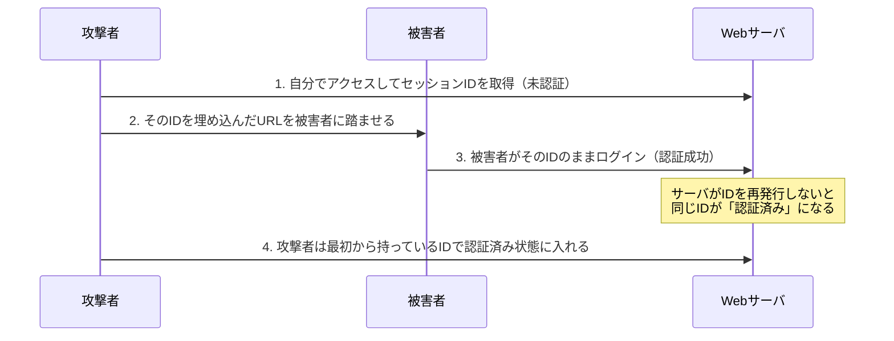

# 1-5 なりすまし

重要度：★★★

定義：明明不是本人，卻**偽裝成本人**進行行為。

## 通信への割り込み

| 日文用語 | 讀音 | 英文 | 中文解釋 | 常考重點／易混淆點 |
|---|---|---|---|---|
| 中間者攻撃 | ちゅうかんしゃこうげき | **MITM**（Man In The Middle） | 潛伏在通信雙方**中間**，竊聽並竄改往來的資料。雙方都以為在跟對方直接通信 | 攻擊點在**通信路徑上** |
| MITB | — | **Man In The Browser** | 潛伏在使用者**端末的瀏覽器內**。平時不動作，等連上網路銀行時才竄改轉帳金額與收款人 | 攻擊點在**使用者的電腦裡** |
| Evil Twin | — | evil twin（悪魔の双子） | 架設一個偽裝成正規公眾 Wi-Fi 的 アクセスポイント（AP），連上的人全被攔截 | **只要訊號比正牌強，裝置就會自動優先連過去** |
| 踏み台 | ふみだい | stepping stone | 不用自己的裝置攻擊，而是經由第三者的電腦發動，以隱藏真正的攻擊者 | 攻擊鏈：攻擊者 → 踏み台 → 踏み台 → 標的 |
| 第三者中継 | だいさんしゃちゅうけい | third-party mail relay / open relay | 盜用他人的メールサーバ 來大量寄送垃圾信 | 見下方專節 |
| IP スプーフィング | — | IP spoofing（**IPアドレス偽装攻撃**） | 偽造來源 IP 位址。例如從外部偽裝成內網 IP 通信，或在 DoS 中隱藏來源 | 「送信元 IP を詐称する」是判別關鍵字 |

### MITM 與 MITB 的決定性差異（最高頻考點）

| | 攻擊位置 | SSL/TLS 加密能否防禦 |
|---|---|---|
| **MITM** | 通信路徑上 | **能**——正確驗證伺服器憑證即可察覺（憑證不符會警告） |
| **MITB** | 使用者的瀏覽器內部 | **不能**——它在瀏覽器**解密之後、顯示之前**動手。通信本身完全正常，憑證完全正確 |

所以 MITB 最恐怖的地方是：**畫面上顯示的轉帳內容是「正確的」，實際送出的是被改過的。** 使用者再怎麼確認畫面也看不出來。這直接決定了它的對策必須走「網路之外的路徑」（見下方）。

### 踏み台 與 ゾンビPC 的關係（你的問題）

**不完全等同，是「角色」與「狀態」的差別：**

- **ゾンビPC**：被 bot 感染、受 C&C 操控的電腦（**狀態**）。
- **踏み台**：被拿來當作攻擊中繼站的機器（**角色**）。

ゾンビPC 幾乎一定會被當成 踏み台，但 踏み台 不一定是 ゾンビPC——例如設定疏漏的**開放代理伺服器（オープンプロキシ）**、被盜帳號的伺服器、第三者中継 狀態的郵件伺服器，都可以當踏み台，它們沒有被感染任何惡意程式。

**共同的考點**：**自分が被害者であると同時に、他人への加害者になる。**

### 第三者中継（だいさんしゃちゅうけい）

郵件伺服器若設定成「**任何人都可以透過我寄信給任何人**」（オープンリレー, open relay），就會被拿來大量發送垃圾信。

被害有兩層：
1. 自家伺服器被當成**送信の踏み台**，頻寬與信譽被消耗。
2. 該伺服器的 IP **被列入黑名單（ブラックリスト）**，導致**自己公司正常的郵件也被全世界拒收**——這才是真正的致命傷。

**對策（注意：不是「只接收聯絡人的信」，那是收信端的過濾，方向錯了）：**

| 對策 | 說明 |
|---|---|
| **第三者中継を禁止する設定** | 郵件伺服器只替「自己網域的使用者」轉送 |
| **SMTP-AUTH** | 寄信前必須先通過帳號密碼認證 |
| **POP before SMTP** | 先收信（POP 認證）通過後，一段時間內才允許寄信（舊方式） |
| **OP25B**（Outbound Port 25 Blocking） | ISP 封鎖使用者端直接對外的 25 埠，阻止被感染的電腦自行發送垃圾信 |

## セッション関連

| 日文用語 | 英文 | 中文解釋 | 常考重點 |
|---|---|---|---|
| セッションハイジャック | session hijacking | 竊取 Web 服務發給已登入使用者的 **セッションID**，直接拿來偽裝成該使用者 | 不需要知道密碼。可讀個資、改資料、亂下訂單 |
| セッション固定攻撃 | session fixation | **攻擊者先取得一個 セッションID，設法讓被害者用「這個 ID」去登入**，登入成功後攻擊者就持有一個已通過認證的 ID | 見下方修正 |
| リプレイ攻撃 | replay attack | 竊取認證時流過的資料（如加密後的密碼、認證用 token），**原封不動重送一次**即可通過認證 | **不需要解出原始密碼**——你的理解正確 |

### セッション固定攻撃的修正

你寫「直接置換掉真的 session」——順序反了。實際上是**攻擊者先給、被害者後用**：

**弱點的本質**：伺服器在登入成功後**沒有重新發行 セッションID**。
**所以對策就是那一句**：**ログイン成功時にセッションIDを再発行する（セッションIDの再生成）。**

你原本寫「只要用戶登入就要把 session 無效化」——方向抓對了，但精確講法是「**把登入前的舊 ID 作廢，發一個新的**」，不是把 session 整個作廢（那樣使用者就登不進去了）。

## 対策

| 攻擊 | 對策 | 原理 |
|---|---|---|
| 第三者中継 | 禁止第三者中継、SMTP-AUTH、OP25B | 讓伺服器只服務自己人 |
| セッションハイジャック | セッションID 用足夠長度的亂數、難以推測 | 猜不到就偷不到 |
| セッションハイジャック | Cookie 加上 **Secure 屬性**（只在 HTTPS 送出）、**HttpOnly 屬性**（JavaScript 讀不到，防 XSS 竊取） | 斷掉竊取途徑 |
| セッションハイジャック | 顯示重要資訊或執行重要操作時**再次要求密碼（再認証）** | 就算 ID 被偷，關鍵操作仍擋得住 |
| セッション固定攻撃 | **ログイン成功時にセッションIDを再発行** | 讓攻擊者手上的舊 ID 失效 |
| リプレイ攻撃 | **チャレンジレスポンス認証**、ワンタイムパスワード、タイムスタンプ、ノンス（nonce） | 讓每次通信的內容都不一樣 → 重送無效 |
| MITB | **トランザクション署名**（transaction signing） | 見下方 |
| MITM | サーバ証明書の検証、TLS | 冒充者拿不出正確憑證 |
| Evil Twin | 不在公眾 Wi-Fi 處理機密；用 **VPN**；確認 AP 正當性 | 就算被攔截也讀不懂 |
| IP スプーフィング | 経路上でのフィルタリング（入ってくる通信に内部IPが詐称されていないか検査） | 內網 IP 不該從外部進來 |

### チャレンジレスポンス認証（リプレイ攻撃の対策）

伺服器每次送一個**不同的亂數（チャレンジ）**，客戶端用密碼把它加工後回送（レスポンス）。
因為每次的亂數都不一樣，**上次的回應這次完全無效**——竊聽者重送只會被拒絕。而且**密碼本身從未在網路上流動**。這個機制 Ch2 認証 會正式展開。

### トランザクション署名（MITB の対策）

你的直覺「類似 OTP 的概念」方向對，但關鍵在**經路**：

因為 MITB 在瀏覽器內部動手，**畫面上的一切都不可信**。所以對策是把確認動作移到**瀏覽器以外的獨立路徑**——用手機 App 或專用裝置，**重新顯示一次實際的轉帳對象與金額**，由使用者在那個裝置上確認並產生簽章。

**重點在「別經路（out-of-band）確認」**：金額與收款人是從金融機構直接送到另一台裝置，不經過被污染的瀏覽器，所以攻擊者改不到那個畫面。單純的 OTP 只證明「是本人」，但**證明不了「交易內容沒被改」**——這是 OTP 與 トランザクション署名 的分界，考題會抓這裡。

## 前因後果

**なりすまし 的本質是「信任被錯置」。**
所有這些攻擊都在回答同一個問題：**系統憑什麼相信「你是你」？**

- 靠 **IP** → IP スプーフィング 打破它
- 靠 **セッションID** → セッションハイジャック／固定攻撃 打破它
- 靠 **通信內容** → リプレイ攻撃 打破它
- 靠 **連上的 AP** → Evil Twin 打破它
- 靠 **畫面顯示** → MITB 打破它

所以對策也有共同的形狀：**加入「只有這一次有效」的要素**（チャレンジレスポンス、ワンタイムパスワード、セッションID 再発行、ノンス）。這條原則貫穿整個 Ch2，先記住它，後面認証的所有機制都是它的變形。

**攻擊位置決定對策層級——這是這節最實用的解題槓桿。**
MITM 在路徑上 → 加密與憑證有效。
MITB 在端末內 → 加密無效，只能靠別經路確認。
題目描述「SSL で暗号化していたのに被害が発生した」，答案方向一定往 **MITB 或端末側的感染** 走，不會是竊聽。

**踏み台 是 1-1「攻擊產業化」與 1-2「ボットネット」的收束點。**
攻擊者不用自己的機器，是為了斷開追查的線索。這也是為什麼「我的電腦被感染又沒損失，放著就好」是錯的——你正在成為別人被害的工具，而且對外的犯罪紀錄掛在你的 IP 上（1-2 提到的 2012 年 PC遠隔操作事件）。

## 待補（考後）

- XSS／CSRF 與 セッションハイジャック 的關係（1-6 之後回填）
- サーバ証明書・電子署名 的機制細節 → Ch2
- チャレンジレスポンス認証 的實際流程圖 → Ch2
- 多要素認証 與各攻擊的對應關係 → Ch2
- DNS キャッシュポイズニング 等其他 なりすまし 手法（若後續章節出現）
