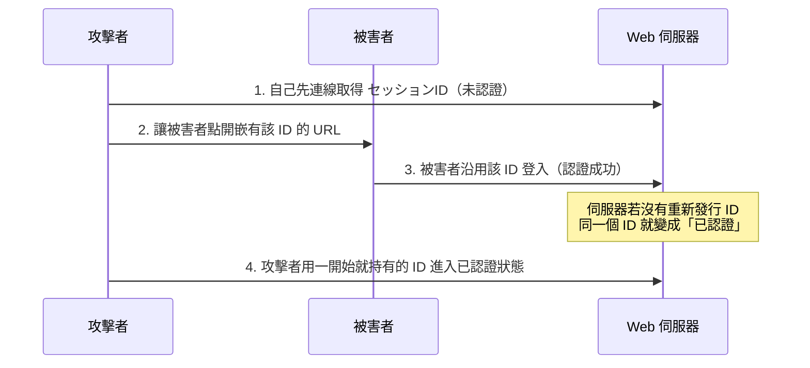

# 1-5 なりすまし

重要度：★★★

> 依導讀順序重寫，不收錄書上原文、原表與練習問題原文。
> **本節依導讀順序分為 ①〜⑥。**

## 縮寫展開

| 縮寫／外來語 | 英文全名 | 說明 |
|---|---|---|
| **IP スプーフィング** | **IP（Internet Protocol） spoofing** | ＝IPアドレス偽装攻撃 |
| **MITM** | **Man In The Middle** | 中間者攻撃，潛伏在通信路徑上 |
| **MITB** | **Man In The Browser** | 潛伏在使用者瀏覽器內 |
| **SSL／TLS** | **Secure Sockets Layer / Transport Layer Security** | 通信加密協定 |
| **トランザクション署名** | **transaction signing** | 在別的裝置確認交易內容並簽章 |
| **OTP** | **One-Time Password** | ＝ワンタイムパスワード |
| **Evil Twin** | **evil twin** | 惡魔雙胞胎，偽裝 AP |
| **AP** | **Access Point** | 無線基地台 |
| **Wi-Fi** | **Wireless Fidelity** | 無線 LAN 的商標名 |
| **VPN** | **Virtual Private Network** | 虛擬私人網路 |
| **セッション ID** | **session ID** | 登入後識別使用者的編號 |
| **セッションハイジャック** | **session hijacking** | 偷 セッションID 冒充 |
| **セッション固定攻撃** | **session fixation** | 先給被害者一個 ID 再共用 |
| **Cookie** | **cookie** | 瀏覽器保存的小型資料 |
| **Secure／HttpOnly 屬性** | **Secure / HttpOnly attribute** | 只走 HTTPS／JavaScript 讀不到 |
| **HTTPS** | **HyperText Transfer Protocol Secure** | 加密的 HTTP |
| **XSS** | **Cross-Site Scripting** | 跨站腳本（→ 1-8） |
| **CSRF** | **Cross-Site Request Forgery** | 跨站請求偽造（→ 1-8） |
| **リプレイ攻撃** | **replay attack** | 原封不動重送認證資料 |
| **チャレンジレスポンス認証** | **challenge-response authentication** | 每次給不同亂數再加工回應 |
| **タイムスタンプ** | **timestamp** | 時間戳記 |
| **ノンス** | **nonce**（number used once） | 只用一次的值 |
| **オープンプロキシ** | **open proxy** | 任何人都能用的代理伺服器 |
| **オープンリレー** | **open relay** | ＝第三者中継 狀態的郵件伺服器 |
| **ブラックリスト** | **blacklist** | 拒收名單 |
| **SMTP** | **Simple Mail Transfer Protocol** | 寄信協定 |
| **SMTP-AUTH** | **SMTP Service Extension for Authentication** | SMTP 加上認證 |
| **POP** | **Post Office Protocol** | 收信協定 |
| **OP25B** | **Outbound Port 25 Blocking** | ISP 封鎖對外 25 埠 |
| **ISP** | **Internet Service Provider** | 網路服務業者 |
| **C&C** | **Command and Control** | 遠端指揮伺服器（→ 1-2） |

## 讀音

| 用語 | 讀音 |
|---|---|
| 偽装 | ぎそう |
| 詐称 | さしょう |
| 中間者攻撃 | ちゅうかんしゃこうげき |
| 悪魔の双子 | あくまのふたご |
| 端末 | たんまつ |
| 別経路 | べつけいろ |
| 再認証 | さいにんしょう |
| 再発行 | さいはっこう |
| 再生成 | さいせいせい |
| 踏み台 | ふみだい |
| 第三者中継 | だいさんしゃちゅうけい |
| 遠隔操作 | えんかくそうさ |

---

## 本節的位置

1-3 是偷到密碼再以本人身分登入；本節更進一步：**不需要密碼，也能讓系統以為你是本人。**
なりすまし（冒充）＝明明不是本人，卻**偽裝成本人**進行行為。整節所有攻擊都在回答同一個問題：**系統憑什麼相信「你是你」？**——IP、連上的 AP、畫面、セッションID、通信內容，每一個信任依據都有對應的攻擊。對策的共同形狀「**只有這一次有效**」是 Ch2 認証 的伏筆；郵件伺服器的部分在 4-3 ② 展開。

---

## ① 系統的信任依據，各被誰打破

先看全貌，後面各段逐一展開：

| 系統相信的東西 | 打破它的攻擊 | 段落 |
|---|---|---|
| **IP 位址** | IP スプーフィング | ② |
| **通信路徑／連上的 AP** | MITM、Evil Twin | ③ |
| **畫面顯示** | MITB | ③ |
| **セッションID** | セッションハイジャック／固定攻撃 | ④ |
| **通信內容** | リプレイ攻撃 | ⑤ |
| **「攻擊來自哪台機器」** | 踏み台、第三者中継 | ⑥ |

---

## ② 偽造來源位址：IP スプーフィング

**IP スプーフィング（IP spoofing）／IPアドレス偽装攻撃**：偽造來源 IP 位址。例如從外部偽裝成內網 IP 通信，或在 DoS 中隱藏來源（→ 1-6）。

> **判別關鍵字：「詐稱（さしょう）來源 IP」。**

**對策**：在路徑上過濾——檢查從外部進來的通信是否冒用內部 IP。**內網 IP 不該從外部進來**，從外面進來就一定是假的。

---

## ③ 插在中間：MITM、MITB、Evil Twin

### MITM vs MITB（最高頻考點）

| | **MITM（Man In The Middle，中間者攻撃）** | **MITB（Man In The Browser）** |
|---|---|---|
| 攻擊位置 | **通信路徑上** | **使用者端末（たんまつ）的瀏覽器內** |
| 做什麼 | 竊聽並竄改往來資料，雙方都以為在直接通信 | 平時不動作，**等連上網路銀行**才竄改轉帳金額與收款人 |
| SSL／TLS 加密能防嗎 | **能**——正確驗證伺服器憑證即可察覺（憑證不符會警告） | **不能**——它在瀏覽器**解密之後、顯示之前**動手；通信完全正常，憑證完全正確 |
| 對策 | 驗證サーバ証明書、TLS（冒充者拿不出正確憑證） | **トランザクション署名**（別経路確認） |

> **MITB 最恐怖之處：畫面上顯示的轉帳內容是「正確的」，實際送出的是被改過的。** 使用者再怎麼確認畫面也看不出來。
> **題型**：題目描述「明明有用 SSL 加密，卻還是發生被害」→ 答案方向一定往 **MITB 或端末側感染** 走，不會是竊聽。

### トランザクション署名：為什麼 OTP 不夠

**⚠️ 理解修正**：直覺「類似 OTP（One-Time Password）的概念」方向對，但關鍵在**經路**。

MITB 在瀏覽器內動手，**畫面上的一切都不可信**。所以把確認動作移到**瀏覽器以外的獨立路徑**——用手機 App 或專用裝置，**重新顯示一次實際的轉帳對象與金額**，由使用者在那台裝置上確認並產生簽章。

> **重點是「別経路（べつけいろ，out-of-band）確認」**：金額與收款人由金融機構直接送到另一台裝置，不經過被污染的瀏覽器，攻擊者改不到。
> **單純的 OTP 只證明「是本人」，證明不了「交易內容沒被改」**——這是 OTP 與 トランザクション署名 的分界，考題抓這裡。

### Evil Twin：自己架一個「中間」

**Evil Twin（evil twin，悪魔の双子）**：架設一個偽裝成正規公眾 Wi-Fi 的 アクセスポイント（access point，AP），連上的人全被攔截——等於攻擊者主動製造 MITM 的位置。

> **只要訊號比正牌強，裝置就會自動優先連過去。**

**對策**：不在公眾 Wi-Fi 處理機密；用 **VPN（Virtual Private Network）**；確認 AP 的正當性——就算被攔截也讀不懂。

---

## ④ 偷或塞 セッションID

登入後，Web 服務發給使用者一個 **セッションID（session ID）**，之後就靠它認人——所以拿到它就**不需要密碼**。

| | **セッションハイジャック**（session hijacking） | **セッション固定攻撃**（session fixation） |
|---|---|---|
| 做法 | **偷走**被害者登入後的 セッションID，直接拿來冒充 | **攻擊者先取得一個 ID，讓被害者用「這個 ID」登入**，之後共用這個已認證的 ID |
| 順序 | 被害者先有 → 攻擊者偷 | **攻擊者先給 → 被害者後用** |
| 被害 | 讀個資、改資料、亂下訂單 | 同左 |

### ⚠️ セッション固定攻撃 的理解修正

原本寫「直接置換掉真的 session」——**順序反了**。實際流程：

**弱點的本質**：伺服器在登入成功後**沒有重新發行 セッションID**。
**對策就一句**：**登入成功時重新發行 セッションID（セッションIDの再生成，さいせいせい）。**

> 原本寫「只要用戶登入就要把 session 無效化」——方向抓對，但精確講法是「**把登入前的舊 ID 作廢，發一個新的**」，不是把 session 整個作廢（那樣使用者就登不進去了）。

### セッションハイジャック 的對策

| 對策 | 原理 |
|---|---|
| セッションID 用足夠長的亂數、難以推測 | 猜不到就偷不到 |
| Cookie 加上 **Secure 屬性**（只在 HTTPS 送出）、**HttpOnly 屬性**（JavaScript 讀不到，防 XSS（Cross-Site Scripting）竊取） | 斷掉竊取途徑 |
| 顯示重要資訊、執行重要操作時**再認証（さいにんしょう）**，再要一次密碼 | 就算 ID 被偷，關鍵操作仍擋得住 |

---

## ⑤ 原封不動重送：リプレイ攻撃

**リプレイ攻撃（replay attack）**：竊取認證時流過的資料（如加密後的密碼、認證用 token），**原封不動重送一次**即可通過認證。

> **不需要解出原始密碼**（原本的理解正確）——加密了也沒用，因為攻擊者根本不讀內容，只是照抄。

**對策：讓每次通信的內容都不一樣 → 重送無效**
チャレンジレスポンス認証（challenge-response authentication）、ワンタイムパスワード（one-time password）、タイムスタンプ（timestamp）、ノンス（nonce）。

### チャレンジレスポンス認証

伺服器每次送一個**不同的亂數（チャレンジ，challenge）**，客戶端用密碼把它加工後回送（レスポンス，response）。

- 每次亂數都不同 → **上次的回應這次完全無效**，竊聽者重送只會被拒絕。
- **密碼本身從未在網路上流動。**

機制在 Ch2 認証 正式展開。

---

## ⑥ 借別人的機器：踏み台 與 第三者中継

前面都是冒充「使用者」，這段是冒充「攻擊來源」——讓追查的線索指向別人。

**踏み台（ふみだい，stepping stone）**：不用自己的裝置攻擊，而是經由第三者的電腦發動，以隱藏真正的攻擊者。
攻擊鏈：攻擊者 → 踏み台 → 踏み台 → 標的。

### 踏み台 vs ゾンビPC（追問）

**不完全等同，是「角色」與「狀態」的差別：**

| | ゾンビPC（zombie PC） | 踏み台 |
|---|---|---|
| 是什麼 | 被 bot 感染、受 C&C 操控的電腦（**狀態**） | 被拿來當攻擊中繼站的機器（**角色**） |
| 關係 | 幾乎一定會被當成 踏み台 | **不一定**是 ゾンビPC |

沒被感染也能當 踏み台 的例子：設定疏漏的**開放代理伺服器（オープンプロキシ，open proxy）**、被盜帳號的伺服器、第三者中継 狀態的郵件伺服器。

> **共同考點：你是受害者，同時也成了攻擊別人的加害者。**

### 第三者中継（だいさんしゃちゅうけい）

郵件伺服器若設定成「**任何人都可以透過我寄信給任何人**」（オープンリレー，open relay），就會被拿來大量發送垃圾信。

被害有兩層：
1. 自家伺服器被當成**寄信的 踏み台**，頻寬與信譽被消耗。
2. 該伺服器的 IP **被列入黑名單（ブラックリスト，blacklist）** → **自己公司正常的郵件也被全世界拒收**——這才是真正的致命傷。

> **⚠️ 對策方向**：不是「只接收聯絡人的信」——那是收信端的過濾，方向錯了。要做的是**讓自家伺服器只服務自己人**。

| 對策 | 說明 |
|---|---|
| **禁止第三者中継的設定** | 郵件伺服器只替「自己網域的使用者」轉送 |
| **SMTP-AUTH**（SMTP Service Extension for Authentication） | 寄信前必須先通過帳號密碼認證 |
| **POP before SMTP** | 先收信（POP 認證）通過後，一段時間內才允許寄信（舊方式） |
| **OP25B**（Outbound Port 25 Blocking） | ISP（Internet Service Provider）封鎖使用者端直接對外的 25 埠，阻止被感染的電腦自行發送垃圾信 |

（三種方式的差別與 OP25B 的原理 → 4-3 ②）

---

## 前因後果

- **なりすまし 的本質是「信任被錯置」**：系統把 IP、セッションID、通信內容、AP、畫面當成「你是你」的證據，每一個都能被偽造或搶走（①的對照表）。
- **對策的共同形狀：加入「只有這一次有效」的要素**——チャレンジレスポンス、ワンタイムパスワード、セッションID 再発行、ノンス。這條原則貫穿 Ch2，後面認証的所有機制都是它的變形。
- **攻擊位置決定對策層級**（本節最實用的解題槓桿）：MITM 在路徑上 → 加密與憑證有效；MITB 在端末內 → 加密無效，只能靠別経路確認。與 1-4「只要加密就安全是錯的」、1-10 キャッシュポイズニング「先問攻擊者站在哪裡」同一個軸。
- **信任要有根**：MITM 靠伺服器憑證識破，憑證可信又要靠 Ch2 的認證機構（ルート証明書）；トランザクション署名 則是把信任移到一條攻擊者碰不到的路徑上。
- **踏み台 是 1-1「攻擊產業化」與 1-2「ボットネット」的收束點**：攻擊者不用自己的機器，是為了斷開追查線索。「我的電腦被感染又沒損失，放著就好」是錯的——你正在成為別人被害的工具，對外的犯罪紀錄掛在你的 IP 上（1-2 的 2012 年 PC遠隔操作事件）。

## 待補（考後）

- XSS／CSRF 與 セッションハイジャック 的關係（1-6 之後回填；XSS／CSRF 實際在 1-8）
- サーバ証明書・電子署名 的機制細節 → Ch2
- チャレンジレスポンス認証 的實際流程圖 → Ch2
- 多要素認証 與各攻擊的對應關係 → Ch2
- DNS キャッシュポイズニング 等其他 なりすまし 手法（若後續章節出現；→ 1-10 已涵蓋）
