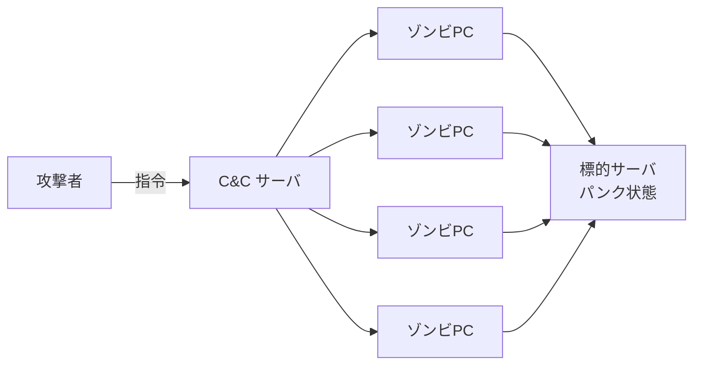

# 1-6 DoS 攻撃

重要度：★★★

## DoS 攻撃

| 日文用語 | 讀音 | 英文 | 中文解釋 | 常考重點 |
|---|---|---|---|---|
| DoS 攻撃 | — | **Denial of Service**（サービス妨害攻撃） | 大量請求塞爆伺服器，使其 **パンク状態**、停止提供服務 | **不是單一手法，是各種手法的總稱** |
| DDoS 攻撃 | — | **Distributed** Denial of Service | 從**複數機器**同時攻擊單一目標 | **多対一**。來源太多，難以特定攻擊者 |
| EDoS 攻撃 | — | **Economic** Denial of Sustainability | 針對**從量課金（pay as you go）**的雲端服務，故意灌高資源使用量，讓被害者付出巨額費用 | 攻擊的不是可用性而是**荷包**——服務其實還活著 |
| メールボム | — | mail bomb | 對特定使用者大量寄送垃圾信、附加巨大檔案，塞爆信箱與伺服器 | 破壞**可用性** |

**DoS 的三個特徵（テキスト）**：
1. 並非特定手法，而是各種攻擊手法的**總稱**
2. 攻擊關係是 **1 対 1**（相對於 DDoS 的多対一）
3. 不少情況是針對 **OS 或軟體的脆弱性**下手，而非單純灌流量

## 代表的な手法

### SYN Flood 攻撃

先理解 TCP 的 **3ウェイハンドシェイク（three-way handshake）**：

```
client → server :  SYN          「我要連你」
client ← server :  SYN + ACK    「好，我準備好了」  ← 此時伺服器已配置資源等待
client → server :  ACK          「確認」            ← 連線成立
```

**攻擊的關鍵不是「一直打」，而是「故意不回第三步」。**

伺服器收到 SYN 後會先**保留一塊連線資源**再等 ACK。攻擊者只送 SYN、永不送 ACK，伺服器就卡在 **ハーフオープン（half-open，半開き接続）**，資源被佔住直到 timeout。連線管理表塞滿後**正常使用者連不進來**。

- 耗盡的是**伺服器的連線資源表**，不是頻寬 → **少量封包就能打垮**
- 來源 IP 通常偽造（→ 1-5 IP スプーフィング），無從得知該擋誰
- **對策：SYN Cookie**（先不配置資源，靠計算值驗證）、縮短 timeout、ファイアウォール

### Smurf 攻撃

**ICMP（Internet Control Message Protocol）** 是網路的狀態回報／錯誤通知協定，**ping 就是用它**。
- **エコー要求（echo request）**＝ping 送出的請求
- **エコー応答（echo reply）**＝對方的回應

**Smurf 的精髓是「借力打人」，攻擊者不直接打伺服器：**

```
攻撃者 --(少数の要求, 送信元IPを被害者に偽装)--> ブロードキャストアドレス
                                                   ├→ ネットワーク上の全ホスト
                                                   └→ 全員がエコー応答 → 被害者が大量の応答に埋もれる
```

攻擊者送 1 個封包，被害者收到上百個 → **増幅攻撃（ぞうふくこうげき, amplification）／反射攻撃（reflection）**。
形式上是 DoS，實際被害規模接近 DDoS，**而且回應的主機全是無辜的踏み台**（→ 1-5）。

**對策**：路由器**不轉送對廣播位址的 ICMP**、關閉不必要的 ICMP 回應。

### リフレクタ攻撃

**リフレクタ（reflector）＝被騙去回應的那台主機。**
攻擊者偽造來源 IP 為被害者，把請求送給 reflector，reflector 老實回應，回應全砸到被害者身上。

- Smurf 的 reflector＝廣播網段上的所有主機
- **DNS アンプ攻撃／NTP アンプ攻撃** 的 reflector＝DNS／NTP 伺服器（放大率可達數十倍）
- 分散化的版本叫 **DRDoS（Distributed Reflection DoS）**

### ランダムサブドメイン攻撃（DNS水責め攻撃）

| 日文用語 | 讀音 | 英文 | 中文解釋 |
|---|---|---|---|
| **ランダムサブドメイン攻撃** | — | random subdomain attack | 別名 **DNS水責め攻撃（DNS water torture）** |
| **オープンリゾルバ** | — | open resolver | 對全世界開放代查服務的 DNS キャッシュサーバ |
| **権威DNSサーバ** | けんいDNSサーバ | authoritative DNS server | 掌管某網域正式資料的伺服器 |

**機制的關鍵在「隨機」兩個字：**

攻擊者向大量 **オープンリゾルバ** 查詢 `a8f3k.example.com`、`z9q1p.example.com` 這種**隨機產生、根本不存在的子網域**。
因為每一個都是全新的，**キャッシュ 裡永遠不會有** → オープンリゾルバ 只能每一次都轉送到 `example.com` 的**権威DNSサーバ**。

> **於是查詢全部匯集到那一台権威サーバ，把它壓垮，該網域就從網路上消失。**

### ⚠️ DNS アンプ攻撃 との対比（必考）

| | **DNS アンプ攻撃** | **ランダムサブドメイン攻撃** |
|---|---|---|
| 踏み台 | **オープンリゾルバ** | **オープンリゾルバ**（相同） |
| **標的** | **被偽造來源 IP 的第三者** | **該網域の権威DNSサーバ** |
| 利用的性質 | **回應比查詢大很多**（増幅） | **快取永遠命中不了**（必定轉送） |
| **凶器は** | **応答**（回應打向被害者） | **問い合わせ**（查詢打向権威サーバ） |

> **記法：一個是「回應變成武器」，一個是「查詢變成武器」。**

**對策共通**：**別讓自己的 DNS 伺服器成為オープンリゾルバ**（再帰的問い合わせを内部に限定 → 1-10）。

## DDoS の二つの来歴（重要な区別）

| | 中間那些機器 | 特徵 |
|---|---|---|
| **ボットネット型** | **被感染的 ゾンビPC** | 攻擊者透過 C&C 下令，bot 主動攻擊（→ 1-2） |
| **反射・増幅型** | **完全沒被感染的正常伺服器** | 被偽造來源 IP 騙去回應，自己不知情 |

**「DDoS ＝ 一定有 botnet」是錯的。**



## 対策：IDS / IPS

| | 全名 | 日文 | 做什麼 |
|---|---|---|---|
| **IDS** | Intrusion Detection System | 侵入検知システム（しんにゅうけんちシステム） | **偵測到就通知管理者，不阻擋** |
| **IPS** | Intrusion Prevention System | 侵入防止システム（しんにゅうぼうしシステム） | **偵測＋自動阻斷** |

差別只有兩個字：**検知 vs 防止**。由此推出兩件必考的事：

**① 設置位置不同**
- **IDS 並列**（接鏡射埠旁觀，通信不經過它）→ 它壞掉不影響通信
- **IPS 串列**（インライン, inline，架在通信路徑上）→ 它壞掉或誤判，**正常通信就被切斷**

**② IPS 的代價是誤判風險** → 不是「IPS 較新較好」，而是**取捨**：要即時阻斷，就得承受誤斷正常業務的風險。

**偵測方式**

| 方式 | 日文 | 原理 | 弱點 |
|---|---|---|---|
| シグネチャ型 | 不正検出 | 比對已知攻擊樣式 | **未知攻擊抓不到**（同 1-2 パターンマッチング） |
| アノマリ型 | 異常検出 | 學習「正常狀態」，偏離就報警 | **誤検知多**；若學習期間已被入侵，會把異常當正常 |

**誤判的兩個名詞（必背）**

- **フォールスポジティブ（false positive）**＝把正常判成攻擊 → 誤報、業務被擋
- **フォールスネガティブ（false negative）**＝把攻擊漏掉 → 更致命

兩者是**蹺蹺板**，不可能同時最佳化。這個取捨在 Ch2 生体認証 的 **FRR／FAR** 會再出現一次，是同一個結構。

**防禦分工（Ch5 正式展開）**：ファイアウォール 看「誰能連哪個 port」；IDS/IPS 看「通信內容像不像攻擊」；WAF 專看 Web 應用層。三者是疊加的多層防御，不是替代關係。

**DDoS 專屬對策**：CDN、クラウド型 DDoS 対策サービス、帯域制御。

## 前因後果

**DoS 系列全部攻擊的是「可用性」。**

| 要素 | 讀音 | 英文 | 意思 | 被破壞的例子 |
|---|---|---|---|---|
| 機密性 | きみつせい | Confidentiality | 只有被授權者能看到 | 情報漏えい、盗聴 |
| 完全性 | かんぜんせい | Integrity | 資料正確、未被竄改 | 改ざん、MITB 改轉帳金額 |
| **可用性** | **かようせい** | **Availability** | **需要時就能正常使用** | **DoS／DDoS、メールボム、ランサムウェア 加密** |

它不偷資料、不改資料，就是**讓你用不了**。題目問「どの要素が損なわれたか」→ 直接答可用性。
（對照：ランサムウェア 破壞可用性；**二重脅迫** 多破壞一個機密性 → 1-2 的考點就是這樣來的。）

**EDoS 是「可用性攻擊」的變種，但打的是錢。**
雲端的從量課金原本是優點（用多少付多少），卻成了新的攻擊面：服務**沒有停止**，帳單卻爆炸。這說明了一件事——**攻擊面會跟著商業模式改變**，不是只跟著技術改變。

**DDoS 最難防，因為每一個封包看起來都是正常的。**
來源是真實 IP、請求格式正確、沒有任何惡意特徵。所以**無法靠「辨識惡意封包」防禦**，只能靠流量規模的分散與吸收（CDN、雲端清洗服務）。這跟本章其他所有攻擊的防禦邏輯都不同——別的攻擊是「認出壞東西擋掉」，DDoS 是「壞東西認不出來，只能扛」。

**反射・増幅型 把 1-5 的 IP スプーフィング 變現了。**
偽造來源 IP 這件事本身無害，一旦配上「會自動回應的第三方」就變成武器。這也是為什麼防禦責任會落到**與被害者無關的第三方**身上（關閉開放的 DNS 遞迴、不轉送廣播 ICMP）——資安不是各家顧好自己就夠，這個觀念 Ch3 的組織責任會再出現。

## 待補（考後）

- DNS アンプ攻撃 的具體機制與放大率
- ランダムサブドメイン攻撃 的實際事例
- Slowloris 等低速型 DoS（少量連線長時間佔用）
- IDS/IPS 的 NIDS／HIDS 分類 → Ch5 回填
- WAF 的詳細機能 → Ch5 回填
- クラウド型 DDoS 対策サービス 的實際運作（スクラビング）
