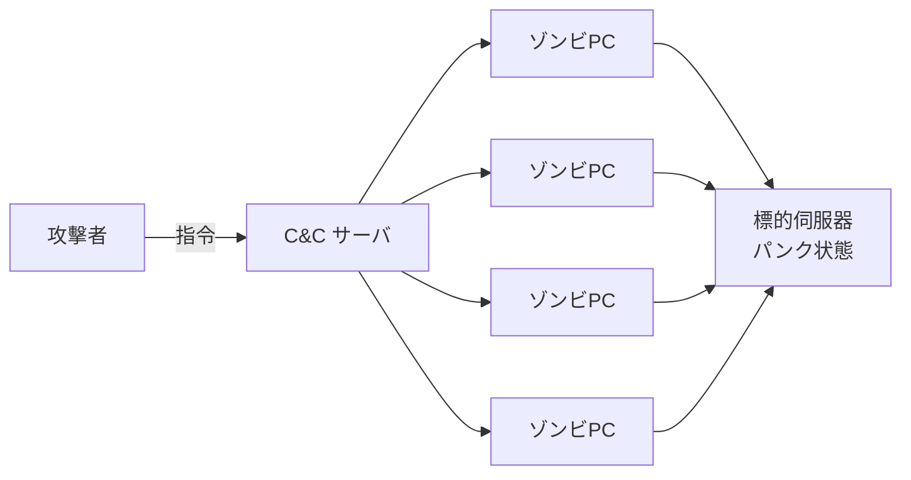

# 1-6 DoS 攻撃

重要度：★★★

> 依導讀順序重寫，不收錄書上原文、原表與練習問題原文。
> **本節依導讀順序分為 ①〜⑥。**

## 縮寫展開

| 縮寫／外來語 | 英文全名 | 說明 |
|---|---|---|
| **DoS** | **Denial of Service** | サービス妨害攻撃，服務阻斷 |
| **DDoS** | **Distributed Denial of Service** | 分散式服務阻斷，多對一 |
| **EDoS** | **Economic Denial of Sustainability** | 針對從量課金，打荷包 |
| **DRDoS** | **Distributed Reflection Denial of Service** | 分散式反射型 DoS |
| **メールボム** | **mail bomb** | 郵件炸彈 |
| **パンク状態** | **puncture**（爆胎）＋状態 | 伺服器被塞爆、停止服務 |
| **TCP** | **Transmission Control Protocol** | 傳輸控制協定 |
| **SYN／ACK** | **SYNchronize／ACKnowledge** | 建立連線／確認 |
| **3ウェイハンドシェイク** | **three-way handshake** | TCP 建立連線的三步驟 |
| **ハーフオープン** | **half-open** | 半開連線（半開き接続） |
| **SYN フラッド** | **SYN flood** | 只送 SYN 不送 ACK |
| **SYN クッキー** | **SYN cookie** | 先不配置資源，靠計算值驗證 |
| **ICMP** | **Internet Control Message Protocol** | 網路狀態回報／錯誤通知，ping 用它 |
| **エコー要求／エコー応答** | **echo request / echo reply** | ping 的請求／回應 |
| **スマーフ攻撃** | **Smurf attack** | 偽造來源向廣播位址送 ICMP |
| **ブロードキャストアドレス** | **broadcast address** | 廣播位址，送給網段上所有主機 |
| **リフレクタ** | **reflector** | 被騙去回應的那台主機 |
| **アンプ攻撃** | **amplification attack** | 増幅攻撃 |
| **DNS** | **Domain Name System** | 網域名稱解析 |
| **NTP** | **Network Time Protocol** | 網路校時協定 |
| **ランダムサブドメイン攻撃** | **random subdomain attack** | 別名 DNS水責め攻撃（DNS water torture） |
| **オープンリゾルバ** | **open resolver** | 對全世界開放代查的 DNS キャッシュサーバ |
| **キャッシュ** | **cache** | 快取 |
| **ボットネット** | **botnet** | 被同一攻擊者操控的殭屍機器群 |
| **ゾンビPC** | **zombie PC** | 被感染、受操控的電腦 |
| **C&C サーバ** | **Command and Control server** | 對 bot 下指令的伺服器 |
| **IP スプーフィング** | **IP spoofing** | 偽造來源 IP |
| **IDS** | **Intrusion Detection System** | 侵入検知システム |
| **IPS** | **Intrusion Prevention System** | 侵入防止システム |
| **インライン** | **inline** | 串接在通信路徑上 |
| **シグネチャ型** | **signature-based** | 比對已知攻擊樣式 |
| **アノマリ型** | **anomaly-based** | 偏離正常就報警 |
| **フォールスポジティブ** | **false positive** | 誤報（把正常判成攻擊） |
| **フォールスネガティブ** | **false negative** | 漏報（把攻擊放過） |
| **FRR／FAR** | **False Rejection Rate／False Acceptance Rate** | 生体認証的本人拒否率／他人受入率（Ch2） |
| **WAF** | **Web Application Firewall** | 應用層防火牆 |
| **CDN** | **Content Delivery Network** | 內容傳遞網路，分散吸收流量 |
| **スクラビング** | **scrubbing** | 雲端清洗流量 |
| **Slowloris** | — | 低速型 DoS 工具 |
| **NIDS／HIDS** | **Network-based／Host-based IDS** | 網路型／主機型 IDS |

## 讀音

| 用語 | 讀音 |
|---|---|
| 増幅攻撃 | ぞうふくこうげき |
| 反射攻撃 | はんしゃこうげき |
| 踏み台 | ふみだい |
| 権威DNSサーバ | けんいDNSサーバ |
| 水責め | みずぜめ |
| 従量課金 | じゅうりょうかきん |
| 侵入検知 | しんにゅうけんち |
| 侵入防止 | しんにゅうぼうし |
| 不正検出 | ふせいけんしゅつ |
| 異常検出 | いじょうけんしゅつ |
| 誤検知 | ごけんち |
| 帯域制御 | たいいきせいぎょ |
| 機密性 | きみつせい |
| 完全性 | かんぜんせい |
| 可用性 | かようせい |
| 二重脅迫 | にじゅうきょうはく |

---

## 本節的位置

1-3 到 1-5 的攻擊都想「進去」：偷密碼、偷聽、冒充。DoS 不進去，它只要**讓你用不了**。整節回答兩個問題：**怎麼用很少的力氣讓服務停擺？為什麼這種攻擊特別難擋？**
① 定義與 CIA → ② 耗盡資源（SYN フラッド）→ ③ 借力打人（反射・増幅）→ ④ 打 DNS（兩種 DNS 攻擊對照）→ ⑤ DDoS 的兩種來歷 → ⑥ 對策（IDS／IPS）。

---

## ① DoS 是什麼：一個總稱，打的是可用性

DoS（Denial of Service）不是一種手法，是**「讓服務停擺」這類攻擊的總稱**。大量請求塞爆伺服器，讓它進入パンク状態（puncture，爆掉）、停止提供服務。

**DoS 的三個特徵**：
1. 並非特定手法，而是各種攻擊手法的**總稱**
2. 攻擊關係是 **1 對 1**（相對於 DDoS 的多對一）
3. 不少情況是針對 **OS 或軟體的脆弱性**下手，而非單純灌流量

同家族的四個名詞：

| 名詞 | 做法 | 考點 |
|---|---|---|
| **DoS** | 一台打一台 | 總稱，不是單一手法 |
| **DDoS**（Distributed） | **複數機器**同時打單一目標 | **多對一**，來源太多，難以特定攻擊者 |
| **EDoS**（Economic Denial of Sustainability） | 針對**従量課金（じゅうりょうかきん，pay as you go）**的雲端服務，故意灌高資源用量，讓被害者付巨額帳單 | 打的不是可用性而是**荷包**，服務其實還活著 |
| **メールボム**（mail bomb） | 對特定使用者大量寄信、夾巨大附件，塞爆信箱與伺服器 | 破壞**可用性** |

**DoS 系列打的是 CIA 裡的「可用性」**：

| 要素 | 意思 | 被破壞的例子 |
|---|---|---|
| 機密性（きみつせい，Confidentiality） | 只有被授權者能看到 | 情報漏えい、盗聴 |
| 完全性（かんぜんせい，Integrity） | 資料正確、未被竄改 | 改ざん、MITB（Man-in-the-Browser）改轉帳金額 |
| **可用性（かようせい，Availability）** | **需要時就能正常使用** | **DoS／DDoS、メールボム、ランサムウェア（ransomware）加密** |

> 題目問「哪個要素受損」→ DoS 直接答**可用性**。它不偷、不改，就是讓你用不了。
> 對照 1-2：ランサムウェア破壞可用性；**二重脅迫（にじゅうきょうはく）**再多破壞一個機密性。

---

## ② 耗盡資源：SYN フラッド

**為什麼少量封包就能打垮伺服器？** 因為攻擊目標不是頻寬，是伺服器「等待中」的資源。

先看 TCP 的 3ウェイハンドシェイク（three-way handshake）：

```
client → server :  SYN          「我要連你」
client ← server :  SYN + ACK    「好，我準備好了」  ← 此時伺服器已配置資源等待
client → server :  ACK          「確認」            ← 連線成立
```

**攻擊的關鍵不是「一直打」，而是「故意不回第三步」。**
伺服器收到 SYN 就先保留一塊連線資源等 ACK。攻擊者只送 SYN、永不送 ACK，伺服器卡在ハーフオープン（half-open，半開き接続（はんびらきせつぞく））狀態，資源被佔住直到 timeout。連線管理表塞滿後，**正常使用者連不進來**。

| 重點 | 說明 |
|---|---|
| 耗盡什麼 | **伺服器的連線資源表**，不是頻寬 → 少量封包就夠 |
| 為什麼難擋 | 來源 IP 通常偽造（→ 1-5 IP スプーフィング（IP spoofing）），不知道該擋誰 |
| 對策 | **SYN クッキー（SYN cookie）**：先不配置資源，靠計算值驗證；縮短 timeout；ファイアウォール（firewall） |

> 例：餐廳接到 100 通訂位電話，每通都說「幫我留位，等等確認」然後不再打來。餐廳位子全留著，真客人進不來。SYN クッキー 就是「不先留位，等客人真的回電再說」。

---

## ③ 借力打人：反射・増幅

②是攻擊者自己打；③是**騙第三者替他打**。

### スマーフ攻撃（Smurf attack）

ICMP（Internet Control Message Protocol）是網路的狀態回報／錯誤通知協定，**ping 就是用它**：ping 送出エコー要求（echo request），對方回エコー応答（echo reply）。

```
攻擊者 ──(少量請求，來源 IP 偽造成被害者)──> 廣播位址
                                              ├→ 網段上所有主機
                                              └→ 全員回エコー応答 → 被害者被大量回應淹沒
```

攻擊者送 1 個封包，被害者收到上百個 → **増幅攻撃（ぞうふくこうげき，amplification）／反射攻撃（はんしゃこうげき，reflection）**。
形式上是 DoS，實際被害規模接近 DDoS，**而且回應的主機全是無辜的踏み台（ふみだい）**（→ 1-5）。

**對策**：路由器**不轉送對ブロードキャストアドレス（broadcast address）的 ICMP**、關閉不必要的 ICMP 回應。

### リフレクタ攻撃（reflector attack）：把 Smurf 一般化

**リフレクタ（reflector）＝被騙去回應的那台主機。** 攻擊者把來源 IP 偽造成被害者，送請求給 reflector，reflector 老實回應，回應全砸到被害者身上。

| 攻擊 | reflector 是誰 |
|---|---|
| Smurf | 廣播網段上的所有主機 |
| **DNS アンプ攻撃／NTP アンプ攻撃**（amplification attack） | DNS（Domain Name System）／NTP（Network Time Protocol）伺服器，放大率可達數十倍 |
| **DRDoS**（Distributed Reflection DoS） | 上述的分散化版本 |

> 重點：偽造來源 IP 本身無害，**一旦配上「會自動回應的第三方」就變成武器**。

---

## ④ 打 DNS：ランダムサブドメイン攻撃 vs DNS アンプ攻撃

③的 DNS アンプ攻撃是把 DNS 當凶器；這裡的ランダムサブドメイン攻撃（random subdomain attack，別名 DNS 水責め攻撃（みずぜめこうげき，DNS water torture））是**把 DNS 本身當目標**。兩者都借用オープンリゾルバ（open resolver：對全世界開放代查服務的 DNS キャッシュ（cache）サーバ），所以必考對照。

**機制的關鍵在「隨機」兩個字**：攻擊者向大量オープンリゾルバ查詢 `a8f3k.example.com`、`z9q1p.example.com` 這種**隨機產生、根本不存在的子網域**。每一個都是全新的，**快取裡永遠不會有** → オープンリゾルバ只能每次都轉送給 `example.com` 的**権威DNSサーバ（けんいDNSサーバ，authoritative DNS server：掌管該網域正式資料的伺服器）**。

> 查詢全部匯集到那一台権威サーバ，把它壓垮，該網域就從網路上消失。

| | **DNS アンプ攻撃** | **ランダムサブドメイン攻撃** |
|---|---|---|
| 踏み台 | **オープンリゾルバ** | **オープンリゾルバ**（相同） |
| **標的** | **被偽造來源 IP 的第三者** | **該網域的権威DNSサーバ** |
| 利用的性質 | **回應比查詢大很多**（増幅） | **快取永遠命中不了**（必定轉送） |
| **凶器** | **回應**（打向被害者） | **查詢**（打向権威サーバ） |

> **記法：一個是「回應變成武器」，一個是「查詢變成武器」。**
> 共通對策：**別讓自己的 DNS 伺服器成為オープンリゾルバ**（遞迴查詢只限內部 → 1-10）。

---

## ⑤ DDoS 的兩種來歷

③④已經出現「很多機器一起打」，但中間那些機器的身分完全不同：

| | 中間那些機器 | 特徵 |
|---|---|---|
| **ボットネット（botnet）型** | **被感染的ゾンビPC（zombie PC）** | 攻擊者透過 C&C（Command and Control）サーバ下令，bot 主動攻擊（→ 1-2） |
| **反射・増幅型** | **完全沒被感染的正常伺服器** | 被偽造來源 IP 騙去回應，自己不知情 |

> **「DDoS ＝ 一定有 botnet」是錯的。**



**DDoS 為什麼最難防**：每一個封包看起來都是正常的——來源是真實 IP、請求格式正確、沒有惡意特徵。所以**無法靠「辨識惡意封包」防禦**，只能靠流量規模的分散與吸收。本章其他攻擊是「認出壞東西擋掉」，DDoS 是「壞東西認不出來，只能扛」。

---

## ⑥ 對策：IDS／IPS 與 DDoS 專屬對策

### IDS vs IPS：差別只有兩個字

| | 全名 | 做什麼 |
|---|---|---|
| **IDS** | Intrusion Detection System，侵入検知（しんにゅうけんち）システム | **偵測到就通知管理者，不阻擋** |
| **IPS** | Intrusion Prevention System，侵入防止（しんにゅうぼうし）システム | **偵測＋自動阻斷** |

**検知 vs 防止**，由此推出兩件必考的事：

1. **設置位置不同**
   - **IDS 並列**（接鏡射埠旁觀，通信不經過它）→ 它壞掉不影響通信
   - **IPS 串列**（インライン（inline），架在通信路徑上）→ 它壞掉或誤判，**正常通信就被切斷**
2. **IPS 的代價是誤判風險** → 不是「IPS 較新較好」，而是**取捨**：要即時阻斷，就得承受誤斷正常業務的風險。

### 偵測方式

| 方式 | 別名 | 原理 | 弱點 |
|---|---|---|---|
| シグネチャ型（signature-based） | 不正検出（ふせいけんしゅつ） | 比對已知攻擊樣式 | **未知攻擊抓不到**（同 1-2 パターンマッチング（pattern matching）） |
| アノマリ型（anomaly-based） | 異常検出（いじょうけんしゅつ） | 學習「正常狀態」，偏離就報警 | **誤検知（ごけんち）多**；若學習期間已被入侵，會把異常當正常 |

### 誤判的兩個名詞（必背）

| 名詞 | 意思 | 後果 |
|---|---|---|
| **フォールスポジティブ（false positive）** | 把正常判成攻擊 | 誤報、業務被擋 |
| **フォールスネガティブ（false negative）** | 把攻擊漏掉 | **更致命** |

> 兩者是**蹺蹺板**，不可能同時最佳化。同一個結構在 Ch2 生体認証（せいたいにんしょう）的 **FRR／FAR**（False Rejection Rate／False Acceptance Rate）會再出現。

### 防禦分工與 DDoS 專屬對策

- ファイアウォール看「誰能連哪個 port」；IDS/IPS 看「通信內容像不像攻擊」；WAF（Web Application Firewall）專看 Web 應用層。三者**疊加成多層防御（たそうぼうぎょ）**，不是替代關係（Ch5 正式展開）。
- **DDoS 專屬對策**：CDN（Content Delivery Network）、クラウド型 DDoS 対策サービス、帯域制御（たいいきせいぎょ）——都是⑤說的「扛」。

---

## 前因後果

- **整節攻擊的都是可用性**：不偷不改，只讓你用不了。題目問受損要素直接答可用性。
- **攻擊面跟著商業模式改變**：EDoS 是可用性攻擊的變種，但打的是錢。從量課金原本是優點（用多少付多少），卻成了新攻擊面——服務**沒停**，帳單卻爆炸。
- **反射・増幅型把 1-5 的 IP スプーフィング變現了**。所以防禦責任落到**與被害者無關的第三方**身上（關閉開放的 DNS 遞迴、不轉送廣播 ICMP）——資安不是各家顧好自己就夠，這個觀念在 Ch3 的組織責任會再出現。
- **DDoS 是「認不出壞東西」的極端**：其他攻擊靠辨識擋掉，DDoS 只能分散吸收。
- **検知 vs 防止**：IDS 與 IPS 的差別決定了設置位置與誤判代價，是安全性 vs 利便性取捨的典型；フォールスポジティブ／ネガティブ的蹺蹺板接到 Ch2 的 FRR／FAR。
- **ファイアウォール＋IDS/IPS＋WAF＝多層防御**，Ch5 會逐一展開。

## 待補（考後）

- DNS アンプ攻撃 的具體機制與放大率
- ランダムサブドメイン攻撃 的實際事例
- Slowloris 等低速型 DoS（少量連線長時間佔用）
- IDS/IPS 的 NIDS／HIDS 分類 → Ch5 回填
- WAF 的詳細機能 → Ch5 回填
- クラウド型 DDoS 対策サービス 的實際運作（スクラビング）
