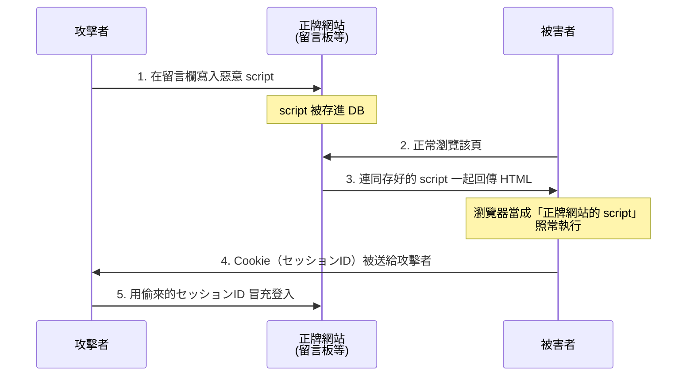
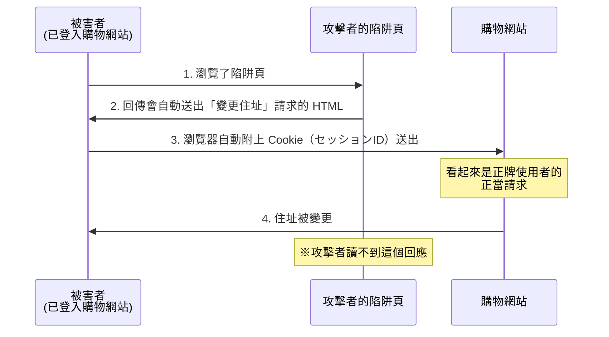

# 1-8 スクリプト攻撃

重要度：★★☆

> 依導讀順序重寫，不收錄書上原文、原表與練習問題原文。
> **本節依導讀順序分為 ①〜⑦。**

## 縮寫展開

| 縮寫／外來語 | 英文全名 | 說明 |
|---|---|---|
| **スクリプト** | **script** | 瀏覽器或伺服器會直接執行的程式碼 |
| **インジェクション** | **injection** | 注入 |
| **XSS** | **Cross-Site Scripting** | クロスサイトスクリプティング |
| **CSRF** | **Cross-Site Request Forgery**（forge＝偽造） | クロスサイトリクエストフォージェリ |
| **SQL** | **Structured Query Language** | 操作資料庫的語言 |
| **OS** | **Operating System** | 作業系統 |
| **シェル** | **shell** | 解譯 OS 指令的程式 |
| **DOM** | **Document Object Model** | 瀏覽器把 HTML 拆成的物件樹 |
| **HTML** | **HyperText Markup Language** | 網頁標記語言 |
| **CSP** | **Content Security Policy** | 網站宣告「只准載入哪些來源的資源」 |
| **WAF** | **Web Application Firewall** | 應用層的防火牆 |
| **クッキー** | **cookie** | 瀏覽器保存的網站資料 |
| **セッションID** | **session ID** | 登入後辨識你的號碼牌 |
| **セッションハイジャック** | **session hijacking** | 偷 session ID 冒充登入者（→ 1-5） |
| **セッション固定攻撃** | **session fixation** | 先塞給你一個已知 ID |
| **スニッフィング** | **sniffing** | 竊聽封包（→ 1-4） |
| **HttpOnly／Secure 屬性** | — | Cookie 屬性：JS 讀不到／只走 HTTPS |
| **SameSite 屬性** | — | Cookie 屬性：跨站請求不自動附帶 |
| **CSRF トークン** | **CSRF token** | 表單裡的隨機驗證值（ワンタイムトークン，one-time token） |
| **リファラ** | **referer** | 從哪一頁連過來的資訊 |
| **プレースホルダ** | **placeholder** | 先固定 SQL 骨架再填值（バインド機構，bind mechanism） |
| **エスケープ処理** | **escape** processing | 把特殊字元換成無害表記 |
| **サニタイジング** | **sanitizing** | 無害化，常與エスケープ同義使用 |
| **バリデーション** | **validation** | 入力値の検証 |
| **ホワイトリスト／ブラックリスト** | **whitelist／blacklist** | 只准已知安全的／列出已知危險的 |
| **ディレクトリリスティング** | **directory listing** | ディレクトリ一覧表示 |
| **ディレクトリトラバーサル** | **directory traversal**（traversal＝穿越） | 別名 パストラバーサル（path traversal） |
| **フットプリンティング** | **footprinting** | 攻擊前的偵察（→ 1-4） |
| **ソルト** | **salt** | 密碼雜湊前加的隨機值（→ 1-3） |
| **パターンマッチング** | **pattern matching** | 比對特徵碼（→ 1-2） |
| **シグネチャ型** | **signature-based** | IDS 比對已知樣式（→ 1-6） |
| **バッファオーバーフロー** | **buffer overflow** | → 1-10 |
| **セキュアプログラミング** | **secure programming** | 安全的程式寫法 |
| **Same-Origin Policy** | — | 同一オリジンポリシー，同源政策 |

## 讀音

| 用語 | 讀音 |
|---|---|
| 注入 | ちゅうにゅう |
| 格納型 | かくのうがた |
| 蓄積型 | ちくせきがた |
| 反射型 | はんしゃがた |
| 窃取 | せっしゅ |
| 改ざん | かいざん |
| 削除 | さくじょ |
| 認証の回避 | にんしょうのかいひ |
| 入力値の検証 | にゅうりょくちのけんしょう |
| 権限の最小化 | けんげんのさいしょうか |
| 乗っ取り | のっとり |
| 踏み台 | ふみだい |
| 設定不備 | せっていふび |
| 無害化 | むがいか |
| 再発行 | さいはっこう |

---

## 本節的位置

1-7 的攻擊靠假網站騙人。這節的攻擊**用的是真網站**：攻擊者把自己的東西塞進正牌網站的輸入欄，讓網站替他做壞事。整節回答：**為什麼「使用者輸入」能變成攻擊？怎麼從結構上讓它不可能？**
① 注入型的共通病 → ② SQL インジェクション → ③ OS コマンドインジェクション → ④ XSS → ⑤ CSRF → ⑥ XSS vs CSRF 與セッションハイジャック收攏 → ⑦ 目錄類（リスティング／トラバーサル）。

---

## ① 注入型攻擊都是同一種病

> **病因：使用者的輸入被當成「語法」而不是「資料」來解釋。**

| 攻擊 | 被注入的語言 | 執行場所 | 影響範圍 |
|---|---|---|---|
| **XSS**（Cross-Site Scripting） | HTML／JavaScript | **被害者的瀏覽器** | **其他使用者** |
| **SQL インジェクション**（SQL injection） | SQL（Structured Query Language） | 伺服器上的**資料庫** | 資料庫裡的資料 |
| **OS コマンドインジェクション**（OS command injection） | shell 指令 | 伺服器的 **OS** | **伺服器本身**（最嚴重） |

嚴重度階梯：資料庫（SQL）< 伺服器 OS（OS コマンド）。XSS 走另一條軸——不擴大對伺服器的權限，而是**把正牌網站變成攻擊其他使用者的武器**。所以「XSS 的直接被害者是誰」答**其他使用者**，不是網站營運者。

---

## ② SQL インジェクション：輸入變成 SQL 語句的一部分

**不是「輸入指令」，是「讓輸入的字變成 SQL 語句的一部分」。**
程式想組的是 `WHERE id = '輸入值'`，攻擊者輸入 `' OR '1'='1` 之類的字串，**整句的語法結構被改寫**，條件永遠成立。

**四種被害（第四種最常被忽略）**：
1. 情報の**窃取（せっしゅ）**
2. **改ざん（かいざん）**
3. **削除（さくじょ）**
4. **認証の回避（にんしょうのかいひ）** ← 不需要密碼就登入成功，因為 WHERE 條件被改成恆真

**對策**

| 對策 | 說明 |
|---|---|
| **プレースホルダ（placeholder）／バインド機構** | **本命。** 先固定 SQL 骨架（`WHERE id = ?`），值之後才以「值的身分」填入 → **值不可能變成語法** |
| エスケープ処理（escape） | 轉義特殊字元。有效但容易漏，次要手段 |
| 入力値の検証（にゅうりょくちのけんしょう，バリデーション（validation）） | 檢查格式（如只准數字） |
| **DB 帳號權限最小化** | 被打穿時限縮損害 |
| **不顯示詳細錯誤訊息** | 錯誤訊息會洩漏表名、欄位名 → 等於幫攻擊者做フットプリンティング（footprinting，1-4） |
| **WAF**（Web Application Firewall） | 應用層擋掉可疑請求 |

> **一句話**：**エスケープ是「把危險的字變乖」，プレースホルダ是「讓字根本沒機會變危險」。**

---

## ③ OS コマンドインジェクション：拿到 OS 層級

**應用程式本來就會呼叫 OS 指令，攻擊者把自己的指令串進去。**
常見手法是用 `;` 或 `|` 接在後面：程式想跑 `ping <輸入的IP>`，輸入 `8.8.8.8; rm -rf /` 就變成兩條指令。

**嚴重度比 SQL インジェクション高一級**，拿到的是 OS 層級的執行能力：

- 檔案的刪除、複製、置換、閱覽
- **下載並執行惡意程式**（等於把 1-2 整章搬到伺服器上）
- **把伺服器當成攻擊他人的踏み台（ふみだい）**（→ 1-5）
- **伺服器的乗っ取り（のっとり）**（完全接管）

**對策**

| 對策 | 說明 |
|---|---|
| **不使用會呼叫 shell 的函式** | **本命。** 不呼叫 shell，就沒有「指令被串接」這回事 |
| 入力値の検証 | 用**ホワイトリスト（whitelist）方式**（只允許已知安全的字元）；黑名單永遠列不完 |
| 権限の最小化（けんげんのさいしょうか） | Web 伺服器行程不要用 root 跑 |

---

## ④ XSS：在正牌網站上跑攻擊者的 script

②③注入的是伺服器；XSS 注入的是**送給其他使用者的網頁**。

### XSS 不是フィッシング——差別在「網站是真的」

| | フィッシング | XSS |
|---|---|---|
| 網域／URL | **假的**（看起來像而已） | **真的，完全正牌** |
| サーバ証明書 | 假的或沒有 | **真的，完全正確** |
| 惡意內容從哪來 | 攻擊者自己架的站 | **被注入到正牌網站的頁面裡** |

> **1-7「確認憑證」的錨點對 XSS 失效**——你人在正牌銀行網站上、憑證正確、網址正確，但頁面上跑著攻擊者的 script。

### 殺傷力來自「同源」

script 是從**正牌網域**載入的，瀏覽器把它當成該網站的正當程式碼，於是**它讀得到該網站的クッキー（cookie）**——也就是**セッションID（session ID）**。偷到就能**セッションハイジャック（session hijacking）**（→ 1-5），**完全不需要密碼**。
（另一種用法是在正牌頁面上顯示假的登入表單騙帳密，但直接偷 Cookie 更常見，連騙都不用騙。）

### 格納型 XSS 的流程

### 三種類（判別關鍵＝惡意 script「存在哪裡」）

| 種類 | script 存在哪 | 特徵 |
|---|---|---|
| **格納型（かくのうがた）／蓄積型（ちくせきがた）** | **伺服器的資料庫裡** | 只要瀏覽該頁就中，**被害範圍最大**（所有訪客） |
| **反射型（はんしゃがた）** | **URL 參數裡**，伺服器原封不動反射回來 | 必須騙被害者點那個特製連結，**一人一次** |
| **DOM Based**（Document Object Model） | **完全在瀏覽器端**，由 JavaScript 動態寫入 DOM | **請求根本沒送到伺服器** → **伺服器日誌上什麼都看不到**，伺服器端對策也擋不住 |

> DOM Based 的「伺服器看不到」是它專屬的考點。

### 對策：エスケープ処理，而且要在「輸出時」做

エスケープ処理／サニタイジング（sanitizing，無害化（むがいか））＝把有特殊意義的字元換成無害表記（`<` → `&lt;`），讓瀏覽器當**普通文字顯示**而非執行。

> **細節考點：エスケープ要在「輸出時」做，不是「輸入時」。**
> 同一筆資料可能輸出到 HTML、JavaScript、URL、CSV，**每個場合要轉義的字元不同**。輸入時就轉掉等於賭死一種用途，而且資料被永久改壞（使用者名字裡的 `&` 變成 `&amp;` 存進 DB）。正解是**原樣儲存，輸出到哪就照那裡的規則轉義**。

---

## ⑤ CSRF：借你的瀏覽器、用你的登入

**定義：讓被害者的瀏覽器，去對「他已經登入的網站」送出他本人沒打算送的請求。**

關鍵在**瀏覽器會自動附上 Cookie**。你登入後，只要對該站發請求，瀏覽器就自動帶上セッションID。攻擊者誘你點進惡意頁面，該頁自動朝目標網站送出「變更住址」的請求——**對網站而言，這個請求帶著有效 session、格式完全正確，沒有理由拒絕。**

**最重要的一點：攻擊者讀不到回應。** 他能讓你「做某件事」，但讀不到結果。所以 CSRF 的被害清單全是**動作**，不是**竊取**：

- 把個資公開範圍擅自全開 → 是**動作**（攻擊者事後自己去看那個公開頁面）
- 擅自改配送地址 → 是**動作**（商品直接寄到攻擊者那）

### 對策：從「攻擊者讀不到」反推

| 對策 | 原理 |
|---|---|
| **CSRF トークン（CSRF token，ワンタイムトークン）** | 表單裡藏一個隨機值，送出時驗證。**攻擊者讀不到頁面，就猜不到這個值** → 偽造請求缺 token 被拒 |
| 重要處理前**再次要求密碼** | 攻擊者不知道密碼 |
| **リファラ（referer）チェック** | 檢查請求是否來自自家頁面 |
| **SameSite Cookie 屬性** | 叫瀏覽器「從別站來的請求不要自動帶這個 Cookie」——從根源切斷 |
| 處理完成後寄確認信 | 事後發現，非預防 |

> **攻擊的弱點決定了對策的形狀**：CSRF トークン有效，理由直接來自「攻擊者讀不到回應」。這個結構記起來比死背有用。

---

## ⑥ XSS vs CSRF，與セッションハイジャック的收攏

### 最高頻的對照題

| | XSS | CSRF |
|---|---|---|
| **惡意行為的執行場所** | **被害者的瀏覽器** | **Web 伺服器**（執行的是網站自己的處理） |
| 需要執行攻擊者的 script 嗎 | **要** | **不需要**，一個自動送出的表單就夠 |
| 濫用的是誰的信任 | **網站對自己頁面內容的信任** | **網站對已登入 session 的信任** |
| 攻擊者能讀到回應嗎 | **能** → 可偷 Cookie、偷資料 | **不能** → 只能讓你做事 |
| 與セッションID 的關係 | **偷走它** | **不偷，用你的**（攻擊者從頭到尾拿不到 ID） |

> **一句話：XSS 是把你的鑰匙偷走，CSRF 是趁你開著門叫你去拿東西。**
> **判別法：看攻擊者能不能拿到回應。** 拿得到 → XSS（能偷）；拿不到、只能讓事情發生 → CSRF（只能做）。

### セッションハイジャック的四條手法（1-5 與本節的收攏）

| 手法 | 對策 |
|---|---|
| 1. **推測**：セッションID 產生規則太簡單 | 用夠長的亂數 |
| 2. **盗聴（とうちょう）**：通信未加密被スニッフィング（sniffing）攔到 | HTTPS、Cookie 的 **Secure 屬性** |
| 3. **用 XSS 偷** ← 本節 | エスケープ処理、Cookie 的 **HttpOnly 屬性**（讓 JavaScript 讀不到 Cookie） |
| 4. **セッション固定攻撃（session fixation）** | 登入成功後**再発行（さいはっこう）**新 ID |

1-5 那張表裡的 HttpOnly，到這裡才真正說得通。

---

## ⑦ 目錄類：ディレクトリリスティング vs ディレクトリトラバーサル

這兩個名字像，但一個是設定問題、一個是主動攻擊：

| 用語 | 英文 | 性質 |
|---|---|---|
| **ディレクトリリスティング**（ディレクトリ一覧表示） | directory listing | **設定不備（せっていふび）**，被動洩漏檔案清單 |
| **ディレクトリトラバーサル**（パストラバーサル） | directory / path traversal（traversal＝橫越、穿越） | **主動攻擊**，指定路徑去讀不該讀的檔 |

**ディレクトリリスティング（directory listing）**：Web 伺服器在某目錄找不到 index.html 時，把該目錄的**檔案清單列出來**。本身不是攻擊，但等於免費送出一張地圖——備份檔（`.bak`、`.old`）、設定檔、未公開文件、原始碼全被看光，是**フットプリンティング（1-4）**最好的材料。
→ 對策：**停用ディレクトリリスティング**（Apache 的 `Options -Indexes`）、每個目錄放 index 檔。

**ディレクトリトラバーサル（directory traversal）**：用 `../` 往上跳，跳出 Web 公開目錄，讀取 `/etc/passwd`、設定檔、其他使用者的資料。名字就是在講「**穿越目錄的邊界**」。
→ 對策：**不讓使用者輸入直接變成檔名或路徑**、檢查輸入值、限制公開目錄以外的存取。

---

## 前因後果

- **讓前提不成立，而不是偵測並擋掉壞輸入**——這節的本命對策全部長同一個樣子：

| 攻擊 | 本命對策 | 共同思路 |
|---|---|---|
| SQL インジェクション | **プレースホルダ** | 不讓資料變成語法 |
| OS コマンドインジェクション | **不呼叫 shell** | 不給執行環境 |
| XSS | **エスケープ処理** | 不讓字串變成標籤 |
| CSRF | **トークン** | 不讓攻擊者偽造得出來 |

- 跟 1-3 的**ソルト（salt）**同一思路：ソルト不去阻止攻擊者查表，而是**讓「預先算好表」這件事失去意義**。**結構性防禦 > 過濾式防禦**，是本章最值得帶走的原則。黑名單式「把壞東西列出來擋掉」永遠列不完（同 1-2 的パターンマッチング（pattern matching）、1-6 的シグネチャ型（signature-based）IDS）。
- **信任要有根，而根也有範圍**：1-7 的結論是「剩下的錨點是サーバ証明書」。XSS 把這個錨點也打掉了——**憑證證明的是「這個網站是真的」，不是「這個頁面上的內容是乾淨的」**。信任問題要往下一層走：Ch2 的暗號與認証。
- **注入型的嚴重度階梯**：資料庫（SQL）< 伺服器 OS（OS コマンド）；XSS 走另一軸，被害者是**其他使用者**。1-10 的プロンプトインジェクション會把同一個病帶到自然語言。

## 待補（考後）

- Same-Origin Policy（同一オリジンポリシー）的正式定義與 XSS 的關係
- CSP（Content Security Policy）的具體指令
- WAF 的詳細機能與限界 → Ch5 回填
- セキュアプログラミング 的其他項目（バッファオーバーフロー 等，若後續小節出現則移至該檔）
- 各注入型攻擊在實際過去問中的出題比重
