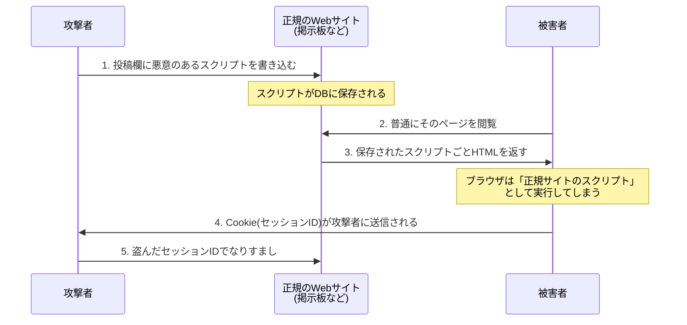
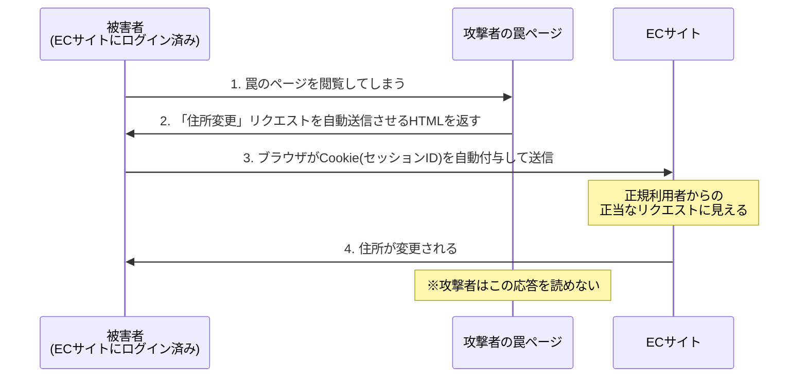

# 1-8 スクリプト攻撃

重要度：★★☆

## 縮寫展開

| 縮寫 | 全名 | 說明 |
|---|---|---|
| **XSS** | **Cross-Site Scripting** | クロスサイトスクリプティング |
| **CSRF** | **Cross-Site Request Forgery**（forge＝偽造） | クロスサイトリクエストフォージェリ |
| **SQL** | **Structured Query Language** | 操作資料庫的語言 |
| **DOM** | **Document Object Model** | 瀏覽器把 HTML 拆成的物件樹 |
| **CSP** | **Content Security Policy** | 網站宣告「只准載入哪些來源的資源」 |
| **WAF** | **Web Application Firewall** | 應用層的防火牆 |

## 全體像：注入型攻撃はすべて同じ病

| 攻擊 | 被注入的語言 | 執行場所 | 影響範圍 |
|---|---|---|---|
| **XSS** | HTML／JavaScript | **被害者的瀏覽器** | **其他使用者** |
| **SQL インジェクション** | SQL | 伺服器上的**資料庫** | 資料庫裡的資料 |
| **OS コマンドインジェクション** | shell 指令 | 伺服器的 **OS** | **伺服器本身**（最嚴重） |

共同的病因：**使用者的輸入被當成「語法」而不是「資料」來解釋。**

## クロスサイトスクリプティング（XSS）

### XSS 不是 フィッシング——差別在「網站是真的」

| | フィッシング | XSS |
|---|---|---|
| 網域／URL | **假的**（看起來像而已） | **真的，完全正牌** |
| サーバ証明書 | 假的或沒有 | **真的，完全正確** |
| 惡意內容從哪來 | 攻擊者自己架的站 | **被注入到正牌網站的頁面裡** |

**所以 1-7 那個「確認憑證」的錨點，對 XSS 失效**——你人在正牌銀行網站上、憑證正確、網址正確，但頁面上跑著攻擊者的 script。

### XSS 的殺傷力來自「同源」

因為 script 是從**正牌網域**載入的，瀏覽器把它當成該網站的正當程式碼，於是**它讀得到該網站的 Cookie**——也就是 **セッションID**。
偷到就能 **セッションハイジャック**（→ 1-5），**完全不需要密碼**。

（另一種用法是在正牌頁面上顯示假的登入表單騙帳密，但直接偷 Cookie 更常見，連騙都不用騙。）

### 格納型 XSS 的流程

### 三種類（判別關鍵＝惡意 script「存在哪裡」）

| 種類 | script 存在哪 | 特徵 |
|---|---|---|
| **格納型（蓄積型）** | **伺服器的資料庫裡** | 只要瀏覽該頁就中，**被害範圍最大**（所有訪客） |
| **反射型** | **URL 參數裡**，伺服器原封不動反射回來 | 必須騙被害者點那個特製連結，**一人一次** |
| **DOM Based** | **完全在瀏覽器端**，由 JavaScript 動態寫入 DOM | **請求根本沒送到伺服器** → **伺服器日誌上什麼都看不到**，伺服器端對策也擋不住 |

DOM Based 的「伺服器看不到」是它專屬的考點。

## クロスサイトリクエストフォージェリ（CSRF）

**定義：讓被害者的瀏覽器，去對「他已經登入的網站」送出他本人沒打算送的請求。**

關鍵在**瀏覽器會自動附上 Cookie**。你登入後，只要對該站發請求，瀏覽器就自動帶上 セッションID。攻擊者誘你點進惡意頁面，該頁自動朝目標網站送出「變更住址」的請求——**對網站而言，這個請求帶著有效 session、格式完全正確，沒有理由拒絕。**

**最重要的一點：攻擊者讀不到回應。**
他能讓你「做某件事」，但讀不到結果。所以 CSRF 的被害清單全是**動作**，不是**竊取**：

- 把個資公開範圍擅自全開 → 是**動作**（攻擊者事後自己去看那個公開頁面）
- 擅自改配送地址 → 是**動作**（商品直接寄到攻擊者那）

### XSS vs CSRF（最高頻的對照題）

| | XSS | CSRF |
|---|---|---|
| **惡意行為的執行場所** | **被害者的瀏覽器** | **Web サーバ**（執行的是網站自己的處理） |
| 需要執行攻擊者的 script 嗎 | **要** | **不需要**，一個自動送出的表單就夠 |
| 濫用的是誰的信任 | **網站對自己頁面內容的信任** | **網站對已登入 session 的信任** |
| 攻擊者能讀到回應嗎 | **能** → 可偷 Cookie、偷資料 | **不能** → 只能讓你做事 |
| 與 セッションID 的關係 | **偷走它** | **不偷，用你的**（攻擊者從頭到尾拿不到 ID） |

**一句話記法：XSS 是把你的鑰匙偷走，CSRF 是趁你開著門叫你去拿東西。**
**判別法：看攻擊者能不能拿到回應。** 拿得到 → XSS（能偷）；拿不到、只能讓事情發生 → CSRF（只能做）。

### セッションハイジャック 的四條手法（1-5 與本節的收攏）

1. **推測**：セッションID 產生規則太簡單 → 對策：用夠長的亂數
2. **盗聴**：通信未加密被 スニッフィング 攔到 → 對策：HTTPS、Cookie 的 **Secure 屬性**
3. **XSS で盗む** ← 本節 → 對策：エスケープ処理、Cookie 的 **HttpOnly 屬性**（讓 JavaScript 讀不到 Cookie）
4. **セッション固定攻撃** → 對策：登入成功後**再発行**新 ID

1-5 那張表裡的 HttpOnly，到這裡才真正說得通。

## SQL インジェクション

機制：**不是「輸入指令」，是「讓輸入的字變成 SQL 語句的一部分」。**
程式想組的是 `WHERE id = '輸入值'`，攻擊者輸入 `' OR '1'='1` 之類的字串，**整句的語法結構就被改寫**，條件永遠成立。

**四種被害（第四種最常被忽略）**：
1. 情報の**窃取**
2. **改ざん**
3. **削除**
4. **認証の回避** ← 不需要密碼就登入成功，因為 WHERE 條件被改成恆真

**對策**

| 對策 | 說明 |
|---|---|
| **プレースホルダ（placeholder）／バインド機構** | **本命。** 先固定 SQL 骨架（`WHERE id = ?`），值之後才以「值的身分」填入 → **值不可能變成語法** |
| エスケープ処理 | 轉義特殊字元。有效但容易漏，次要手段 |
| 入力値の検証（バリデーション） | 檢查格式（如只准數字） |
| **DB アカウントの権限を最小化** | 被打穿時限縮損害 |
| **詳細なエラーメッセージを表示しない** | 錯誤訊息會洩漏表名、欄位名 → 等於幫攻擊者做 フットプリンティング（1-4） |
| **WAF** | 應用層擋掉可疑請求 |

## OS コマンドインジェクション

機制：**應用程式本來就會呼叫 OS 指令，攻擊者把自己的指令串進去。**
常見手法是用 `;` 或 `|` 接在後面：程式想跑 `ping <輸入的IP>`，輸入 `8.8.8.8; rm -rf /` 就變成兩條指令。

**嚴重度比 SQL インジェクション 高一級**——拿到的是 OS 層級的執行能力：

- 檔案的刪除、複製、置換、閱覽
- **下載並執行惡意程式**（等於把 1-2 整章搬到伺服器上）
- **把伺服器當成攻擊他人的踏み台**（→ 1-5）
- **サーバの乗っ取り**（完全接管）

**對策**

| 對策 | 說明 |
|---|---|
| **シェルを呼び出す関数を使わない** | **本命。** 不呼叫 shell，就沒有「指令被串接」這回事 |
| 入力値の検証 | 用**ホワイトリスト方式**（只允許已知安全的字元）；黑名單永遠列不完 |
| 権限の最小化 | Web 伺服器行程不要用 root 跑 |

## ディレクトリリスティング／ディレクトリトラバーサル

| 用語 | 英文 | 性質 |
|---|---|---|
| **ディレクトリリスティング**（ディレクトリ一覧表示） | directory listing | **設定不備（せっていふび）**，被動洩漏檔案清單 |
| **ディレクトリトラバーサル**（パストラバーサル） | directory / path traversal（traversal＝橫越、穿越） | **主動攻擊**，指定路徑去讀不該讀的檔 |

**ディレクトリリスティング**：Web 伺服器在某目錄找不到 index.html 時，會把該目錄的**檔案清單列出來**。本身不是攻擊，但等於免費送出一張地圖——備份檔（`.bak`、`.old`）、設定檔、未公開文件、原始碼全被看光，是 **フットプリンティング（1-4）** 最好的材料。
→ 對策：**ディレクトリリスティングを無効化**（Apache 的 `Options -Indexes`）、每個目錄放 index 檔。

**ディレクトリトラバーサル**：用 `../` 往上跳，跳出 Web 公開目錄，讀取 `/etc/passwd`、設定檔、其他使用者的資料。名字就是在講「**穿越目錄的邊界**」。
→ 對策：**不讓使用者輸入直接變成檔名或路徑**、檢查輸入值、限制公開目錄以外的存取。

## 対策の共通原理

| 用語 | 英文 | 做什麼 |
|---|---|---|
| エスケープ処理／サニタイジング | escape / sanitizing（日文「無害化（むがいか）」） | 把有特殊意義的字元換成無害表記（`<` → `&lt;`），讓瀏覽器當**普通文字顯示**而非執行 |
| プレースホルダ | placeholder | 先確定語法骨架，值之後才以值的身分填入 |

**差別一句話**：**エスケープ 是「把危險的字變乖」，プレースホルダ 是「讓字根本沒機會變危險」。**

**XSS 對策的細節考點：エスケープ 要在「輸出時」做，不是「輸入時」。**
同一筆資料可能輸出到 HTML、JavaScript、URL、CSV，**每個場合要轉義的字元不同**。輸入時就轉掉等於賭死一種用途，而且資料被永久改壞（使用者名字裡的 `&` 變成 `&amp;` 存進 DB）。正解是**原樣儲存，輸出到哪就照那裡的規則轉義**。

**CSRF 的對策**

| 對策 | 原理 |
|---|---|
| **CSRF トークン（ワンタイムトークン）** | 表單裡藏一個隨機值，送出時驗證。**攻擊者讀不到頁面，就猜不到這個值** → 偽造請求缺 token 被拒 |
| 重要處理前**再次要求密碼** | 攻擊者不知道密碼 |
| **リファラ（referer）チェック** | 檢查請求是否來自自家頁面 |
| **SameSite Cookie 属性** | 叫瀏覽器「從別站來的請求不要自動帶這個 Cookie」——從根源切斷 |
| 處理完成後寄確認信 | 事後發現，非預防 |

**CSRF トークン 為什麼有效，理由直接來自攻擊的限制**——因為攻擊者讀不到回應。**攻擊的弱點決定了對策的形狀**，這個結構記起來比死背有用。

## 前因後果

**這一節的對策全部長同一個樣子：讓攻擊的前提不成立，而不是偵測並擋掉壞輸入。**

| 攻擊 | 本命對策 | 共同思路 |
|---|---|---|
| SQL インジェクション | **プレースホルダ** | 不讓資料變成語法 |
| OS コマンドインジェクション | **不呼叫 shell** | 不給執行環境 |
| XSS | **エスケープ処理** | 不讓字串變成標籤 |
| CSRF | **トークン** | 不讓攻擊者偽造得出來 |

這跟 1-3 的 **ソルト** 是同一個思路——ソルト 不去阻止攻擊者查表，而是**讓「預先算好表」這件事失去意義**。
**結構性防禦 > 過濾式防禦**，是本章最值得帶走的原則。黑名單式的「把壞東西列出來擋掉」永遠列不完（同 1-2 的パターンマッチング、1-6 的シグネチャ型 IDS）。

**這一節也接收了 1-7 留下的問題。**
1-7 的結論是「當眼睛看到的全不可信，剩下的錨點是サーバ証明書」。XSS 把這個錨點也打掉了——**憑證證明的是「這個網站是真的」，不是「這個頁面上的內容是乾淨的」**。
所以信任的問題最終要往下一層走：Ch2 的暗号と認証。

**注入型攻擊的嚴重度階梯（判斷題常用）**：
資料庫（SQL インジェクション）< 伺服器 OS（OS コマンドインジェクション）。
而 XSS 走的是另一條軸——它不擴大對伺服器的權限，**它把正牌網站變成攻擊其他使用者的武器**。所以「XSS 的直接被害者是誰」這種題目，答案是**其他使用者**，不是網站營運者。

## 待補（考後）

- Same-Origin Policy（同一オリジンポリシー）的正式定義與 XSS 的關係
- CSP（Content Security Policy）的具體指令
- WAF 的詳細機能與限界 → Ch5 回填
- セキュアプログラミング 的其他項目（バッファオーバーフロー 等，若後續小節出現則移至該檔）
- 各注入型攻擊在實際過去問中的出題比重
