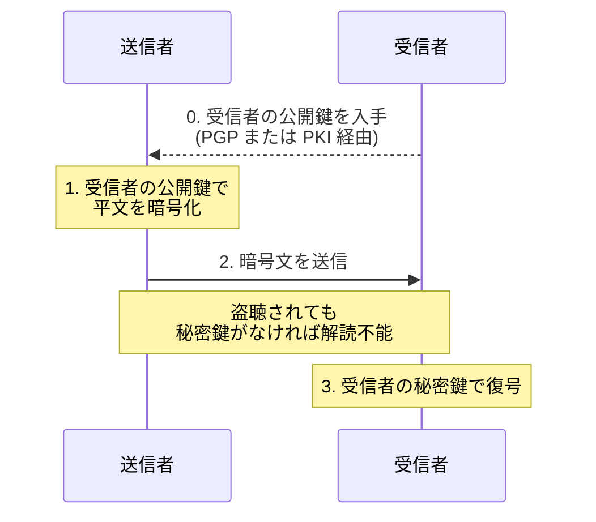

# 2-3 公開鍵暗号方式

> 依導讀順序重寫，不收錄書上原文、原表與練習問題原文。
> **本節依導讀順序分為 ①〜⑥。**

## 縮寫展開

| 縮寫／外來語 | 英文全名 | 說明 |
|---|---|---|
| **RSA** | **Rivest・Shamir・Adleman**（三位發明者姓氏首字母） | 代表性的公開鍵演算法 |
| **ECC** | **Elliptic Curve Cryptography** | 楕円曲線暗号 |
| **PGP** | **Pretty Good Privacy** | 分散型的公開鍵信任機制 |
| **PKI** | **Public Key Infrastructure** | 公開鍵基盤 |
| **CA** | **Certificate Authority** | 認証局 |
| **PQC** | **Post-Quantum Cryptography** | 耐量子計算機暗号 |
| **NIST** | **National Institute of Standards and Technology** | 美國標準技術研究所（待補用） |
| **SSL/TLS** | **Secure Sockets Layer／Transport Layer Security** | 網站加密通信協定 |
| **IoT** | **Internet of Things** | 物聯網 |
| **BEC** | **Business Email Compromise** | 商業郵件詐騙（→ 1-5） |
| **DNSSEC** | **DNS Security Extensions**（DNS＝Domain Name System） | → 1-10 |
| **DH／ECDH** | **Diffie-Hellman／Elliptic Curve Diffie-Hellman** | 鍵交換方式（待補用） |
| **S/MIME** | **Secure/Multipurpose Internet Mail Extensions** | 郵件加密・簽章規格（待補用） |
| **鍵ペア** | **key pair** | 一組公開鍵＋秘密鍵 |
| **Web of Trust** | — | ＝信頼の輪 |
| **デジタル署名** | **digital signature** | 數位簽章（→ 2-5） |
| **ハイブリッド暗号方式** | **hybrid cryptosystem** | → 2-4 |
| **ルート証明書** | **root certificate** | 信任的起點（→ 2-6） |

## 讀音

| 用語 | 讀音 |
|---|---|
| 公開鍵暗号方式 | こうかいかぎあんごうほうしき |
| 非対称鍵暗号 | ひたいしょうかぎあんごう |
| 公開鍵 | こうかいかぎ |
| 秘密鍵 | ひみつかぎ |
| 鍵ペア | かぎペア |
| 素因数分解 | そいんすうぶんかい |
| 離散対数 | りさんたいすう |
| 楕円曲線暗号 | だえんきょくせんあんごう |
| 耐量子計算機暗号 | たいりょうしけいさんきあんごう |
| 正当性 | せいとうせい |
| 信頼の輪 | しんらいのわ |
| 認証局 | にんしょうきょく |
| 電子証明書 | でんししょうめいしょ |
| 公開鍵基盤 | こうかいかぎきばん |
| 中間者攻撃 | ちゅうかんしゃこうげき |
| 否認防止 | ひにんぼうし |
| 危殆化 | きたいか |

---

## 本節的位置

2-2 的共通鍵暗号方式卡在兩個缺點：**鍵配送問題**（要先有安全通道才能送鑰匙，死結）、**鍵數 n(n-1)/2 爆炸**。

本節的**公開鍵暗号方式（こうかいかぎあんごうほうしき）**就是為解開這個死結而生：**如果鑰匙本來就可以公開，就沒有「怎麼安全送出」的問題。**
但它也帶來兩個新問題——**慢**（2-4 解）、**這把公開鍵真的是對方的嗎**（2-6 PKI 解）。

① 鑰匙成對 → ② 兩個方向（Ch2 最大失分點）→ ③ 加密流程 → ④ 優缺點 → ⑤ 新問題：公開鍵的正当性 → ⑥ 代表演算法。

---

## ① 鑰匙成對

別名**非対称鍵暗号（ひたいしょうかぎあんごう）**（asymmetric key cryptography）——加密和解密用**不同的**鑰匙。

| 用語 | 意思 | 考點 |
|---|---|---|
| **鍵ペア（かぎペア，key pair）** | 每個人持有的一組鑰匙 | 公開鍵與秘密鍵**數學上成對**，無法拆開或另配 |
| **公開鍵（こうかいかぎ，public key）** | **公開給不特定多數人** | 公開是它的本意，不是外洩 |
| **秘密鍵（ひみつかぎ，private key）** | **絕對不能公開**，本人保管 | 外洩＝身分被完全奪走 |

---

## ② 兩個方向——Ch2 最大的失分點

同一組鍵ペア，看「用哪一把上鎖」，就變成完全不同的用途：

| 目的 | 誰的鑰匙**加密／簽署** | 誰的鑰匙**解密／驗證** | 達成什麼 |
|---|---|---|---|
| **暗号化** | **收件人的公開鍵** | **收件人的秘密鍵** | **機密性** |
| **デジタル署名（digital signature）** | **寄件人的秘密鍵** | **寄件人的公開鍵** | **認証・否認防止（ひにんぼうし）** |

> **一句話判別：加密用「對方的」鑰匙，簽名用「自己的」鑰匙。**

**背後的道理（比死背可靠）：**

> **用公開鍵上鎖** → 誰都能鎖，但**只有本人打得開** → **保密**
> **用秘密鍵上鎖** → **只有本人鎖得起來**，但誰都能打開 → **證明是本人**

秘密鍵簽的東西誰都能驗證，**這不是缺陷，正是重點**——要讓所有人都能確認「這確實出自本人之手」。（簽章的完整流程在 2-5。）

### 選項裡的經典陷阱

| 錯誤敘述 | 為什麼錯 |
|---|---|
| 用收件人的**公開鍵**加密後，能用**同一把公開鍵**解密 | 公開鍵是公開的，若能解密則所有人都解得開，加密毫無意義 |
| 用收件人的公開鍵加密，能用**寄件人的**公開鍵或秘密鍵解密 | 鑰匙是**成對**的，只有**配對的那一把**能解。寄件人的鑰匙與這次加密無關 |

---

## ③ 加密的流程

把 ② 表格的第一列走一遍：

**為什麼竊聽無效**：即使途中被攔截，**沒有收件人的秘密鍵就解不開**。而秘密鍵從頭到尾**沒有在網路上傳輸過**——這正是它勝過共通鍵方式的地方，也是鍵配送問題消失的原因。

---

## ④ 優缺點：跟 2-2 對照

| | 內容 | 對照 2-2 共通鍵 |
|---|---|---|
| **優點①** | **解決了鍵配送問題**——公開鍵本來就要公開，不需要安全通道 | 共通鍵的致命傷 |
| **優點②** | **鍵數 2n**（每人一對）。100 人只要 **200 把** | 共通鍵要 **4950 把** |
| **缺點①** | **処理速度が遅い**——慢**數百～數千倍** | 共通鍵唯一的優點就是快 |
| **缺點②** | **環境建置麻煩**——鍵ペア的產生、公開鍵的發布與管理都需要制度 | 共通鍵很輕便 |

> 兩邊優缺點剛好互補，2-4 會直接拿這張對照表推出ハイブリッド暗号方式（hybrid cryptosystem）。

---

## ⑤ 新問題：公開鍵的正当性

> **你拿到的那把「公開鍵」，怎麼確定它真的是收件人的？**

如果攻擊者把**自己的公開鍵**冒充成對方的交給你，你加密後**他就能解開**——這是**公開鍵版本的中間者攻撃（ちゅうかんしゃこうげき）**。

**公開鍵暗号方式解決了「鑰匙怎麼安全送出」，卻帶來新問題「這把鑰匙是誰的」。** 證明鑰匙歸屬有兩種模型：

| | **PGP（Pretty Good Privacy）** | **PKI（Public Key Infrastructure，公開鍵基盤（こうかいかぎきばん））** |
|---|---|---|
| 信任模型 | **Web of Trust（信頼の輪（しんらいのわ））** | **認証局（にんしょうきょく，CA：Certificate Authority）為頂點的階層構造** |
| 結構 | **分散型**——使用者互相為對方的公開鍵簽署背書 | **中央集權型**——由公正的第三方發行**電子証明書（でんししょうめいしょ）** |
| 比喻 | 朋友介紹朋友，一層層建立信任網 | 大家都信任的公證機關統一發證 |
| 規模 | 個人之間、朋友圈 | **社會性的基礎建設**，**SSL/TLS（Secure Sockets Layer／Transport Layer Security）用的就是這個** |

> **PGP 與 PKI 不是加密技術，是「證明鑰匙歸屬」的機制。**（PKI 在 2-6 展開。）

---

## ⑥ 代表演算法

公開鍵方式的安全性來自「某個數學問題算不完」：

| 演算法 | 安全性根據 | 現況 |
|---|---|---|
| **RSA（Rivest・Shamir・Adleman）** | **素因数分解（そいんすうぶんかい，prime factorization）的困難性**——兩個大質數相乘很容易，反過來分解極難 | 世界上最廣泛使用 |
| **楕円曲線暗号（だえんきょくせんあんごう，ECC：Elliptic Curve Cryptography）** | 楕円曲線上的**離散対数（りさんたいすう）**問題 | **更短的鑰匙、同等強度**：ECC 256 bit ≒ RSA 3072 bit → **快、省電** → 手機、IoT（Internet of Things）、現代 TLS 大量採用 |
| **耐量子計算機暗号（たいりょうしけいさんきあんごう，PQC：Post-Quantum Cryptography）** | — | 量子電腦一旦實用化，**RSA 與 ECC 會同時崩潰**（素因数分解與離散対数在量子電腦上都能快速求解）→ 2-1 **危殆化（きたいか）**的終極版本 |

> 用語陷阱：日文用「**素因数**」，不是「質因数」。

---

## 前因後果

- **Ch2 的主線在這裡完成一半，也立刻暴露下一個問題：**

| 階段 | 解決了什麼 | 帶來什麼新問題 |
|---|---|---|
| **共通鍵暗号方式**（2-2） | 快 | **鍵配送問題**、鍵數 n(n-1)/2 |
| **公開鍵暗号方式**（2-3） | **鍵配送問題**、鍵數降為 2n | **慢**、**公開鍵的正当性** |
| **ハイブリッド暗号方式**（2-4） | 用公開鍵方式送出共通鍵，之後用共通鍵方式傳資料 → **兼顧安全與速度** | — |
| **PKI・電子証明書**（2-6） | **公開鍵的正当性** | — |

- **公開鍵暗号方式不是「更好的加密方式」，而是「解決鑰匙分配問題的方式」。** 它慢到不可能加密整個網頁或檔案——**資料加密的主力仍是共通鍵方式**。公開鍵方式只負責開場那幾個位元組（送出共通鍵），以及簽名。
- **還 Ch1 的兩張欠條**：1-5 BEC（Business Email Compromise）的對策「電子署名」、1-10 DNSSEC（DNS Security Extensions）「用電子署名驗證回應」→ 都是 ② 的**秘密鍵簽署・公開鍵驗證**（細節在 2-5）。
- **信任要有根**：⑤ 說明加密本身不夠，還要能確認鑰匙是誰的。PGP 靠人際網、PKI 靠 CA，2-6 再往上追到ルート証明書（root certificate）。
- **讓前提不成立，也會被推翻前提**：公開鍵暗号方式的安全性**不建立在「保密」上，而是「數學上的計算困難」**——RSA 連演算法都公開，靠的是**大數的素因数分解實務上算不完**。量子電腦的威脅**不是破解密碼，而是讓「算不完」變成「算得完」**。這跟 2-1 的危殆化第二種成因（演算法被攻破）是同一回事——**前提消失，安全就消失。** 呼應 Ch1：真正的防禦是讓攻擊的前提不成立；而防禦自己的前提一旦被推翻，就整個歸零。

## 待補（考後）

- Diffie-Hellman 鍵交換（DH／ECDH）的機制
- 楕円曲線暗号 的數學原理與 鍵長對照表
- PQC 的 NIST 標準化狀況（CRYSTALS-Kyber 等）
- PGP／S/MIME 在郵件加密中的實際運用 → Ch5 回填
- RSA 的鍵長推移（1024 → 2048 → 3072 bit）
