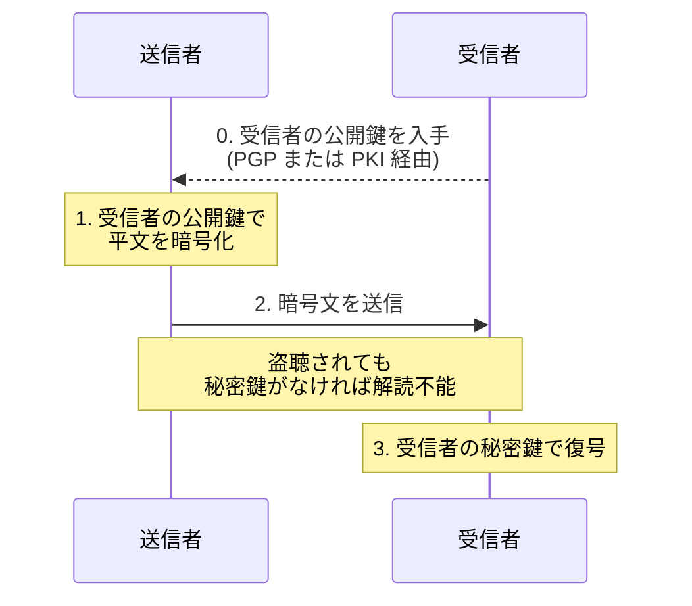

# 2-3 公開鍵暗号方式

## 縮寫展開

| 縮寫 | 全名 | 說明 |
|---|---|---|
| **RSA** | **Rivest・Shamir・Adleman**（三位發明者姓氏首字母） | 代表性的公開鍵演算法 |
| **ECC** | **Elliptic Curve Cryptography** | 楕円曲線暗号 |
| **PGP** | **Pretty Good Privacy** | 分散型的公開鍵信任機制 |
| **PKI** | **Public Key Infrastructure** | 公開鍵基盤 |
| **CA** | **Certificate Authority** | 認証局 |
| **PQC** | **Post-Quantum Cryptography** | 耐量子計算機暗号 |

## 基本

| 日文用語 | 讀音 | 英文 | 中文解釋 | 常考重點／易混淆點 |
|---|---|---|---|---|
| **公開鍵暗号方式** | こうかいかぎあんごうほうしき | asymmetric key cryptography | 使用**成對**的兩把鑰匙 | 別名：**非対称鍵暗号** |
| **鍵ペア** | かぎペア | key pair | 每個人持有的一組鑰匙 | 公開鍵與秘密鍵**數學上成對**，無法拆開或另配 |
| **公開鍵** | こうかいかぎ | public key | **公開給不特定多數人** | 公開是它的本意，不是外洩 |
| **秘密鍵** | ひみつかぎ | private key | **絕對不能公開**，本人保管 | 外洩＝身分被完全奪走 |
| **素因数分解** | そいんすうぶんかい | prime factorization | RSA 的安全性根據 | 日文用「素因数」，不是「質因数」 |
| **楕円曲線暗号** | だえんきょくせんあんごう | **ECC** | 用更短的鑰匙達到同等強度 | ECC 256 bit ≒ RSA 3072 bit → **快、省電** → 手機、IoT、現代 TLS 大量採用 |

## 二つの方向——Ch2 最大的失分點

| 目的 | 誰的鑰匙**加密／簽署** | 誰的鑰匙**解密／驗證** | 達成什麼 |
|---|---|---|---|
| **暗号化** | **收件人的公開鍵** | **收件人的秘密鍵** | **機密性** |
| **デジタル署名** | **寄件人的秘密鍵** | **寄件人的公開鍵** | **認証・否認防止** |

**一句話判別：加密用「對方的」鑰匙，簽名用「自己的」鑰匙。**

**背後的道理（比死背可靠）：**

> **用公開鍵上鎖** → 誰都能鎖，但**只有本人打得開** → 這叫**保密**
> **用秘密鍵上鎖** → **只有本人鎖得起來**，但誰都能打開 → 這叫**證明是本人**

秘密鍵簽的東西誰都能驗證，**這不是缺陷，正是重點**——要讓所有人都能確認「這確實出自本人之手」。

### よくある誤解（選項裡的經典陷阱）

| 錯誤敘述 | 為什麼錯 |
|---|---|
| 用收件人的**公開鍵**加密後，能用**同一把公開鍵**解密 | 公開鍵是公開的，若能解密則所有人都解得開，加密毫無意義 |
| 用收件人的公開鍵加密，能用**寄件人的**公開鍵或秘密鍵解密 | 鑰匙是**成對**的，只有**配對的那一把**能解。寄件人的鑰匙與這次加密無關 |

## 暗号化の手順

**為什麼盜聽無效**：即使在通信途中被攔截，**沒有收件人的秘密鍵就解不開**。而秘密鍵從頭到尾**沒有在網路上傳輸過**——這正是它勝過共通鍵方式的地方。

## メリット・デメリット

| | 內容 |
|---|---|
| **メリット①** | **解決了鍵配送問題**——公開鍵本來就是要公開的，不需要安全通道 |
| **メリット②** | **鍵の数は 2n**（每人一對）。100 人只要 200 把，對比共通鍵的 4950 把 |
| **デメリット①** | **処理速度が遅い**——比共通鍵方式慢**數百～數千倍** |
| **デメリット②** | **環境建置麻煩**——鍵ペア 的產生、公開鍵的發布與管理都需要制度 |

## 公開鍵の正当性——這個方式帶來的新問題

> **你拿到的那把「公開鑰匙」，怎麼確定它真的是收件人的？**

如果攻擊者把**自己的公開鍵**冒充成對方的交給你，你加密後**他就能解開**——這是**公開鍵版本的中間者攻撃**。

**公開鍵暗号方式解決了「鑰匙怎麼安全送出」，卻帶來新問題「這把鑰匙是誰的」。**

| | **PGP** | **PKI** |
|---|---|---|
| 信任模型 | **Web of Trust（信頼の輪）** | **認証局（CA）為頂點的階層構造** |
| 結構 | **分散型**——使用者互相為對方的公開鍵簽署背書 | **中央集権型**——由公正的第三方發行**電子証明書** |
| 比喻 | 朋友介紹朋友，一層層建立信任網 | 大家都信任的公證機關統一發證 |
| 規模 | 個人之間、朋友圈 | **社會性的基礎建設**，**SSL/TLS 用的就是這個** |

**PGP 與 PKI 不是加密技術，是「證明鑰匙歸屬」的機制。**

## 代表的なアルゴリズム

| 演算法 | 安全性根據 | 現況 |
|---|---|---|
| **RSA** | **素因数分解の困難性**——把兩個大質數相乘很容易，反過來分解極難 | 世界上最廣泛使用 |
| **楕円曲線暗号（ECC）** | 楕円曲線上的離散對數問題 | **更短的鑰匙、同等強度** → 快、省電 → 手機、IoT、現代 TLS |
| **耐量子計算機暗号（PQC）** | — | 量子電腦一旦實用化，**RSA 與 ECC 會同時崩潰**（素因数分解與離散対数在量子電腦上都能快速求解）→ 2-1 **危殆化** 的終極版本 |

## 前因後果

**Ch2 的主線在這裡完成了一半——但也立刻暴露了下一個問題。**

| 階段 | 解決了什麼 | 帶來什麼新問題 |
|---|---|---|
| **共通鍵暗号方式**（2-2） | 快 | **鍵配送問題**、鍵の数 n(n-1)/2 |
| **公開鍵暗号方式**（2-3） | **鍵配送問題**、鍵数降為 2n | **慢**、**公開鍵的正当性** |
| **ハイブリッド暗号方式**（後續） | 用公開鍵方式送出共通鍵，之後用共通鍵方式傳資料 → **兼顧安全與速度** | — |
| **PKI・電子証明書**（後續） | **公開鍵的正当性** | — |

**所以公開鍵暗号方式不是「更好的加密方式」，而是「解決鑰匙分配問題的方式」。**
它慢到不可能拿來加密整個網頁或檔案——**實際承擔資料加密工作的主力仍然是共通鍵方式**。公開鍵方式只負責開場那幾個位元組（把共通鍵安全地送過去），以及簽名。

**這也解釋了 Ch1 留下的兩張欠條：**
- 1-5 BEC 的對策「電子署名」→ 就是本節的 **秘密鍵で署名・公開鍵で検証**
- 1-10 DNSSEC「用電子署名驗證回應」→ 同一個機制

**最後一點值得記**：公開鍵暗号方式的安全性**不是建立在「保密」上，而是建立在「數學上的計算困難」**——RSA 的安全性完全公開（連演算法都公開），靠的是「**大數的素因数分解實務上算不完**」。
所以量子電腦才會是威脅：**它不是破解密碼，而是讓那個「算不完」變成「算得完」。** 這跟 2-1 提到的危殆化第二種成因（演算法本身被攻破）是同一回事——**前提消失，安全就消失。**

呼應 Ch1 的那條總結：**真正的防禦是讓攻擊的前提不成立；而前提一旦被推翻，防禦就整個歸零。**

## 待補（考後）

- Diffie-Hellman 鍵交換（DH／ECDH）的機制
- 楕円曲線暗号 的數學原理與 鍵長對照表
- PQC 的 NIST 標準化狀況（CRYSTALS-Kyber 等）
- PGP／S/MIME 在郵件加密中的實際運用 → Ch5 回填
- RSA 的鍵長推移（1024 → 2048 → 3072 bit）
