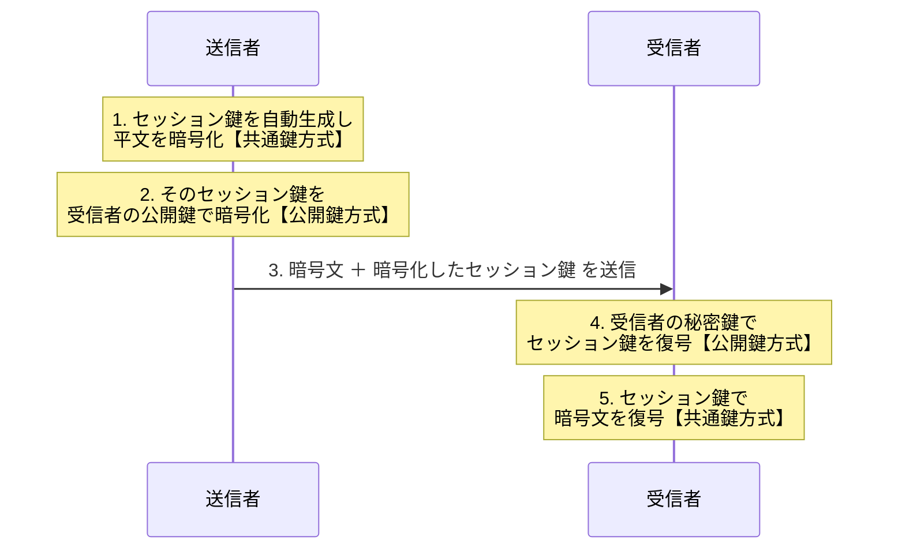

# 2-4 ハイブリッド暗号方式

## 縮寫展開

| 縮寫 | 全名 | 說明 |
|---|---|---|
| **SSL** | **Secure Sockets Layer** | 舊稱，現已被 TLS 取代 |
| **TLS** | **Transport Layer Security** | 實際使用 ハイブリッド暗号方式 的代表 |

## 基本

| 日文用語 | 讀音 | 英文 | 中文解釋 | 常考重點／易混淆點 |
|---|---|---|---|---|
| **ハイブリッド暗号方式** | — | **hybrid cryptosystem** | 結合共通鍵與公開鍵兩種方式 | **各自只做自己擅長的事**：公開鍵送鑰匙、共通鍵傳資料 |
| **セッション鍵** | セッションかぎ | **session key** | 每次通信**自動生成、用完即丟**的共通鍵 | **一次性**——下次通信重新產生一把。即使某次的鍵外洩，也只影響那一次 |
| **手軽** | てがる | — | 輕便、不費事 | 指共通鍵方式「不需建置基礎設施就能用」 |

## 共通鍵 vs 公開鍵 對照表

| 觀點 | **共通鍵暗号方式** | **公開鍵暗号方式** |
|---|---|---|
| **処理速度** | **速い**（快數百～數千倍） | **遅い** |
| **鍵数の増え方** | **人數的平方**成比例 → **急增** | **人數成正比** → 線性 |
| **n 人時的鍵数** | **n(n-1)/2** | **2n** |
| **鍵配送の容易さ** | **困難**（**鍵配送問題**） | **容易**（公開鍵本來就是要公開的） |
| **鍵の配送方法** | 需要**另一條安全通道**（當面交付、掛號信） | **PGP**（信頼の輪）or **PKI**（認証局・電子証明書） |
| **特徴** | **手軽**、適合**少人數** | **環境建置麻煩**、適合**大人數・不特定對象** |

**100 人的實感**：共通鍵 **4950 把** vs 公開鍵 **200 把**。

**橫著看這張表，兩邊的優缺點剛好完全互補：**

> **共通鍵：快，但鑰匙送不出去。**
> **公開鍵：鑰匙送得出去，但慢。**

**ハイブリッド暗号方式 就是直接讀這張表想出來的。**

## 手順

| 步驟 | 動作 | 使用的方式 |
|---|---|---|
| 1 | 自動生成 **セッション鍵**，用它加密平文 | **共通鍵方式** |
| 2 | 用**收件人的公開鍵**加密那把 セッション鍵 | **公開鍵方式** |
| 3 | **暗号文 ＋ 加密後的セッション鍵** 一起送出 | — |
| 4 | 收件人用**自己的秘密鍵**解開 セッション鍵 | **公開鍵方式** |
| 5 | 用 セッション鍵 解開暗号文 | **共通鍵方式** |

**注意用詞**：第 3 步送的是「**加密後的共通鍵（セッション鍵）**」——**公開鍵不需要加密也不需要傳送**，它本來就是公開的。

**為什麼加密 セッション鍵 不會慢**：公開鍵方式雖然慢，但**要加密的東西只有一把鑰匙（很短）**。慢的是「每 byte 的處理成本」，資料量小就無所謂。**大量的平文交給快的共通鍵方式處理。**

## 特徴

| 解決了什麼 | 怎麼解決的 |
|---|---|
| 共通鍵方式的 **鍵配送問題** | 用公開鍵方式把 セッション鍵 安全送過去 |
| 公開鍵方式的 **処理速度慢** | 只用它加密「一把鑰匙」，大量資料交給共通鍵方式 |
| 同時保留 | 公開鍵方式的**鍵數少（2n）、容易傳遞** |

## 前因後果

**Ch2 到這裡，暗号化這條線完成了。**

| 階段 | 解決了什麼 | 帶來什麼新問題 |
|---|---|---|
| **共通鍵暗号方式**（2-2） | 快 | **鍵配送問題**、鍵数 n(n-1)/2 |
| **公開鍵暗号方式**（2-3） | 鍵配送問題、鍵数降為 2n | **慢**、**公開鍵的正当性** |
| **ハイブリッド暗号方式**（2-4） | **慢** ← 本節 | — |
| **PKI・電子証明書**（後續） | **公開鍵的正当性** | — |

**所以 Ch2 不是在介紹三種平行的加密方式**——共通鍵與公開鍵**不是二選一的競爭關係，而是分工關係**。現實世界裡幾乎不存在「純粹只用公開鍵方式加密資料」的系統。

**你每天都在用它。**
瀏覽器連上 HTTPS 網站時，開場的 TLS ハンドシェイク 做的就是這五個步驟：先用公開鍵方式交換 セッション鍵，之後整個網頁的內容都用共通鍵方式傳輸。**這就是 1-4「盗聴の対策は暗号化」那句話的完整答案。**

**セッション鍵「用完即丟」的意義**：
即使某次通信的 セッション鍵 被破解，**也只影響那一次通信**，過去和未來的通信都安全。這個設計思路與 1-3 的 **ソルト**、1-5 的 **ワンタイムパスワード** 一致——**限制單次洩漏的影響範圍**。

**但這裡還留著一個洞**：整套流程的起點是「取得收件人的公開鍵」。
**如果那把公開鍵根本是攻擊者的呢？** 攻擊者就能解開 セッション鍵，進而解開全部內容——而且雙方毫無察覺。
**這就是為什麼 PKI 與 電子証明書 必須存在**：ハイブリッド暗号方式 解決了速度，卻**無法自己證明公開鍵的歸屬**。下一節開始處理這件事。

## 待補（考後）

- TLS ハンドシェイク 的完整流程 → Ch5 回填
- 鍵交換専用の方式（Diffie-Hellman、ECDH）與本節做法的差異
- Forward Secrecy（前方秘匿性）與 セッション鍵 的關係
- S/MIME 在郵件中的 ハイブリッド 運用
