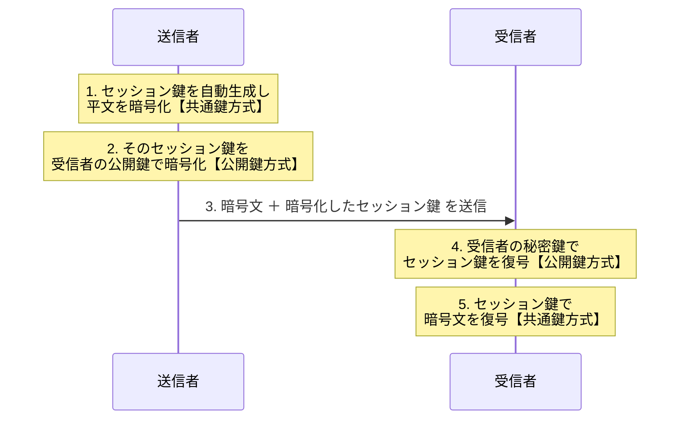

# 2-4 ハイブリッド暗号方式

> 依導讀順序重寫，不收錄書上原文、原表與練習問題原文。
> **本節依導讀順序分為 ①〜④。**

## 縮寫展開

| 縮寫／外來語 | 英文全名 | 說明 |
|---|---|---|
| **ハイブリッド暗号方式** | **hybrid cryptosystem** | 結合共通鍵與公開鍵兩種方式 |
| **セッション鍵** | **session key** | 每次通信自動生成、用完即丟的共通鍵 |
| **SSL** | **Secure Sockets Layer** | 舊稱，現已被 TLS 取代 |
| **TLS** | **Transport Layer Security** | 實際使用ハイブリッド暗号方式的代表 |
| **TLS ハンドシェイク** | **TLS handshake** | TLS 連線開場的交涉 |
| **HTTPS** | **HyperText Transfer Protocol Secure** | HTTP over TLS |
| **PGP** | **Pretty Good Privacy** | 信頼の輪（→ 2-3） |
| **PKI** | **Public Key Infrastructure** | 認証局・電子証明書（→ 2-3、2-6） |
| **デジタル署名** | **digital signature** | → 2-5 |
| **ソルト** | **salt** | → 1-3 |
| **ワンタイムパスワード** | **one-time password** | → 1-5 |
| **DH／ECDH** | **Diffie-Hellman／Elliptic Curve Diffie-Hellman** | 鍵交換專用方式（待補用） |
| **Forward Secrecy** | — | 前方秘匿性（待補用） |
| **S/MIME** | **Secure/Multipurpose Internet Mail Extensions** | 郵件加密・簽章規格（待補用） |

## 讀音

| 用語 | 讀音 |
|---|---|
| 手軽 | てがる（輕便、不費事） |
| 共通鍵暗号方式 | きょうつうかぎあんごうほうしき |
| 公開鍵暗号方式 | こうかいかぎあんごうほうしき |
| 処理速度 | しょりそくど |
| 鍵配送問題 | かぎはいそうもんだい |
| 鍵数 | かぎすう |
| 正当性 | せいとうせい |
| 盗聴 | とうちょう |
| 前方秘匿性 | ぜんぽうひとくせい |

---

## 本節的位置

2-2 的共通鍵：**快，但鑰匙送不出去。** 2-3 的公開鍵：**鑰匙送得出去，但慢。**
本節的**ハイブリッド暗号方式（hybrid cryptosystem）**不是第三種新發明，而是**把前兩節的優點拼起來**——公開鍵只負責送鑰匙，共通鍵負責傳資料。

2-3 留下的兩個新問題，本節解掉「慢」；「公開鍵的正当性（せいとうせい）」仍留著，交給 2-5・2-6。
① 把兩邊並排 → ② 合體的五個步驟 → ③ セッション鍵（session key）為什麼用完就丟 → ④ 解決了什麼、還沒解決什麼。

---

## ① 把兩種方式並排

ハイブリッド是直接讀這張表想出來的：

| 觀點 | **共通鍵暗号方式（2-2）** | **公開鍵暗号方式（2-3）** |
|---|---|---|
| **処理速度（しょりそくど）** | **快**（快數百～數千倍） | **慢** |
| **鍵數的增加方式** | 與**人數的平方**成比例 → **急增** | 與**人數成正比** → 線性 |
| **n 人時的鍵數** | **n(n-1)/2** | **2n** |
| **鍵配送的難易** | **困難**（**鍵配送問題（かぎはいそうもんだい）**） | **容易**（公開鍵本來就要公開） |
| **鍵的配送方法** | 需要**另一條安全通道**（當面交付、掛號信） | **PGP（Pretty Good Privacy，信頼の輪）** 或 **PKI（Public Key Infrastructure，認証局・電子証明書）** |
| **特徵** | **手軽（てがる）**——不需建置基礎設施就能用，適合**少人數** | **環境建置麻煩**，適合**大人數・不特定對象** |

**100 人的實感**：共通鍵 **4950 把** vs 公開鍵 **200 把**。

**橫著看，兩邊的優缺點完全互補：**

> **共通鍵：快，但鑰匙送不出去。**
> **公開鍵：鑰匙送得出去，但慢。**

---

## ② 合體：五個步驟

**各自只做自己擅長的事：公開鍵送鑰匙、共通鍵傳資料。**

| 步驟 | 動作 | 使用的方式 |
|---|---|---|
| 1 | 自動生成**セッション鍵**，用它加密平文 | **共通鍵方式** |
| 2 | 用**收件人的公開鍵**加密那把セッション鍵 | **公開鍵方式** |
| 3 | **暗号文＋加密後的セッション鍵**一起送出 | — |
| 4 | 收件人用**自己的秘密鍵**解開セッション鍵 | **公開鍵方式** |
| 5 | 用セッション鍵解開暗号文 | **共通鍵方式** |

> **用詞陷阱**：第 3 步送的是「**加密後的共通鍵（セッション鍵）**」——**公開鍵不需要加密也不需要傳送**，它本來就是公開的。

**為什麼加密セッション鍵不會慢**：公開鍵方式慢的是「每 byte 的處理成本」，而這裡**要加密的只有一把鑰匙（很短）**，資料量小就無所謂。**大量的平文交給快的共通鍵方式。**

**自編例**：傳一個 100 MB 的檔案。公開鍵方式只加密那把 128 bit 的セッション鍵；100 MB 本體全部交給共通鍵方式。

---

## ③ セッション鍵：用完即丟

**セッション鍵＝每次通信自動生成、用完即丟的共通鍵。** 下次通信重新產生一把。

> **意義：即使某次的セッション鍵被破解，也只影響那一次通信**，過去和未來的通信都安全。

這個設計思路與 1-3 的**ソルト（salt）**、1-5 的**ワンタイムパスワード（one-time password）**一致——**限制單次洩漏的影響範圍**。

---

## ④ 解決了什麼、還沒解決什麼

| 解決了什麼 | 怎麼解決的 |
|---|---|
| 共通鍵方式的**鍵配送問題** | 用公開鍵方式把セッション鍵安全送過去 |
| 公開鍵方式的**処理速度慢** | 只用它加密「一把鑰匙」，大量資料交給共通鍵方式 |
| 同時保留 | 公開鍵方式的**鍵數少（2n）、容易傳遞** |

**但還留著一個洞**：整套流程的起點是「取得收件人的公開鍵」。
**如果那把公開鍵根本是攻擊者的呢？** 攻擊者就能解開セッション鍵，進而解開全部內容——**而且雙方毫無察覺**。ハイブリッド解決了速度，卻**無法自己證明公開鍵的歸屬**。

---

## 前因後果

- **Ch2 的暗号化這條線到這裡完成：**

| 階段 | 解決了什麼 | 帶來什麼新問題 |
|---|---|---|
| **共通鍵暗号方式**（2-2） | 快 | **鍵配送問題**、鍵數 n(n-1)/2 |
| **公開鍵暗号方式**（2-3） | 鍵配送問題、鍵數降為 2n | **慢**、**公開鍵的正当性** |
| **ハイブリッド暗号方式**（2-4） | **慢** ← 本節 | — |
| **PKI・電子証明書**（2-6） | **公開鍵的正当性** | — |

- **共通鍵與公開鍵不是二選一的競爭關係，而是分工關係。** Ch2 不是在介紹三種平行的加密方式；現實裡幾乎不存在「純粹只用公開鍵方式加密資料」的系統。
- **每天都在用它**：瀏覽器連上 HTTPS（HyperText Transfer Protocol Secure）網站時，開場的 TLS（Transport Layer Security）ハンドシェイク（handshake）做的就是這五個步驟——先用公開鍵方式交換セッション鍵，之後整個網頁內容都用共通鍵方式傳。**這就是 1-4「盗聴（とうちょう）的對策是加密」的完整答案。**
- **往下接**：到這裡只處理了「別人讀不懂」（機密性）。「內容有沒有被改」「對方是不是本人」要靠公開鍵的**另一個方向**——2-5 デジタル署名（digital signature）；而④ 留下的「公開鍵是誰的」，最後由 2-6 PKI 收尾。**信任要有根。**

## 待補（考後）

- TLS ハンドシェイク 的完整流程 → Ch5 回填
- 鍵交換専用の方式（Diffie-Hellman、ECDH）與本節做法的差異
- Forward Secrecy（前方秘匿性）與 セッション鍵 的關係
- S/MIME 在郵件中的 ハイブリッド 運用
