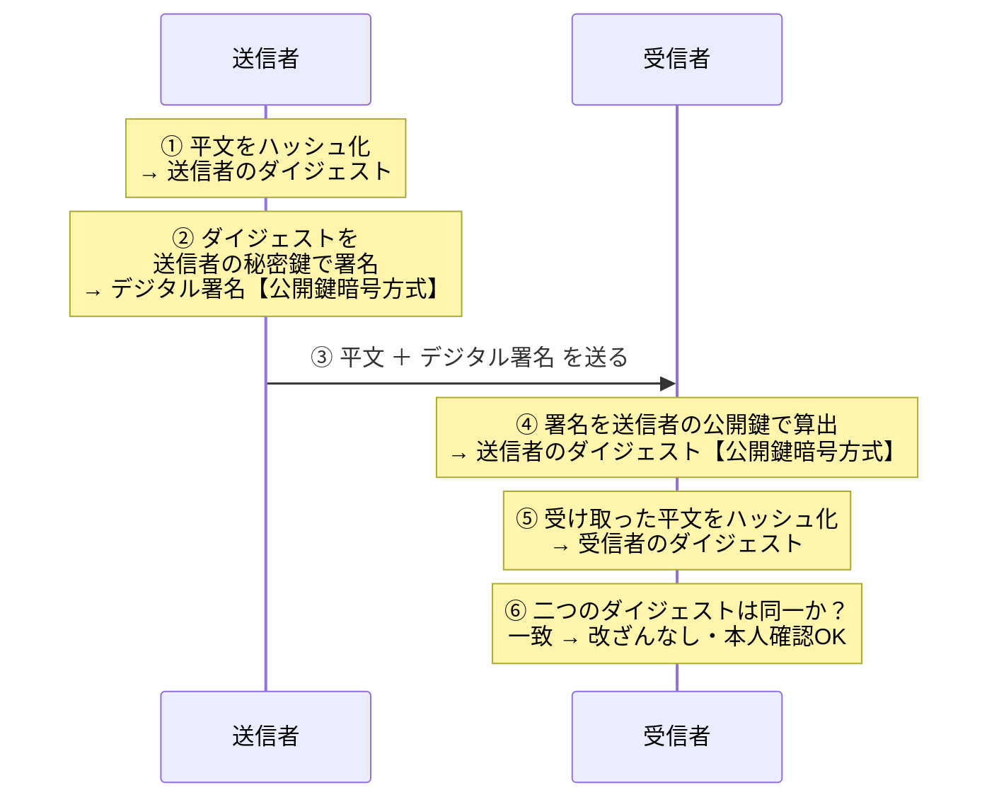

# 2-5 デジタル署名

## 縮寫展開

| 縮寫 | 全名 | 說明 |
|---|---|---|
| **MD5** | **Message Digest algorithm 5** | 128 bit，**已危殆化** |
| **SHA** | **Secure Hash Algorithm** | 系列名 |
| **SHA-1** | — | **已危殆化**，僅限相容性用途 |
| **SHA-2** | — | 現行主流：SHA-224／256／**384**／512 |
| **TLS** | **Transport Layer Security** | 實際運用本節技術的代表 |
| **HTTPS** | **HyperText Transfer Protocol Secure** | HTTP over TLS |

## ハッシュ関数

| 日文用語 | 讀音 | 英文 | 中文解釋 | 常考重點／易混淆點 |
|---|---|---|---|---|
| **ハッシュ関数** | ハッシュかんすう | **hash function** | 把任意長度的資料轉換成固定長度的值 | |
| **ハッシュ値**（メッセージダイジェスト） | ハッシュち | **hash value / message digest** | 計算出來的固定長度結果 | 兩個詞同義，**ダイジェスト** 是書上常用的說法 |
| **ハッシュ化** | ハッシュか | hashing | 進行 hash 運算的動作 | |
| **一方向性** | いちほうこうせい | one-way property | **不可逆**——可以比對，但無法從 hash 值還原原文 | |
| **衝突耐性** | しょうとつたいせい | collision resistance | **要刻意製造出「兩份不同資料得到相同 hash 值」在計算上極為困難** | 見下 |
| **衝突（コリジョン）** | しょうとつ | **collision** | 不同的平文得出相同的 hash 值 | |

### ⚠️ 常見誤解：「不同的平文 hash 出來一定不一樣」

**這句是錯的。**

ハッシュ値 是**固定長度**，而平文可以無限長 → **理論上一定存在碰撞**。

正確的說法是：**要「刻意製造出」碰撞在計算上極為困難** ＝ **衝突耐性**。

**這正是 MD5 與 SHA-1 危殆化的原因**——碰撞已經能被實際製造出來，攻擊者可以做出一份假文件，讓它的 hash 值跟正本一模一樣。

### 主要なハッシュ関数

| 演算法 | 長度 | 現況 |
|---|---|---|
| **MD5** | 128 bit | **已危殆化，不建議使用** |
| **SHA-1** | 160 bit | **已危殆化**。被 CRYPTREC 列入 **運用監視暗号リスト** |
| **SHA-2**（SHA-224／256／384／512） | 對應數字的 bit 數 | **現行主流** |

**CRYPTREC 運用監視暗号リスト 的正確讀法（容易讀反）：**

> **只有為了「維持既有系統的相容性」才容許繼續使用，新系統禁止採用。**

不是「用在相容性以外的用途」，而是**只能用在相容性這一個用途**。

### ハッシュ関数の用途：パスワード管理

資料庫**不存密碼平文，只存 hash 值**。登入時把輸入的密碼 hash 後與資料庫比對。
即使資料庫外洩，攻擊者也拿不到原始密碼（一方向性）。

→ 但同樣的密碼會產生同樣的 hash 值，因此需要 **ソルト（salt）**（→ 1-3）。
**Ch1 那個對策的原理，到這裡才完整。**

## デジタル署名

### なぜハッシュだけでは足りないのか

若只是「把平文和 hash 值一起送出」：

| 步驟 | 攻擊者能不能做到 |
|---|---|
| 把平文改掉 | ✅ 可以 |
| 重新算出新平文的 hash 值 | ✅ 可以（hash 函數是公開的） |
| 把 hash 值一起換掉 | ✅ 可以 |

→ 收件人比對起來完全一致，**毫無察覺**。

> **ハッシュ 只能偵測「意外的損壞」，擋不住「蓄意的竄改」。**

**解法：把 hash 值用寄件人的秘密鍵封死** ＝ **デジタル署名**。

| 步驟 | 攻擊者能不能做到 |
|---|---|
| 把平文改掉 | ✅ |
| 重新算出新的 digest | ✅ |
| **做出「對應新 digest 的署名」** | ❌ **做不到——沒有寄件人的秘密鍵** |

**完整的邏輯鏈：**

> digest 是內容的指紋 → 內容一改，指紋就變
> 但光有指紋沒用，因為指紋也能被一起換掉
> **署名＝用秘密鍵把那枚指紋封死，讓它換不掉**
> 指紋換不掉 ＋ 指紋對不上 ＝ **竄改一定會被發現**

**一句話：ハッシュ 負責「偵測改變」，署名 負責「讓偵測本身無法被繞過」。兩個加起來才是完全性。**

### 署名の流れ

**デジタル署名 本身就是「被秘密鍵加密過的 digest」。**

送出去的只有兩樣東西：

| 送出的內容 | 說明 |
|---|---|
| **平文** | **原樣，沒有加密** |
| **デジタル署名** | ＝ digest 用秘密鍵加密後的結果 |

**digest 不會單獨傳送**——它**被包在署名裡面**，收件人用公開鍵把它「算出」。

> 平文 →〔hash〕→ digest →〔秘密鍵で署名〕→ **デジタル署名**
> **デジタル署名** →〔公開鍵で算出〕→ digest ←〔hash〕← 收到的平文
> 　　　　　　　　　　　**兩邊的 digest 一致嗎？**

### 方向のおさらい（Ch2 最大的失分點）

| 目的 | 加密／簽署 | 解密／驗證 |
|---|---|---|
| **暗号化** | 收件人的**公開鍵** | 收件人的**秘密鍵** |
| **デジタル署名** | 寄件人的**秘密鍵** | 寄件人的**公開鍵** |

**署名的本質：「只有本人做得出來，但誰都打得開」。**
驗證用公開鍵，所以全世界都能驗證——**重點不在「別人打不開」，在「別人做不出來」。**

### 三つの追問（考題最愛）

| 問題 | 答案 |
|---|---|
| **デジタル署名 能防止盜聽嗎？** | **不能。** 平文是原樣送的。署名的目的是**完全性＋認証**，**不是機密性**。要保密得另外加密（→ 2-4 ハイブリッド） |
| **為什麼先 hash 再簽，不直接簽平文？** | 公開鍵方式**慢**。hash 值**長度固定且短**，簽它只要一瞬間——**與 ハイブリッド 同一思路：公開鍵方式只碰小東西** |
| **署名能「防止」竄改嗎？** | **嚴格講不能，只能「検知（けんち）」。** 發現不一致後只能丟棄、要求重送。選項寫「改ざんを防止できる」通常是陷阱 |

### 二つのダイジェストが一致すると、同時に三つが証明される

| 證明了什麼 | 為什麼 |
|---|---|
| **完全性**（沒被竄改） | 內容改了，hash 就對不上 |
| **真正性・認証**（確實是本人寄的） | 只有本人的秘密鍵簽得出這個署名 |
| **否認防止（ひにんぼうし，non-repudiation）** | 本人事後不能說「不是我寄的」——只有他有那把秘密鍵 |

**否認防止 是 デジタル署名 獨有的**——hash 單獨做不到，暗号化 也做不到。很常考。

## 技術と守るものの対応

### ⚠️ 過去問パターン：「ソフトウェアに署名を施す目的はどれか」

正解は**「アプリケーションの改ざんを利用者が検知できるようにするため」**。
四個誘餌各自對應一種典型誤解：

| 誘餌 | 為什麼錯 |
|---|---|
| アプリを**暗号化**して内容を秘匿する | **署名 ≠ 暗号化。** 署名給的是完全性・真正性・否認防止，**唯獨不給機密性** |
| **利用者を認証**する | 簽章的是**発行者**。證明的是「這軟體來自誰」，與使用者是誰無關 |
| ウイルス感染を**防ぐ** | 只能**検知**改竄，**不能防止** |
| 不正コピーを**防止**する | 那是 DRM／コピーガード，不同技術 |

> **デジタル署名 擋不住任何人竄改檔案。它只能讓你「發現」檔案被竄改過。**
> 所以正解用的動詞是「**検知**」。**看到選項寫「改ざんを防ぐ」「感染を防ぐ」，那個動詞本身就是錯的。**

實作上對應 **コードサイニング証明書**（→ 2-6）——下載軟體時跳「発行者不明」，就是這個署名缺席的畫面。

| 技術 | 守護的要素 |
|---|---|
| **暗号化** | **機密性** |
| **ハッシュ ＋ デジタル署名** | **完全性** |
| **デジタル署名** | **真正性（認証）**、**否認防止** |

**TLS／HTTPS 就是綜合運用這些技術的代表**：可防止**盗聴・なりすまし・改ざん**，但**無法修復**已被竄改的資料。

## 前因後果

**Ch2 到這裡，三種守護目標各自有了對應的技術。**

| 想達成什麼 | 技術 | 出現在 |
|---|---|---|
| 內容不被讀懂 | 暗号化（共通鍵／公開鍵／ハイブリッド） | 2-1〜2-4 |
| 內容沒被竄改 | **ハッシュ ＋ デジタル署名** | 2-5 |
| 對方確實是本人 | **デジタル署名** | 2-5 |

**注意 デジタル署名 是「公開鍵暗号方式的另一種用法」，不是新技術。**
同一組鍵ペア，**反過來用**就從「保密」變成「證明身分」。這是 2-3 那張方向表的實戰應用，也是為什麼那張表必須背熟。

**這節同時補完了 Ch1 的多張欠條：**

| Ch1 的說法 | Ch2 的解答 |
|---|---|
| 1-3 密碼不存平文、要加 ソルト | 本節的 **ハッシュ・一方向性** |
| 1-5 BEC 對策「電子署名」 | 本節的**秘密鍵で署名・公開鍵で検証** |
| 1-8 CSRF 對策「トークン」的不可偽造性 | 同樣依賴「攻擊者做不出來」這個性質 |
| 1-10 DNSSEC「用電子署名驗證回應」 | 同一機制 |

**但最後一個洞還沒補**：整套驗證的前提是「**我手上這把公開鍵，確實屬於那個寄件人**」。
如果攻擊者把自己的公開鍵冒充成寄件人的交給你，他就能用自己的秘密鍵簽署假文件，而你會驗證成功並深信不疑。

**デジタル署名 證明了「簽署者持有某把秘密鍵」，但證明不了「那把鑰匙屬於誰」。**
→ 這就是 **電子証明書・認証局（CA）・PKI** 存在的理由，下一節處理。

## 待補（考後）

- SHA-3 的定位
- HMAC（鍵付きハッシュ）與デジタル署名的差異
- MD5／SHA-1 碰撞攻擊的實際案例
- タイムスタンプ（時刻認証）與否認防止的關係
- 電子署名法 的法律效力 → Ch6 回填
