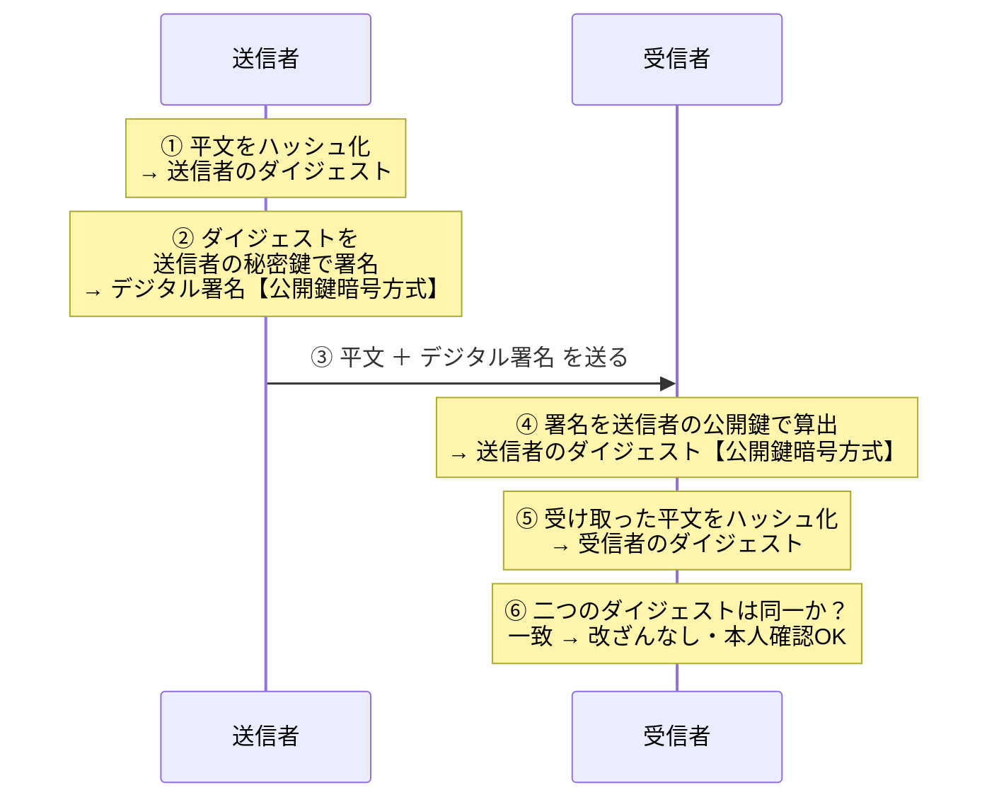

# 2-5 デジタル署名

> 依導讀順序重寫，不收錄書上原文、原表與練習問題原文。
> **本節依導讀順序分為 ①〜⑦。**

## 縮寫展開

| 縮寫／外來語 | 英文全名 | 說明 |
|---|---|---|
| **デジタル署名** | **digital signature** | 數位簽章 |
| **ハッシュ関数** | **hash function** | 雜湊函數 |
| **ハッシュ値** | **hash value** | 雜湊值 |
| **メッセージダイジェスト** | **message digest** | ＝ハッシュ値，書上常簡稱ダイジェスト |
| **ハッシュ化** | **hashing** | 進行雜湊運算 |
| **コリジョン** | **collision** | ＝衝突 |
| **MD5** | **Message Digest algorithm 5** | 128 bit，**已危殆化** |
| **SHA** | **Secure Hash Algorithm** | 系列名 |
| **SHA-1** | **Secure Hash Algorithm 1** | **已危殆化**，僅限相容性用途 |
| **SHA-2** | **Secure Hash Algorithm 2** | 現行主流：SHA-224／256／**384**／512 |
| **SHA-3** | **Secure Hash Algorithm 3** | （待補用） |
| **CRYPTREC** | **Cryptography Research and Evaluation Committees** | → 2-1 |
| **TLS** | **Transport Layer Security** | 實際運用本節技術的代表 |
| **HTTPS** | **HyperText Transfer Protocol Secure** | HTTP over TLS |
| **DRM** | **Digital Rights Management** | 數位版權管理 |
| **コピーガード** | **copy guard** | 防複製技術 |
| **コードサイニング証明書** | **code signing certificate** | 軟體簽章用的憑證（→ 2-6） |
| **ソルト** | **salt** | → 1-3 |
| **BEC** | **Business Email Compromise** | → 1-5 |
| **CSRF** | **Cross-Site Request Forgery** | → 1-8 |
| **トークン** | **token** | CSRF 對策用的隨機值 |
| **DNSSEC** | **DNS Security Extensions**（DNS＝Domain Name System） | → 1-10 |
| **CA** | **Certificate Authority** | 認証局 |
| **PKI** | **Public Key Infrastructure** | 公開鍵基盤 |
| **HMAC** | **Hash-based Message Authentication Code** | 鍵付きハッシュ（待補用） |
| **タイムスタンプ** | **timestamp** | 時刻認証（待補用） |

## 讀音

| 用語 | 讀音 |
|---|---|
| 署名 | しょめい |
| 関数 | かんすう |
| 一方向性 | いちほうこうせい |
| 衝突／衝突耐性 | しょうとつ／しょうとつたいせい |
| 危殆化 | きたいか |
| 運用監視暗号リスト | うんようかんしあんごうリスト |
| 改ざん | かいざん |
| 検知 | けんち |
| 防止 | ぼうし |
| 完全性 | かんぜんせい |
| 真正性 | しんせいせい |
| 否認防止 | ひにんぼうし |
| 機密性 | きみつせい |
| 発行者 | はっこうしゃ |
| 秘密鍵／公開鍵 | ひみつかぎ／こうかいかぎ |
| 電子証明書 | でんししょうめいしょ |
| 認証局 | にんしょうきょく |
| 時刻認証 | じこくにんしょう |
| 電子署名法 | でんししょめいほう |

---

## 本節的位置

2-2〜2-4 做完的只有一件事：**讓別人讀不懂（機密性）**。但 2-1 ① 就畫過界線——加密**不保證內容沒被改，也不保證對方是誰**。

本節補上另外兩塊：**ハッシュ（hash）負責「偵測改變」，デジタル署名（digital signature）負責「讓偵測無法被繞過」並「證明是本人」。** 而デジタル署名不是新技術，正是 2-3 ② 那張方向表的**第二列**——同一組鍵ペア反過來用。

2-4 ④ 留下的「公開鍵是誰的」，本節仍解不了，交給 2-6。
① ハッシュ関数 → ② 主要演算法與危殆化 → ③ 用途：密碼保存 → ④ 光有ハッシュ為什麼不夠 → ⑤ 簽章流程 → ⑥ 三個追問與三個證明 → ⑦ 考題：簽章不是萬能。

---

## ① ハッシュ関数：內容的指紋

**ハッシュ関数（ハッシュかんすう，hash function）**：把任意長度的資料轉成**固定長度**的值。算出來的結果叫**ハッシュ値（ハッシュち，hash value）**，又稱**メッセージダイジェスト（message digest）**，書上常簡稱ダイジェスト；做這個運算叫**ハッシュ化（hashing）**。

兩個性質撐起它的用途：

| 性質 | 意思 |
|---|---|
| **一方向性（いちほうこうせい，one-way property）** | **不可逆**——可以比對，但無法從ハッシュ値還原原文 |
| **衝突耐性（しょうとつたいせい，collision resistance）** | **要刻意製造出「兩份不同資料得到相同ハッシュ値」在計算上極為困難** |

**衝突（しょうとつ）／コリジョン（collision）**＝不同的平文得出相同的ハッシュ値。

> ⚠️ **常見誤解：「不同的平文，ハッシュ値一定不一樣」——這句是錯的。**
> ハッシュ値是**固定長度**，平文可以無限長 → **理論上一定存在碰撞**。
> 正確說法是：**要「刻意製造出」碰撞在計算上極為困難**＝衝突耐性。

---

## ② 主要ハッシュ関数與危殆化

衝突耐性一旦被攻破，就是 2-1 ④ 說的**危殆化（きたいか）**——攻擊者能做出一份假文件，讓它的ハッシュ値跟正本一模一樣。**MD5 與 SHA-1 就是這樣退場的。**

| 演算法 | 長度 | 現況 |
|---|---|---|
| **MD5（Message Digest algorithm 5）** | 128 bit | **已危殆化，不建議使用** |
| **SHA-1（Secure Hash Algorithm 1）** | 160 bit | **已危殆化**。被 CRYPTREC（Cryptography Research and Evaluation Committees）列入**運用監視暗号リスト（うんようかんしあんごうリスト）** |
| **SHA-2**（SHA-224／256／384／512） | 對應數字的 bit 數 | **現行主流** |

> **運用監視暗号リスト的正確讀法（容易讀反）：**
> **只有為了「維持既有系統的相容性」才容許繼續使用，新系統禁止採用。**
> 不是「用在相容性以外的用途」，而是**只能用在相容性這一個用途**。

---

## ③ ハッシュ的用途：密碼保存

資料庫**不存密碼平文，只存ハッシュ値**。登入時把輸入的密碼ハッシュ化後與資料庫比對。
即使資料庫外洩，攻擊者也拿不到原始密碼——靠的是**一方向性**。

但同樣的密碼會產生同樣的ハッシュ値，因此需要**ソルト（salt）**（→ 1-3）。**Ch1 那個對策的原理，到這裡才完整。**

---

## ④ 光有ハッシュ為什麼不夠

若只是「把平文和ハッシュ値一起送出」：

| 步驟 | 攻擊者做得到嗎 |
|---|---|
| 把平文改掉 | ✅ |
| 重新算出新平文的ハッシュ値 | ✅（ハッシュ関数是公開的） |
| 把ハッシュ値一起換掉 | ✅ |

→ 收件人比對起來完全一致，**毫無察覺**。

> **ハッシュ只能偵測「意外的損壞」，擋不住「蓄意的竄改」。**

**解法：把ハッシュ値用寄件人的秘密鍵（ひみつかぎ）封死＝デジタル署名（しょめい）。**

| 步驟 | 攻擊者做得到嗎 |
|---|---|
| 把平文改掉 | ✅ |
| 重新算出新的ダイジェスト | ✅ |
| **做出「對應新ダイジェスト的署名」** | ❌ **做不到——沒有寄件人的秘密鍵** |

**完整的邏輯鏈：**

> ダイジェスト是內容的指紋 → 內容一改，指紋就變
> 但光有指紋沒用，因為指紋也能被一起換掉
> **署名＝用秘密鍵把那枚指紋封死，讓它換不掉**
> 指紋換不掉＋指紋對不上＝**竄改一定會被發現**

> **一句話：ハッシュ負責「偵測改變」，署名負責「讓偵測本身無法被繞過」。兩個加起來才是完全性（かんぜんせい）。**

---

## ⑤ 簽章的流程

**デジタル署名本身就是「被秘密鍵加密過的ダイジェスト」。** 送出去的只有兩樣：

| 送出的內容 | 說明 |
|---|---|
| **平文** | **原樣，沒有加密** |
| **デジタル署名** | ＝ダイジェスト用秘密鍵加密後的結果 |

**ダイジェスト不會單獨傳送**——它**被包在署名裡面**，收件人用公開鍵（こうかいかぎ）把它「算出」。

> 平文 →〔ハッシュ〕→ ダイジェスト →〔秘密鍵で署名〕→ **デジタル署名**
> **デジタル署名** →〔公開鍵で算出〕→ ダイジェスト ←〔ハッシュ〕← 收到的平文
> 　　　　　　　　　　　**兩邊的ダイジェスト一致嗎？**

### 方向複習（Ch2 最大的失分點，接 2-3 ②）

| 目的 | 加密／簽署 | 解密／驗證 |
|---|---|---|
| **暗号化** | 收件人的**公開鍵** | 收件人的**秘密鍵** |
| **デジタル署名** | 寄件人的**秘密鍵** | 寄件人的**公開鍵** |

> **署名的本質：「只有本人做得出來，但誰都打得開」。**
> 驗證用公開鍵，所以全世界都能驗證——**重點不在「別人打不開」，在「別人做不出來」。**

---

## ⑥ 三個追問，與一致時證明的三件事

### 考題最愛的三個追問

| 問題 | 答案 |
|---|---|
| **デジタル署名能防止竊聽嗎？** | **不能。** 平文是原樣送的。署名的目的是**完全性＋認証**，**不是機密性（きみつせい）**。要保密得另外加密（→ 2-4 ハイブリッド） |
| **為什麼先ハッシュ再簽，不直接簽平文？** | 公開鍵方式**慢**。ハッシュ値**長度固定且短**，簽它只要一瞬間——**與ハイブリッド同一思路：公開鍵方式只碰小東西** |
| **署名能「防止」竄改嗎？** | **嚴格講不能，只能「検知（けんち）」。** 發現不一致後只能丟棄、要求重送。選項寫「能防止改ざん（かいざん）」通常是陷阱 |

### 兩個ダイジェスト一致，同時證明三件事

| 證明了什麼 | 為什麼 |
|---|---|
| **完全性**（沒被竄改） | 內容改了，ハッシュ就對不上 |
| **真正性（しんせいせい）・認証**（確實是本人寄的） | 只有本人的秘密鍵簽得出這個署名 |
| **否認防止（ひにんぼうし，non-repudiation）** | 本人事後不能說「不是我寄的」——只有他有那把秘密鍵 |

> **否認防止是デジタル署名獨有的**——ハッシュ單獨做不到，暗号化也做不到。很常考。

---

## ⑦ 考題：簽章不是萬能

### ⚠️ 頻出題型：替軟體加上數位簽章的目的

**正解方向：讓使用者能「検知」軟體被竄改。** 四個誘答各自對應一種典型誤解：

| 誘答方向 | 為什麼錯 |
|---|---|
| 把軟體**加密**、隱藏內容 | **署名≠暗号化。** 署名給完全性・真正性・否認防止，**唯獨不給機密性** |
| **認證使用者** | 簽章的是**発行者（はっこうしゃ）**。證明的是「這軟體來自誰」，與使用者是誰無關 |
| **防止**病毒感染 | 只能**検知**竄改，**不能防止** |
| **防止**非法複製 | 那是 DRM（Digital Rights Management）／コピーガード（copy guard），不同技術 |

> **デジタル署名擋不住任何人竄改檔案，只能讓你「發現」檔案被竄改過。**
> 所以正解用的動詞是「**検知**」。**看到選項寫「防止改ざん」「防止感染」，那個動詞本身就是錯的。**

實作上對應**コードサイニング証明書（code signing certificate）**（→ 2-6）——下載軟體時跳出「發行者不明」，就是這個署名缺席的畫面。

### 技術與守護要素的對應

| 技術 | 守護的要素 |
|---|---|
| **暗号化** | **機密性** |
| **ハッシュ＋デジタル署名** | **完全性** |
| **デジタル署名** | **真正性（認証）**、**否認防止** |

**TLS（Transport Layer Security）／HTTPS（HyperText Transfer Protocol Secure）就是綜合運用這些技術的代表**：能防止**盗聴・なりすまし**，並能**検知**改ざん（與上面「只能検知」一致）；但**無法修復**已被竄改的資料。

---

## 前因後果

- **Ch2 到這裡，三種守護目標各自有了對應的技術：**

| 想達成什麼 | 技術 | 出現在 |
|---|---|---|
| 內容不被讀懂 | 暗号化（共通鍵／公開鍵／ハイブリッド） | 2-1〜2-4 |
| 內容沒被竄改 | **ハッシュ＋デジタル署名** | 2-5 |
| 對方確實是本人 | **デジタル署名** | 2-5 |

- **デジタル署名是「公開鍵暗号方式的另一種用法」，不是新技術。** 同一組鍵ペア**反過來用**，就從「保密」變成「證明身分」——這是 2-3 ② 方向表的實戰應用，也是那張表必須背熟的原因。
- **検知 vs 防止**：署名的定位是「讓竄改藏不住」，不是「讓竄改做不到」。這條線貫穿全書：防不了的東西，至少要能被發現。
- **本節補完 Ch1 多張欠條：**

| Ch1 的說法 | Ch2 的解答 |
|---|---|
| 1-3 密碼不存平文、要加ソルト | ① 的**ハッシュ・一方向性** |
| 1-5 BEC（Business Email Compromise）對策「電子署名」 | ⑤ 的**秘密鍵簽署・公開鍵驗證** |
| 1-8 CSRF（Cross-Site Request Forgery）對策「トークン（token）」的不可偽造性 | 同樣依賴「攻擊者做不出來」這個性質 |
| 1-10 DNSSEC（DNS Security Extensions）「用電子署名驗證回應」 | 同一機制 |

- **信任要有根——最後一個洞還沒補**：整套驗證的前提是「**我手上這把公開鍵，確實屬於那個寄件人**」。若攻擊者把自己的公開鍵冒充成寄件人的交給你，他就能用自己的秘密鍵簽假文件，而你會驗證成功並深信不疑。
  **デジタル署名證明了「簽署者持有某把秘密鍵」，但證明不了「那把鑰匙屬於誰」。** → 這就是**電子証明書（でんししょうめいしょ）・認証局（にんしょうきょく，CA：Certificate Authority）・PKI（Public Key Infrastructure）**存在的理由，2-6 處理。

## 待補（考後）

- SHA-3 的定位
- HMAC（鍵付きハッシュ）與デジタル署名的差異
- MD5／SHA-1 碰撞攻擊的實際案例
- タイムスタンプ（時刻認証）與否認防止的關係
- 電子署名法 的法律效力 → Ch6 回填
