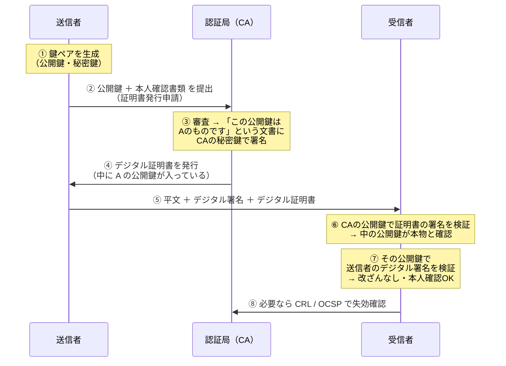

# 2-6 PKI・デジタル証明書

## 縮寫展開

| 縮寫 | 全名 | 日文／說明 |
|---|---|---|
| **PKI** | **Public Key Infrastructure** | 公開鍵基盤 |
| **CA** | **Certificate Authority** | 認証局 |
| **TTP** | **Trusted Third Party** | 信頼できる第三者 |
| **CRL** | **Certificate Revocation List** | 証明書失効リスト |
| **OCSP** | **Online Certificate Status Protocol** | 線上即時查詢証明書狀態 |
| **CPS** | **Certification Practice Statement** | 認証局運用規程 |
| **DV** | **Domain Validation** | 網域所有權驗證 |
| **OV** | **Organization Validation** | 組織實在性驗證 |
| **EV** | **Extended Validation** | 最嚴格的驗證 |

## PKI が必要な理由

**2-5 留下的洞**：デジタル署名 證明了「簽署者持有某把秘密鍵」，但**證明不了「那把鑰匙屬於誰」**。
若攻擊者把自己的公開鍵冒充成對方的交給你，他就能簽署假文件，而你會**驗證成功並深信不疑**。

**理想解法是「直接跟本人拿公開鍵」，但網路上做不到**——不知道對方長相、隔著距離、無法當面驗身分。

→ 引入 **信頼できる第三者（TTP）**＝**認証局（CA）**。

**PKI 的關鍵洞察**：
> 問題從「**這把公開鍵是誰的？**」被換成「**這份証明書是不是 CA 簽的？**」
> 看似只是把問題往上推一層，但差別是——**你只需要信任少數幾個 CA，不需要信任幾億個網站。**

## 用語の区別（最容易混淆，考題愛對調）

| | 對應的現實物 | 證明什麼 |
|---|---|---|
| **デジタル署名** | **印章蓋下去** | 這份**文件**沒被竄改、確實是我簽的 |
| **デジタル証明書** | **印鑑証明書** | **這顆印章確實是本人的**（＝這把**公開鍵**屬於本人） |

**署名證明「文件」，証明書證明「鑰匙的歸屬」。**

**PKI 本身就是用 2-5 的技術做的**：CA 寫一份「這把公開鍵確實屬於某某人」的文件，**用 CA 自己的秘密鍵簽署**——這份簽好的文件就是デジタル証明書。

## 発行から検証までの流れ

**注意兩點：**

**① 公開鍵不用另外送——它已經包在証明書裡。**
証明書的內容＝**A 的公開鍵 ＋ A 的身分資訊 ＋ CA 的署名**。送出去的只有三樣：**平文、デジタル署名、デジタル証明書**。

**② 驗證本身不需要連線。**

| 動作 | 需要連 CA 嗎 |
|---|---|
| **驗證証明書的署名** | **不用**。用手邊已有的 **CA 公開鍵（ルート証明書）** 即可——瀏覽器和 OS 出廠就內建了數十個 CA 的根証明書 |
| **確認有沒有被失效** | **要**。這才是 CRL／OCSP 出場的時機 |

### 本節的骨架：兩層驗證

> **第一層**：用 **CA 的公開鍵**，驗「**証明書**」的署名 → 確認**這把公開鍵真的是 A 的**
> **第二層**：用 **A 的公開鍵**，驗「**文件**」的署名 → 確認**文件沒被竄改、確實是 A 簽的**

**2-5 只有第二層，所以有洞。2-6 補上第一層。**
而第一層用的技術**跟第二層完全一樣**，都是 デジタル署名——只是簽署者換成了 CA。

## 失効の確認：CRL と OCSP

| 日文用語 | 讀音 | 說明 |
|---|---|---|
| **失効** | しっこう | 在有效期限內被提前作廢 |
| **シリアル番号** | — | CRL 登載的就是這個，不是整份証明書 |

**CRL（証明書失効リスト）**：CA 發行的「黑名單」，列出被吊銷的証明書序號。

> ⚠️ **有効期限切れ 的証明書「不會」被列入 CRL。** 期限一到本來就無效，不需要公告。**CRL 只登載「在有效期限內、但被提前作廢」的証明書。**——這是考點。

**失効的典型理由**：秘密鍵外洩、記載事項變更（公司改名）、持有人離職。

**CRL 的兩個缺點：**

| 缺點 | 說明 |
|---|---|
| **檔案越來越大** | 失效的越積越多，每次驗證都要下載整份清單 |
| **即時性不足** | **定期發行** → 「剛剛才被作廢」的証明書，在下次發行前**查不出來** |

**OCSP**：**即時**向 CA 的 **OCSP レスポンダ（responder）** 查詢「**這一張**証明書現在還有效嗎」。

回應有三種：

| 回應 | 意思 |
|---|---|
| **good** | 有效 |
| **revoked** | 已失效 |
| **unknown** | 不知道（不在該 CA 管轄內） |

**回應本身帶有 レスポンダ 的署名**——否則攻擊者偽造一個「good」就破功了。**又是 2-5 的技術在底層撐著。**

| | **CRL** | **OCSP** |
|---|---|---|
| 形式 | **清單**，整份下載 | **逐張查詢** |
| 時機 | **定期發行**，有時間差 | **即時** |
| 負擔 | 客戶端下載量大 | 每次連線都要連 CA |

**OCSP 自身的代價**：每次驗證都連 CA → **CA 知道你在瀏覽哪些網站（隱私問題）**，且 **レスポンダ 掛掉時驗證做不了**。
→ 解法 **OCSP ステープリング（OCSP Stapling）**：**網站伺服器自己預先向 CA 取得「帶簽章的有效證明」**，在 TLS 連線時一併交給瀏覽器，瀏覽器不用自己連 CA。

## 階層構造とトラストチェーン

**ルート認証局 → 中間認証局 → 下位認証局 → 使用者的証明書**

這條鏈叫 **信頼の連鎖（トラストチェーン，certificate chain）**——**每一層的証明書都由上一層簽署**，一路往上追到 ルート。

### ルート証明書は「自己署名（じこしょめい，self-signed）」

ルート 上面沒有更高的機關，**只能自己簽自己**。所以它**證明不了自己**——

> **信任的起點不是數學，是「你的瀏覽器／OS 出廠就內建了這些 ルート証明書」這個前提。**
> **整個 PKI 的信任，最終建立在「你相信作業系統／瀏覽器廠商挑的那幾十個 CA」之上。**

**トラストアンカー（trust anchor，信任的錨點）** 就是這個終點。

**因此「惡意的根証明書被安裝進電腦」是嚴重事故**：攻擊者就能簽出任何網站的假証明書，而瀏覽器**完全不會警告**。
→ 接回 1-7 ファーミング：**連「確認証明書」這道最後防線都能被繞過。**

### なぜ階層にするのか

**ルート的秘密鍵一旦外洩，整個信任體系全滅。**
所以做法是：**ルート的秘密鍵離線保管，平常不上網**，日常發證交給中間認証局。中間的鍵外洩了，作廢那一層就好，**ルート 不受影響**。

**與 2-4 セッション鍵「用完即丟」、1-3 ソルト 同一設計思路：限制單點失效的影響範圍。**

### CPS（認証局運用規程）

CA 公開自己「**如何審查、如何發證、如何管理金鑰**」的規程，讓外界能判斷這個 CA 值不值得信任。

## デジタル証明書の種類

| 種類 | 證明什麼 | 補充 |
|---|---|---|
| **サーバ証明書** | **這個網站是本人的** | 防止 Web 伺服器被冒充。SSL/TLS 用的就是它 |
| **クライアント証明書** | **使用者或終端裝置是本人的** | 安裝在電腦上。**只有裝了証明書的裝置才能連進系統**——比密碼強，因為**密碼會外洩，証明書綁在特定裝置上** |
| **コードサイニング証明書** | **軟體開發者的身分 ＋ 安裝檔沒被竄改** | 下載軟體時跳「發行者不明」，就是這個缺席 |
| **ルート証明書** | — | **自己署名**，トラストアンカー |

### サーバ証明書の三階分類（考點）

| 種類 | 審查內容 |
|---|---|
| **DV（Domain Validation）** | 只確認「**你控制這個網域**」——最快最便宜，**不保證營運者是誰** |
| **OV（Organization Validation）** | 加上**組織實在性**的審查 |
| **EV（Extended Validation）** | **最嚴格**，審查法人登記、實際營運狀況等。也稱 **EV SSL**，只對企業發行 |

> ⚠️ **釣魚網站也能輕易取得 DV 証明書**——網址列一樣有鎖頭、一樣是 HTTPS。
> **鎖頭只證明「通信有加密」，不證明「這家公司是真的」。**

**所以 1-7 那句「確認サーバ証明書」要補一句：光看有沒有鎖頭不夠，要看証明書裡的組織名稱。**

## 前因後果

**Ch2 的信任鏈到這裡閉環了。**

| 節 | 解決了什麼 | 留下什麼 |
|---|---|---|
| 2-2 共通鍵 | 快 | 鍵配送問題 |
| 2-3 公開鍵 | 鍵配送問題 | 慢、**公開鍵的正当性** |
| 2-4 ハイブリッド | 慢 | — |
| 2-5 デジタル署名 | 完全性・真正性・否認防止 | **公開鍵的正当性** |
| **2-6 PKI** | **公開鍵的正当性** | **ルート証明書自身の正当性**（只能靠預先信任） |

**注意最後那一格：PKI 並沒有「徹底解決」信任問題，它只是把信任集中到少數幾個點。**
ルート証明書 是自己簽自己的——**數學到這裡就沒辦法再往上證明了**。剩下的是社會性的信任：CA 的審查制度、CPS、以及作業系統廠商的把關。

> **這是 Ch2 最深的一句：密碼學能把信任「傳遞」與「放大」，但無法「無中生有」。總得有一個起點是你選擇相信的。**

**這也讓 Ch1 的許多對策終於完整：**

| Ch1 的說法 | 完整的解答 |
|---|---|
| 1-7「フィッシング 要確認サーバ証明書」 | 本節的 サーバ証明書 ＋ **DV/OV/EV 的差異**（鎖頭不等於安全） |
| 1-7「ファーミング 只能靠証明書」 | 本節的兩層驗證；**但根証明書被汙染時同樣失效** |
| 1-10「DNSSEC 用電子署名驗證」 | 同樣依賴 PKI 式的信任鏈 |
| 1-5「なりすまし 的對策」 | クライアント証明書 |

## 待補（考後）

- X.509 証明書的實際欄位結構
- 証明書の有効期限 的一般長度與縮短趨勢
- Let's Encrypt 等自動化 CA 與 ACME 協定
- CT（Certificate Transparency）
- 認証局が侵害された実例（DigiNotar 等）
- クライアント証明書 在日本公部門（マイナンバーカード）的運用 → Ch6 回填
