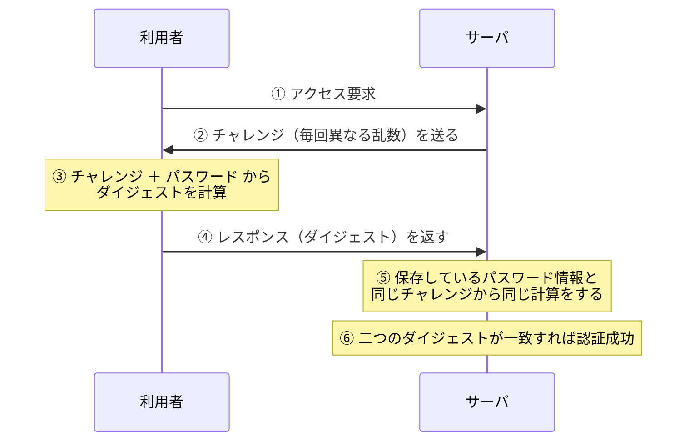

# 2-9 利用者認証

重要度：★★★

## 縮寫展開

| 縮寫 | 全名 | 日文／說明 |
|---|---|---|
| **PIN** | **Personal Identification Number** | 暗証番号 |
| **FIDO** | **Fast IDentity Online** | 推動無密碼認證的業界標準團體 |
| **OTP** | **One Time Password** | ワンタイムパスワード（使い捨てパスワード） |
| **TOTP** | **Time-based One Time Password** | 時刻同期方式 |
| **SSO** | **Single Sign-On** | シングルサインオン |
| **CAPTCHA** | **Completely Automated Public Turing test to tell Computers and Humans Apart** | 名字本身就是定義 |
| **FRR** | **False Rejection Rate** | 本人拒否率 |
| **FAR** | **False Acceptance Rate** | 他人受入率 |
| **eKYC** | **electronic Know Your Customer** | 線上本人確認 |
| **EMV 3-D Secure** | **3 Domain Secure** | 3D セキュア |

## 認証の三要素

| 要素 | 英文 | 內容 | メリット | デメリット | 例 |
|---|---|---|---|---|---|
| **知識認証** | **Something you know** | 本人才知道的資訊 | **導入簡單** | **忘記**就用不了、**被別人知道**就完蛋 | パスワード、**PIN** |
| **所有物認証**（所持認証） | **Something you have** | 本人擁有的東西 | 只有實際偷到才會被冒用 | **借出借入**、**遺失**、**被複製**的風險 | IC カード、ID カード、**ハードウェアトークン**、スマートフォン |
| **生体認証**（バイオメトリクス認証） | **Something you are** | 身體特徵或行動特徵 | **難以竊取、無法借出、不會遺忘** | **機器成本高**、**無法變更**、誤判 | 下表 |

### 生体認証の分類

| 身体的特徴 | 行動的特徴 |
|---|---|
| 指紋、**虹彩（こうさい）**、網膜、**静脈パターン**、顔、声紋 | **署名（筆跡）**、キーストローク、歩容 |

### ⚠️ 生体認証 最大的弱點：変更できない

> **パスワード 外洩可以改，IC カード 遺失可以補發——但指紋、虹彩外洩了，一輩子換不了。**

生體資訊一旦外洩是**永久性的損害**。這是它與前兩個要素本質上的差異。

其他弱點：**受傷、老化造成無法辨識**；以及**誤判**——

| 指標 | 全名 | 意思 |
|---|---|---|
| **本人拒否率（FRR）** | False Rejection Rate | **把本人誤判為他人**（進不去，不便） |
| **他人受入率（FAR）** | False Acceptance Rate | **把他人誤判為本人**（被冒用，危險） |

**兩者是取捨關係**：判定閾值調嚴 → FAR 下降但 FRR 上升（本人也常被擋）；調鬆則相反。
**沒有「兩個都降到零」的設定**，只能依用途取平衡。

## 多要素認証 と 二段階認証

| 用語 | 定義 |
|---|---|
| **多要素認証（2要素認証）** | 組合**不同「要素」**的認證 |
| **二段階認証** | 分**兩個階段**進行，**不管兩次是不是同一種要素** |

### ⚠️ 本節最常見的失分點

> **パスワード ＋ 秘密の質問 → 兩個都是「知識」→ 是二段階認証，但「不是」多要素認証。**
> **パスワード ＋ スマホのOTP → 知識 ＋ 所有物 → 才是多要素認証。**

**二段階 ≠ 多要素。**

## パスワードレス認証・FIDO

不使用密碼，改以**所有物認証**或**生体認証**進行。**FIDO** 是推動這件事的業界標準。

**機制（考點，而且用到 2-3 的技術）：**

> **FIDO 使用公開鍵暗号方式。秘密鍵永遠留在使用者的裝置（認証器）內，伺服器上只存公開鍵。**

| 性質 | 為什麼 |
|---|---|
| **伺服器被駭也偷不到密碼** | 伺服器上**根本沒有秘密資訊**，只有公開鍵——公開了也無所謂 |
| **フィッシング 無效** | 認証器會**綁定網域**，在假網站上**根本不會作動**（→ 1-7） |

**這等於一次解決了 1-3 パスワードクラック 與 1-7 フィッシング 兩章的問題——因為它把「共有的秘密」整個拿掉了。**
（呼應 2-8：**共有的東西無法證明歸屬，獨有的東西才能。**）

**パスキー（passkey）** 就是 FIDO2 的實作。

## ワンタイムパスワード（OTP）

**使い捨てパスワード**——經過一段時間或使用一次後就失效。**即使被竊取，下次也用不了。**
例：高額提款時需輸入 ハードウェアトークン 產生的一次性密碼。

| 產生方式 | 機制 |
|---|---|
| **時刻同期方式（TOTP）** | 用**目前時刻**產生，每 30～60 秒換一次 |
| **チャレンジレスポンス方式** | 伺服器送出亂數（チャレンジ），使用者用它算出答案（レスポンス） |
| **カウンタ同期方式** | 用**使用次數**當種子 |

## チャレンジレスポンス認証

**最關鍵的性質：**

> **パスワードそのものは一度もネットワークを流れない。**
> 傳的只有「用密碼＋チャレンジ 算出來的 digest」。

所以即使被 **スニッフィング（1-4）** 全程監聽也拿不到密碼，而且錄下來的回應下次也用不了。

### チャレンジ と ソルト の対比（很值得記）

| | **ソルト（1-3）** | **チャレンジ（2-9）** |
|---|---|---|
| 是什麼 | 存放密碼時附加的值 | **每次認證都重新產生的亂數** |
| 存在哪 | **儲存在伺服器上**，固定不變 | **不儲存**，用完即棄 |
| 防什麼 | **レインボーテーブル**（事前算好的表） | **リプレイ攻撃（再送攻撃）** |

**共通點：兩者都在破壞「同樣的輸入產生同樣的結果」這件事。**
ソルト 讓**事先算好的表失效**；チャレンジ 讓**攔截到的回應無法重播**。

**リプレイ攻撃（replay attack，再送攻撃）**：攻擊者不需解開內容，**直接把攔截到的封包原封不動再送一次**就能冒充。

## その他の認証技術

| 技術 | 內容 | 重點 |
|---|---|---|
| **PIN（暗証番号）** | 知識認証的一種，常作為多要素認証的一環 | **通常只在「那個特定裝置」上有效** → 就算被看到，拿到別處也用不了。這是它只有 4 位數卻仍可接受的原因 |
| **シングルサインオン（SSO）** | 一次認證後，後續系統不用重複登入 | 見下 |
| **リスクベース認証** | 偵測到與平常不同的使用環境時**追加認證** | 參考 **IP アドレス、OS、Web ブラウザ、時間帶**等。Google 的「可疑登入」提醒就是這個 |
| **CAPTCHA** | 人類看得懂、機器看不懂的圖案 | 目的是**區分人與 bot**。現在 AI 已能破解相當比例 |
| **パスワードリマインダ** | 忘記密碼時用「秘密の質問」驗證 | 見下 |

### SSO の利点とリスク

| 優點 | 風險 |
|---|---|
| 使用者不用記多組密碼、**管理可一元化**（離職時停用一個帳號就全部切斷） | **一點突破就全線失守** → **SSO 必須搭配多要素認証** |

### パスワードリマインダ の問題点

所謂「只有你知道的問題」（母親的舊姓、第一隻寵物的名字）**其實常常查得到**——社群網站、公開資料。
**這正是 1-4 フットプリンティング 的材料。**
→ **秘密の質問 本質上仍是知識認証，而且是強度很低的那種。**

## 決済・本人確認への応用

### 3D セキュア 2.0（EMV 3-D Secure）

**「3D」不是三次元，是 3 Domain（三個領域）**——イシュア（發卡機構）、アクワイアラ（收單機構）、相互運用領域。

| | **1.0** | **2.0** |
|---|---|---|
| 做法 | **每次都要輸入密碼** | **リスクベース認証** |
| 問題 | 太麻煩 → **カゴ落ち**（購物車棄單） | — |
| 判定材料 | — | 裝置資訊、購買履歷、金額、IP 等 |
| 低風險時 | — | **完全不追加認證（フリクションレス）** |
| 高風險時 | — | 才要求 ワンタイムパスワード 等 |

**2.0 的核心思想是「安全性與便利性的平衡」——不是變得更嚴，而是只在該嚴的時候才嚴。**

### eKYC

線上完成本人確認。方式：**拍攝本人＋證件照片**，或**用手機讀取 IC 晶片**（マイナンバーカード、護照）。

**意義在於「本人確認可以線上完結」**——以前一定要臨櫃或寄送書面文件。
背後是 **犯罪収益移転防止法（犯収法）** 對本人確認的要求 → **Ch6 會再出現。**

## 前因後果

**本節是 Ch1 與 Ch2 的匯流點。**

Ch1 的 1-3 指出「密碼這個認證方式本身就不安全」（辞書攻撃、ブルートフォース、パスワードリスト攻撃），但當時只能給出「密碼要長、要加 ソルト」這類**補強式**的答案。
**本節給出的是結構性的答案：不要只靠知識認証。**

| Ch1 的攻擊 | 本節的解答 |
|---|---|
| 1-3 パスワードクラック 全系列 | **多要素認証**、**パスワードレス認証（FIDO）** |
| 1-3 パスワードリスト攻撃（使い回し） | **多要素認証**——密碼對了也進不去 |
| 1-4 スニッフィング | **チャレンジレスポンス**——密碼不流經網路 |
| 1-5 リプレイ攻撃・セッションハイジャック | **ワンタイムパスワード**、チャレンジ 的一次性 |
| 1-7 フィッシング | **FIDO**——認証器綁定網域，假網站上不會作動 |

**三要素的設計哲學值得單獨記住：**

> **每一個要素都有「對應的弱點」，而那些弱點彼此不重疊。**
> 知識會被看到、被猜到；所有物會遺失、被偷；生體無法變更、會誤判。
> **所以答案不是「找出最強的那一個」，而是「組合弱點不重疊的兩個」。**

這就是 **多要素認証** 的全部道理，也是為什麼「二段階 ≠ 多要素」會被反覆考——**兩個知識認証 疊起來，弱點是同一個，疊了也沒用。**

**另一條貫穿本節的線是「安全性 vs 便利性」**：
3D セキュア 1.0 因為太麻煩導致棄單、CAPTCHA 讓人類也痛苦、生体認証 調太嚴會擋到本人。
**SG 的價值觀是：過度的安全措施會因為使用者繞過它而反過來降低安全性。**
リスクベース認証 與 3D セキュア 2.0 就是這個思想的具體答案——**平常不擋，可疑時才擋。**

## 待補（考後）

- SSO 的實現方式（SAML、OAuth、リバースプロキシ型、エージェント型）→ Ch5 回填
- FIDO2／WebAuthn 的技術細節
- 生体認証 的 FRR／FAR 交叉點（EER）
- ハードウェアトークン 與 ソフトウェアトークン 的差異
- 犯罪収益移転防止法 對 eKYC 的具體要求 → Ch6 回填
- CAPTCHA 的後繼技術（reCAPTCHA v3 等）
