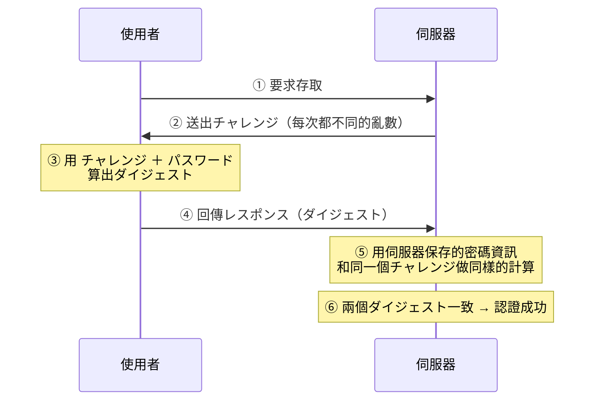

# 2-9 利用者認証

重要度：★★★

> 依導讀順序重寫，不收錄書上原文、原表與練習問題原文。
> **本節依導讀順序分為 ①〜⑦。**

## 縮寫展開

| 縮寫／外來語 | 英文全名 | 說明 |
|---|---|---|
| **PIN** | **Personal Identification Number** | 暗証番号 |
| **OTP** | **One Time Password** | ワンタイムパスワード（使い捨てパスワード） |
| **TOTP** | **Time-based One Time Password** | 時刻同期方式 |
| **FIDO** | **Fast IDentity Online** | 推動無密碼認證的業界標準團體 |
| **FIDO2** | — | FIDO 的現行規格，パスキー的基礎 |
| **SSO** | **Single Sign-On** | シングルサインオン |
| **CAPTCHA** | **Completely Automated Public Turing test to tell Computers and Humans Apart** | 名字本身就是定義 |
| **FRR** | **False Rejection Rate** | 本人拒否率 |
| **FAR** | **False Acceptance Rate** | 他人受入率 |
| **eKYC** | **electronic Know Your Customer** | 線上本人確認 |
| **EMV 3-D Secure** | **EMV 3 Domain Secure**（EMV＝Europay, Mastercard, Visa） | 3D セキュア |
| **IP** | **Internet Protocol** | IP アドレス＝網路位址 |
| **OS** | **Operating System** | 作業系統 |
| **パスワード** | **password** | 密碼 |
| **ハードウェアトークン** | **hardware token** | 產生 OTP 的實體小裝置 |
| **IC カード** | **Integrated Circuit card** | 晶片卡 |
| **スマートフォン** | **smartphone** | 智慧型手機 |
| **バイオメトリクス認証** | **biometric authentication** | ＝生体認証 |
| **キーストローク** | **keystroke** | 打字節奏 |
| **パスワードレス認証** | **passwordless authentication** | 無密碼認證 |
| **パスキー** | **passkey** | FIDO2 的實作 |
| **チャレンジレスポンス** | **challenge-response** | 挑戰回應 |
| **ダイジェスト** | **digest** | hash 值 |
| **カウンタ同期** | **counter-based** | 以使用次數同步 |
| **リプレイ攻撃** | **replay attack** | 再送攻撃 |
| **スニッフィング** | **sniffing** | 竊聽（→ 1-4） |
| **ソルト** | **salt** | 存密碼時加的隨機值（→ 1-3） |
| **レインボーテーブル** | **rainbow table** | 事先算好的 hash 對照表 |
| **リスクベース認証** | **risk-based authentication** | 異常時才追加認證 |
| **パスワードリマインダ** | **password reminder** | 忘記密碼時的找回機制 |
| **フットプリンティング** | **footprinting** | 事前蒐集目標資訊（→ 1-4） |
| **イシュア** | **issuer** | 發卡機構 |
| **アクワイアラ** | **acquirer** | 收單機構 |
| **フリクションレス** | **frictionless** | 不追加認證、無摩擦 |
| **カゴ落ち** | （cart abandonment） | 購物車棄單 |

## 讀音

| 用語 | 讀音 |
|---|---|
| 利用者認証 | りようしゃにんしょう |
| 知識認証 | ちしきにんしょう |
| 所有物認証／所持認証 | しょゆうぶつにんしょう／しょじにんしょう |
| 生体認証 | せいたいにんしょう |
| 身体的特徴 | しんたいてきとくちょう |
| 行動的特徴 | こうどうてきとくちょう |
| 虹彩 | こうさい |
| 網膜 | もうまく |
| 静脈 | じょうみゃく |
| 声紋 | せいもん |
| 署名（筆跡） | しょめい（ひっせき） |
| 歩容 | ほよう |
| 本人拒否率 | ほんにんきょひりつ |
| 他人受入率 | たにんうけいれりつ |
| 多要素認証 | たようそにんしょう |
| 二段階認証 | にだんかいにんしょう |
| 秘密の質問 | ひみつのしつもん |
| 認証器 | にんしょうき |
| 使い捨て | つかいすて |
| 時刻同期方式 | じこくどうきほうしき |
| 再送攻撃 | さいそうこうげき |
| 暗証番号 | あんしょうばんごう |
| 本人確認 | ほんにんかくにん |
| 相互運用領域 | そうごうんようりょういき |
| 犯罪収益移転防止法（犯収法） | はんざいしゅうえきいてんぼうしほう（はんしゅうほう） |

---

## 本節的位置

1-3 指出「密碼這個認證方式本身就不安全」（辞書攻撃、ブルートフォース（brute force）、パスワードリスト攻撃），當時只能給出「密碼要長、要加ソルト」這類**補強式**答案。本節給**結構性**的答案：**不要只靠知識認証**。也是 2-8「利用者認証」的展開。
① 三要素 → ② 多要素 vs 二段階 → ③ 一次性密碼 → ④ 不傳密碼的認證 → ⑤ 根本不用密碼 → ⑥ 輔助技術 → ⑦ 付款與本人確認的應用。

---

## ① 認證三要素：每個要素都有自己的弱點

證明「我是我」只有三種來源：

| 要素 | 英文 | 內容 | 優點 | 缺點 | 例 |
|---|---|---|---|---|---|
| **知識認証（ちしきにんしょう）** | **Something you know** | 本人才知道的資訊 | **導入簡單** | **忘記**就用不了、**被別人知道**就完蛋 | パスワード（password）、**PIN（Personal Identification Number）** |
| **所有物認証（しょゆうぶつにんしょう）**（所持認証） | **Something you have** | 本人擁有的東西 | 只有實際偷到才會被冒用 | **借出借入**、**遺失**、**被複製**的風險 | IC カード（Integrated Circuit card）、ID カード、**ハードウェアトークン（hardware token）**、スマートフォン（smartphone） |
| **生体認証（せいたいにんしょう）**（バイオメトリクス認証（biometric authentication）） | **Something you are** | 身體特徵或行動特徵 | **難以竊取、無法借出、不會遺忘** | **機器成本高**、**無法變更**、誤判 | 下表 |

生体認証再分兩類（細節見 2-10）：

| 身体的特徴（しんたいてきとくちょう） | 行動的特徴（こうどうてきとくちょう） |
|---|---|
| 指紋、**虹彩（こうさい）**、網膜、**静脈パターン（vein pattern）**、顔、声紋 | **署名（筆跡）**、キーストローク（keystroke）、歩容 |

### ⚠️ 生体認証最大的弱點：無法變更

> **パスワード外洩可以改，IC カード遺失可以補發——但指紋、虹彩外洩了，一輩子換不了。**

生體資訊一旦外洩是**永久性的損害**，這是它與前兩個要素本質上的差異。其他弱點：**受傷、老化造成無法辨識**；以及**誤判**——**本人拒否率（ほんにんきょひりつ，FRR（False Rejection Rate））**＝把本人誤判為他人（不便），**他人受入率（たにんうけいれりつ，FAR（False Acceptance Rate））**＝把他人誤判為本人（危險）。兩者是取捨關係，**沒有「兩個都降到零」的設定**（詳見 2-10）。

> **每一個要素都有對應的弱點，而那些弱點彼此不重疊**：知識會被看到、被猜到；所有物會遺失、被偷；生體無法變更、會誤判。

---

## ② 多要素認証 vs 二段階認証

既然弱點不重疊，答案就不是「找出最強的那一個」，而是「**組合弱點不重疊的兩個**」。這引出兩個常被混用的詞：

| 用語 | 定義 |
|---|---|
| **多要素認証（たようそにんしょう）**（2要素認証） | 組合**不同「要素」**的認證 |
| **二段階認証（にだんかいにんしょう）** | 分**兩個階段**進行，**不管兩次是不是同一種要素** |

### ⚠️ 本節最常見的失分點

> **パスワード ＋ 秘密の質問（ひみつのしつもん）→ 兩個都是「知識」→ 是二段階認証，但「不是」多要素認証。**
> **パスワード ＋ 手機收到的 OTP → 知識 ＋ 所有物 → 才是多要素認証。**
> **二段階 ≠ 多要素。**兩個知識認証疊起來，弱點是同一個，疊了也沒用。

---

## ③ ワンタイムパスワード（OTP）：被偷了也只能用一次

密碼最大的問題是「被偷了就能一直用」。**ワンタイムパスワード（one-time password，OTP）**＝**使い捨て（つかいすて）パスワード**，經過一段時間或使用一次後就失效，**即使被竊取，下次也用不了**。
例：高額提款時，需輸入ハードウェアトークン產生的一次性密碼。

| 產生方式 | 機制 |
|---|---|
| **時刻同期方式（じこくどうきほうしき，TOTP（Time-based One Time Password））** | 用**目前時刻**產生，每 30～60 秒換一次 |
| **チャレンジレスポンス方式（challenge-response）** | 伺服器送出亂數（チャレンジ），使用者用它算出答案（レスポンス）→ 見 ④ |
| **カウンタ同期方式（counter-based）** | 用**使用次數**當種子 |

---

## ④ チャレンジレスポンス認証：密碼本身不在網路上流動

**為什麼需要它**：就算密碼夠強，只要它在網路上傳，就可能被**スニッフィング（sniffing，1-4）**錄下。チャレンジレスポンス的做法是**只傳「用密碼算出來的結果」**。

> **最關鍵的性質：密碼本身一次都沒有在網路上流動。**
> 傳的只有「用密碼＋チャレンジ算出來的ダイジェスト（digest）」。

所以即使被全程監聽也拿不到密碼；而且**錄下來的回應下次也用不了**，因為下次的チャレンジ不同。這擋的是**リプレイ攻撃（replay attack，再送攻撃（さいそうこうげき））**：攻擊者不需解開內容，**直接把攔截到的封包原封不動再送一次**就能冒充。

### チャレンジ vs ソルト（很值得記）

| | **ソルト（salt，1-3）** | **チャレンジ（2-9）** |
|---|---|---|
| 是什麼 | 存放密碼時附加的值 | **每次認證都重新產生的亂數** |
| 存在哪 | **儲存在伺服器上**，固定不變 | **不儲存**，用完即棄 |
| 防什麼 | **レインボーテーブル（rainbow table）**（事前算好的表） | **リプレイ攻撃** |

> **共通點：兩者都在破壞「同樣的輸入產生同樣的結果」。** ソルト讓**事先算好的表失效**；チャレンジ讓**攔截到的回應無法重播**。

---

## ⑤ パスワードレス認証・FIDO：把「共有的秘密」整個拿掉

③④ 都還在保護密碼；**パスワードレス認証（passwordless authentication）**則乾脆不用密碼，改以**所有物認証**或**生体認証**進行。**FIDO（Fast IDentity Online）** 是推動這件事的業界標準。

**機制（考點，用到 2-3 的技術）：**

> **FIDO 使用公開鍵暗号方式。秘密鍵永遠留在使用者裝置的認証器（にんしょうき）內，伺服器上只存公開鍵。**

| 性質 | 為什麼 |
|---|---|
| **伺服器被駭也偷不到密碼** | 伺服器上**根本沒有秘密資訊**，只有公開鍵——公開了也無所謂 |
| **フィッシング（phishing）無效** | 認証器會**綁定網域**，在假網站上**根本不會作動**（→ 1-7） |

**這一次解決了 1-3 パスワードクラック與 1-7 フィッシング兩章的問題**——因為「共有的秘密」不存在了。呼應 2-8：**共有的東西無法證明歸屬，獨有的東西才能。**

**パスキー（passkey）** 就是 FIDO2 的實作。

---

## ⑥ 輔助的認證技術

以下各自解決一個具體痛點：

| 技術 | 內容 | 重點 |
|---|---|---|
| **PIN（暗証番号（あんしょうばんごう））** | 知識認証的一種，常作為多要素認証的一環 | **通常只在「那個特定裝置」上有效** → 就算被看到，拿到別處也用不了。這是它只有 4 位數卻仍可接受的原因 |
| **シングルサインオン（Single Sign-On，SSO）** | 一次認證後，後續系統不用重複登入 | 見下 |
| **リスクベース認証（risk-based authentication）** | 偵測到與平常不同的使用環境時**追加認證** | 參考 **IP（Internet Protocol）アドレス、OS（Operating System）、Web ブラウザ（web browser）、時間帶**等。Google 的「可疑登入」提醒就是這個 |
| **CAPTCHA** | 人類看得懂、機器看不懂的圖案 | 目的是**區分人與 bot**。現在 AI 已能破解相當比例 |
| **パスワードリマインダ（password reminder）** | 忘記密碼時用「秘密の質問」驗證 | 見下 |

### SSO 的優點與風險

| 優點 | 風險 |
|---|---|
| 使用者不用記多組密碼、**管理可一元化**（離職時停用一個帳號就全部切斷） | **一點突破就全線失守** → **SSO 必須搭配多要素認証** |

### パスワードリマインダ的問題

所謂「只有你知道的問題」（母親的舊姓、第一隻寵物的名字）**其實常常查得到**——社群網站、公開資料，**正是 1-4 フットプリンティング（footprinting）的材料**。
→ **秘密の質問本質上仍是知識認証，而且是強度很低的那種。**

---

## ⑦ 付款與本人確認的應用

### 3D セキュア 2.0（EMV 3-D Secure）

**「3D」不是三次元，是 3 Domain（三個領域）**——イシュア（issuer，發卡機構）、アクワイアラ（acquirer，收單機構）、相互運用領域（そうごうんようりょういき）。

| | **1.0** | **2.0** |
|---|---|---|
| 做法 | **每次都要輸入密碼** | **リスクベース認証** |
| 問題 | 太麻煩 → **カゴ落ち（購物車棄單）** | — |
| 判定材料 | — | 裝置資訊、購買履歷、金額、IP 等 |
| 低風險時 | — | **完全不追加認證（フリクションレス（frictionless））** |
| 高風險時 | — | 才要求ワンタイムパスワード等 |

> **2.0 的核心是「安全性與便利性的平衡」——不是變得更嚴，而是只在該嚴的時候才嚴。**

### eKYC（electronic Know Your Customer）

線上完成本人確認（ほんにんかくにん）。方式：**拍攝本人＋證件照片**，或**用手機讀取 IC 晶片**（マイナンバーカード、護照）。
**意義在於「本人確認可以線上完結」**——以前一定要臨櫃或寄送書面文件。背後是**犯罪収益移転防止法（はんざいしゅうえきいてんぼうしほう，犯収法）**對本人確認的要求 → **Ch6 會再出現。**

---

## 前因後果

- **本節是 Ch1 與 Ch2 的匯流點**：

  | Ch1 的攻擊 | 本節的解答 |
  |---|---|
  | 1-3 パスワードクラック全系列 | **多要素認証**、**パスワードレス認証（FIDO）** |
  | 1-3 パスワードリスト攻撃（使い回し） | **多要素認証**——密碼對了也進不去 |
  | 1-4 スニッフィング | **チャレンジレスポンス**——密碼不流經網路 |
  | 1-5 リプレイ攻撃・セッションハイジャック（session hijacking） | **ワンタイムパスワード**、チャレンジ的一次性 |
  | 1-7 フィッシング | **FIDO**——認証器綁定網域，假網站上不會作動 |

- **組合弱點不重疊的要素**：這就是多要素認証的全部道理，也是「二段階 ≠ 多要素」被反覆考的原因。與 4-3 多層防御（たそうぼうぎょ）同一個想法：單一防線一定有洞，就疊洞不在同一處的防線。
- **讓前提不成立**：チャレンジレスポンス讓「密碼在網路上流動」不成立；FIDO 讓「伺服器上有秘密」不成立——攻擊的前提沒了，攻擊就沒對象。
- **安全性 vs 利便性取捨**：3D セキュア 1.0 太麻煩導致棄單、CAPTCHA 讓人類也痛苦、生体認証調太嚴會擋到本人。**SG 的價值觀是：過度的安全措施會因為使用者繞過它而反過來降低安全性。**リスクベース認証與 3D セキュア 2.0 就是具體答案——**平常不擋，可疑時才擋。**

## 待補（考後）

- SSO 的實現方式（SAML、OAuth、リバースプロキシ型、エージェント型）→ Ch5 回填
- FIDO2／WebAuthn 的技術細節
- 生体認証 的 FRR／FAR 交叉點（EER）
- ハードウェアトークン 與 ソフトウェアトークン 的差異
- 犯罪収益移転防止法 對 eKYC 的具體要求 → Ch6 回填
- CAPTCHA 的後繼技術（reCAPTCHA v3 等）
