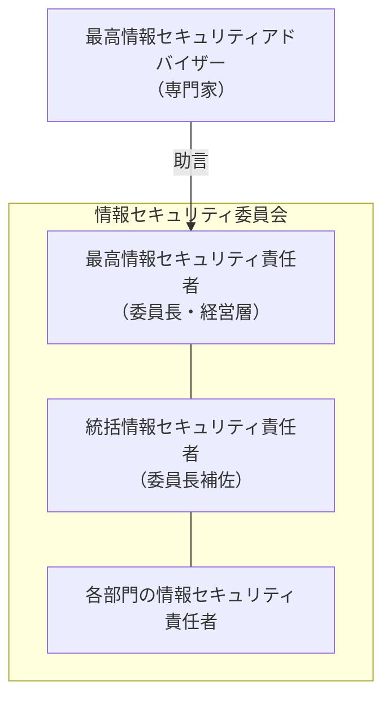

# 3-1 情報セキュリティ管理

重要度：★★★

> 依導讀順序重寫，不收錄書上原文、原表與練習問題原文。
> **本節依導讀順序分為 ①〜⑧。**

## 縮寫展開

| 縮寫／外來語 | 英文全名 | 說明 |
|---|---|---|
| **ISMS** | **Information Security Management System** | 情報セキュリティマネジメントシステム，資安管理「機制」 |
| **マネジメント** | **management** | 管理、經營 |
| **ポリシ** | **policy** | 方針（→ 3-2） |
| **ISO** | **International Organization for Standardization** | **国際標準化機構** |
| **IEC** | **International Electrotechnical Commission** | **国際電気標準会議** |
| **JIS** | **Japanese Industrial Standards** | **日本産業規格**（2019 年由「日本工業規格」改名） |
| **JAS** | **Japanese Agricultural Standards** | **日本農林規格** |
| **ベストプラクティス** | **best practice** | 最佳實務，27002 的定位 |
| **ISMS-AC** | **ISMS Accreditation Center** | 日本的 ISMS 認定機関 |
| **サーベイランス** | **surveillance** | ＝維持審査，每年一次 |
| **Pマーク** | **privacy mark** | プライバシーマーク，個人情報保護的認證 |
| **デファクトスタンダード** | **de facto standard** | **事実上の標準** |
| **デジュールスタンダード** | **de jure standard** | **法律上・公的な標準** |
| **IPA** | **Information-technology Promotion Agency, Japan** | **独立行政法人情報処理推進機構**，本考試主辦單位 |
| **JVN** | **Japan Vulnerability Notes** | IPA 與 JPCERT/CC（Japan Computer Emergency Response Team Coordination Center）共同營運的脆弱性資訊網站 |
| **ガイドライン** | **guideline** | 指引 |
| **PDCA** | **Plan-Do-Check-Act** | 計画・実施・点検・改善 |
| **スパイラルアップ** | **spiral up** | 每轉一圈水準更高 |
| **マネジメントレビュー** | **management review** | 經營層的審視（→ Ch8） |
| **トップダウン** | **top-down** | 由上而下 |
| **コミットメント** | **commitment** | 経営陣のコミットメント＝經營層的投入與承諾 |
| **カゴ落ち** | **cart abandonment** | 購物車放棄（→ 2-9） |
| **アドバイザー** | **adviser** | 最高情報セキュリティアドバイザー，只提供助言 |
| **CISO** | **Chief Information Security Officer** | 最高情報セキュリティ責任者 |
| **CIO** | **Chief Information Officer** | 最高情報責任者 |
| **CTO** | **Chief Technology Officer** | 最高技術責任者 |
| **システムアドミニストレータ** | **system administrator** | 俗稱シスアド；**IPA 用法＝利用部門的 IT 推進者**，不是伺服器管理員 |
| **プロジェクトマネージャ** | **project manager** | 專案經理 |

## 讀音

| 用語 | 讀音 |
|---|---|
| 故意／意図的 | **こい／いとてき** |
| 偶発的 | **ぐうはつてき** |
| 規格 | **きかく** |
| 標準化 | **ひょうじゅんか** |
| 要求事項 | **ようきゅうじこう** |
| 実践の規範 | **じっせんのきはん** |
| 適合性評価制度 | **てきごうせいひょうかせいど** |
| 認証／認定 | **にんしょう／にんてい** |
| 認定機関／審査機関 | **にんていきかん／しんさきかん** |
| 有効期間 | **ゆうこうきかん** |
| 維持審査／更新審査 | **いじしんさ／こうしんしんさ** |
| 事実上 | **じじつじょう** |
| 脅威 | **きょうい** |
| 見直し | **みなおし** |
| 内部監査 | **ないぶかんさ** |
| 経営陣 | **けいえいじん** |
| 職務の分離 | **しょくむのぶんり** |
| 相互牽制 | **そうごけんせい** |
| 承認者 | **しょうにんしゃ** |
| 周知徹底 | **しゅうちてってい** |
| 就業規則 | **しゅうぎょうきそく** |
| 罰則 | **ばっそく** |
| 例外措置 | **れいがいそち** |
| 代理承認者 | **だいりしょうにんしゃ** |
| 事後申請 | **じごしんせい** |
| 形骸化 | **けいがいか** |
| 委員会 | **いいんかい** |
| 全社横断 | **ぜんしゃおうだん** |
| 統括 | **とうかつ** |
| 助言 | **じょげん** |
| 経営戦略 | **けいえいせんりゃく** |
| 整合性 | **せいごうせい** |

---

## 本節的位置

Ch1 講攻擊、Ch2 講密碼、Ch5 講產品——**全部都是技術。** 但技術擋不住「員工不知道這樣做有問題」。
**Ch3 是整本書的轉折點：從「用什麼工具擋」轉向「靠什麼機制運作」。** 這節先回答「為什麼要管理、靠什麼機制管理（ISMS）、依據什麼標準、怎麼持續運轉（PDCA）、由誰來推（組織）」；
3-2 接著把這套機制寫成文件（情報セキュリティポリシ（じょうほうセキュリティポリシ）），3-3 再決定有限的資源要先保護什麼（リスクマネジメント（risk management））。

① 為什麼需要管理 → ② ISMS 是什麼 → ③ 規格與標準 → ④ ISMS 的規格體系 → ⑤ 認證制度 → ⑥ PDCA → ⑦ 組織運營四原則 → ⑧ 推動體制與角色。

---

## ① 為什麼需要「管理」：故意與偶發

情報セキュリティ管理（じょうほうセキュリティかんり）是針對組織資安對策的要求與策略。**它不只處理內部的「故意（こい）」行為，也包含「偶発的（ぐうはつてき）」的情況**——資安概念不足、公司沒有足夠的防範意識所導致的失誤。

| | 例 |
|---|---|
| **故意（意図的，いとてき）** | 內部人員蓄意帶走資料 |
| **偶発的（過失）** | **寄錯信、USB 弄丟、設定打錯** |

> **實際的事故統計裡，偶発的那一邊佔的比例非常高。這正是 Ch3 存在的理由。**
> **Ch1、Ch2、Ch5 全是「技術」。但技術擋不住「員工不知道這樣做有問題」。**

---

## ② ISMS：買不到、只能建立的機制

既然問題出在「人和組織」，解法就不能只是再買一台設備。

**ISMS（Information Security Management System）＝組織整體用來保護資訊安全的「機制」。**
**ISMS 不是一個產品，你買不到它，只能建立它。** 內容包含：依範本建立**情報セキュリティポリシ**（→ 3-2）、組織的教育訓練、資安評估與修正等。

建立 ISMS 的好處：

| 好處 |
|---|
| 減少資安事故的發生 |
| 從業人員的資安意識提高 |
| **獲得外部信賴，擴張商業版圖** |

第三點是 ⑤ 認證制度存在的理由：「我們有在管理」要能讓外部相信，就需要第三方來認證。

### 本考試與 IPA

順帶一提，**這張考試本身就叫「情報セキュリティマネジメント試験」**——Ch3 是這張證照的核心章。
主辦單位是 **IPA（Information-technology Promotion Agency, Japan，独立行政法人情報処理推進機構（どくりつぎょうせいほうじんじょうほうしょりすいしんきこう））**，推動 IT 的組織。

> **本測驗不是 ISMS 本身，而是由 IPA 舉辦、用來推動 ISMS 的考試。**

IPA 的產出會直接變成考題：

| 產出 | 為什麼跟你有關 |
|---|---|
| **情報セキュリティ10大脅威（じゅうだいきょうい）** | **每年發布，SG 常直接出題**。**組織編**與**個人編**分開排名，題目通常考組織編 |
| 各種ガイドライン（guideline） | 給中小企業的對策指引等 |
| 脆弱性情報（JVN（Japan Vulnerability Notes）等） | 與脆弱性管理相關 |

> **「情報セキュリティ10大脅威」值得考前掃一眼**——那是少數「不在課本裡、但會考」的東西。

---

## ③ 規格與標準：先搞懂「規格」是什麼

ISMS 要被外部承認，就需要一份大家都認的基準——那就是「規格」。

**規格（きかく）＝把規定整理並制定好的東西（規則、約定）。** 規格化的目的是**標準化（ひょうじゅんか）**。例如鍵盤配列——規格化之前各家隨性，使用者很不方便。

> **規格不是法律，不遵守不會被罰。只是規格化後的東西更符合社會期待。**

| 種類 | 內容 |
|---|---|
| **国際規格（こくさいきかく）** | 各國討論後統一制定。主要由 **ISO**（International Organization for Standardization，国際標準化機構）與 **IEC**（International Electrotechnical Commission，国際電気標準会議）制定 |
| **国内規格（国家規格，こくないきかく／こっかきかく）** | 各國自訂。日本有 **JIS**（Japanese Industrial Standards，日本産業規格）、**JAS**（Japanese Agricultural Standards，日本農林規格） |

### 怎麼成為標準：デファクト vs デジュール

| | 意思 | 怎麼成為標準 |
|---|---|---|
| **デファクトスタンダード**（de facto standard） | **事実上（じじつじょう）の標準** | **市場競爭的結果**。沒有任何機構認可過 |
| **デジュールスタンダード**（de jure standard） | **法律上・公的な標準** | **ISO、JIS 等標準化機関正式制定** |

**de facto ＝「事實上」、de jure ＝「法律上」，皆為拉丁語。**

**例**：個人電腦作業系統有九成是 Windows；以前錄影帶規格之爭中打敗 Betamax 的 VHS。

> **注意 VHS 那個例子的重點——Betamax 技術上未必比較差，但輸掉市場就不是標準了。**
> **デファクト 的判準只有一個：大家實際上在用哪個。**

ISMS 的規格（④）是典型的デジュールスタンダード。

---

## ④ ISMS 的規格體系：27000 / 27001 / 27002

| 規格 | 內容 |
|---|---|
| **ISO/IEC 27000** | **用語定義** |
| **ISO/IEC 27001** | **要求事項（ようきゅうじこう）**——**認證的基準就是它**。「你必須做到這些」 |
| **ISO/IEC 27002** | **実践の規範（じっせんのきはん）**——**ベストプラクティス（best practice）集**。「具體可以怎麼做」 |

> **27001 是「必須符合什麼」（拿認證看這本），27002 是「建議怎麼做」（實作參考）。**

**ISO/IEC 並列的理由**：兩個組織共同制定，所以雙掛名。

**日本版對應為 JIS Q 27001、JIS Q 27002。**
**題目會混用 ISO/IEC 與 JIS Q——兩者內容相同**，JIS 是日本翻譯後的國家標準，**因為要翻譯所以發布會延遲幾年。**

---

## ⑤ 認證制度：讓「我們有在管理」可被外部驗證

### 制度 vs 認證

| | 內容 |
|---|---|
| **ISMS 適合性評価制度（てきごうせいひょうかせいど）** | **整個制度框架本身**——誰有資格審查、依據什麼基準、如何維持公信力 |
| **ISMS 認証（にんしょう）** | **某個組織實際通過審查後拿到的那張認證** |

**就像「駕照制度」與「你的駕照」的關係。**

**制度的結構是三層**：**認定機関（にんていきかん，日本是 ISMS-AC（ISMS Accreditation Center））認定審査機関 → 審査機関（しんさきかん，＝認証機関）審查企業 → 企業取得認証**。

> **有這層結構，認證才有公信力**——否則任何人都能自稱「我幫你認證」。信任要有根：認證機構本身也要被認定。

### ⚠️ 審查週期（考點）

| | 週期 |
|---|---|
| **認証の有効期間（ゆうこうきかん）** | **3 年** |
| **維持審査（いじしんさ，サーベイランス（surveillance））** | **每年** |
| **更新審査（こうしんしんさ）** | **每 3 年** |

> **ISMS 不是拿到就結束的獎狀，是必須持續運作的機制。停止運作就會被取消。**
> **每年查的是「你這個 PDCA 還在轉嗎」，不是查當初寫的文件漂不漂亮。**

### 其他認證制度

| 制度 | 對象 |
|---|---|
| **ISO 9000** 系列 | **品質（ひんしつ）**管理 |
| **ISO 14000** 系列 | **環境（かんきょう）**管理 |
| **プライバシーマーク（privacy mark，Pマーク）** | **個人情報（こじんじょうほう）**保護 |

### ⚠️ ISMS 認証 vs プライバシーマーク（必考）

| | **ISMS 認証** | **プライバシーマーク** |
|---|---|---|
| 保護對象 | **情報資産全般**（所有資訊資產） | **只有個人情報** |
| 認證單位 | **可以只針對一個部門／事業所** | **必須是法人全體** |
| 基準 | ISO/IEC 27001（JIS Q 27001） | **JIS Q 15001** |
| 範圍 | **國際規格** | **日本獨自的制度** |

**「只認證一個部門也可以」是 ISMS 的特徵**——所以會看到「本公司○○事業部取得 ISMS 認證」這種寫法；
**Pマーク 不能這樣，要嘛全公司拿，要嘛沒有。**

---

## ⑥ PDCA：讓機制一直轉下去

⑤ 說每年都要查「還在轉嗎」——轉的就是 **PDCA（Plan-Do-Check-Act）サイクル（cycle）**，ISMS 的核心思考模式。

| 階段 | 業務上 | ISMS 上 |
|---|---|---|
| **Plan（計画，けいかく）** | 整理問題點、建立目標與達成計畫 | **ISMS の確立（かくりつ）** |
| **Do（実施，じっし）** | 依目標與計畫執行業務 | **ISMS の導入・運用（どうにゅう・うんよう）** |
| **Check（点検，てんけん）** | 確認是否依當初的目標與計畫執行 | **ISMS の監視・見直し（かんし・みなおし）** |
| **Act（改善，かいぜん）** | 依審核結果改善業務 | **ISMS の維持・改善（いじ・かいぜん）** |

**Check 階段包含「内部監査（ないぶかんさ）」與「マネジメントレビュー（management review）」**（→ Ch8 會再出現）。

### ⚠️ 不是「圓」，是「螺旋」

> **PDCA 每轉一圈，水準要比上一圈高——這叫 スパイラルアップ（spiral up）。**
> **如果轉完一圈回到原點，那只是在做白工。**

### 為什麼非得一直轉

| 出現在 | 說的是同一件事 |
|---|---|
| **2-1 危殆化（きたいか）** | 演算法會過期 |
| **5-7 WPA3（Wi-Fi Protected Access 3）也有脆弱性** | 沒有永遠安全的加密 |
| **3-1 PDCA** | **所以管理機制也必須持續更新** |

> **資安沒有「完成」這個狀態。威脅一直在變，昨天有效的對策今天可能已經失效。**

---

## ⑦ 組織運營四原則

機制要轉得動，靠的是人。組織運営（そしきうんえい）有四個原則，每一個都在防一種「機制失效」的方式。

### 原則一：トップダウン（top-down）的管理體制

不是單單交給負責人，而是**整個公司從上到下統一**，需要經營層的積極參與。
**正式說法是「経営陣（けいえいじん）のコミットメント（commitment）」。**

> **為什麼非得從上面來**：資安措施要花錢、要改變既有流程、常常讓業務變麻煩——
> **沒有經營層的權限和預算，負責人推不動任何事。** ISO/IEC 27001 明文要求最高管理階層的領導。

### 原則二：明示每個人的角色與責任

不只是執行，也包含評價、修正與後續改善。**誰要在什麼時候做什麼，並明確誰負責改善。**

**為防止不正行為，承認者（しょうにんしゃ）／被承認者、監査する側／される側（稽核方／受稽核方）要分開——這叫 職務の分離（しょくむのぶんり，separation of duties）。**

> **目的是 相互牽制（そうごけんせい）：一個人無法獨力完成整個不正流程。**
> **申請的人不能自己批准，被查的人不能自己當稽核。**

### 原則三：制定規則並周知徹底

以 情報セキュリティポリシ 為出發點制定規程、實施教育訓練，並周知徹底（しゅうちてってい）。
組織體制要能在出現違反時**盡早發現並防止再發**。
**故意違反要有罰則（ばっそく），並明確記載在就業規則（しゅうぎょうきそく）裡**（→ 3-2 基本方針的「罰則」項目）。

### 原則四：設置例外措置

規定寫太死會導致業務窒礙難行。要針對緊急狀況預先準備彈性的例外措置（れいがいそち）——
例如**緊急時承認者不在，事先訂定代理承認者（だいりしょうにんしゃ）**，或採**事後申請（じごしんせい）認可**的方式。

> **⚠️ 例外措施不是在放寬安全，而是在保護安全。**
> **規則訂得太死，會被繞過——而被繞過的規則等於不存在。**

日文叫 **形骸化（けいがいか）**：制度還在，但只剩空殼。這是全書反覆出現的「安全性 vs 利便性」取捨：

| 出現在 | 同一件事 |
|---|---|
| **2-9 3D セキュア（3-D Secure）1.0** | 每次都要輸密碼 → **カゴ落ち（cart abandonment）** |
| **5-4 IPS（Intrusion Prevention System）** | 判定太嚴 → **正常業務被切斷** |
| **3-1 例外措置** | 規則太死 → **員工自己找後門繞過** |

**沒有正規的例外管道，人就會去用不正規的。**
**代理承認者、事後承認這些設計，是把必然會發生的例外拉回制度之內、留下紀錄。**

---

## ⑧ 推動體制與角色

### 情報セキュリティ委員会

各部門之間認知不一致時負責調整，需要經營層參與的**全社横断（ぜんしゃおうだん）の運営委員会（うんえいいいんかい）**。

> **⚠️ アドバイザー（adviser）在委員會「外面」。** 它提供的是**「助言（じょげん）」，不是「指示」**——沒有決策權，通常是外部專家或顧問。
> **這是刻意的設計：專業知識和決策責任要分開。** 專家懂技術但不承擔經營責任，做決定的必須是能負責、能調度預算的人。

### CIO vs CISO：為什麼要分成兩個人

| | **CIO**（Chief Information Officer） | **CISO**（Chief Information Security Officer） |
|---|---|---|
| 日文 | **最高情報責任者（さいこうじょうほうせきにんしゃ）** | **最高情報セキュリティ責任者** |
| 立場 | **活用資訊**——用 IT 創造經營價值 | **保護資訊** |

> **因為這兩個目標會衝突。CIO 想推新系統、想開放資料、想加快導入速度；CISO 要踩煞車。**
> **同一個人兼任，踩煞車的動機就會輸給推進度的壓力。**

**這又是那條「安全性 vs 利便性」的線——只是這次它被寫進了組織架構裡。**
前面幾次是用技術設計去平衡（3D セキュア 2.0、IPS 閾值），**這次是用「讓兩個人互相制衡」來平衡**——呼應 ⑦ 的**職務の分離**。

### ⚠️ 頻出題型：「某某職位的角色是哪一個」

**判斷點是「視野的範圍」。**

| 職位 | 視野 | 主軸 |
|---|---|---|
| **CIO** | **全社** | **経営戦略（けいえいせんりゃく）との整合性（せいごうせい）** |
| **CTO**（Chief Technology Officer） | 全社 | **技術本身**（調查・利用研究・教育） |
| **システムアドミニストレータ**（system administrator） | **部門** | 自部門的系統化方案 |
| **プロジェクトマネージャ**（project manager） | **專案** | 運營管理 |

> **CIO 的正解敘述必含兩個關鍵字：「全社的観点（ぜんしゃてきかんてん，全公司的觀點）」「経営戦略との整合性（與經營策略的一致性）」。**

### ⚠️ システムアドミニストレータ 是英文語感的陷阱

| | 英文語感 | **IPA 考試的用法** |
|---|---|---|
| system administrator | **伺服器／系統管理員**（技術人員） | **利用部門立場的 IT 推進者** |

**日本的「シスアド」指的是「業務部門裡懂 IT、負責把自己部門需求整理成系統化提案的人」**——**不是管伺服器的工程師。**
所以「各部門的代表，向資訊系統部門提出自己部門的系統化方案」才會是它。**這用英文語感讀完全讀不出來。**

---

## 前因後果

- **Ch3 是整本書的轉折點**：Ch1、Ch2、Ch5 全是技術，但技術有一個它無法覆蓋的區域——**偶発的な事故**：員工不知道這樣做有問題、規則寫了沒人看、出事沒人知道該找誰。**這些不是任何產品能解決的。**
- **所以 ISMS 的定位不是「更強的防護」，而是「讓防護持續運作的機制」。** 規格（27001）給它基準，認證制度（三層＋每年審查）讓外部能信任它——**信任要有根**，認證機構本身也要被認定。
- **本節的三個支柱，各自對應一種「機制會失效」的方式：**

| 支柱 | 防止什麼 |
|---|---|
| **PDCA（スパイラルアップ）** | **對策隨時間過期**——威脅在變，措施不變就是在退步 |
| **トップダウン ＋ 職務の分離** | **有人不做、或一個人說了算**——沒有權限推不動，沒有牽制會腐化 |
| **例外措置** | **規則被繞過（形骸化）**——太嚴的規則會逼人走後門 |

- **這三者背後是同一個前提，跟 Ch5 的結論一致（侵入は防げない）：**

> **Ch5 承認「邊界會被突破」，所以發展出內部對策與出口對策。**
> **Ch3 承認「人會犯錯、制度會鬆弛」，所以需要持續審查、相互牽制、預留例外。**
> **兩章都不是在追求「不會出事」，而是在設計「出事之後還能運作」。**

- **CIO 與 CISO 的分離是全章最精練的例子**：安全性與利便性的衝突無法消除，**所以不要指望一個人同時扮演兩個角色——把衝突制度化，讓它在會議桌上發生，而不是在某個人的內心發生。**
- **往下接**：機制有了，接著要把它寫成文件——3-2 的三層「情報セキュリティポリシ」；之後 3-3 再決定資源有限時先保護什麼。

## 待補（考後）

- 情報セキュリティポリシ 的三層構造（基本方針・対策基準・実施手順）→ 3-2 展開
- ISO/IEC 27017（雲端）・27701（隱私）等衍生規格
- **情報セキュリティ10大脅威 最新版**（考前到 IPA 網站確認）
- 内部監査・マネジメントレビュー 的細節 → Ch8 回填
- CSIRT（Computer Security Incident Response Team）・SOC（Security Operation Center）的體制 → Ch4 回填
- JIS Q 15001 的內容
