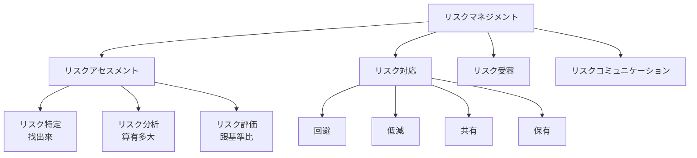

# 3-3 リスクマネジメント

重要度：★★★

> 依課本內容以導讀形式重寫；例子為自編，不收錄書上原表。
> **本節依導讀順序分為 ①〜⑤，建議照順序讀。** 全節用「健康檢查」當貫穿的比喻。

## 縮寫展開

| 縮寫／外來語 | 英文全名 | 日文／說明 |
|---|---|---|
| **リスクマネジメント** | **risk management** | 規格為 **JIS Q 31000** |
| **リスクアセスメント** | **risk assessment** | 特定・分析・評価 |
| **ベースラインアプローチ** | **baseline approach** | baseline＝基準線 |
| **JRMS2010** | **JIPDEC Risk Management System 2010** | 詳細リスク分析 的代表性評估系統 |
| **JIPDEC** | **Japan Institute for Promotion of Digital Economy and Community** | 日本情報経済社会推進協会 |
| **リスクコントロール** | **risk control** | 防止發生・擴大 |
| **リスクファイナンシング** | **risk financing** | 用錢補償損失 |
| **リスクヘッジ** | **risk hedge** | 預測並壓低風險 |
| **リスクコミュニケーション** | **risk communication** | 與利害關係人的對話 |
| **地政学的リスク** | **geopolitical risk** | 地理學＋政治學 |
| **UPS** | **Uninterruptible Power Supply** | 無停電電源装置（→ 4-4） |

## 讀音

| 用語 | 讀音 |
|---|---|
| 洗出し | **あらいだし**（全部列出來） |
| 棚卸し | **たなおろし**（盤點） |
| 脆弱性 | **ぜいじゃくせい** |
| 定性的／定量的 | **ていせいてき／ていりょうてき** |
| 回避／低減 | **かいひ／ていげん** |
| 移転／分散 | **いてん／ぶんさん** |
| 受容／保有 | **じゅよう／ほゆう** |
| 意思決定 | **いしけってい** |
| 残留リスク | **ざんりゅうリスク** |
| 選好／忌避 | **せんこう／きひ** |
| 顕在化 | **けんざいか**（風險變成現實） |

---

# ① 為什麼需要リスクマネジメント、整體結構

## 接回前兩節

3-1 建好了 ISMS 這套機制，3-2 寫好了規則。**但還缺一個問題沒回答：**

> **錢和人力有限，不可能每樣東西都保護到最好。那要先保護哪個？保護到什麼程度？**

**事故發生了才慌忙處理就太晚了。** リスクマネジメント 就是**事先找出風險藏在哪、多大，決定優先順序。**

## 「リスク」的定義

> **事象的結果、以及發生的容易程度都不確定，而且結果不符合期待。**

**兩個面向（後面會一直用到）：**

| 面向 | 意思 |
|---|---|
| **結果的大小**（影響度） | 真的發生了，損失多大 |
| **發生的容易程度**（發生可能性） | 多容易發生 |

## 整體結構

> **主幹只有一條：找出來 → 算有多大 → 跟基準比 → 決定怎麼處理。**
> **前三步＝リスクアセスメント；全部＝リスクマネジメント。**

### ⚠️ 考點：JIS Q 31000 的定義

課本的樹狀圖把「特定」放在「分析」底下，**但 JIS Q 31000 的定義是：リスクアセスメント＝特定・分析・評価，三者並列。**
**考試照這個答。「対応」「受容」不屬於アセスメント。**

## 貫穿全節的比喻：健康檢查

| 步驟 | 健康檢查 | リスクマネジメント |
|---|---|---|
| **特定** | 決定要檢查哪些項目 | 找出有哪些風險 |
| **分析** | **量出血壓 150** | **算出風險有多大** |
| **評価** | **跟基準 140 比，判定「需要治療」** | **跟事先訂好的基準比，判定要不要處理** |
| **対応** | 吃藥、改生活習慣，或者先觀察 | 選一種處理方式 |

> **最容易混的是「分析」和「評価」：分析是「量出數字」，評価是「拿數字跟基準比，做出判定」。**
> **量血壓的時候還不知道要不要治療；跟基準比過，才知道。**

**例**：「伺服器風險值算出來是 16」＝**分析**；「公司規定超過 12 就要處理，所以判定需要處理」＝**評価**。

## リスクマネジメントシステムの PDCA

**環境一直在變、新的威脅一直出現，做一次就好的對策是不夠的**（→ 3-1）：

| | 內容 |
|---|---|
| **Plan** | **リスクアセスメント** |
| **Do** | **リスク対応** |
| **Check** | 測量效果、評估有效性 |
| **Act** | 改善 |

---

# ② 事前準備：訂基準、盤點資産

## リスクアセスメントの手順

| 區分 | 步驟 | 做什麼 |
|---|---|---|
| **事前準備** | **① リスク基準** | **先決定評分標準** |
| | **② 情報資産の洗出し** | **把所有資産列出來，做成台帳** |
| **リスク分析** | ③ リスク特定 | 幫每個資産打分數 |
| | ④ リスク算定 | 算出リスクレベル |
| **リスク評価** | ⑤ リスク評価 | 跟基準比 |

## ① リスク基準：先把尺訂好

### 為什麼一定要先訂

> **「血壓超過 140 要治療」這條線，是在量血壓之前就定好的。**
> **量完才決定基準，就會看數字調標準：「150 好像還好啦」——人會替眼前的數字找理由。**

### 三把尺

| 基準 | 量什麼 |
|---|---|
| **(a) 資産價值的基準** | 從**機密性・完全性・可用性**看這個資産有多重要 |
| **(b) 脅威・脆弱性的基準** | 威脅多容易發生、弱點多嚴重 |
| **(c) リスク受容基準** | **多少以下可以接受，超過就要處理** ← ⑤ 評価 用的就是這把 |

### (a) 為什麼要分成三個分數

**同一個資產在三個面向上可能完全不同**——只給一個總分就看不出差別，對策會選錯。

| 資産（自編例） | 機密性 | 完全性 | 可用性 |
|---|---|---|---|
| **公司官網的首頁** | **低**（本來就公開） | **高**（被竄改就出大事） | **高**（掛掉客戶就看不到） |
| **顧客名單** | **極高** | 中 | 低（晚一天查也沒關係） |
| **員工訓練教材**（內部用） | **高**（見下） | **中〜高**（見下） | **低**（見下） |

**評分時該問的三個問題（以訓練教材為例）：**

| 面向 | 問什麼 | 訓練教材的判斷 |
|---|---|---|
| **機密性** | **「是給誰看的？」** | 含內部營運資訊 → 高；**但要看是給哪一群人的教材**，分級依「可公開給誰」 |
| **完全性** | **「被竄改會怎樣？」** | 一般教材 → 中。**但如果內容是資安手續，被竄改後新人會學到錯的做法且無人察覺 → 應該更高** |
| **可用性** | **「用不了多久會出事？有沒有即時性？」** | 暫時用不了只是麻煩，沒有即時性，可以補救 → 低 |

> **同一份文件，「內容是什麼」也會影響分數。**

### 各把尺的分數（例）

**機密性**（依「可公開給誰」）：

| 等級 | 意思 | 分數 |
|---|---|---|
| 極秘 | 只有最少的必要人員 | 4 |
| 関係者外秘 | 部門內 | 3 |
| 社外秘 | 公司內 | 2 |
| 公開 | 誰都能看 | 1 |

**完全性・可用性**：依對業務的影響，高 3／中 2／低 1。

**脅威・脆弱性：**

| 分數 | 脅威 | 脆弱性 |
|---|---|---|
| 3 | 發生可能性**高** | 管理與對策**不足** |
| 2 | 中 | 有一定程度 |
| 1 | 低 | 管理與對策**充分** |

**(c) リスク受容基準也要依機密性・完全性・可用性分別訂**——每個面向能忍受的程度不同。

### 三要素的定義（→ Ch2）

| 要素 | 讀音 | 定義 |
|---|---|---|
| **機密性** | きみつせい | 有權限的人才能存取 |
| **完全性** | かんぜんせい | 資訊正確、沒被竄改 |
| **可用性** | かようせい | 需要時就能用 |

## ② 情報資産の洗出し：先知道自己有什麼

> **不知道自己有的東西，就不可能保護它。**

**盤點（棚卸し）所有情報資産，做成「情報資産台帳」。**

### 六類情報資産

| 分類 | 例 |
|---|---|
| **情報資産** | 檔案、資料庫、契約書 |
| **物理的資産** | 電腦、伺服器 |
| **ソフトウェア資産** | 業務軟體、OS |
| **人的資産** | **人本身，擁有的資格、技能、經驗** |
| **無形資産** | **公司的商譽、形象** |
| **サービス** | 運算、通信服務，**暖氣、照明、電源、空調** |

### ⚠️ 容易漏掉的三個

| | 為什麼算資産 |
|---|---|
| **人的資産** | 資深工程師離職，**只有他懂的系統就沒人能維護** |
| **無形資産** | 資料外洩真正的損失**常常是商譽**，不是那些資料 |
| **サービス 的空調・電源** | **就是 4-4 的サポートユーティリティ**——兩章在講同一件事 |

### 台帳的記載項目

資産名稱、用途、**管理責任者**、管理擔當者、使用者範圍、記錄形式、保存地點、**保存期間**。

---

# ③ 分析：四種手法、怎麼算風險

## 四種リスク分析手法

| 手法 | 做法 | 健檢比喻 | 優點 | 缺點 |
|---|---|---|---|---|
| **ベースラインアプローチ** | 訂一條基準線（**自組織的対策基準**），逐項檢查差距 | **標準健檢套餐** | **容易執行** | 基準線太高或太低就失準 |
| **詳細リスク分析** | 對**每個資産**逐一識別價值・脅威・脆弱性・安全要求 | **全身精密檢查** | **分析嚴密** | **耗時、耗人力、需要專業** |
| **組合せアプローチ** | **並用**：重要資産做詳細，其他用ベースライン | **一般項目做套餐，高風險部位做精密** | 截長補短 | — |
| **非形式的アプローチ** | 靠顧問或擔當者的**經驗判斷** | **醫生看一眼憑經驗說** | **很快** | **結果取決於那個人的能力** |

> **兩個極端：ベースライン（快但粗）與 詳細（準但貴）。**
> **組合せ 存在的理由：詳細太花時間，ベースライン 對重要資産又太隨便——所以重要的做詳細，其他的用基準線。**

**詳細リスク分析的代表性評估系統：JRMS2010**（JIPDEC 制定）。

> **⚠️ 要確認**：課本 p229「ISMS が推奨する手法」一句的歸屬（照片中看似接在ベースラインアプローチ之後）——**待翻書確認**。

## リスク特定 → リスク算定

**自編例：員工訓練教材**

**リスク特定＝把分數填進去：**

| 項目 | 分數 | 理由 |
|---|---|---|
| **資産價值（機密性）** | **3** | 関係者外秘 |
| **脅威**（內部人員帶出去） | **2** | 發生可能性中等 |
| **脆弱性**（放在全公司都能看的共用資料夾） | **3** | 管理不足 |

**リスク算定＝算出風險值：**

> **リスクレベル ＝ 資産価値 × 脅威 × 脆弱性 ＝ 3 × 2 × 3 ＝ 18**

**收緊資料夾權限（脆弱性 3 → 1）→ 3 × 2 × 1 ＝ 6**

**リスクマトリックス**：事先把所有組合算好的速查表，**查表即可，不必每次計算**。

### ⚠️ 接 9/17 的錯題：任一項為 0，乘出來就是 0

那份教材若根本沒人想偷（脅威接近 0），**脆弱性再大，風險也很小。**

## ⚠️ 脅威 と 脆弱性 の区別（本章最容易卡住的地方）

**常見的誤解：「威脅是外部的」——不對。**
4-1 的**員工操作失誤、內部人員帶走資料、地震**都是威脅，沒有一個是外部攻擊者。

> **威脅＝會造成損害的「原因」**（人、事件、自然現象）
> **脆弱性＝讓那個原因「得逞」的、自己這邊的弱點**

### 比喻：小偷和沒鎖的門

| | 比喻 | 你能控制嗎 |
|---|---|---|
| **脅威** | **小偷** | **不能**——你鎖門，世界上的小偷不會變少 |
| **脆弱性** | **門沒鎖** | **能**——鎖上就好 |

**收緊權限＝控制脆弱性**：小偷還在（威脅不變），**只是進不來了。**

### 判斷時問一句話

> **「這是『會發生什麼壞事』，還是『為什麼它能得逞』？」**

| 脅威（會發生什麼） | 脆弱性（為什麼能得逞） |
|---|---|
| 駭客入侵 | 沒套修補程式（4-3） |
| 內部人員帶走資料 | 共用資料夾權限太寬 |
| 地震 | 伺服器機櫃沒固定（4-4） |
| 颱風造成停電 | 沒有 UPS（4-4） |
| 員工寄錯信 | 沒有寄出前的確認機制（4-3） |
| 冒充 IT 部門打電話騙密碼 | 員工沒受訓練；沒有「IT 不會打電話要密碼」的規定 |
| — | 員工密碼是 `123456` |

> **每一個威脅都配著一個脆弱性，對策打的永遠是右邊那一欄。**

## 定性的分析 と 定量的分析

| | **定性的** | **定量的** |
|---|---|---|
| 表示 | **高・中・低** | **具體數值** |
| 健檢比喻 | 「血壓偏高」 | 「血壓 150」 |
| 方法 | 訪談、檢查清單 | 計算 |
| 優點 | **不花時間** | **明確** |
| 缺點 | **不夠細** | **要算出可信的數字很花時間和技術** |

**實務上並用：先定性快速分類，再對特別重要的做定量**（與組合せアプローチ 同一個想法）。

---

# ④ 評価と対応：跟基準比、四種處理方式

## リスク評価：拿分數跟基準比

**健康檢查裡「跟 140 比」那一步。** 訓練教材的例子，機密性受容基準 **12**：

| | リスクレベル | 跟 12 比 | 判定 |
|---|---|---|---|
| **收緊權限之前** | 18 | 超過 | **要處理** |
| **收緊權限之後** | 6 | 沒超過 | **可以接受** |

> **超過受容基準的，優先進行リスク対応。題目出現「リスク基準と比較」→ リスク評価。**

### ⚠️ 四個步驟的關鍵字（考點）

| 步驟 | 做什麼 | 關鍵字 |
|---|---|---|
| **リスク特定** | **發現**風險，認識並記述 | 発見・認識・記述 |
| **リスク分析** | **理解性質、決定リスクレベル** | 特質を理解・レベルを決定 |
| **リスク評価** | **跟基準比，判定是否可受容** | **リスク基準と比較** |
| **リスク対応** | **修正**風險 | 対策を講じる |

## リスク対応：四種

| 種類 | 做法 | 例 |
|---|---|---|
| **回避** | **把產生風險的原因拿掉**，讓風險本身消失 | 伺服器可能從網路被入侵 → **禁止連網**；風險大利潤小的業務 → **乾脆不做** |
| **低減** | **降低發生機率**，或**降低發生後的損失** | 員工教育、就業規則加罰則、**筆電資料加密**、**收緊權限** |
| **共有** | **把風險分給別人** | 移転・分散（見下） |
| **保有** | **不處理**，當作容許範圍內 | 找不到對策、或對策成本高於損失 |

**共有的兩種：**

| | 做法 |
|---|---|
| **リスク移転** | **外包**，把風險本身轉給別人；**サイバー保険**補償損失 |
| **リスク分散** | 為防災**把資料分散放在不同地方**（→ 4-4 遠隔バックアップ） |

**回避的代價**：最根本，但也最傷——「不做那個業務」本身就是損失。**低減不根本，卻是最實際、最常選的。**

## 四種怎麼選：用 ① 的兩個面向

| | 發生機率 **低** | 發生機率 **高** |
|---|---|---|
| **影響 大** | **共有** | **回避** |
| **影響 小** | **保有** | **低減**（基本選項，範圍最大） |

> **記法：兩個都大 → 逃；兩個都小 → 放著；只有影響大 → 找人分攤；其他 → 降低它。**

### 兩個軸就是那條公式拆開來

> **發生機率 ＝ 脅威 × 脆弱性**
> **影響大小 ＝ 資産価値**
> **リスクレベル ＝ 影響大小 × 發生機率**

**前面算分數用的東西，到這裡直接變成選對策的依據。**

## リスクコントロール と リスクファイナンシング

| | 意思 | 包含 |
|---|---|---|
| **リスクコントロール** | **防止發生，或發生時不讓損害擴大** | 回避、低減、共有（外包、分散） |
| **リスクファイナンシング** | **發生後用錢補損失。風險本身沒降低** | **サイバー保険**（移転）、保有（自己負擔） |

> **⚠️ 保險不會讓事故變少，只是讓你賠得起。**
> **リスク移転中：「保險」屬ファイナンシング，「外包」屬コントロール。**

**頻出題型**：「サイバー保険に入ることは四つの対応のどれか」→ **リスク共有（移転）**。

### 應用：「總公司所在地大地震」（發生機率低、影響極大）→ 共有

| | 地震發生後 |
|---|---|
| **只買保險**（ファイナンシング） | **錢賠得回來，但公司停擺**——伺服器全毀、資料不見、好幾個月無法營業 |
| **リスク分散**（コントロール） | **另一個城市有備份與備援，業務繼續** |

> **兩者都屬共有，但一個補「錢」，一個保「營運」。理想上兩個都做。**

---

# ⑤ 受容と保有、その他の用語

## ⚠️ リスク受容 vs リスク保有（最常考）

| | **リスク保有** | **リスク受容** |
|---|---|---|
| 是什麼 | 四種**リスク対応**之一 | 組織的**意思決定** |
| **包含「根本沒發現」的嗎** | **包含**——特定階段漏掉的，結果也算保有 | **不包含** |
| 條件 | — | **明確知道有此風險**，組織**決定**接受 |

**健康檢查比喻：**
> **保有**：身上所有沒在治療的問題，**包含根本沒檢查出來的病**。
> **受容**：醫生說「有輕微脂肪肝」，**你知道了，決定先不治療**。

> **受容一定是「有意識的決定」；保有可以是「不知不覺的」。**

**例**：系統管理員**根本沒發現**舊伺服器有漏洞而沒處理 → **保有**（不是受容）。

## 残留リスク

> **リスク対応之後仍剩下的風險。包含沒被特定出來的。**

**PDCA 必須一直轉的理由**：
- 一定還有**沒發現的**風險
- **今天處理到 0，明天出現新攻擊手法，它又不是 0 了**——PDCA 停下的那一刻就開始退步

## その他の用語

| 用語 | 意思 |
|---|---|
| **リスク所有者** | **對該風險負說明責任（アカウンタビリティ）、有權限處理的人**。通常就是台帳上的**管理責任者**——每個風險都要有人負責，否則大家都以為別人在管 |
| **リスクコミュニケーション** | **為提供風險資訊，與利害關係人反覆進行的對話**。幫助組織了解風險的存在、特徵、發生容易度、嚴重性 |
| **リスクヘッジ** | 預測可能發生的風險，**事先採取措施壓到最小** |
| **リスク源** | **可能引發風險的要因或狀況** |
| **地政学的リスク** | 特定地區的**政治・社會・軍事緊張**影響國際的風險 |

## リスク選好 vs リスク忌避

- A：**抽中拿 10,000 元，沒中拿 0 元**
- B：**不用抽，確定拿 5,000 元**

| | 選 | 類型 |
|---|---|---|
| **リスク選好** | **A**，喜歡不確定性 | high risk, high return |
| **リスク忌避** | **B**，選確定的 | low risk, low return |

## ⚠️ 三組最容易混的（總整理）

| 組 | 差別 |
|---|---|
| **マネジメント vs アセスメント** | マネジメント＝**PDCA 整個流程**；アセスメント＝**只是 Plan** |
| **分析 vs 評価** | 分析＝**特定＋算出大小，不做判定**；評価＝**跟基準比，判定要不要處理** |
| **保有 vs 受容** | 保有＝**含沒發現的，非組織決定**；受容＝**知道了、組織決定接受** |

---

## 前因後果

**3-3 是整本書「脅威與脆弱性」這條線的收束點。**

9/17 刷題錯的那題「脅威不存在就不必急著處理脆弱性」，當時只能給一個關係式；
**本節給了完整的操作流程——那個關係式是 リスク算定 的公式本身，而且它拆開來就是選對策的兩個軸。**

**整個リスクマネジメント 背後的核心判斷，是「不追求零風險」：**

> **風險不可能歸零。問題不是「要不要處理」，而是「花多少成本、處理到什麼程度」。**

所以流程裡有兩個看起來在「不處理」的東西：

| | 為什麼存在 |
|---|---|
| **リスク受容基準** | **事先劃出「這條線以下我們接受」**——沒有這條線，就無法判斷資源投在哪 |
| **リスク保有・受容** | **對策成本高於損失時，不做對策才是理性的** |

**這是全書那條「安全性 vs 成本／利便性」取捨的正式決策版本。**
前面的版本是**技術的閾值**（2-10 FRR/FAR、5-4 FP/FN）與**組織的制衡**（3-1 CIO vs CISO）；
**這次是一張可以寫進會議記錄的表：算出數字、跟基準比、選四種之一。**

**另一個觀察：四種對應裡，只有「低減」是 Ch5 那些產品在做的事。**
防火牆、IDS、WAF、EDR——**全部屬於四格中的一格。**
**技術對策只是選項之一；有時正確答案是「不做這個業務」「買保險」「分散到別的城市」或「接受它」。**

### 與其他章節的連結

| 相關 | 連結 |
|---|---|
| **Ch2 三要素** | 資産價值依機密性・完全性・可用性分別評分 |
| **3-1 PDCA** | リスクマネジメント 本身也要轉 |
| **3-2 ベースラインアプローチ** | 四種分析手法之一；基準線＝自組織的対策基準 |
| **4-1 脅威の3分類** | 特定階段就是用這三類去找威脅 |
| **4-4 サポートユーティリティ・遠隔バックアップ** | 資産分類的「サービス」；リスク分散 |
| **Ch5 各種製品** | 幾乎都是**リスク低減** |

## 待補（考後）

- JIS Q 31000 與 JIS Q 27005（資安風險管理）的關係
- JRMS2010 的具體評估項目
- 定量的分析 的計算方法（ALE：年間予想損失額 等）
- サイバー保険 的補償範圍 → Ch6・Ch9 回填
- p229「ISMS が推奨する手法」的歸屬確認
