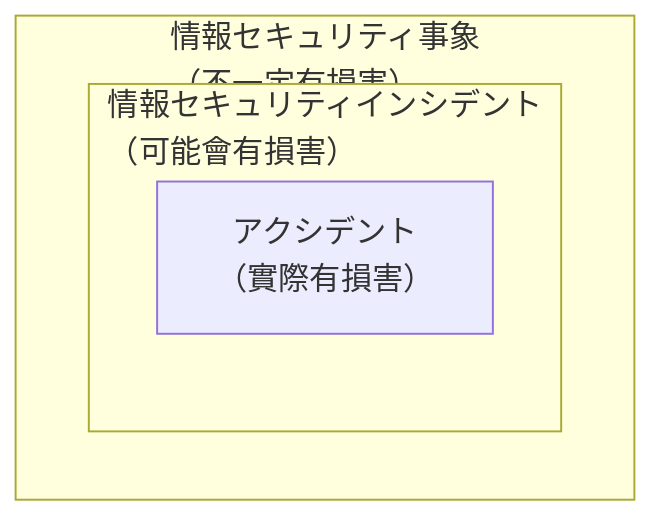

# 3-4 情報セキュリティ管理の実践

重要度：★★★

> 依課本內容以導讀形式重寫；例子為自編，不收錄書上原表與練習問題原文。
> **本節依導讀順序分為 ①〜⑥，建議照順序讀。**

## 縮寫展開

| 縮寫／外來語 | 英文全名 | 日文／說明 |
|---|---|---|
| **CTF** | **Capture The Flag** | 奪旗賽、ハッカーコンテスト |
| **SBOM** | **Software Bill of Materials** | ソフトウェア部品構成表（唸 エスボム） |
| **CVE** | **Common Vulnerabilities and Exposures** | **共通脆弱性識別子** |
| **CWE** | **Common Weakness Enumeration** | **共通脆弱性タイプ一覧** |
| **CVSS** | **Common Vulnerability Scoring System** | **共通脆弱性評価システム** |
| **CPE** | **Common Platform Enumeration** | 製品識別用的平台名稱一覽 |
| **CCE** | **Common Configuration Enumeration** | 資安設定項目的識別子 |
| **CSA** | **Control Self Assessment** | **統制自己評価** |
| **PCI DSS** | **Payment Card Industry Data Security Standard** | 信用卡業界資安基準 |
| **ISMAP** | **Information system Security Management and Assessment Program** | 政府情報システムのためのセキュリティ評価制度（唸 イスマップ） |
| **IaaS／PaaS／SaaS** | **Infrastructure／Platform／Software as a Service** | 雲端服務的三種層級 |
| **CSIRT** | **Computer Security Incident Response Team** | 唸 シーサート |
| **PSIRT** | **Product Security Incident Response Team** | 唸 ピーサート |
| **JPCERT/CC** | **Japan Computer Emergency Response Team Coordination Center** | JPCERT コーディネーションセンター |
| **JVN** | **Japan Vulnerability Notes** | 弱點情報入口網站 |
| **J-CRAT** | **Cyber Rescue and Advice Team against targeted attack of Japan** | サイバーレスキュー隊（唸 ジェイクラート） |
| **J-CSIP** | **Initiative for Cyber Security Information sharing Partnership of Japan** | サイバー情報共有イニシアティブ（唸 ジェイシップ） |
| **SOC** | **Security Operation Center** | 唸 ソック |
| **NOTICE** | **National Operation Towards IoT Clean Environment** | 唸 ノーティス |
| **ISAC** | **Information Sharing and Analysis Center** | 唸 アイサック |
| **CSF** | **CyberSecurity Framework** | 美國 NIST 制定 |
| **NIST** | **National Institute of Standards and Technology** | 美國國家標準技術研究所 |
| **CPSF** | **Cyber-Physical Security Framework** | 經濟產業省制定 |
| **ペネトレーションテスト** | **penetration test** | penetration＝貫穿 |
| **ファジング** | **fuzzing** | fuzz＝引發問題的資料 |
| **サイバーハイジーン** | **cyber hygiene** | hygiene＝衛生 |
| **セキュリティクリアランス** | **security clearance** | 適格性評價 |

## 讀音

| 用語 | 讀音 |
|---|---|
| 脆弱性検査 | **ぜいじゃくせいけんさ** |
| 組込み機器 | **くみこみきき** |
| 事象 | **じしょう** |
| 自己点検 | **じこてんけん** |
| 内部監査／外部監査 | **ないぶかんさ／がいぶかんさ** |
| 識別・防御・検知・対応・復旧 | しきべつ・ぼうぎょ・けんち・たいおう・ふっきゅう |

---

## 本節的位置

3-1 建了機制，3-2 寫了規則，3-3 算了風險——**但光是這樣，擋不住任何損害。**

> **規則寫好了、風險算好了，然後呢？要有人真的去做，還要有人確認有沒有做到。**

**本節＝ISMS PDCA 中的 Do（實施）與 Check（點檢・監査）。**

（課本開頭提到「外部委託先の管理」，照片中未見該段內容——**待補拍確認**。）

---

# ① 教育と訓練

## 為什麼要教育

> **實際事故很多是「偶発的」——寄錯信、USB 弄丟、點了釣魚連結（→ 3-1）。**
> **技術擋不住「員工不知道這樣做有問題」，能擋的只有讓他知道。**

## 情報セキュリティ教育

**目的**：讓組織裡**所有人**知道並遵守資安規則與程序。

**對象是「全従業者」，包含派遣社員・アルバイト**（→ 3-2 適用範圍）。

**為什麼要包含他們：**
- 他們**一樣能把資料帶出去、一樣會點到釣魚信**
- **攻擊者會挑最弱的一環**：派遣與工讀生常**受訓最少，權限卻跟正職差不多**
- 對 1-9 的標的型攻擊來說，**只要有信箱就是目標**

**傳達的內容**：情報セキュリティポリシ 與相關規程、緊急時的應對、資安的威脅與對策。

### ⚠️ 實施時機（考點）

| 時機 | 為什麼 |
|---|---|
| **ポリシ 開始運用時・變更時** | **規則變了** |
| **新人・中途採用者入社時、異動時** | **人變了**：新職位有新權限、新規則 |
| **資安事故發生後、有人不遵守規則時** | **出事了** |

> **記法：規則變了、人變了、出事了——三種「變化」都要重新教育。**

**接 4-2**：教育＝状況的犯罪予防的「**⑤ 言い訳を許さない**」——讓人無法說「我不知道不行」。

## 情報セキュリティ訓練

> **教育＝讓人「知道」；訓練＝讓人「實際做一次」。知道不等於做得到。**

| 訓練 | 內容 |
|---|---|
| **標的型攻撃メール訓練** | 對員工寄**假的**標的型攻擊郵件，看會不會**開附件、點內文連結** |
| **レッドチーム演習** | **攻擊方（レッドチーム）**由資安專家組成，對委託組織的**防禦方（ブルーチーム）**實際攻擊，**驗證對策的実効性**。**對戰型**演習 |
| **CTF（Capture The Flag）** | 以**解謎或攻防戰**學習資安技術的競賽，又稱**ハッカーコンテスト**。名稱來自**搶奪藏起來的旗子** |

**三個重點：**

**標的型攻撃メール訓練最能說明「知道 ≠ 做得到」**——幾乎人人都「知道」別亂點，但收到寫得很像真的郵件時還是會點。**只有訓練測得出這一點。**

**訓練同時也是「測量」**——寄完假郵件，公司知道**幾 % 的人點了、哪個部門最容易中招**。**它也是 PDCA 的 Check：讓組織知道防線哪裡最薄。**

**レッドチーム演習的重點在「実効性」**——不是檢查「有沒有裝、有沒有訂」，**而是真的打一次看防不防得住**（防止 3-1 的形骸化）。

**CTF 跟前兩者不同**：前兩者**測試組織的防禦**，**CTF 培養人的技術**。

---

# ② 脆弱性検査と脆弱性管理

## 脆弱性検査：找出系統裡的弱點

| | 時機 |
|---|---|
| **運用前検査** | 系統**建置時・更新時** |
| **定期検査** | **開始運作後**定期進行 |

**為什麼上線後還要定期查？** 系統沒改，**新的漏洞仍會不斷被發現**（2-1 危殆化、3-3 残留リスク）。

### 主要手法

| 手法 | 對象 | 做法 |
|---|---|---|
| **ペネトレーションテスト** | **伺服器・系統** | 為確認**攻擊者進不進得來**，**實際模擬攻擊** |
| **ファジング** | **組込み機器・軟體** | **送入大量「可能引發問題」的資料**，觀察有無異常動作，找出 **bug 與未知漏洞** |

**組込み機器（くみこみきき）＝用途固定的設備**——家電、汽車、工業機械；與 PC 這種萬用機器不同。

**其他檢查項目：**
- 對外埠號有無漏洞 → **ポートスキャン**
- **セキュリティパッチ**套用狀況
- **未使用・不需要的帳號**是否已停用

### ⚠️ 三個「實際打打看」的東西

| | 對象 | 想知道什麼 |
|---|---|---|
| **ペネトレーションテスト** | **伺服器・系統** | **攻擊者進不進得來** |
| **レッドチーム演習** | **整個組織的防禦** | **對策是否真的有效**，含偵測與應對 |
| **ファジング** | **軟體・組込み機器** | **丟奇怪的資料進去會不會壞**（未知漏洞） |

### ⚠️ ファジング 的誤答選項

| 敘述 | 那是什麼 |
|---|---|
| 只讓通過マルウェア檢查的 PC 連上內網 | **検疫ネットワーク**（→ 5-8） |
| 機械式檢查原始碼語法，比對特定模式 | **ソースコード検査** |
| 一邊讀原始碼一邊對照檢查清單 | **ソースコードレビュー** |
| **自動產生多樣資料輸入軟體，從回應與行為檢出漏洞** | **ファジング** ✓ |

> **判別點：ファジング 不看原始碼，只從外面「丟東西進去看它會不會壞」。**

## 脆弱性管理：四個縮寫

| 規格 | 回答的問題 |
|---|---|
| **CVE**（共通脆弱性識別子） | **這個漏洞「叫什麼」**——全世界唯一的編號 |
| **CWE**（共通脆弱性タイプ一覧） | **這個漏洞「是哪一類」**——分類 |
| **CVSS**（共通脆弱性評価システム） | **這個漏洞「有多嚴重」**——世界共通基準的分數 |
| **SBOM**（ソフトウェア部品構成表） | **我的軟體「裡面裝了什麼」**——元件名稱、版本、依存關係 |

**工作上的對應**：`npm audit`、Dependabot 的警告上寫的 `CVE-2024-xxxx` ＝ CVE，「High 7.5」＝ CVSS；**SBOM 的概念類似 `package-lock.json`**——某套件爆出 CVE 時，讓你立刻知道自己有沒有用到。

### ⚠️ CWE 練習題的誤答選項

| 誤答敘述 | 那是 |
|---|---|
| 以基本・現状・環境三基準評估 IT 製品漏洞的手法 | **CVSS** |
| 識別製品用的平台名稱一覽 | **CPE** |
| 識別資安相關設定項目的識別子 | **CCE** |
| **漏洞種類的一覽** | **CWE** ✓ |

## ⚠️ CVSS の三つの評価基準（★必考）

| 基準 | 評估什麼 | **會隨什麼改變** |
|---|---|---|
| **基本評価基準** | **漏洞本身的特性**：對機密性・完全性・可用性的影響 | **不隨時間改變** |
| **現状評価基準** | **漏洞「現在」的嚴重程度**：攻擊程式出現了沒、有無對策可用 | **隨時間改變** |
| **環境評価基準** | **最終嚴重程度**，連同**使用者自己的環境**重新評估 | **依使用者而不同** |

> **記法：基本＝漏洞天生的；現状＝現在世界上的狀況；環境＝在「我家」的狀況。**
> **基本不會變，因為漏洞「能讓人做到什麼」不會變；會變的是漏洞周圍的世界——現状量的就是那個世界。**

**自編例：某 Web 伺服器軟體的漏洞**
- **基本**：能遠端執行程式 → 天生就嚴重，**永遠不變**
- **現状**：剛公開時沒有攻擊程式；**一個月後出現現成攻擊工具 → 分數上升**；官方釋出修補 → 分數下降
- **環境**：**你公司那台伺服器根本沒對外公開 → 在你家嚴重程度較低**

**題目判別：**
- 「攻擊程式碼的出現與否、可用對策的程度 → 評價隨時間改變」→ **現状**
- 「評價結果不隨時間改變」→ **基本**
- 「各製品利用者的評價結果不同」→ **環境**

---

# ③ インシデント管理とセキュリティ評価

## インシデント管理

**管理資安事故發生時的處理。** incident＝出來事、事件。

### ⚠️ 三層包含關係（★必考）

| 用語 | 定義 |
|---|---|
| **情報セキュリティ事象** | **不一定造成損害**的事 |
| **情報セキュリティインシデント** | **可能造成損害**的事件・事故・事態 |
| **アクシデント** | インシデント的結果，**真的造成損害** |

**比喻：開車**

| | 開車 | 資安（自編例） |
|---|---|---|
| **事象** | 路上發生的所有事，**含完全沒事的** | 防火牆記錄到**一次**登入失敗 |
| **インシデント** | **可能出事的事**：差點撞到，**也含真的撞到** | **5 分鐘內登入失敗 300 次，最後沒成功**——沒成功，但很明顯有人在使壞 |
| **アクシデント** | **真的撞到了** | **登入成功，資料被偷** |

> **事象 ⊃ インシデント ⊃ アクシデント。所有インシデント都是事象，但事象不一定是インシデント。**

### ⚠️ 練習題的考法

**正解說法：「事象は、インシデントに分類され**得る**」**——**「可能」是，不是「一定」是。**

| 誤答 | 為什麼錯 |
|---|---|
| 兩者是同一個東西 | 一個包含另一個 |
| 兩者無關 | 一個包含另一個 |
| 所有事象都是インシデント | **方向反了** |

## セキュリティ評価

**確認對策是否有效、有沒有做到。**

| | **自己評価**（第一者評価・セルフアセスメント） | **第三者評価** |
|---|---|---|
| 誰評估 | **自己** | **中立立場的專家** |
| 頻率 | **每天・每週・每月**，用檢查清單 | 偶爾，需事前準備 |
| 成本 | **不花人力、時間、費用** | **花人力、時間、費用** |
| 可信度 | 低 | **高** |

**為什麼第三者比較可信？自己改自己的考卷**——很難客觀，**而且有改寬鬆的誘因**。

### 自己評価的細分：差在「誰做」

| | 誰做 | 做什麼 |
|---|---|---|
| **自己評価** | **資訊系統的擔當者** | 評估自組織的資安對策狀況 |
| **自己点検** | **一般員工** | **自己檢查有無遵守對策**。效果：掌握遵守狀況、徹底執行、**提升資安意識** |
| **CSA（統制自己評価）** | **一般員工** | **自己監查自己部門的活動** |

### 第三者評価：資安監查的兩種

| | 誰做 |
|---|---|
| **内部監査** | **組織內部的監查部門** |
| **外部監査** | **委託外部專家** |

> **⚠️ 內部監查是自己公司的人，為何算第三者？關鍵是「獨立」——監查部門與被監查部門分開，它不是在檢查自己的工作（→ 3-1 職務の分離）。**

---

# ④ 評価基準・制度

**整理的軸：每個制度都在回答「評價的對象是什麼」。**

| 制度 | **評價什麼** | 誰來評 |
|---|---|---|
| **PCI DSS** | **處理信用卡資訊的業者** | 信用卡業界基準 |
| **情報セキュリティ対策ベンチマーク** | **自己的組織** | **自我診斷**（IPA 提供） |
| **ISMAP** | **政府要用的雲端服務** | **第三者** |
| **IT製品の調達におけるセキュリティ要件リスト** | **要採購的 IT 產品** | 經濟產業省制定 |
| **セキュリティクリアランス** | **人** | 政府 |

> **對象：業者、自己、雲端、產品、人——用這條軸記就不會混。**

## PCI DSS

> **保護信用卡資訊的業界資安基準。適用於所有「儲存、處理、傳輸」卡片會員資訊的機關與加盟店。**

- **5-5**：WAF 不會被拿掉的理由之一，就是 PCI DSS 直接要求
- **實務**：改用 Stripe 這類金流服務，讓卡號不經過自己的伺服器，**目的之一就是把 PCI DSS 的適用範圍縮到最小**（→ 3-3 リスク移転）

## 情報セキュリティ対策ベンチマーク

> **回答自組織的對策狀況與企業資訊，就能確認資安水準的自我診斷系統。**

**屬於 ③ 的「自己評価」。**

## ISMAP

> **由第三者事先評價・登錄「符合政府資安要求的雲端服務」（IaaS・PaaS・SaaS）的制度。**

**目的：推動「クラウド・バイ・デフォルト原則」**——**政府資訊系統優先考慮使用雲端**。
政府要大量用雲端，不可能每個機關各自審查一次，**所以事先審好、列成清單。**
**評價對象是「雲端服務」，不是政府機關**——站在**買方**立場，事先替所有機關把賣方審好。

### IaaS／PaaS／SaaS（以 AWS 對照）

| | 業者提供到哪 | 例 |
|---|---|---|
| **IaaS** | **伺服器・網路** | EC2 |
| **PaaS** | **開發・執行環境** | Elastic Beanstalk、Heroku |
| **SaaS** | **應用程式本身** | Gmail、Slack |

### ⚠️ ISMAP 練習題：誤答借用別的制度的特徵

| 誤答敘述 | 比較像 |
|---|---|
| 對處理個人資訊的業者授予**標章**，准許政府委託 | **プライバシーマーク**（3-1） |
| 以「私有雲規格＋公有雲專用管理策」的國際規格為基準 | **JIS Q 27017** 類的雲端管理策（3-2） |
| 個人資料移轉海外時**不需本人同意** | 個人情報保護法的海外移轉規定（→ Ch6） |
| **事先評價・登錄符合政府要求的雲端服務** | **ISMAP** ✓ |

> **與 9/17 錯的 XML署名／Ajax 同一種出題方式：誤答是把隔壁制度的正確描述搬過來。**

## IT製品の調達におけるセキュリティ要件リスト

> **依產品類別（數位複合機、防火牆等）整理「要考慮的威脅」與「對應的資安要求」。經濟產業省制定，幫助採購安全的產品。**

**重點在「採購之前」。**（複合機常被忘記，但它有硬碟、有網路，**掃描過的文件都存在裡面。**）

## セキュリティクリアランス

> **基於國家安全，由政府確認需要接觸重要資訊之人是否可信的制度。**

**五個制度中唯一評價「人」的。**（日本 2024 年立法 → Ch6 可能再碰到。）

---

# ⑤ 組織・機関

**兩條軸定位每個組織：「做什麼」×「管多大範圍」**

| | **自己的組織** | **業界** | **跨組織・全國** |
|---|---|---|---|
| **事故應對** | 組織内 CSIRT、**PSIRT**（產品） | — | **JPCERT/CC**、国際連携 CSIRT、**J-CRAT** |
| **監視** | **SOC** | — | **NOTICE**（IoT） |
| **情報共享** | — | **ISAC** | **J-CSIP** |
| **弱點情報** | — | — | **JVN**、JVN iPedia、MyJVN |

## 事故應對：CSIRT 系

**CSIRT（シーサート）**
> **資安インシデント發生時負責應對的組織。** 受理報告、支援應對、分析手法、檢討防止再發——**從技術面**提供建議。

**比喻：公司的消防隊。**

| 種類 | 範圍 |
|---|---|
| **組織内 CSIRT** | **自己的組織**（企業、政府機關） |
| **国際連携 CSIRT** | **國家・地區** |
| **JPCERT/CC** | **日本代表性的 CSIRT**。製作 **CSIRT マテリアル**（建立組織內 CSIRT 的指南） |

**JPCERT/CC 名字裡的「Coordination（協調）」是重點**——像**全國消防的協調中心**，串起各家 CSIRT。

**PSIRT（ピーサート）**
> **處理「自家產品・服務」的資安事故。**

| | 管什麼 |
|---|---|
| **CSIRT** | **自己公司內部**發生的事故 |
| **PSIRT** | **賣出去的產品**發生的事故 |

**工作上的連結**：自家產品被外部回報漏洞時，**接收回報、修補、對外向使用者公告**——PSIRT 的工作。

**J-CRAT（ジェイクラート）**
> **防止標的型攻擊的損害擴大。** 接受諮詢、降低受害組織損失、**斬斷攻擊的連鎖**。**IPA 營運。**

**名字就是角色：サイバーレスキュー隊（救難隊）。**

## 監視：SOC・NOTICE

**SOC（ソック）**
> **專門負責監視資訊設備、防止網路攻擊的組織。**

**比喻：24 小時保全監控中心。** **常外包**，理由：
- 具監視技能的**人才難找**
- 需要 **24 小時 365 天**監視

**SOC 的主要工具是 5-8 SIEM**（相関分析）。

**NOTICE（ノーティス）**
> **觀測對 IoT 設備的攻擊**，並提醒使用者注意。（→ 1-10 Mirai）

## 情報共享：J-CSIP・ISAC

**J-CSIP（ジェイシップ）**
> 參加組織把**內部偵測到的攻擊資訊集中到 IPA**，**匿名化後**在參加組織間共享，用以對付高度的網路攻擊。

**比喻：同業之間的情報交換群組，大家發言都匿名。**

### 為什麼要匿名化

> **被攻擊這件事傳出去，損失的是商譽（→ 3-3 無形資産）。**
> **要具名分享，大家就會綁手綁腳、選擇不說。**
> **匿名化把「分享的成本」降下來 → 願意說的公司變多 → 所有人都更安全。**

**ISAC（アイサック）**
> **各業界內**共享・分析攻擊的威脅、弱點、事故資訊。例：**金融 ISAC、交通 ISAC、電力 ISAC**。

| | 範圍 |
|---|---|
| **J-CSIP** | **跨業界**，IPA 居中 |
| **ISAC** | **同一業界**之內 |

### ⚠️ J-CSIP 練習題

**正解**：在參加組織間**共享攻擊資訊**，以對付高度的網路攻擊。

| 誤答 | |
|---|---|
| 參加組織**互相做資安監查**並共享結果 | ✗ |
| 參加組織**互相備份資料** | ✗ |
| 整理資安產品的有效性資訊並**公開** | ✗ |

> **J-CRAT＝救援，J-CSIP＝共享。名字像，做的事完全不同。**

## 弱點情報：JVN 系

| 名稱 | 內容 |
|---|---|
| **JVN** | 提供日本使用之軟體的**弱點資訊與對策**的入口網站。**IPA 與 JPCERT/CC 共同營運** |
| **JVN iPedia** | 同上弱點資訊的**資料庫**。JVN 營運 |
| **MyJVN** | JVN 提供的**版本檢查工具** |

**JVN 上的弱點資訊用的就是 ② 的 CVE 編號與 CVSS 分數。**

---

# ⑥ フレームワークと情報の入手先

## サイバーセキュリティフレームワーク（CSF）

> **組織實施資安對策的代表性指南**（原為美國 **NIST** 制定）。

| 機能 | 英文 | 內容 |
|---|---|---|
| **識別** | **Identify** | 找出**要保護的資訊** |
| **防御** | **Protect** | 實施保護對策 |
| **検知** | **Detect** | 掌握攻擊的**徵兆或發生** |
| **対応** | **Respond** | **事先規劃**被攻擊時的通報與防止擴大程序，並執行 |
| **復旧** | **Recover** | **事先規劃**受損功能・服務的復原計畫，並執行 |

> **重點：不只防守，還要「被攻擊後把影響壓到最小、早點恢復」。**
> **只有前兩個是事前；後三個是事中與事後。CSF 的前提是「一定會被打進來」——5-2「侵入は防げない」。**

### CSF 五個功能＝目前讀過的整本書

| CSF | 學過的 |
|---|---|
| **識別** | 3-3 資産の洗出し・リスク特定 |
| **防御** | Ch5 各種產品、4-3 技術的対策 |
| **検知** | 5-4 IDS、5-8 SIEM・EDR、⑤ SOC |
| **対応** | ⑤ CSIRT、③ インシデント管理 |
| **復旧** | 4-4 遠隔バックアップ・二重化 |

**例**：「EDR 偵測到異常行為」→ **検知**；「從遠端備份把資料救回來」→ **復旧**。

（**2024 年 CSF 2.0 新增第六個「統治（Govern）」**。考試照課本的五個答。）

## CPSF（サイバー・フィジカル・セキュリティ対策フレームワーク）

> **經濟產業省制定。** 針對**虛擬空間與現實世界高度融合的社會**整理資安對策的全貌，**目的是確保整條供應鏈的安全**。

**Society 5.0**：讓虛擬與現實高度融合、提供新商品與服務，**同時達成經濟發展與社會課題解決**的「超智慧社會」（日本政府的願景）。

| | 制定者 | 重點 |
|---|---|---|
| **CSF** | 美國 NIST | **組織**的資安（五個功能） |
| **CPSF** | **日本經濟產業省** | **虛擬＋現實融合**的社會、**整條供應鏈** |

## サイバーハイジーン

> **為了不被惡意程式感染，讓資訊設備保持「衛生」狀態的預防措施。**

**像洗手、刷牙：不是高深技術，是每天的習慣**——套修補、更新定義檔、停用沒在用的帳號、定期檢查（→ 4-3 共通対策、② 定期検査）。

## 弱點情報的來源

| **可信** | **不可信** |
|---|---|
| **JPCERT/CC**、**JVN**、**J-CSIP** | **ダークウェブ**、**SNS** |

**不可信的理由**：沒人查證，**可能是錯的，也可能是故意放的誘餌。**

---

## 前因後果

**3-4 是 Ch3 前三節的「執行面」——3-1 建機制、3-2 寫規則、3-3 算風險，3-4 讓這一切真的動起來，並確認它有在動。**

**本節內容沿 CSF 的時間軸排下來：**

| 時間 | 做什麼 | CSF |
|---|---|---|
| **平時・預防** | 教育、訓練、弱點檢查、サイバーハイジーン | **識別・防御** |
| **平時・監視** | SOC、SIEM、NOTICE | **検知** |
| **發生時** | CSIRT、J-CRAT、インシデント管理 | **対応** |
| **事後** | 復原、防止再發、再教育 | **復旧** |
| **持續** | 自己評価・第三者評価 | **ISMS 的 Check** |

**而貫穿本節的是 Ch1 就提過的判斷：**

> **1-1：攻擊已經產業化、組織化。所以防守也不能單打獨鬥。**

這就是本節有一整頁組織名的理由——**J-CSIP、ISAC、JVN 全是「情報共享」的機制**。
一家公司看到的攻擊只是冰山一角，**把大家看到的湊起來，才看得出全貌。**
**與 5-8 SIEM 的「相関分析」同一個思想，只是尺度從「一家公司的多台機器」放大到「多家公司」。**
**而匿名化是讓這件事能運作的關鍵——它降低了「說出來」的代價。**

**另一個貫穿的形狀：「知道」不等於「做到」，「有」不等於「有效」。**
- 教育讓人知道 → **訓練確認做得到**
- 有對策 → **レッドチーム 確認有效**
- 自己說有做 → **第三者評価 確認真的有做**

> **3-4 整節都在對抗 3-1 講過的「形骸化」。**

### 與其他章節的連結

| 相關 | 連結 |
|---|---|
| **1-9 標的型攻撃** | 標的型攻撃メール訓練、J-CRAT |
| **2-1 危殆化** | 定期検査的理由；CVSS 現状評価基準 |
| **3-1 職務の分離・形骸化** | 內部監查算第三者評価；訓練與監查對抗形骸化 |
| **3-2 適用範圍** | 教育對象含派遣・アルバイト |
| **3-3 無形資産・残留リスク** | J-CSIP 匿名化的理由；定期検査的理由 |
| **4-2 状況的犯罪予防** | 教育＝⑤ 言い訳を許さない |
| **5-5 WAF** | PCI DSS 的要求 |
| **5-8 SIEM・EDR・検疫ネットワーク** | SOC 的工具；ファジング 的誤答選項 |

## 待補（考後）

- **外部委託先の管理**（課本開頭提及，照片未涵蓋——待補拍）
- CVSS v3 的具體計算與 v4 的差異
- インシデント対応の手順（検知→初動→封じ込め→復旧→報告）
- CSIRT マテリアル 的內容
- 監査の詳細（監査証跡・監査報告）→ Ch8 回填
- ISMAP-LIU（低影響用途向け）
- CSF 2.0 的「統治（Govern）」
- セキュリティクリアランス 日本法制化 → Ch6 回填
