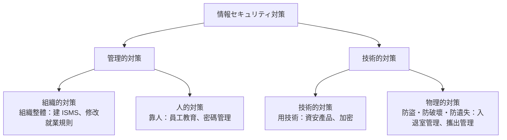

# 4-2 人的セキュリティ対策

重要度：★★★

> 依課本內容以導讀形式重寫。

## 讀音

| 用語 | 讀音 |
|---|---|
| 割れ窓理論 | **われまどりろん** |
| 状況的犯罪予防 | **じょうきょうてきはんざいよぼう** |
| 見返り | **みかえり**（回報、好處） |
| 挑発 | **ちょうはつ** |
| 容認 | **ようにん** |

---

## ① 對策的兩層分類

4-1 的威脅分三類；對策則分四類，**再往上合併成兩大類**：

> **管理的＝靠「規則與人」；技術的＝靠「機器與物」。**
> **這本書把物理的対策歸在技術的対策底下。**

| 對策 | 在哪 |
|---|---|
| 組織的対策 | **Ch3** |
| 人的対策 | **本節** |
| 技術的対策 | 4-3、Ch5 |
| 物理的対策 | 4-4 |

**本節的出發點：大家的目光常放在技術面，但最終讓資安陷入危險的是「人」。**

## ② 人的セキュリティ対策

**靠人來進行的資安對策。** 下面兩個理論說明「為什麼人會做壞事、怎樣讓人不做壞事」。

## ③ 割れ窓理論（われまどりろん）

> **放任輕微的不正或犯罪（＝打破的窗戶），會誘發更大的不正與犯罪。**

破窗沒人修 → 等於宣告「這裡沒人管」→ 更多窗戶被打破、垃圾被亂丟。

### 為什麼小違規也要處理

**重點不只是「別人會模仿」，而是：**

> **沒被處理的小違規會變成一個訊號，告訴所有人「這裡規則可以不守」。**
> **所以要處理的不只是那一次違規，而是它傳出去的訊息。**

**資安上的例子**：密碼貼在螢幕上、用私人 USB、螢幕沒鎖就離開——這些被默許，規則就開始崩解。

**接 3-1**：規則要能「儘早發現違反並防止再發」；放任的結果就是**形骸化（けいがいか）**。

## ④ 状況的犯罪予防（じょうきょうてきはんざいよぼう）

**不改變「人」，而是改變「環境」，讓犯罪難以發生。** 把這個方法套用到資安上。

### 五原則

| 原則 | 意思 | 資安上的例子 |
|---|---|---|
| **① 犯行を難しくする** | 讓犯行變困難 | **存取權限最小化**、禁止 USB、攜出管理 |
| **② 捕まるリスクを高める** | 提高被抓的風險 | **記錄日誌、監視攝影機，並讓員工知道** |
| **③ 犯行の見返りを減らす** | 減少犯行的好處 | **資料加密**——偷走了也讀不了 |
| **④ 犯行の挑発を減らす** | 減少誘發犯行的刺激 | **公平的人事考核**、改善職場環境 |
| **⑤ 犯罪を容認する言い訳を許さない** | 不給藉口 | **明文化規則並周知**、簽保密切結書 |

### 三個值得想的點

**② 的關鍵是「讓對方知道」。**
偷偷監視抓得到人；**公開說明有在監視，才有嚇阻效果。**

**③ 是學過的東西換個說法。**
加密不是防止偷，**而是讓偷走的東西沒價值**。
同一個想法：**5-8 TPM**（硬碟拔走也解不開）、**5-8 VDI**（終端上根本沒資料）。

**④ 跟技術完全無關。**
**人事制度也是資安對策**——不滿的員工更容易做壞事。這也是為什麼人的對策不能只交給 IT 部門。

> **五原則的整體精神：不假設人是好人或壞人，而是讓「做壞事」在這個環境裡不划算。**

### ⚠️ 考點：對策 ↔ 原則 的對應

題目會給一個具體對策，問它屬於哪一個原則。

| 對策 | 原則 |
|---|---|
| 伺服器室裝監視攝影機 | **② 捕まるリスクを高める** |
| **筆電硬碟加密** | **③ 犯行の見返りを減らす** |
| 簽保密切結書 | **⑤ 言い訳を許さない** |
| 只讓必要人員存取 | **① 犯行を難しくする** |

**判別技巧**：問自己「這個對策改變了犯行的哪一面？」——**難度？風險？好處？動機？藉口？**

## 前因後果

**4-2 是 4-1「人的脅威」的回答，也是全書最不「技術」的一節。**

Ch1〜Ch5 的對策幾乎都在問「用什麼工具擋」。本節問的是另一件事：

> **為什麼人會做壞事？**

兩個理論給了兩個方向的答案：

| 理論 | 看的是什麼 | 答案 |
|---|---|---|
| **割れ窓理論** | **組織的氛圍** | 小違規放任 → 規範崩解。**所以要處理小事** |
| **状況的犯罪予防** | **犯行的環境** | 讓做壞事變難、變危險、變無利可圖、沒理由、沒藉口 |

**兩者共同的前提是：不去期待人是好人。**
這跟 Ch5 的結論（5-2「侵入は防げない」、5-8「ゼロトラスト」）是同一個思想，只是對象從「網路」變成了「人」：

> **Ch5：不信任網路的內部。**
> **4-2：不預設員工的善意——但也不把他們當壞人，而是設計一個讓他們不需要選擇做壞事的環境。**

### 與其他章節的連結

| 相關 | 連結 |
|---|---|
| **3-1 形骸化・罰則** | 割れ窓理論 解釋了為什麼小違規也要處理 |
| **3-1 職務の分離** | 屬於「① 犯行を難しくする」——一個人無法獨力完成不正 |
| **3-4 資安教育** | 屬於「⑤ 言い訳を許さない」 |
| **5-8 DLP・ログ** | 「① 難しくする」與「② 捕まるリスク」 |
| **5-8 TPM・VDI** | 「③ 見返りを減らす」 |

## 待補（考後）

- IPA「組織における内部不正防止ガイドライン」中五原則的具體對策清單
- 不正のトライアングル（動機・機会・正当化）與五原則的對應
