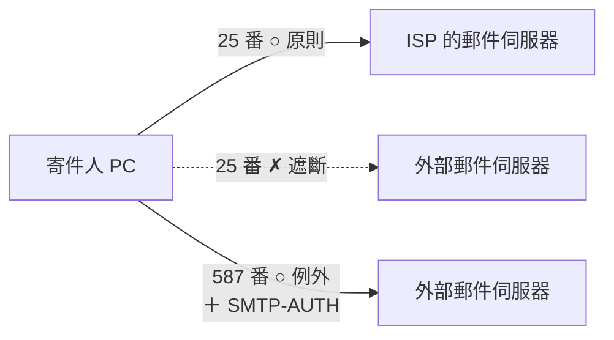
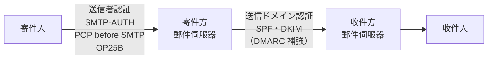

# 4-3 技術的セキュリティ対策

重要度：★★★

> 依課本內容以導讀形式重寫，例子為自編，不收錄書上原表與練習問題原文。
> **本節依導讀順序分為 ①〜⑦，建議照順序讀。**

## 縮寫展開

| 縮寫／外來語 | 英文全名 | 日文／說明 |
|---|---|---|
| **SMTP** | **Simple Mail Transfer Protocol** | 寄信協定 |
| **POP3** | **Post Office Protocol version 3** | 收信協定 |
| **SMTP-AUTH** | **SMTP Service Extension for Authentication** | SMTP 加上認證 |
| **POP before SMTP** | — | 寄信前先用 POP3 認證 |
| **OP25B** | **Outbound Port 25 Blocking** | 封鎖往外的 25 號埠 |
| **ISP** | **Internet Services Provider** | インターネット接続業者 |
| **SPF** | **Sender Policy Framework** | 以 IP 驗證寄件網域 |
| **DKIM** | **DomainKeys Identified Mail** | 以數位簽章驗證寄件網域（唸 ディーキム） |
| **DMARC** | **Domain-based Message Authentication, Reporting, and Conformance** | 補強 SPF／DKIM（唸 ディーマーク） |
| **URL** | **Uniform Resource Locator** | 網址 |
| **ラテラルムーブメント** | **lateral movement** | 橫向移動 |
| **多層防御** | たそうぼうぎょ／**defense in depth** | 多層防禦 |
| **ベイジアンフィルタリング** | **Bayesian filtering** | 貝氏過濾 |
| **オンプレミス** | **on-premises** | 自有機房 |
| **ソルト／ペッパー** | **salt / pepper** | 鹽／胡椒 |
| **ストレッチング** | **stretching** | 拉長 |
| **ステガノグラフィ** | **steganography** | 隱寫術 |
| **デジタルフォレンジックス** | **digital forensics** | 數位鑑識 |
| **サーバの要塞化** | ようさいか／**hardening** | 伺服器強化 |

## 讀音

| 用語 | 讀音 |
|---|---|
| 第三者中継 | **だいさんしゃちゅうけい** |
| 踏み台 | **ふみだい** |
| 誤送信 | **ごそうしん** |
| 送信ドメイン認証 | **そうしんドメインにんしょう** |
| 電子透かし | **でんしすかし** |
| あぶり出し | **あぶりだし**（檸檬汁寫字、加熱顯現） |

---

# ① 共通対策と多層防御

**本節的範圍**：技術的對策包含資安產品與加密技術，**產品已在 Ch5 講完，本節講其他的技術對策。**

## 所有系統都要做的兩件事

| 對策 | 重點 |
|---|---|
| **套用セキュリティパッチ** | 修補已知漏洞。**⚠️ 不只 OS、軟體，路由器、防火牆、IDS/IPS 等網路設備內建的軟體也要** |
| **導入マルウェア対策ソフト** | 為了對付新的惡意程式，**頻繁更新マルウェア定義ファイル** |

**第一點是考點**：網路設備也是一台電腦，也有自己的韌體要修補。
（1-10 的 IoT 攝影機會被 Mirai 打下，就是因為沒人更新它。）

## 入口・内部・出口（→ 5-2 已學）

| 對策 | 目的 | 手段 |
|---|---|---|
| **入口対策** | 不讓攻擊者侵入 | FW、IDS、IPS、マルウェア対策ソフト、パッチ |
| **内部対策** | 侵入後不讓損害擴大 | **把一般業務用內網與可存取機密的內網分離** |
| **出口対策** | 不讓資訊被送出去 | FW、IDS、IPS 等 |

**出口対策的名字由來**：攻擊者**帶著機密離開時經過的「出口」**。
需要它的原因：**只靠入口對策擋不住的攻擊越來越多**（→ 1-9）。

## 兩個新名詞

**多層防御（たそうぼうぎょ，defense in depth）**
> **像入口・內部・出口那樣，在多個層次、多個階段進行多種相關對策。**

**ラテラルムーブメント（lateral movement）**
> **攻擊者進入內網後，在網路裡「橫向」擴散感染。**（lateral＝橫向的）

**這就是內部對策要防的東西。** 防的手段：
- **網段分離**（課本的例子；實作上就是 **5-6 VLAN**）
- **5-2 パーソナルファイアウォール**
- **5-8 EDR**
- 權限最小化

---

# ② 寄信端的垃圾信對策：送信者認証

## 問題的起點

> **寄信協定 SMTP 本身沒有「確認寄件人是誰」的功能。**

因此被濫用：

| 濫用 | 意思 |
|---|---|
| **第三者中継** | 未經同意借用**別人的郵件伺服器**轉寄，藏住身分 |
| **踏み台** | 攻擊者為隱藏自己是兇手，**經由第三者的機器**發動攻擊 |

**解法：在寄信端加上「送信者認証」。**

## 三種方式

| 方式 | 做法 | 需要誰配合 |
|---|---|---|
| **SMTP-AUTH** | **幫 SMTP 補上認證**，寄信時用 ID／密碼認證 | **郵件軟體＋郵件伺服器都要支援** |
| **POP before SMTP** | 寄信前，**先用收信的 POP3 認證**，成功才准寄 | **只有伺服器要支援，郵件軟體不用改** |
| **OP25B** | ISP **封鎖用戶往外部郵件伺服器的 25 號埠** | **ISP** |

**POP before SMTP 的原理**：SMTP 沒有認證，但 POP3 本來就有帳密，**借用 POP3 的認證結果證明「剛登入的就是本人」**。

> **⚠️ 考點：「郵件軟體不用改」的是 POP before SMTP。**

## OP25B 詳解（最常考）

**為什麼要封鎖 25 號埠？** 被感染的家用 PC（**1-2 ボット**）會被命令寄大量垃圾信，
而它們是**直接連到收件方郵件伺服器的 25 號埠**，**不經過 ISP 的郵件伺服器**。

| | 規則 |
|---|---|
| **原則** | 寄信一律經 **ISP 的郵件伺服器**；往 ISP 以外的 **25 號埠一律封鎖** |
| **例外** | 要用外部郵件伺服器時，走 **587 號埠（サブミッションポート）**，並以 **SMTP-AUTH** 認證，通過才轉寄 |

### 追問：為什麼 25 號埠會被濫用？（不是因為「大家都知道這個號碼」）

**郵件寄送分兩段：**

| 段落 | 誰連誰 | 能要求認證嗎 |
|---|---|---|
| **投遞（submission）** | **使用者** → 自己的郵件伺服器 | **可以**，你有帳號 |
| **轉送（relay）** | **郵件伺服器** → 收件人的郵件伺服器 | **不行**，全世界任何伺服器都可能寄信給你 |

**轉送本質上必須對所有人開放、無認證**，否則收不到陌生人的信。這是設計，不是 bug。

**問題在於早期投遞和轉送都用 25 號埠。**
bot 只要**假裝自己是郵件伺服器**，直接連收件方的 25 號埠，對方無法要求認證，只好照收。

**解法是把兩個角色拆開：**

| 埠 | 用途 | 規則 |
|---|---|---|
| **25** | **只給伺服器之間轉送** | 開放、無認證（沒得選） |
| **587** | **只給使用者投遞** | **一定要認證** |

**OP25B 再加一道**：家用線路的電腦**正常不需要做伺服器間轉送**，所以直接封掉。**會往外連 25 號埠的家用 PC，幾乎一定是 bot。**

> **重點不是「25 危險、587 安全」。埠號只是門牌，差別在門後的規則。**

### 追問：「不經過 ISP」的正確意思

**所有封包都一定走 ISP 的網路線路。** 正確說法是：**bot 不經過 ISP 的「郵件伺服器」。**

| | bot 寄垃圾信時 |
|---|---|
| 走 ISP 的**網路線路**？ | **會** |
| 經過 ISP 的**郵件伺服器**？ | **不會** |

> **正因為封包一定經過 ISP 的線路，OP25B 才做得到**——ISP 的路由器看得到「往外連 25 號、目的地不是自家郵件伺服器」的封包，就能擋。

### 生活化比喻：郵局

| email | 郵局 |
|---|---|
| ISP 的網路線路 | **馬路** |
| ISP 的郵件伺服器 | **你家附近的郵局** |
| **投遞（587）** | **拿信到郵局櫃台寄**，郵局可以要你出示證件 |
| **轉送（25）** | **郵局之間用貨車互相交接** |

- **轉送不能要求認證**：高雄郵局每天收全國郵局送來的信，不可能一封封查寄件人證件。
- **垃圾信**：有人開貨車**冒充郵局**，直接開到別的郵局交接口卸貨。
- **OP25B**：**住宅區出口設路檢**——住家的車不准開往郵局交接口，要寄信就去自家附近的郵局櫃台。
- **587 ＋ SMTP-AUTH**：想用別間郵局寄？可以，**但要走櫃台並出示證件。**

**工作上的例子**：程式用 `smtp.gmail.com:587` ＋ 帳密寄信 = **投遞**；Gmail 再用 25 號把信**轉送**給收件方。

### 延伸：「換埠號就安全」是誤解

把 SSH 從 22 改到 2222 → **能減少自動掃描的雜訊，但不算真正的安全**。

- 攻擊者全埠掃描一次就找得到
- **掃描工具不是靠埠號猜服務，而是直接連上去——服務自己會表明身分**（HTTPS 握手、版本回應）

這叫 **security through obscurity（靠隱藏來保護）**，資安上不視為對策。**與 5-7 SSID ステルス 同類：藏起來不等於有保護。**

> **判斷一個埠危不危險，看的不是號碼，而是：誰在聽？有沒有認證？是不是加密的？**
> （1-10 的 23 號埠被打，是因為**後面跑的是明文 Telnet ＋ 初期密碼**，不是因為號碼被知道。）

---

# ③ 收信端的垃圾信對策：送信ドメイン認証

**②是寄件方確認「寄信的人是誰」；③是收件方確認「送來的那台伺服器，真的是它自稱的網域嗎」。**

> **送信者認証：寄件方伺服器 驗證 使用者**
> **送信ドメイン認証：收件方伺服器 驗證 寄件方伺服器**

## SPF：比對 IP 位址

1. 收件伺服器看寄件網域（`@` 後面）
2. **問該網域的 DNS 伺服器：「哪些 IP 可以代表你寄信？」**
3. **與實際送信來的伺服器 IP 比對**
4. 對得上 → 判定沒有冒充，交給收件人

> **比喻：打電話問台北郵局的總機「你們的貨車車牌有哪些」，對照眼前這台車。總機＝DNS，車牌＝IP。**

## DKIM：比對數位簽章

1. 寄件伺服器**用秘密鍵**在信上加**デジタル署名**
2. 收件伺服器**從寄件方的 DNS 伺服器取得公開鍵**
3. **用公開鍵驗證簽章**

> **比喻：台北郵局在每封信上蓋印章，高雄郵局查它公開登記的印鑑證明。**

**這就是 2-5 デジタル署名 原封不動拿來用**，所以也附帶 2-5 的效果：

> **⚠️ 簽章對得上，還能證明內容在路上沒被竄改（完全性）。SPF 只看車牌，做不到。**

## DMARC：事先宣告「對不上時怎麼辦」

**SPF 和 DKIM 負責判斷真假；DMARC 讓寄件網域的主人事先表明處理方針**——**不處理／隔離／拒收**，並要求收件方回報結果（Reporting）。

> **DMARC 不是第三種驗證方法，是用來補強 SPF 和 DKIM 的。**

## 為什麼都放在 DNS 上

**DNS 由網域主人管理——只有真正擁有該網域的人才能在上面寫東西。**
（工作上設定 SES、SendGrid 時要加的 DNS TXT 記錄，就是 SPF、DKIM 公開鍵、DMARC 方針。）

## ⚠️ 頻出パターン：SPF の仕組み

| 敘述 | 是什麼 |
|---|---|
| 收件伺服器用**郵件上的數位簽章**確認寄件網域沒被冒充 | **DKIM** |
| **收件伺服器從寄件網域資訊與寄信伺服器的 IP 位址，確認寄件網域沒被冒充** | **SPF** ✓ |
| 寄件伺服器把所有郵件存檔 | 無關 |
| 寄信前等待上司核准 | 無關 |

> **判別：出現「IP アドレス」→ SPF；出現「デジタル署名」→ DKIM。**

## ベイジアンフィルタリング：不同類的東西

> **根據使用者過去標記為垃圾信的郵件，以貝氏統計分析單字出現頻率，判定新郵件是否為垃圾信。**

**上面三個驗證「是誰寄的」；這個判斷「內容像不像垃圾信」。**

## 整理：寄件端與收件端

| | 誰驗證誰 | 技術 |
|---|---|---|
| **寄件端** | 寄件伺服器 **驗證 寄件人** | SMTP-AUTH、POP before SMTP、OP25B |
| **收件端** | 收件伺服器 **驗證 寄件伺服器** | SPF、DKIM（DMARC 補強） |

---

# ④ 誤送信・ウイルスメール・標的型攻撃メール・不正アクセス

## 防止誤送信

| 做法 | 方向 |
|---|---|
| 設定**不立即寄出**、**收件人不在通訊錄時跳確認** | **不讓它寄錯** |
| **附件加密** | **就算寄給錯的人，對方也打不開** |

**兩個方向是 4-2 的形狀**：對應状況的犯罪予防 **①「難しくする」** 與 **③「見返りを減らす」**——只是對象從故意犯行變成**偶發失誤**。

> **補充：日本的 PPAP**（寄加密 zip，再用同一信箱寄密碼）
> **第一封寄錯人，第二封通常也寄給同一個錯的人**；兩封走同一條路，被竊聽也一起被竊聽。
> 日本政府 2020 年已廢止此做法。

## 防病毒信：一律用純文字格式

| 設定 |
|---|
| 收發信**用テキスト形式，不用 HTML 形式** |
| **所有郵件以純文字顯示** |
| 回信**不照原信格式，一律用純文字** |

**HTML 能藏的東西：**

| 能藏什麼 | 危險 |
|---|---|
| **簡易程式（script）** | 打開信就執行（→ 1-8） |
| **顯示文字與實際連結不同** | 看起來是正規網址，點下去是釣魚網站（→ 1-7） |
| **外部圖片** | 一打開就去外部抓圖 → **對方知道你開信了、知道你的 IP** |

**「回信也用純文字」的理由**：用 HTML 回信，**原信的惡意 HTML 會被引用進回信**，繼續傳下去。

## 防標的型攻擊郵件

| 做法 | 連結 |
|---|---|
| **教育員工不打開可疑郵件** | 3-4 標的型攻撃メール訓練 |
| **分享可疑郵件資訊** | 組織內分享；跨組織＝ 3-4 **J-CSIP** |
| 使用郵件軟體的**垃圾信過濾功能** | ③ ベイジアンフィルタリング |

## 不正アクセス対策

**目的：除了防竊聽，也是為了不被當成踏み台、變成攻擊別人的一方。**
（與 ② OP25B 是同一個問題：**被感染的電腦主人既是受害者，也成了加害者。**）

| 做法 | 說明 |
|---|---|
| **正確設定・管理 ID 與密碼** | → 1-3、2-9 |
| **關閉檔案共用** | 具體：**關閉「ネットワーク探索」**，讓別人無法經網路看到你的電腦 |
| **使用資安軟體的防火牆功能** | → 5-2 パーソナルファイアウォール |
| **備份資料** | 萬一時的保險 |

**關閉網路探索在公共 Wi-Fi 上特別重要**——與 5-7 **プライバシセパレータ** 同一個問題：一個是使用者自己關，一個是 AP 幫大家擋。

---

# ⑤ Web・スマートフォン・クラウド

## Web：兩種過濾

| 方式 | 看什麼 | 做法 |
|---|---|---|
| **URL フィルタリング** | **網址** | 列出允許／禁止的 URL |
| **コンテンツフィルタリング** | **網頁內容** | 監視內容，符合事先設定條件就擋（例：與業務無關的詞） |

**與 Ch5 同一結構：**

| 只看「地址」 | 看「內容」 |
|---|---|
| 5-2 パケットフィルタリング | 5-5 WAF |
| **URL フィルタリング** | **コンテンツフィルタリング** |

### 追問：URL フィルタリング 怎麼被繞過

**不是「偽造網址」，而是「網址可以隨時換，名單永遠追不上」與「好網址裡也能裝壞東西」：**

| 繞過方式 | 為什麼擋不住 |
|---|---|
| **一直換新網址** | 惡意網站每天大量註冊新網域，**黑名單來不及** |
| **短網址** | 表面是短網址服務，**真正目的地藏在後面** |
| **放在合法大型服務上** | 惡意檔案放在 Google Drive、GitHub 等——**業務也要用，不可能封鎖** |
| **正規網站被入侵** | **網址在白名單上，內容卻有毒**（→ 1-9 水飲み場型攻撃） |

> **最後一個最致命：白名單也救不了。**
> **這與 5-1 同一個演化：URL 過濾看「身分」，內容過濾看「行為」。身分可以換、可以借，內容才藏不住。**

## スマートフォン（携帯端末）

| 對策 | 重點 |
|---|---|
| **OS 保持最新** | 不只 PC，**手機、平板也要** |
| **使用資安 App** | **手機的導入率比 PC 低很多** |
| **只從可信來源安裝 App、更新到最新版** | 善用自動更新 |

**⚠️ 兩個考點細節：**
- **Android 設定成不允許安裝「提供元不明のアプリ」**——繞過官方商店直接裝 APK 是惡意程式主要入口
- **安裝時確認「アクセス許可」**——手電筒 App 要讀通訊錄？就有問題

## クラウドサービス

**自己不準備伺服器與軟體，透過網路就能使用的服務。**
名字來自 cloud：**經網路使用，看不清連到的東西長什麼樣，像隔著一團雲。**

**利用例**：電子郵件、辦公軟體、儲存空間；財務會計、薪資計算、人事管理、顧客管理 等經營管理 App。

### 三種形態（考點）

| 形態 | 內容 | 優缺點 |
|---|---|---|
| **パブリッククラウド** | **與其他使用者共用**業者建好的環境 | **便宜，但彈性低** |
| **プライベートクラウド** | 業者**專為自家公司**建的環境 | **較貴，但彈性高** |
| **ハイブリッドクラウド** | **公有雲＋私有雲＋オンプレミス**組合 | 截長補短 |

**オンプレミス（on-premises）**＝**自己持有、放在自己機房的設備**，與雲端相對。

**追問：公有雲便宜是因為不能客製嗎？**
**因果反了——便宜和不能客製都是「共用」造成的**：

| | 原因 |
|---|---|
| 便宜 | 多家公司**分攤**硬體與維運成本 |
| 不能客製 | 共用環境**只能提供大家都需要的功能** |

> **比喻：公有雲是公車，私有雲是包車。公車便宜因為大家一起搭，路線固定也因為大家一起搭。**

### メリット

用多少付多少、初期投資低、忙季可彈性擴充；法規或技術改變時容易換服務；系統管理與資安可交給業者；可利用多樣服務擴展事業。

### リスク（考點）

| 風險 | 具體 |
|---|---|
| **受限於外部系統** | **維護時間不能自己選**、故障時**無法讓它早點修好**、功能有限 |
| **資料放在公司外** | 故障時**無法確保完全性・可用性**；**無法照公司自訂的委外管理規則去管** |
| **費用暴增** | 使用量變大，費用跟著暴增 |
| **無法客製** | 細部需求業者不會回應 |
| **無法與既有資料連動** | — |

> **核心：交給別人，就等於放棄了一部分的控制權。**

**接 3-3 リスク移転**：用雲端是把部分風險轉出去，**但責任不會跟著轉移**——
**責任共有モデル（shared responsibility model）**：基礎設施是業者的責任，**S3 bucket 設成公開造成外洩，是使用者的責任**。（課本未寫，實務知識）

**接 3-4**：政府採用雲端前查 **ISMAP**；**接 3-2**：雲端的管理策是 **JIS Q 27017**。

---

# ⑥ アプリケーションセキュリティ：密碼保存

**應用程式內部防止密碼被破解的技術。**

## ソルト（→ 1-3 複習）

**算雜湊前，在密碼加一段隨機字串。要夠長，且每個使用者都不同。**

**自編例：**

| 使用者 | 密碼 | 加上的 salt | 雜湊值 |
|---|---|---|---|
| A | `Pa$$w0rd` | 無 | `9F3A…` |
| B | `Pa$$w0rd` | `k7#Q2` | `41C8…` |
| C | `Pa$$w0rd` | `z!91m` | `D02E…` |

**同樣的密碼，雜湊值完全不同** →
- **レインボーテーブル 失效**
- 破出一個人的密碼，**也看不出還有誰用同一組**

語源：用**鹽**調味。

## ペッパー

**同樣是在算雜湊前加入的字串**；鹽之外再加**胡椒**。

### ⚠️ ソルト と ペッパー の違い（考點）

| | **ソルト** | **ペッパー** |
|---|---|---|
| **每個人一樣嗎** | **每個使用者不同** | **全體使用者共用一個** |
| **存在哪** | **與雜湊值同一處**（通常同一筆 DB 紀錄） | **與雜湊值分開**，放在**外部無法存取的地方** |

**情境：資料庫整個被偷走**——ソルト 在同一張表，**一起被拿走**；ペッパー 在別處，**光偷 DB 拿不到**。

> **兩者任務不同：ソルト 負責「讓每個人都不一樣」，不需保密；ペッパー 負責「保密」，所以要藏起來。**

## ストレッチング

**算出雜湊值後，再以該雜湊值重算雜湊，反覆進行。**（stretching＝拉長）

**假設重複 10,000 次：**

| | 影響 |
|---|---|
| **正常使用者** | 一次登入多幾毫秒，**無感** |
| **攻擊者** | 試幾十億組，**每組都多算 10,000 次** |

> **同樣的額外成本，對一次登入的人無感，對要試幾十億次的人是致命的——不對稱。**

**與 2-1 同一個邏輯**：鍵長用「組合數」墊高成本，ストレッチング 用「時間」墊高成本。

**實務**：bcrypt、Argon2 已內建 salt 與 stretching；bcrypt `cost = 10` ＝重複 2¹⁰ 次。

## 三者各擋什麼

| 技術 | 擋的是 |
|---|---|
| **ソルト** | **レインボーテーブル**、同密碼同雜湊 |
| **ペッパー** | **只有資料庫外洩**的情況 |
| **ストレッチング** | **ブルートフォース、辞書攻撃**的速度 |

---

# ⑦ 隱藏資訊的技術・デジタルフォレンジックス・權限位元題

## 電子透かし（→ 5-8 已學）

在圖片、音樂、影片中**埋入著作權人資訊**，被盜拷後可確認原始權利人。

## ステガノグラフィ

> **把資訊埋進資料，並讓人根本察覺不到「這裡面藏了東西」。**

**像用檸檬汁寫字（あぶり出し）**：乾了看不見，**看的人不知道紙上有字**；加熱才浮現。

例：每次傳遞圖片時偷偷埋入**日期與使用者名稱**，使用者不會察覺，事後可追查圖片經過誰的手。

語源：希臘文 steganos（被覆蓋的）＋ graphein（書寫）。

## ⚠️ 三者比較（考點）

| | **這裡有藏東西，會被發現嗎？** | **藏的資訊與載體有關嗎？** |
|---|---|---|
| **暗号** | **會發現**，只是讀不懂 | — |
| **電子透かし** | 不會（看不到） | **有關**：藏的是**這張圖的**著作權人 |
| **ステガノグラフィ** | **不會——連「有藏東西」都不知道** | **無關**：藏的是日期、使用者名，與圖片內容無關 |

> **兩個判斷點：**
> **暗号 vs ステガノグラフィ →「存在」會不會被發現。**（看不看得到分不出電子透かし和ステガノグラフィ——兩者都看不到）
> **電子透かし vs ステガノグラフィ → 藏的東西與載體有沒有關係。**

**記法：**
> **電子透かし ＝「名牌」**——宣告「這是誰的」，所以藏的一定與這個東西有關。
> **ステガノグラフィ ＝「夾帶」**——圖片只是信封，藏的東西與信封無關。

**例題**：在照片裡埋入「**這張照片的攝影師名字**」→ **電子透かし**（與照片本身有關）。

## デジタルフォレンジックス

> **收集並保全可作為資安犯罪證據的資料。**

例：為**防止日誌或記憶媒體被刪除、竄改**，設為**禁止寫入**或**複製一份**，準備之後的調查與訴訟。
語源：forensics＝科學搜查、鑑識。又稱**コンピュータフォレンジックス**。

**記憶媒体**＝保存資訊的裝置或媒體，例如 DVD、USB 隨身碟。

**想成刑案現場**：不在凶器上亂摸，**先拍照、封存，分析用複製品**。**原件被動過，就失去證據能力。**

> **關鍵字：「法的な証拠性」。**
> 正解敘述：**為確保資料在法律上的證據效力，對原因調查所需的資料進行保全、收集、分析。**

**⚠️ 練習題的誤答選項：**

| 敘述 | 是什麼 |
|---|---|
| 依基準過濾通過郵件伺服器的郵件 | 電子メールのフィルタリング |
| 防禦外部攻擊與不正存取、保護伺服器 | **サーバの要塞化** |
| 磁碟光是初期化可能被還原，要用任意資料覆寫 | 資料完全消去 |
| **確保法律上的證據效力，保全・收集・分析資料** | **デジタルフォレンジックス** ✓ |

**サーバの要塞化（ようさいか，hardening）**：**以伺服器本身為對象的資安對策**——停不要的服務、關不用的埠、套修補。要塞＝堡壘。

**連結**：5-8 **WORM**（保護證據）、5-8 **SIEM**／5-7 **接続ログ**（先有日誌才有證據）、3-4 **インシデント管理**。

## ⚠️ 權限位元題（8 進位）

**設定**：某 OS 用 **3 個位元**分別代表讀取・寫入・執行的許可，以 **8 進位 0〜7** 設定。試驗結果：

| 設定 | 結果 |
|---|---|
| **0** | 讀、寫、執行**都不行** |
| **3** | **讀和寫可以，執行不行** |
| **7** | **全部可以** |

**8 進位 → 2 進位（每位 8 進位＝3 位元）：**

| 8 進位 | 0 | 1 | 2 | 3 | 4 | 5 | 6 | 7 |
|---|---|---|---|---|---|---|---|---|
| 2 進位 | 000 | 001 | 010 | **011** | **100** | 101 | 110 | 111 |

**推理：**
- **3 ＝ 011** → 右兩位元亮，結果「讀寫可」→ **右兩位元是讀和寫**（誰是讀、誰是寫無法確定）
- 剩下的**最左位元（100 ＝ 4）是執行**

| 選項 | 2 進位 | 實際效果 | 判定 |
|---|---|---|---|
| 2 → 讀和執行 | 010 | 只有讀或寫其一 | ✗ |
| **4 → 只能執行** | **100** | **只有執行** | **✓** |
| 5 → 只能寫 | 101 | 執行＋讀寫其一 | ✗ |
| 6 → 讀和寫 | 110 | 執行＋讀寫其一 | ✗ |

> **⚠️ 陷阱：Unix 權限是 r＝4、w＝2、x＝1（執行是最小位元）。這題的 OS 是虛構的，執行是 4。**
> **直接套 Unix 規則會答錯。這類題一定要從題目給的試驗結果推，不要用既有知識去套。**

---

## 前因後果

**4-3 表面上是一堆零散的技術，但依導讀順序排下來，有一條清楚的主線：**

> **從「防入侵」→「防冒充」→「防寄錯」→「防外洩」→「保證據」。**

| 段落 | 問的是什麼 |
|---|---|
| ① | **怎麼擋在門外**，擋不住時怎麼限制擴散 |
| ②③ | **怎麼知道對方是誰**——使用者是誰（②）、伺服器是誰（③） |
| ④ | **人會犯錯**，怎麼讓錯誤不造成損失 |
| ⑤ | **環境變了**（手機、雲端），控制權在誰手上 |
| ⑥ | **資料被偷走了**，怎麼讓它沒用 |
| ⑦ | **出事了**，怎麼留下證據 |

**而全節反覆出現的，是全書已經看過好幾次的三個形狀：**

**① 驗證「身分」不如驗證「行為」**
URL 過濾 vs 內容過濾、SPF（只看 IP）vs DKIM（簽章連內容一起驗）——**與 5-1 從 シグネチャ 到 ビヘイビア 的演化同型。**

**② 讓偷走的東西沒價值**
附件加密、ソルト・ペッパー・ストレッチング——**與 4-2「見返りを減らす」、5-8 TPM／VDI 同型。**

**③ 信任要有根**
DKIM 的公開鍵、SPF 的 IP 清單、DMARC 的方針，**全部放在 DNS 上**——因為 DNS 由網域主人管理。
**這跟 2-6 的ルート証明書、5-8 セキュアブート 的 ROM 是同一件事：驗證需要一個「只有正主才能寫」的地方當起點。**

### 與其他章節的連結

| 相關 | 連結 |
|---|---|
| **1-2 ボットネット** | OP25B 要防的對象 |
| **1-3 パスワードクラック** | ソルト・ストレッチング 的對手 |
| **1-7 フィッシング** | HTML 郵件的假連結 |
| **1-9 標的型攻撃・水飲み場型** | 出口對策、URL 過濾的極限 |
| **2-5 デジタル署名** | DKIM 的原理 |
| **3-3 リスク移転** | 雲端與責任共有 |
| **4-2 状況的犯罪予防** | 誤送信對策的兩個方向 |
| **5-6 VLAN** | 防ラテラルムーブメント |
| **5-8 WORM・SIEM** | デジタルフォレンジックス 的前提 |

## 待補（考後）

- S/MIME、PGP 與郵件加密（→ 2-7 已部分涵蓋）
- DMARC 的三種 policy（none／quarantine／reject）的具體設定
- SPF 在轉寄時失效的問題（DKIM 可存活）
- ARC（Authenticated Received Chain）
- MDM による携帯端末管理 → 5-8 已涵蓋
- SaaS・PaaS・IaaS 的責任分界
