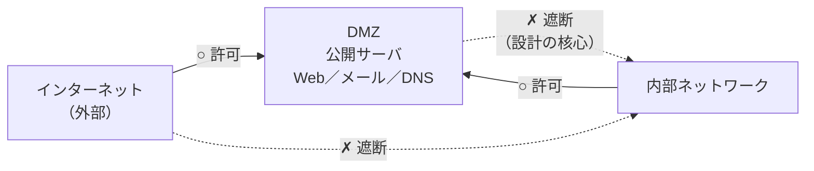

# 5-3 DMZ

重要度：★★☆

## 縮寫展開

| 用語 | 英文全名 | 日文／說明 |
|---|---|---|
| **DMZ** | **DeMilitarized Zone** | **非武装地帯（ひぶそうちたい）** |
| **踏み台** | ふみだい / stepping stone | 被攻陷後用來跳向下一個目標的機器 |
| **公開サーバ** | こうかいサーバ | Web／メール／DNS／プロキシ 等，**必須讓外部存取**的伺服器 |

## DMZ とは

**外部ネットワーク（危険）と内部ネットワーク（安全）の間**に置かれる区画。
名前の由来は**朝鮮半島の 38 度線のような「非武装地帯」——どちらの陣営も踏み込まない緩衝地帯。**

### 通信の可否（考點はこの四行）

| 方向 | 可否 |
|---|---|
| 外部 → **DMZ** | **○** |
| 内部 → **DMZ** | **○** |
| **DMZ → 内部** | **✗ ← 整個設計的重點** |
| 外部 → 内部 | **✗** |

> **「兩邊都能存取」只講對一半。真正的重點是「從 DMZ 進不了內部」。**
> **＝一方通行の扉。**

## なぜ DMZ が必要か——ファイアウォールが1台のときのジレンマ

**公開サーバ 不被外部頻繁存取就沒有意義。** 但擺放的位置只有兩個選擇：

| 置き場所 | 何が起きるか | 犠牲になるもの |
|---|---|---|
| **内部ネットワーク** | FW に「外部→内部」の穴を開けることになる。設定をどれだけ厳密にしても脆弱性は残る。サーバが陥落すれば**攻撃者は既に内部にいる**——**踏み台**にされて内部を横移動される | **内部ネットワークの安全** |
| **ファイアウォールの外** | 外部が内部に入る必要はなくなり内部は安全。しかしサーバは**完全に無防備**——攻撃・重要情報の漏洩 | **サーバ自身の安全** |

> **DMZ は「どちらも選ばない」という答え。**
> **陥落しても構わない場所を用意し、そこに公開サーバを置く。**
> **保住的是內部網路，交出去的是 DMZ 本身。**

## 二つの実装

| 構成 | 中身 |
|---|---|
| **二重ファイアウォール（デュアルファイアウォール）構成** | FW を 2 台直列に置き、**その間**を DMZ にする。サンドイッチ構成とも |
| **1台・3インタフェース構成** | 1 台の FW に**外部／DMZ／内部**の 3 ポートを持たせる。コストが低い |

**どちらでも判断ロジックは同じ**——**「DMZ → 内部」が通らないこと**が本質。

課本說的**「ファイアウォールを通る二つの経路の間に位置する」**，意思是——
**「外部から入ってくる経路」と「内部から出ていく経路」の中間**という意味。

### 二重 FW 構成で何が起きるか

1. 外部可以通過**第 1 道防火牆**存取 DMZ 上的公開サーバ
2. **第2の FW** が「外部」および「DMZ」から内部への通信を遮断する
3. → **公開サーバ 就算被當成踏み台，也到不了內部網路**

## 内部 → 外部 の扱い

**基本構成では、内部から外部／DMZ への通信は一律許可。** 発信元が信頼できる側だから。

### ⚠️ ただし 5-2 の「出口対策」との張力に注意

| | 前提 | 内部 → 外部 |
|---|---|---|
| **DMZ の基本構成** | 内部は清潔である | **一律許可** |
| **出口対策の思想**（→ 5-2） | **内部は既に感染しているかもしれない** | **検査・制限する**（C&C 通信の遮断、プロキシ強制） |

**矛盾ではなく、前提の世代が違う。**
**DMZ の基本構成を問われたら「内部→外部は可」、標的型攻撃対策を問われたら「出口対策が必要」。問われている層が違う。**

## 前因後果

**DMZ 回答的是資安設計上的一個根本矛盾：**

> **「不公開就沒有意義的東西」和「絕對不能被碰的東西」，同時存在於同一個組織裡。**

Web サーバ 要讓全世界都連得到才有價值；顧客資料庫則誰都不能碰。
**この二つを同じ信頼レベルの場所に置くこと自体が間違い**——これが DMZ の出発点。

**所以 DMZ 的本質不是「多蓋了第三道牆」，而是「把信任從兩段變成三段」。**

| | 信頼レベル |
|---|---|
| 外部 | **信頼しない** |
| **DMZ** | **限定的に信頼する（＝失っても構わない）** |
| 内部 | 信頼する |

**この「段階を増やす」という発想が、そのまま先へ延びていく：**

- **5-2 の三層対策（入口・内部・出口）**＝時間軸で段階を増やした
- **パーソナルファイアウォール**＝在每一台終端上增加邊界
- **ゼロトラスト**＝**段階を増やしきった果てに「内部」という特別扱いを廃止した**

> **DMZ は「内部は信頼できる」という前提を保ったまま、例外区画を作る解法。**
> **ゼロトラスト 則是把那個前提整個丟掉的解法。**
> **両者は同じ問いへの、異なる世代の答え。**

**1-9 標的型攻撃との関係**：APT は**内部に入り込んでから数か月かけて横移動する**。
DMZ はその横移動の経路を一本断つが、**メール添付から内部端末が直接感染する経路**には無力——
**だからこそ 5-2 の内部対策・出口対策が別途必要になる。DMZ 一つで完結しない。**

## 待補（考後）

- リバースプロキシ 與 DMZ 的關係
- 踏み台攻撃・ラテラルムーブメント（橫向移動）的詳細
- ゼロトラストアーキテクチャ 的詳細
- 公開サーバの種類ごとの配置（DNS の内外分離など）
