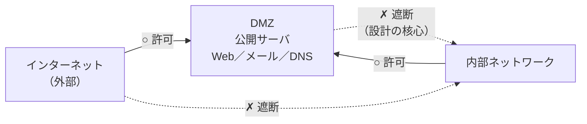

# 5-3 DMZ

重要度：★★☆

> 依導讀順序重寫，不收錄書上原文、原表與練習問題原文。
> **本節依導讀順序分為 ①〜④。**

## 縮寫展開

| 縮寫／外來語 | 英文全名 | 說明 |
|---|---|---|
| **DMZ** | **DeMilitarized Zone** | **非武装地帯（ひぶそうちたい）** |
| **ファイアウォール（FW）** | **firewall** | → 5-2 |
| **デュアルファイアウォール** | **dual firewall** | ＝二重ファイアウォール構成 |
| **インタフェース** | **interface** | 這裡指防火牆的網路埠 |
| **DNS** | **Domain Name System** | 網域名稱系統 |
| **プロキシ** | **proxy** | 代理伺服器（→ 5-8） |
| **C&C** | **Command and Control** | 惡意程式的指揮中心（→ 1-2） |
| **APT** | **Advanced Persistent Threat** | 進階持續性威脅（→ 1-9） |
| **ゼロトラスト** | **zero trust** | → 5-8 |
| **リバースプロキシ** | **reverse proxy** | → 5-8 |
| **ラテラルムーブメント** | **lateral movement** | 橫向移動 |

## 讀音

| 用語 | 讀音 |
|---|---|
| 非武装地帯 | ひぶそうちたい |
| 公開サーバ | こうかいサーバ |
| 踏み台 | ふみだい |
| 陥落 | かんらく |
| 二重 | にじゅう |
| 一方通行 | いっぽうつうこう |
| 横移動 | よこいどう |
| 信頼 | しんらい |

---

## 本節的位置

5-2 的防火牆把世界切成「內」和「外」兩塊。但有一種伺服器卡在中間：Web、郵件、DNS（Domain Name System）這些**必須讓外部連進來才有意義**的伺服器。放內網太危險、放外面又沒保護——本節的 DMZ（DeMilitarized Zone）就是為這個兩難而生。
① 兩難本身 → ② DMZ 的通信規則（考點） → ③ 兩種實作 → ④ 和 5-2 出口対策看似衝突的地方。
DMZ 只處理「放在哪裡」，**通過了 DMZ 規則的通信內容是否有問題，它一樣不管**——那是 5-4 之後的事。

---

## ① 防火牆只有一台時的兩難

**公開サーバ（こうかいサーバ）**＝Web／郵件／DNS／プロキシ等**必須讓外部存取**的伺服器。它不被外部頻繁存取就沒意義，但擺放位置只有兩個選擇：

| 擺放位置 | 會發生什麼 | 犧牲的是 |
|---|---|---|
| **內網** | 防火牆要開一個「外→內」的洞。設定再嚴，伺服器的漏洞還是在。伺服器一旦陥落（かんらく），**攻擊者已經在內網裡**——被當成**踏み台（ふみだい，跳板）**橫向移動 | **內網的安全** |
| **防火牆外面** | 外部不必進內網，內網安全。但伺服器**完全無防備**——被攻擊、重要資訊外洩 | **伺服器本身的安全** |

> **DMZ 的答案是「兩個都不選」。**
> **準備一個「被攻陷也沒關係」的區域，把公開サーバ放在那裡。**
> **保住的是內網，交出去的是 DMZ 本身。**

名字來自**非武装地帯（ひぶそうちたい）**——像朝鮮半島 38 度線那樣，雙方都不進入的緩衝地帶。

---

## ② 通信規則：重點在「DMZ 進不了內網」

考點就是這四行：

| 方向 | 可否 |
|---|---|
| 外部 → **DMZ** | **○** |
| 內部 → **DMZ** | **○** |
| **DMZ → 內部** | **✗ ← 整個設計的重點** |
| 外部 → 內部 | **✗** |

> **「兩邊都能存取 DMZ」只講對一半。真正的重點是「從 DMZ 進不了內網」。**
> **＝一方通行（いっぽうつうこう）的門。**

**自編例**：電商公司的 Web 伺服器放 DMZ，顧客資料庫放內網。Web 伺服器被打下後，攻擊者想從它連資料庫——這一步被擋。（實務上 Web 需要查 DB 時，只開放特定埠、特定來源的例外，其餘照擋。）

---

## ③ 兩種實作

| 構成 | 內容 |
|---|---|
| **二重（にじゅう）ファイアウォール構成**（デュアルファイアウォール，dual firewall） | 兩台防火牆串聯，**兩台之間**就是 DMZ。又稱三明治構成 |
| **1 台・3 インタフェース構成** | 一台防火牆有**外部／DMZ／內部**三個埠（interface）。成本較低 |

**不管哪種，判斷邏輯相同**——本質是**「DMZ → 內部」不通**。

課本描述 DMZ「位在通過防火牆的兩條路徑之間」，意思是：**「從外部進來的路徑」與「從內部出去的路徑」的中間。**

### 二重防火牆構成實際發生什麼

1. 外部可以通過**第 1 道防火牆**存取 DMZ 上的公開サーバ
2. **第 2 道防火牆**遮斷從「外部」和「DMZ」往內網的通信
3. → **公開サーバ就算被當成踏み台，也到不了內網**

---

## ④ 內部 → 外部：和 5-2 出口対策的張力

**基本構成下，內部往外部／DMZ 的通信一律允許**——因為發起端是可信任的一側。

但這看起來和 5-2 的出口対策衝突：

| | 前提 | 內部 → 外部 |
|---|---|---|
| **DMZ 基本構成** | 內部是乾淨的 | **一律允許** |
| **出口対策的想法**（→ 5-2） | **內部可能已經被感染** | **要檢查、限制**（遮斷 C&C 通信、強制走 Proxy） |

> **不是矛盾，是前提的世代不同。**
> **題目問 DMZ 的基本構成 → 「內→外可以」；問標的型攻撃對策 → 「需要出口対策」。問的層次不同。**

---

## 前因後果

- **DMZ 回答的是一個根本矛盾**：「不公開就沒意義的東西」和「絕對不能被碰的東西」同時存在於同一個組織。Web 伺服器要全世界連得到才有價值，顧客資料庫誰都不能碰——**把兩者放在同一信頼（しんらい）等級的地方，本身就是錯的。**
- **DMZ 的本質不是「多一道牆」，而是「信任從兩段變三段」**：

| | 信任等級 |
|---|---|
| 外部 | **不信任** |
| **DMZ** | **有限信任（＝失去也沒關係）** |
| 內部 | 信任 |

- **「增加段數」這個想法一路往後延伸**：5-2 的三層對策是在時間軸上加段；パーソナルファイアウォール是在每台終端加邊界；5-6 VLAN 用交換器在內網切區段；**ゼロトラスト（zero trust）則是加到極致後，乾脆廢除「內部」這個特權。**

> **DMZ 是保留「內部可信」這個前提、另開例外區域的解法；ゼロトラスト是把前提整個丟掉的解法。同一個問題，不同世代的答案。**

- **與 1-9 標的型攻撃的關係**：APT **進入內網後花好幾個月横移動（よこいどう）**。DMZ 切斷了「從公開サーバ往內」這一條路徑，但對**郵件附件讓內部終端直接中毒**這條路徑無效——**所以 5-2 的內部對策、出口対策另外需要，DMZ 一個解決不了全部（多層防御）。**
- **接 5-4**：DMZ 決定了「誰能連到哪裡」，但被允許通過的通信（外部→DMZ）內容和頻率有沒有異常，DMZ 和防火牆一樣看不到——下一節 IDS・IPS 撿起這塊。

## 待補（考後）

- リバースプロキシ 與 DMZ 的關係
- 踏み台攻撃・ラテラルムーブメント（橫向移動）的詳細
- ゼロトラストアーキテクチャ 的詳細
- 公開サーバの種類ごとの配置（DNS の内外分離など）
