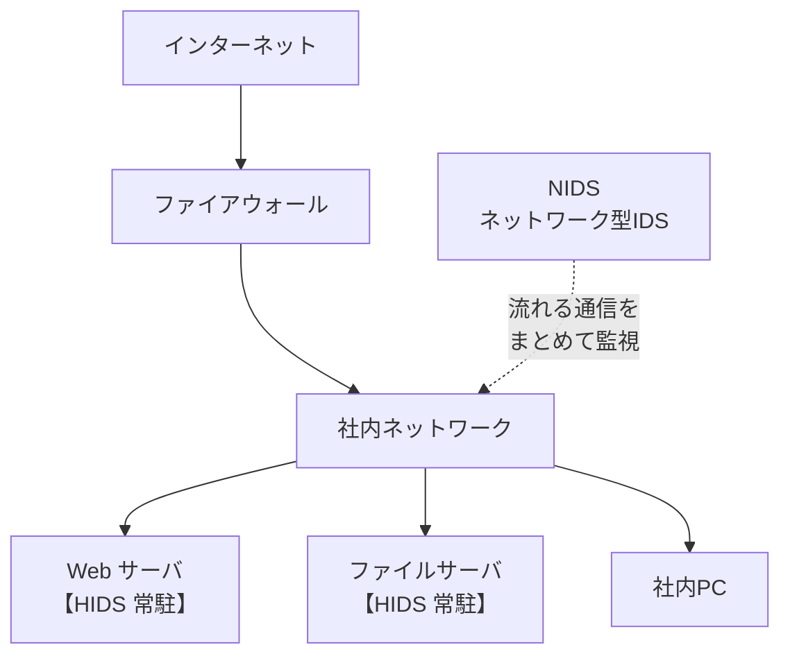

# 5-4 IDS・IPS

重要度：★☆☆

## 縮寫展開

| 縮寫／外來語 | 英文全名 | 日文／說明 |
|---|---|---|
| **IDS** | **Intrusion Detection System** | **侵入検知システム** |
| **IPS** | **Intrusion Prevention System** | **侵入防止システム** |
| **NIDS** | **Network-based Intrusion Detection System** | **ネットワーク型IDS** |
| **HIDS** | **Host-based Intrusion Detection System** | **ホスト型IDS** |
| **NIPS** | **Network-based Intrusion Prevention System** | ネットワーク型IPS |
| **HIPS** | **Host-based Intrusion Prevention System** | ホスト型IPS |
| **ホスト** | **host** | ネットワークに接続された**個々のコンピュータ**（特にサーバ） |
| **インライン** | **inline** | **通信経路上**に配置される形 |
| **ミラーポート** | **mirror port** | 通信を**複製**して渡すポート |
| **フォールスポジティブ** | **false positive** | **偽陽性**（誤検知） |
| **フォールスネガティブ** | **false negative** | **偽陰性**（見逃し） |

## IDS（侵入検知システム）

**即時監視網路或 ホスト**，一旦**發現不正當的存取就通報管理者**。

### 管理者がすること

通報を受けた管理者は——

1. 判斷**這是攻擊已經開始了，還是攻擊的前兆（偵察）**
2. **調整防火牆的 フィルタリング 設定**，讓今後同類的不正當存取被擋掉
   （該当する送信元 IP の遮断、怪しいアクセス経路の閉鎖 など）

### 「融通が効くルール設定が可能」の意味

**融通が効く（ゆうずうがきく）＝ 靈活、有彈性。**

| | 表現できること |
|---|---|
| **ファイアウォール** | 「誰から・どこへ・どのポート → 通す／通さない」**だけ**。ルールが固定的 |
| **IDS** | **パターンや振る舞い**を書ける：接続頻度、パケット内容の特徴、普段と違う通信時間帯 など |

例：**「同一個來源在 10 秒內送了 500 個 SYN」**——**防火牆的規則語法根本寫不出這句話**，但 IDS 寫得出來。

> **これが 5-2 で残した穴をそのまま埋めている。**
> **FW は個々のパケットは見えるが、「このパケット群はまとめて見ると怪しい」が言えない。**

### 二つの型

| | **NIDS（ネットワーク型）** | **HIDS（ホスト型）** |
|---|---|---|
| 放哪 | **ネットワーク上**（一台で一区画を監視） | **各サーバの中にソフトとして常駐** |
| 看什麼 | **流經網路的全部通信** | **そのホストの通信＋ログ＋ファイルの改ざん** |
| 看不到 | **暗号化された通信の中身**、そこを通らないパケット | **他のホストで起きたこと** |

## IPS（侵入防止システム）

**IDS の拡張**。通報に加えて、**攻撃を自動的に防御する**。
和防火牆一樣監視所有通信，**遮斷可疑的通信**。
IDS と同じく **ネットワーク型／ホスト型**に分かれる。

### ⚠️ IPS は「ファイアウォールを自動調整する」のではない

| | **IDS** | **IPS** |
|---|---|---|
| **位置** | **傍ら**——通信を**コピー**して受け取る（**ミラーポート**、パッシブ） | **通信経路上（インライン）**——全パケットが**自分を通過する** |
| できること | **通報のみ** | **その場でパケットを破棄** |
| 遮断するのは誰 | **人／ファイアウォール**（手動でルール調整） | **IPS 自身** |

> **IDS 只拿到副本，正本早就送達了——它想擋也擋不住。**
> **IPS 把自己插在路徑中間，封包沒有 IPS 的許可就過不去。**
>
> **これが両者の最も根本的な違い——「通報か防御か」より正確。**

## 誤検知（ごけんち）

**命名邏輯這樣拆就不會混：**

> **ポジティブ ＝「異常あり」と判定。ネガティブ ＝「異常なし」と判定。**
> **False ＝ その判定が間違っていた。**

| | 判定 | 実際 | 後果 |
|---|---|---|---|
| **フォールスポジティブ**（偽陽性） | 異常あり | **正常** | **正常な業務通信が遮断される** |
| **フォールスネガティブ**（偽陰性） | 異常なし | **異常** | **攻撃を見逃す** |

### 2-10 とまったく同じ構造

| **2-10 生体認証** | **本節** |
|---|---|
| **本人拒否率（FRR／False Rejection Rate）** | **フォールスポジティブ** |
| **他人受入率（FAR／False Acceptance Rate）** | **フォールスネガティブ** |

> **検知を厳しくすると FP が増え、緩めると FN が増える。両方ゼロの設定は存在しない。**

### ⚠️ IPS では FP の代価が跳ね上がる

**IDS の誤検知**＝通報が一件増えるだけ。
**IPS の誤検知**＝**正常な業務通信がその場で切断される**＝業務停止。

> **だから「IPS のほうが上位」とは限らない。**
> **FP のコストを嫌って、あえて IDS だけを置き、判断は人に残す組織もある。**

## 前因後果

**本節は 5-2 が自分で告白した限界への、直接の回答である。**

5-2 的防火牆放棄了兩樣東西——**內容**，以及**「一群封包合起來看的異常」**。
IDS／IPS が拾うのは後者：**一つひとつは正当な通信でも、頻度・順序・量を見れば攻撃と分かる**もの。
**1-6 的 DoS 攻撃、ポートスキャン** 正是這一類，**防火牆的規則語法原理上就寫不出來**。

**そして本節は、Ch2 で見た構造がもう一度現れる場所でもある。**

| | 厳しくすると | 緩めると |
|---|---|---|
| **2-10 生体認証** | 本人が入れない | 他人が入れる |
| **5-4 IDS／IPS** | 業務が止まる | 攻撃が通る |

> **「安全性與便利性無法兩全，能做的只是決定線畫在哪」——從完全不同的產品出發，又回到 2-9、2-10 的同一個結論。**
> **これは偶然ではなく、「判定」という行為そのものが必ず二種類の誤りを持つから。**

**さらに IDS と IPS の選択それ自体が、この線引きの実例になっている：**
**自動で止める（IPS）か、人に判断を残す（IDS）か**——**速さを取るか、誤爆の代価を避けるか。**

**5-1 からの流れで見ると、本節は「判定をやめる」路線ではなく「判定を精密にする」路線の側にいる。**
だからこそ誤検知の問題から逃れられない。
**只要還在做判定，FP 與 FN 就不會消失**——正是這個限界意識，通往後來的 ゼロトラスト 與無害化（ウェブアイソレーション）的思路。

## 待補（考後）

- シグネチャ型 と アノマリ型（異常検知型）の検知方式の違い
- IDS／IPS と WAF の守備範囲の重なり
- SIEM によるログ統合・相関分析 → 5-8 で回填
- ハニーポット との併用
- インライン配置による単一障害点（SPOF）の問題
