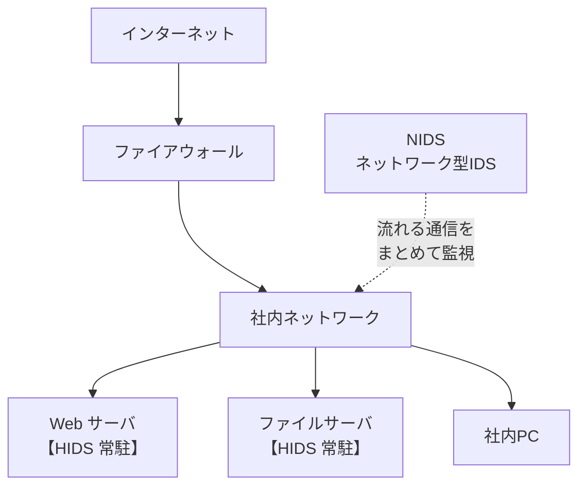

# 5-4 IDS・IPS

重要度：★☆☆

> 依導讀順序重寫，不收錄書上原文、原表與練習問題原文。
> **本節依導讀順序分為 ①〜④。**

## 縮寫展開

| 縮寫／外來語 | 英文全名 | 說明 |
|---|---|---|
| **IDS** | **Intrusion Detection System** | **侵入検知システム** |
| **IPS** | **Intrusion Prevention System** | **侵入防止システム** |
| **NIDS** | **Network-based Intrusion Detection System** | ネットワーク型 IDS |
| **HIDS** | **Host-based Intrusion Detection System** | ホスト型 IDS |
| **NIPS** | **Network-based Intrusion Prevention System** | ネットワーク型 IPS |
| **HIPS** | **Host-based Intrusion Prevention System** | ホスト型 IPS |
| **ホスト** | **host** | 連上網路的**個別電腦**（特別指伺服器） |
| **インライン** | **inline** | 放在**通信路徑上**的配置 |
| **パッシブ** | **passive** | 被動，只接收副本 |
| **ミラーポート** | **mirror port** | **複製**通信送出的埠 |
| **フォールスポジティブ（FP）** | **false positive** | **偽陽性**（誤判為異常） |
| **フォールスネガティブ（FN）** | **false negative** | **偽陰性**（漏判） |
| **FRR** | **False Rejection Rate** | 本人拒否率（→ 2-10） |
| **FAR** | **False Acceptance Rate** | 他人受入率（→ 2-10） |
| **SYN** | **synchronize** | TCP 建立連線的旗標 |
| **DoS** | **Denial of Service** | 阻斷服務攻擊（→ 1-6） |
| **ポートスキャン** | **port scan** | 掃描開著哪些埠（→ 1-6） |
| **SQL インジェクション** | **SQL（Structured Query Language）injection** | → 1-8、5-5 |
| **SIEM** | **Security Information and Event Management** | → 5-8 |
| **SPOF** | **Single Point Of Failure** | 單點故障 |
| **シグネチャ型／アノマリ型** | **signature-based／anomaly-based** | 比對已知特徵／偵測偏離平常 |

## 讀音

| 用語 | 讀音 |
|---|---|
| 侵入検知 | しんにゅうけんち |
| 侵入防止 | しんにゅうぼうし |
| 融通が効く | ゆうずうがきく |
| 前兆 | ぜんちょう |
| 常駐 | じょうちゅう |
| 改ざん | かいざん |
| 誤検知 | ごけんち |
| 見逃し | みのがし |
| 偽陽性／偽陰性 | ぎようせい／ぎいんせい |

---

## 本節的位置

5-2 的防火牆一次只看一個封包的ヘッダ，5-3 的 DMZ 只決定誰能連到哪個區域。兩者都看不到一種攻擊：**每個封包單獨看都正當，合起來看才是攻擊**——例如 1-6 的 DoS（Denial of Service）攻擊、ポートスキャン（port scan）。本節的 IDS／IPS 撿起這一塊。
① IDS 能寫出防火牆寫不出的規則 → ② NIDS 與 HIDS → ③ IPS 和 IDS 的根本差別在「位置」 → ④ 判定必帶的兩種誤判。

---

## ① IDS：抓「一群封包」的異常

**IDS（侵入検知（しんにゅうけんち）システム）**＝**即時監視網路或ホスト（host）**，發現不正當的存取就**通報管理者**。

### 管理者收到通報後做什麼

1. 判斷**攻擊已經開始，還是攻擊的前兆（ぜんちょう，偵察）**
2. **調整防火牆的過濾設定**，讓之後同類的不正當存取被擋下（遮斷該來源 IP、關閉可疑的存取路徑等）

### 「融通が効く（ゆうずうがきく）規則設定」是什麼意思

融通が効く＝靈活、有彈性。對照防火牆：

| | 能表達的規則 |
|---|---|
| **防火牆** | 只有「誰、到哪、哪個埠 → 放行／不放行」，規則固定 |
| **IDS** | 能寫**模式與行為**：連線頻率、封包內容特徵、不尋常的通信時段等 |

**自編例**：「**同一個來源在 10 秒內送了 500 個 SYN**」——**防火牆的規則語法根本寫不出這句話**，IDS 寫得出來。

> **這直接填上 5-2 留下的洞：防火牆看得到每一個封包，但說不出「這群封包合起來看很可疑」。**

---

## ② 放在哪：NIDS vs HIDS

| | **NIDS（ネットワーク型）** | **HIDS（ホスト型）** |
|---|---|---|
| 放哪 | **網路上**（一台監視一個區段） | **以軟體常駐（じょうちゅう）在每台伺服器裡** |
| 看什麼 | **流經網路的所有通信** | **該主機的通信＋日誌＋檔案改ざん（かいざん）** |
| 看不到 | **加密通信的內容**、沒經過它的封包 | **其他主機上發生的事** |

---

## ③ IPS：差別在「站在哪裡」

**IPS（侵入防止（しんにゅうぼうし）システム）**＝IDS 的擴充：除了通報，還會**自動防禦攻擊**。和防火牆一樣監視所有通信，**遮斷可疑通信**。也分ネットワーク型／ホスト型。

### ⚠️ IPS 不是「自動調整防火牆」

| | **IDS** | **IPS** |
|---|---|---|
| **位置** | **旁邊**——從**ミラーポート（mirror port）**拿通信的**副本**（パッシブ，passive） | **通信路徑上（インライン，inline）**——所有封包**都要經過它** |
| 能做的 | **只能通報** | **當場丟棄封包** |
| 誰來遮斷 | **人／防火牆**（手動調規則） | **IPS 自己** |

> **IDS 拿到的只是副本，正本早就送到了——它想擋也擋不住。**
> **IPS 把自己插在路徑中間，沒有它放行，封包就過不去。**
> **這是兩者最根本的差異，比「通報還是防禦」更精確。**

**自編例**：IDS 像大樓保全看監視器，發現可疑人物只能打電話叫人；IPS 像站在門口的保全，直接把人攔下。

---

## ④ 誤検知：判定必帶的兩種錯

### 命名這樣拆就不會混

> **ポジティブ＝判定「有異常」；ネガティブ＝判定「沒異常」。**
> **False＝那個判定錯了。**

| | 判定 | 實際 | 後果 |
|---|---|---|---|
| **フォールスポジティブ**（偽陽性（ぎようせい），誤検知（ごけんち）） | 有異常 | **正常** | **正常業務通信被遮斷** |
| **フォールスネガティブ**（偽陰性（ぎいんせい），見逃し（みのがし）） | 沒異常 | **異常** | **漏掉攻擊** |

### 和 2-10 完全同構

| **2-10 生体認証** | **本節** |
|---|---|
| **本人拒否率（FRR，False Rejection Rate）** | **フォールスポジティブ** |
| **他人受入率（FAR，False Acceptance Rate）** | **フォールスネガティブ** |

> **偵測調嚴，FP 增加；調鬆，FN 增加。兩者同時為零的設定不存在。**

### ⚠️ 在 IPS 上，FP 的代價暴增

- **IDS 誤判**＝多一封通報而已
- **IPS 誤判**＝**正常業務通信當場被切斷**＝業務停擺

> **所以「IPS 比較高級」不一定成立。**
> **有些組織嫌 FP 代價太高，刻意只放 IDS，把判斷留給人。**

---

## 前因後果

- **本節直接回答 5-2 自己承認的限界**：防火牆放棄了「內容」和「一群封包合起來看的異常」，IDS／IPS 撿的是後者——**每一個都正當，看頻率、順序、量才知道是攻擊。**1-6 的 DoS、ポートスキャン正是這類，**防火牆的規則語法原理上寫不出來**。
- **Ch2 的結構再一次出現（安全性 vs 利便性取捨）**：

| | 調嚴 | 調鬆 |
|---|---|---|
| **2-10 生体認証** | 本人進不去 | 別人進得去 |
| **5-4 IDS／IPS** | 業務停擺 | 攻擊通過 |

> **「安全性與便利性無法兩全，只能決定線畫在哪」——從完全不同的產品出發，又回到 2-9、2-10 的同一個結論。這不是巧合，「判定」這個動作本身就一定帶兩種錯。**

- **選 IDS 還是 IPS，本身就是畫線的實例**：自動擋（IPS）還是留給人判斷（IDS）——要速度，還是避開誤擋的代價（検知 vs 防止）。
- **從 5-1 的脈絡看，本節站在「把判定做得更精密」那一邊，不是「不再判定」那一邊**，所以逃不掉誤判。**只要還在判定，FP 與 FN 就不會消失**——這個限界意識，通往ゼロトラスト和無害化（ウェブアイソレーション）的思路。
- **接 5-5**：IDS／IPS 讀得到封包內容，但讀不懂 Web 應用程式的「語意」——SQL インジェクション藏在表單欄位裡時，它分不出來。下一節 WAF 撿最後這一塊。

## 待補（考後）

- シグネチャ型 と アノマリ型（異常検知型）の検知方式の違い
- IDS／IPS と WAF の守備範囲の重なり
- SIEM によるログ統合・相関分析 → 5-8 で回填
- ハニーポット との併用
- インライン配置による単一障害点（SPOF）の問題
