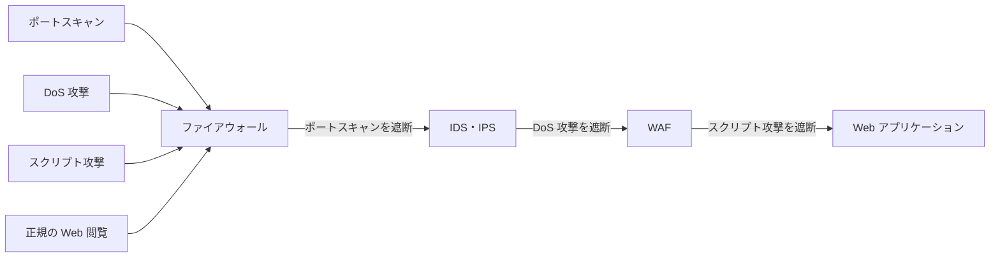
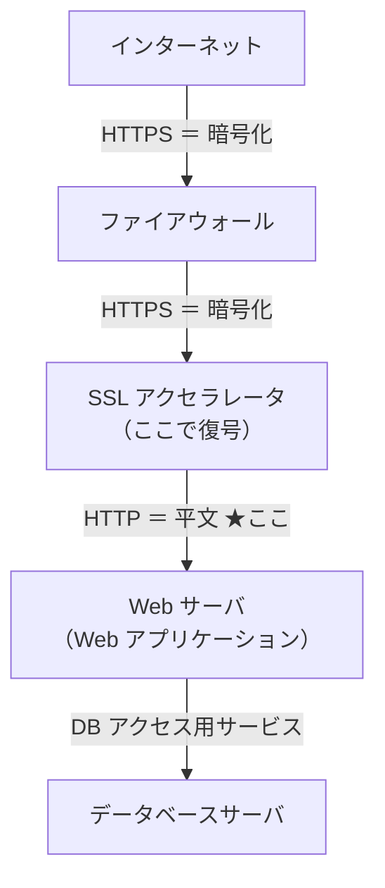

# 5-5 WAF

重要度：★★☆

> 依導讀順序重寫，不收錄書上原文、原表與練習問題原文。
> **本節依導讀順序分為 ①〜⑤。**

## 縮寫展開

| 縮寫／外來語 | 英文全名 | 說明 |
|---|---|---|
| **WAF** | **Web Application Firewall** | Web 應用程式專用的防禦產品 |
| **ファイアウォール** | **firewall** | → 5-2 |
| **IDS／IPS** | **Intrusion Detection／Prevention System** | → 5-4 |
| **Web アプリケーション** | **web application** | 網站背後的程式 |
| **スクリプト攻撃** | **script attack** | SQL インジェクション、XSS 等（→ 1-8） |
| **SQL インジェクション** | **SQL（Structured Query Language）injection** | 把 SQL 語句塞進輸入欄位 |
| **XSS** | **Cross-Site Scripting** | 跨站腳本 |
| **HTTP／HTTPS** | **HyperText Transfer Protocol（Secure）** | 網頁通信協定／加密版 |
| **URL** | **Uniform Resource Locator** | 網址 |
| **POST** | **POST method** | HTTP 送出表單資料的方式 |
| **クッキー（Cookie）** | **cookie** | 瀏覽器保存的小資料 |
| **SSL／TLS** | **Secure Sockets Layer／Transport Layer Security** | 通信加密協定（→ 5-8） |
| **SSL アクセラレータ** | **SSL accelerator** | 代替伺服器做加解密的裝置（→ 5-8） |
| **EC サイト** | **e-commerce site** | 電商網站 |
| **ゼロデイ攻撃** | **zero-day attack** | → 1-10 |
| **ライブラリ** | **library** | 外部函式庫 |
| **PCI DSS** | **Payment Card Industry Data Security Standard** | 信用卡業界資安標準 |
| **ミドルウェア** | **middleware** | OS 與應用程式之間的軟體 |
| **CDN** | **Content Delivery Network** | 內容傳遞網路 |
| **エスケープ処理／プレースホルダ** | **escape processing／placeholder** | 1-8 的根本對策（要改程式碼） |
| **OWASP** | **Open Worldwide Application Security Project** | Web 應用資安社群 |

## 讀音

| 用語 | 讀音 |
|---|---|
| 脆弱性 | ぜいじゃくせい |
| 根本的対策 | こんぽんてきたいさく |
| 緩和策 | かんわさく |
| 暫定対策 | ざんていたいさく |
| 多層防御 | たそうぼうぎょ |
| 通販（通信販売） | つうはん（つうしんはんばい） |
| 復号 | ふくごう |
| 平文 | ひらぶん |
| 情報流出 | じょうほうりゅうしゅつ |
| 誤検知 | ごけんち |

---

## 本節的位置

5-2 防火牆放棄了「內容」和「封包群的異常」，5-4 IDS・IPS 撿起了封包群的異常，也讀得到封包內容——但它讀不懂 **Web 應用程式的語意**：表單欄位裡塞了一段 SQL，在它眼中只是一串普通文字。本節的 WAF（Web Application Firewall）撿起 5-2 放棄清單的最後一塊。
① WAF 為什麼存在、它的定位 → ② 三種產品的分工 → ③ WAF 放在哪（頻出設計題） → ④ 能做的事 → ⑤ 代價。

---

## ① 為什麼需要 WAF：根本對策做不完

**WAF＝針對 Web アプリケーション（web application）攻擊的特化型防禦產品。**

照理說，Web 應用程式的脆弱性（ぜいじゃくせい）應該由開發者修原始碼。但現實是程式碼龐大、外包、舊系統、改了會壞——**修不完，也來不及修。**

> **WAF 是「緩和策（かんわさく，暫定対策（ざんていたいさく））」，不是根本的対策（こんぽんてきたいさく）。**
> **它不修漏洞，只是讓攻擊打不進那個漏洞。**

**考題愛問的判斷**：問「根本的対策」→ 答「**修正脆弱性**」；問「立即能採取的對策」→ 答「**導入 WAF**」。

### ⚠️ 但「緩和策」不等於「臨時的」

**程式碼修好後，WAF 也不會被拆掉。** 「不是根本對策」講的是**優先順序**，不是說它是暫時的鷹架。

| 為什麼永久保留 | 說明 |
|---|---|
| **ゼロデイ攻撃**（→ 1-10） | 新漏洞天天被發現，修正永遠落後於揭露 |
| **外部ライブラリ（library）的脆弱性** | 自己的程式沒問題，用的函式庫有洞 |
| **多層防御（たそうぼうぎょ，defense in depth）** | 資安基本原則：不依賴單一防線 |
| **合規要求** | PCI DSS（Payment Card Industry Data Security Standard）等規範直接要求電商要有 WAF |

> **WAF 的角色會從「緊急補洞」變成「保險」，但不會消失。**

---

## ② 三種產品的分工

### 誰擋什麼

| | 看什麼 | 擋得住 | 擋不住 |
|---|---|---|---|
| **防火牆** | **只看ヘッダ**（IP、埠號、方向） | **ポートスキャン**、往不該去的目的地的通信 | **外形是正規通信的** DoS 攻擊、スクリプト攻撃 |
| **IDS・IPS** | ヘッダ **＋ 通信內容** | **DoS 攻擊**、打 OS 漏洞的攻擊、打檔案共用服務的攻擊 | 打 Web 應用自身邏輯的攻擊 |
| **WAF** | **HTTP 請求的「語意」** | **スクリプト攻撃**（SQL インジェクション、XSS）、**應用程式的資訊外流** | — |

（ポートスキャン在這裡列給防火牆，意思是：沒開放的埠一律不回應，掃描什麼也拿不到。若要**認出**「這是一次掃描」並通報，那是 5-4 IDS 的模式偵測。）

### ⚠️ 「讀內容」的精度差

**IDS／IPS 也讀內容。** 差別在**讀得懂到哪個層次**：

> **IDS／IPS 讀的是「封包的內容」，WAF 讀的是「HTTP 請求的語意」。**
> WAF 知道哪一段是 **URL 參數**、哪一段是 **POST 資料**、哪一段是 **Cookie**，
> 所以才判斷得出「**這個參數欄位裡塞了 SQL 語句**」。

IDS／IPS 擅長 OS・ミドルウェア（middleware）・網路層級的攻擊；Web 應用自身的邏輯漏洞，它看不懂。

### 層層過濾

**讀法：每一層擋掉自己負責的那種，其餘往下傳。只有「正規的 Web 瀏覽」四層全過，抵達應用程式。**

> **三個產品不是互相取代，是分工，疊起來才完整。**
> **越下層看得越細，但也越慢——所以不能把全部工作都丟給 WAF。**

---

## ③ WAF 放在哪（頻出設計題）

**前提**：這裡的 WAF **本身沒有加解密通信的功能**（題目會明講）。

典型構成（自行重繪）：

### 判斷原則只有兩條

> **① 通信必須已經「復号（ふくごう，解密）之後」——加密著就讀不到內容。**
> **② 必須在 Web 應用程式「處理之前」——處理完才檢查就太遲。**
> **同時滿足兩條的區間只有一個。**

| 位置 | 判定 | 理由 |
|---|---|---|
| 網際網路〜防火牆 | **✗** | **還是 HTTPS，加密著讀不到** |
| 防火牆〜SSL アクセラレータ | **✗** | 同上，**還沒解密** |
| **SSL アクセラレータ〜Web 伺服器** | **○** | **已解密（HTTP，平文（ひらぶん））＋應用程式處理前** |
| Web 伺服器〜資料庫伺服器 | **✗** | **應用程式已經處理完**，對漏洞來說太遲 |

### 為什麼這題很本質

**這題就是把本節核心（WAF 讀的是 HTTP 請求的語意）直接變成設計問題。**

> **要讀懂語意就必須是明文 → WAF 只能放在「解密之後」。**
> **它要保護的是應用程式本身 → 必須放在「應用程式之前」。**
> **兩個約束把位置壓到只剩一處。**

**SSL アクセラレータ（SSL accelerator）**＝**專門代替伺服器處理 SSL／TLS 加解密的裝置**。原本目的是**減輕 Web 伺服器負荷**，結果**畫出了一條「從這裡開始是明文」的界線**——**WAF 的位置跟著那條線決定。**（實務上這個位置常就是リバースプロキシ → 5-8。）

---

## ④ WAF 能做的兩件事

| | 內容 |
|---|---|
| **擋外部打進應用程式的攻擊** | スクリプト攻撃等 |
| **擋應用程式往外的情報流出（じょうほうりゅうしゅつ）** | 回應內容出現信用卡號等模式時攔下（**出口対策**的一種 → 5-2） |

---

## ⑤ 代價

| 缺點 | 說明 |
|---|---|
| **處理時間增加** | 每個請求都要解析內容 |
| **Web 伺服器負荷** | 額外的運算成本 |
| **誤検知（ごけんち）（→ 5-4）** | **フォールスポジティブ（false positive）＝正常訂單被擋** ＝ 電商直接損失營收 |

**最後一項在 WAF 上特別致命**：WAF 通常擺在**營收發生的路徑上**，**擋錯一筆訂單就是真金白銀的損失**。所以導入初期常先用「**只偵測、不遮斷**」模式運行，觀察一段時間再開啟遮斷。

**自編例**：網購通販（つうはん）網站的商品評論欄允許使用者輸入 `<b>` 標籤，WAF 一開遮斷就把大量正常評論當 XSS 擋掉——這就是先跑偵測模式、調好規則再上線的理由。

---

## 前因後果

- **本節是 Ch5 前半的收束點，也是 5-2「放棄清單」的最後一項：**

| 節 | 放棄了什麼／撿起什麼 |
|---|---|
| **5-2 防火牆** | 放棄內容、封包群的異常 |
| **5-3 DMZ** | 處理「公開伺服器放哪」，內容一樣不看 |
| **5-4 IDS・IPS** | 撿起封包群的異常，但看不懂應用邏輯 |
| **5-5 WAF** | **撿起最後一塊：應用層的語意** |

> **看得越細，擋得越準，但也越慢、越貴、越容易誤擋。**
> **所以把它們串成一列，粗的在前面先篩掉大量垃圾，細的只處理剩下的少數（多層防御）。**

這是效率上的必然，不是誰比較強。把所有通信都丟給 WAF 做語意解析，Web 伺服器會先被自己的防禦壓垮。（「看得越細越慢」的根本原因 → 5-6 OSI 分層。）
- **與 1-8 對照**：1-8 給 SQL インジェクション、XSS 的對策是**エスケープ処理、プレースホルダ、入力值驗證**——**全部要改程式碼**。本節給的是**不改程式碼的版本**。

> **兩者不是替代關係：根本對策是修程式，WAF 是在那之外多一層保險。**
> **題目出現「根本的」三個字，答案一定是修正脆弱性，不會是 WAF。**

- **到這裡為止的限界**：5-2〜5-5 全都還是「在邊界判定」。進了內網之後、或連上網路的那台終端本身有沒有問題，要到 5-6 VLAN、5-8 EDR／検疫ネットワーク才處理。

## 待補（考後）

- WAF 的導入形態（ソフトウェア型／アプライアンス型／クラウド型）
- ブラックリスト方式／ホワイトリスト方式 の WAF 設定
- WAF と CDN の併用
- SSL アクセラレータ（SSL accelerator）／SSL インスペクション（SSL inspection）的細節
- OWASP Top 10 との対応
- 導入 WAF 造成延遲的實測數據（超出考試範圍，考試只會定性地問「處理時間會增加」）
