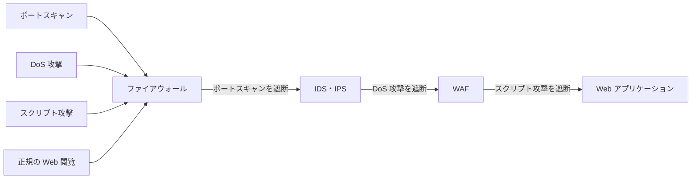
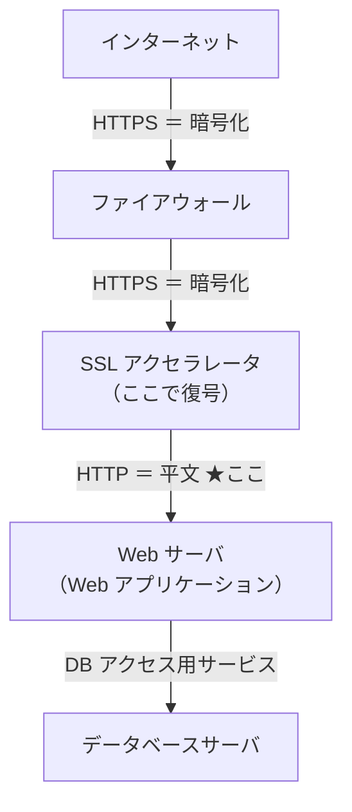

# 5-5 WAF

重要度：★★☆

## 縮寫展開

| 縮寫／外來語 | 英文全名 | 日文／說明 |
|---|---|---|
| **WAF** | **Web Application Firewall** | Web アプリケーション専用の防御製品 |
| **ファイアウォール** | **firewall** | → 5-2 |
| **IDS／IPS** | **Intrusion Detection / Prevention System** | → 5-4 |
| **Web通販** | つうはん（通信販売） | **網購、電商（EC サイト）** |
| **スクリプト攻撃** | script attack | SQL インジェクション、XSS 等（→ 1-8） |

## WAF とは

**針對 Web アプリケーション 的攻擊做防禦的特化型產品。**

### 為什麼需要它——根本對策做不完

**照理說，Web アプリケーション 的脆弱性應該由開發者修正原始碼。**
但現實是：程式碼量龐大、外包、舊系統、改了會壞——**修不完，也來不及修。**

> **WAF 是「緩和策（暫定對策）」，不是根本對策。**
> **它不修漏洞，只是讓攻擊打不進那個漏洞。**

這是考題愛問的觀點：**問「根本的な対策」→ 答「脆弱性の修正」；問「即座に講じる対策」→ 答「WAF の導入」。**

### ⚠️ 但「緩和策」不等於「臨時的」

**程式碼修好之後，WAF 也不會被移除。** 「不是根本對策」講的是**優先順序**，不是說它是暫時的鷹架。

| 為什麼永久保留 | 說明 |
|---|---|
| **ゼロデイ攻撃**（→ 1-10） | 新漏洞天天被發現，修正永遠落後於揭露 |
| **外部函式庫的脆弱性** | 自己的程式沒問題，用的 library 有洞 |
| **多層防御（defense in depth）** | 資安基本原則：不依賴單一防線 |
| **合規要求** | PCI DSS 等規範直接要求電商必須有 WAF |

> **WAF 的角色會從「緊急補洞」變成「保險」，但不會消失。**

## 三つの製品の守備範囲（核心比較）

| | 看什麼 | 擋得住 | 擋不住 |
|---|---|---|---|
| **ファイアウォール** | **ヘッダ のみ**（IP アドレス、ポート番号、方向） | **ポートスキャン**、不正なあて先への通信 | **正規の通信の形をした** DoS 攻撃、スクリプト攻撃 |
| **IDS・IPS** | ヘッダ **＋ 通信内容** | **DoS 攻撃**、OS の脆弱性を突く攻撃、ファイル共有サービスへの攻撃 | Web アプリ固有のロジックを突く攻撃 |
| **WAF** | **HTTP リクエストの「意味」** | **スクリプト攻撃**（SQL インジェクション、XSS）、**アプリからの情報流出** | — |

### ⚠️ 「内容を読む」の精度差

**IDS/IPS も内容は読む。** 差別在**讀得懂什麼層次**：

> **IDS/IPS 讀的是「封包的內容」，WAF 讀的是「HTTP 請求的語意」。**
> WAF 知道哪一段是 **URL 參數**、哪一段是 **POST 資料**、哪一段是 **Cookie**，
> 所以才判斷得出「**這個參數欄位裡塞了 SQL 語句**」。

**IDS/IPS 擅長的是 OS・ミドルウェア・ネットワーク 層級的攻擊；Web 應用自身的邏輯漏洞，它看不懂。**

## 攻撃と防御層の対応

**讀法：每一層擋掉自己負責的那一種，剩下的往下傳。只有「正規の Web 閲覧」四層全過，抵達應用程式。**

> **三個產品不是互相取代，是分工。層層疊起來才完整。**
> **越下層看得越細，但也越慢——所以不能把全部工作都丟給 WAF。**

## WAF をどこに置くか（頻出の設計問題）

**前提**：這裡討論的 WAF **本身沒有加密／解密通信的功能**（考題會明講這個前提）。

典型的構成（此圖為自行重繪）：

### 判斷原則（只有兩個條件）

> **① 通信が「復号された後」であること——暗号化されたままでは中身が読めない。**
> **② Web アプリケーションが「処理する前」であること——処理後では手遅れ。**
>
> **この二つを同時に満たす区間は一つしかない。**

| 位置 | 判定 | 理由 |
|---|---|---|
| インターネット〜ファイアウォール間 | **✗** | **HTTPS のまま。暗号化されていて内容が読めない** |
| ファイアウォール〜SSL アクセラレータ間 | **✗** | 同上、**まだ復号されていない** |
| **SSL アクセラレータ〜Web サーバ間** | **○** | **復号済み（HTTP）＋ アプリが処理する前** |
| Web サーバ〜データベースサーバ間 | **✗** | **アプリの処理が既に終わった後**。脆弱性対策として遅い |

### 為什麼這個配置問題很本質

**這題就是把本節的核心（WAF 讀的是 HTTP 請求的「語意」）直接變成一個設計問題。**

> **要讀懂語意就必須是明文，所以 WAF 只能放在「解密之後」。**
> **而它要保護的對象就是應用程式本身，所以必須放在「應用程式之前」。**

**這兩個約束把可放的位置壓縮到只剩一處。**

**SSL アクセラレータ**＝**專門代替伺服器處理 SSL／TLS 加解密的裝置**。
它原本的目的是**減輕 Web 伺服器的負荷**，但結果是**造出了一條「從這裡開始是明文」的界線**——**WAF 的位置是跟著那條界線決定的。**

## WAF ができること

| | 內容 |
|---|---|
| **外部からアプリへの攻撃を防ぐ** | スクリプト攻撃 など |
| **アプリからの情報流出を防ぐ** | 回應內容裡出現信用卡號等模式時攔下（**出口対策**的一種 → 5-2） |

## デメリット

| 缺點 | 說明 |
|---|---|
| **処理時間が増える** | 每個請求都要解析內容 |
| **Web サーバへの負荷** | 額外的運算成本 |
| **誤検知（→ 5-4）** | **フォールスポジティブ ＝ 正常的訂單被擋掉** ＝ 電商直接損失營收 |

**最後一項在 WAF 上特別致命**：WAF 通常擺在**營收發生的路徑上**。
**擋錯一筆訂單就是真金白銀的損失**——所以 WAF 導入初期常先以「**検知のみ・遮断しない**」模式運行，觀察一段時間再開啟遮斷。

## 前因後果

**本節是 Ch5 前四節的收束點，也是 5-2 那份「放棄清單」的最後一項。**

回顧這條線：

| 節 | 放棄了什麼 | 誰來撿 |
|---|---|---|
| **5-2 ファイアウォール** | 內容、封包群的異常 | ↓ |
| **5-4 IDS・IPS** | 撿起「封包群的異常」，但看不懂應用邏輯 | ↓ |
| **5-5 WAF** | **撿起最後一塊：應用層的語意** | — |

**三者的關係可以用一句話概括：**

> **看得越細，擋得越準，但也越慢、越貴、越容易誤擋。**
> **所以把它們串成一列，讓粗的擋在前面先篩掉大量垃圾，細的只處理活下來的少數。**

**這是效率上的必然，不是誰比較強。** 如果把所有通信都丟給 WAF 做語意解析，Web 伺服器會先被自己的防禦壓垮。

### 與 1-8 的對照

1-8 的 **SQL インジェクション、XSS** 當時給的對策是「**エスケープ処理、プレースホルダ、入力値検証**」——**全部都是要改程式碼的。**
本節給的是**不改程式碼的版本**。

> **兩者不是替代關係：根本對策是修程式，WAF 是在那之外多一層保險。**
> **考題只要出現「根本的」三個字，答案就一定是修正脆弱性，不會是 WAF。**

## 待補（考後）

- WAF 的導入形態（ソフトウェア型／アプライアンス型／クラウド型）
- ブラックリスト方式／ホワイトリスト方式 の WAF 設定
- WAF と CDN の併用
- SSL アクセラレータ／SSL インスペクション の詳細
- OWASP Top 10 との対応
- WAF 導入による遅延の実測（試験範囲外。定性的に「処理時間が増える」とだけ問われる）
