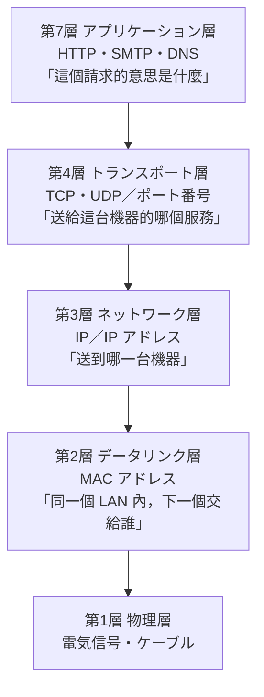
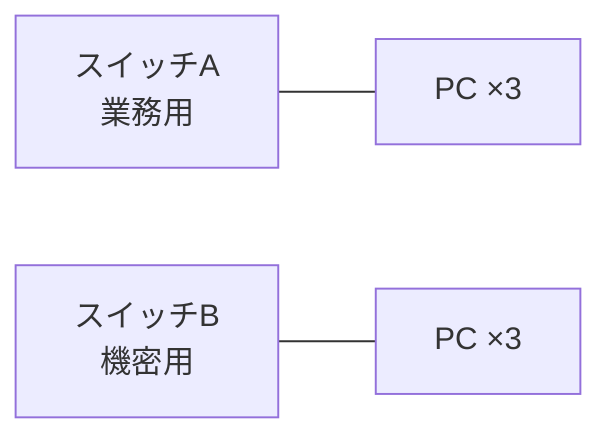
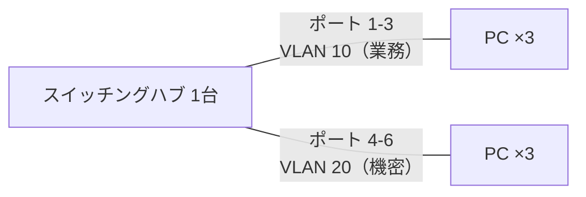
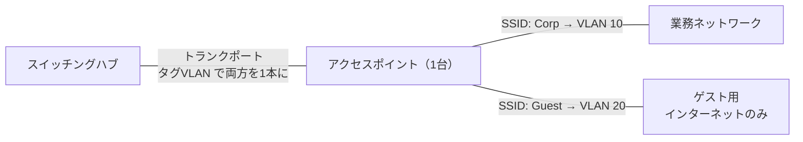

# 5-6 VPN・VLAN

重要度：★☆☆（但本節牽涉的網路基礎會在 Ch7 再出現）

## 縮寫展開

| 縮寫／外來語 | 英文全名 | 日文／說明 |
|---|---|---|
| **VPN** | **Virtual Private Network** | **仮想専用線**／仮想的な専用回線網 |
| **VLAN** | **Virtual LAN** | **仮想 LAN** |
| **LAN** | **Local Area Network** | 構内網路 |
| **公衆回線** | こうしゅうかいせん | 公眾線路（＝網際網路） |
| **専用線** | せんようせん | 獨佔的實體線路 |
| **スイッチングハブ** | **switching hub** | ＝**L2 スイッチ** |
| **リピータハブ** | **repeater hub** | 舊式集線器 |
| **MAC アドレス** | **Media Access Control address** | 網卡固有的位址 |
| **トランクポート** | **trunk port** | 同時承載多個 VLAN 的埠 |
| **SSID** | **Service Set Identifier** | 無線網路的名稱 |
| **AP** | **Access Point** | アクセスポイント |
| **RADIUS** | **Remote Authentication Dial In User Service** | 認證伺服器的協定 |
| **MDM** | **Mobile Device Management** | 行動裝置管理 |
| **EAP** | **Extensible Authentication Protocol** | 802.1X 使用的認證框架 |
| **OSI 参照モデル** | **Open Systems Interconnection** | 網路的七層模型 |

---

# VPN

**經由網路構成的「仮想の専用回線網」。**

**網際網路是 公衆回線（こうしゅうかいせん）**，通信通常不加密，**很容易被竊聽（→ 1-4 スニッフィング）**。
VPN 把通信**整個加密**，讓第三者無法竊聽；**同時包含認証技術**，所以也無法 なりすまし（→ 1-5）。

> **開 VPN 會變慢，主因通常不是加密，是「繞路」。**
> 加解密現在很快；真正的成本是流量要先跑到 VPN 伺服器再出去。**連冰島的節點，封包就真的跑去冰島。**

## 三種線路的比較

| | **専用線** | **IP-VPN** | **インターネットVPN** |
|---|---|---|---|
| 實體 | **完全獨佔的一條線** | **通信事業者的閉域網，多家共用** | **公衆回線** |
| 隔離方式 | 物理上就是分開的 | **邏輯上分開** | **靠加密** |
| 費用 | **最貴** | 中 | **最便宜** |
| 品質 | 最穩 | 穩 | **不安定** |
| 典型用途 | — | **企業據點之間** | 到處都能用 |

**IP-VPN 的定位是「用共用的基礎設施，做出接近專用線的效果」。**
不需為每個客戶拉實體線路所以便宜，又因為不走公開網際網路，品質仍然可控。

> **記法：専用線＝自己的路；IP-VPN＝公司內部的專用車道；インターネットVPN＝在公路上開一台有色玻璃的車。**

## ⚠️ 兩條互相獨立的軸（最常混淆的地方）

**軸① 走在什麼線路上** → 就是上面那張表（インターネットVPN／IP-VPN）

**軸② 誰連到誰**

| | 內容 |
|---|---|
| **拠点間接続（LAN 間接続）** | 東京分公司 ←→ 大阪分公司，**網路對網路** |
| **リモートアクセス** | **個人的一台電腦** → 公司內網 |

**兩個軸可以自由組合。** 常見的誤解是把「FortiClient 這種遠端連線軟體」跟「NordVPN 這種消費者服務」拿來跟 IP-VPN 比較——**前兩者是軸②的東西，IP-VPN 是軸①的東西。**

| 例 | 屬於 |
|---|---|
| 消費者 VPN 服務 | 機制上是 **インターネットVPN**，但目的是隱藏來源、繞地區限制 |
| 企業的遠端連線用戶端 | **リモートアクセスVPN**（軸②），底下通常跑 インターネットVPN |
| **IP-VPN** | **只能在有拉線的據點之間用**——不可能「從任何地方連」 |

## リモートアクセス 為什麼不穩

**前提就是「人在任何地方」**——家裡、咖啡廳、飯店、手機網路。**你不可能在每個咖啡廳拉一條閉域線路進來**，所以只能走公衆回線。

不穩的來源有三層，由近到遠：

| 來源 | 說明 |
|---|---|
| **自己這端的最後一哩** | 家裡 Wi-Fi、行動網路——**通常是最弱的一環** |
| **公衆回線** | 沒有任何人保證頻寬 |
| **VPN 閘道本身** | **全公司的人都擠進同一個入口** |

> **VPN 閘道是個集中點，而集中點同時是效能瓶頸和單點故障（SPOF）。**
> **這也是 ゼロトラスト 被推動的理由之一——不再把所有人繞進同一個入口。**

---

# 【前提知識】網路的「層」與各種機器

> **這段屬於 Ch7 テクノロジ系，先寫在這裡。讀到 Ch7 時再整合。**

## OSI 参照モデル

網路通信是**分層**的，每一層只管自己的事，把剩下的交給下一層。

（第 5・6 層在 SG 幾乎不考。）

## 各機器「看得到第幾層」

| 機器 | 看到第幾層 | 依據什麼決定去向 |
|---|---|---|
| **リピータハブ** | **第 1 層** | **不判斷**，收到訊號就全部複製出去 |
| **スイッチングハブ（L2 スイッチ）** | **第 2 層** | **MAC アドレス** |
| **ルータ／L3 スイッチ** | **第 3 層** | **IP アドレス** |
| **ファイアウォール**（→ 5-2） | **第 3〜4 層** | IP アドレス ＋ **ポート番号** |
| **IDS／IPS**（→ 5-4） | 第 3〜7 層 | ヘッダ ＋ 內容 |
| **WAF**（→ 5-5） | **第 7 層** | **HTTP 請求的語意** |

> **Ch5 整章的產品差異，本質上就是這張表——「看得到第幾層」。**
> **層越高看得越細，但要拆的東西越多，所以越慢。** 這就是 5-5「看得越細、越慢越貴」的真正原因。

## MAC アドレス と IP アドレス

| | **MAC アドレス** | **IP アドレス** |
|---|---|---|
| 綁在哪 | **網卡本身**，出廠就固定 | **邏輯上指派**，換地方就變 |
| 有效範圍 | **只在同一個 LAN 內** | **跨越網路都有效** |
| 角色 | **下一站交給誰** | **最終目的地的地址** |

**寄包裹的比喻剛好貼切**：IP アドレス 是包裹上的**收件地址**，全程不變；
MAC アドレス 是**每一段運送中下一個經手的人**——每段都不同，**但地址從頭到尾是同一個。**

**所以 スイッチングハブ（第 2 層）只能在同一個 LAN 內送東西，跨網路必須交給 ルータ（第 3 層）。**

## リピータハブ と スイッチングハブ

| | **リピータハブ（ハブ）** | **スイッチングハブ（L2 スイッチ）** |
|---|---|---|
| 收到訊框怎麼辦 | **往所有埠複製一份** | **只送到目的地那個埠** |
| 怎麼知道要送哪 | 不知道 | **學習每個埠後面掛著哪些 MAC アドレス** |
| 後果 | **所有人都看得到別人的通信** | 其他埠**看不到** |

> **這正是 1-4 スニッフィング 的背景**：在老式 ハブ 上竊聽是免費的；
> **在 スイッチングハブ 上，攻擊者必須額外做 ARP スプーフィング 去騙交換器**，門檻高很多。

---

# VLAN

**把連接在 スイッチングハブ 上的機器分組管理的機能。**

## 為什麼需要它

**就算用了 スイッチングハブ，同一台交換器上的所有埠仍屬於同一個「ブロードキャストドメイン」**——ARP 之類的廣播訊框還是會送給全部人。**在網路的意義上，它們就是同一個網路。**

> **VLAN 做的事：讓一台實體交換器，在邏輯上變成好幾台互相獨立的交換器。**

### VLAN 之前：只能買兩台

**兩台交換器、兩套線路、彼此之間沒有任何電線相連。**
靠的是「**物理上根本沒接起來**」。

### VLAN 之後：一台就夠

**交換器被設定成「1–3 號埠和 4–6 號埠互相看不見」**，效果等同兩台獨立交換器。

### 省下來的不只是機器錢

| 省掉什麼 |
|---|
| 第二台交換器的購置與維護 |
| **第二套實體線路的佈線工程** |
| 機房空間、電力 |
| **人員換部門時要重新拉線** → 改設定就好 |

**最後一項在實務上最有感**：以前員工調部門要請人去機房拔線改插；**有 VLAN 之後改個設定即可。**

## 分組方式

| 方式 | 怎麼分 |
|---|---|
| **ポートVLAN** | 依**實體埠號**分組（1–3 號業務、4–6 號機密）。**最主要的方式** |
| **タグVLAN（IEEE 802.1Q）** | 在訊框裡**加上 VLAN ID 標籤**，讓**同一條線路承載多個 VLAN** → **可跨越多台交換器** |

**承載多個 VLAN 的埠叫 トランクポート。**

## ⚠️ VLAN 間は直接通信できない

> **要跨 VLAN 必須經過 ルータ 或 L3 スイッチ。**

**這對資安很有價值**——所有跨區流量都被迫經過一個點，**可以在那裡設存取控制**。

**這就是 5-2 說的 内部対策**：即使攻擊者打下一台業務用 PC，**也無法直接橫向移動到機密網段。**

## 無線 LAN での VLAN

**一台 アクセスポイント 可以同時發出多個 SSID，每個 SSID 對應一個 VLAN ID。**

**注意 AP 到交換器只有一條線。** 兩個 VLAN 的流量都走那條，**靠訊框上的 VLAN 標籤區分**——這就是 タグVLAN 的實際用途。

**最常見的應用是訪客 Wi-Fi**：來賓能上網，**但碰不到公司內部的任何東西。**

### 動的VLAN（ダイナミックVLAN）と IEEE 802.1X

**同一個 SSID 也能分流**：使用者連上來時先認證，**認證伺服器（RADIUS）根據「你是誰」決定把你丟到哪個 VLAN。**

> **同一個 SSID、同一支手機——業務部的人進業務網段，訪客進訪客網段。**

### 認証の方式

| 方式 | 怎麼驗 | 強度 |
|---|---|---|
| **MAC アドレス認証** | 只看網卡號碼 | **最弱**——MAC 可偽造 |
| **ID／パスワード**（EAP-PEAP 等） | 帳密送到認證伺服器比對 | 中 |
| **クライアント証明書**（EAP-TLS） | **裝置裡預先安裝一張數位憑證** | **最強** |

**クライアント証明書 的內容就是 2-6 的 PKI**：公司自架**認証局（CA）**，發憑證給每台配發的電腦（內含**該裝置的公開鍵＋CA 的署名**），裝置自己保管**秘密鍵**。

> **連線時裝置用秘密鍵簽名，證明「這張憑證是我的」——跟 2-6 的伺服器憑證是同一套機制，只是方向反過來：這次是客戶端向伺服器證明自己。**

**放進 2-9 的框架：這是 所有物認証（Something you have）**——「擁有那把秘密鍵」就是持有物。**再加上使用者輸入的帳密，就構成多要素認証。**

**憑證靠 MDM（Mobile Device Management）統一派送**——這就是為什麼公司配發的筆電能自動連上內網 Wi-Fi，而自己的手機不行。

---

## 前因後果

**VPN 和 VLAN 名字很像，做的事卻剛好相反——這是本節最該記住的對比。**

| | **VPN** | **VLAN** |
|---|---|---|
| 目的 | **把分散的東西連起來** | **把連著的東西分開** |
| 手段 | **加密**（在公開線路上造出私密通道） | **標籤／埠號**（在同一台交換器上造出邊界） |
| 解決的問題 | 距離 | **信任的混雜** |
| 對應的對策層 | 主要是**入口対策**（安全地進來） | **内部対策**（進來了也去不了別處） |

**兩者都是「仮想（virtual）」——意思都是「物理上不是那樣，但邏輯上當作那樣」。**

- **VPN**：物理上走的是公眾網路，**邏輯上當作一條專線**
- **VLAN**：物理上是同一台交換器，**邏輯上當作好幾台**

> **這個「virtual」的思路本身就是 Ch5 的主旋律：不改變實體，改變規則。**

### 與前幾節的連結

| 相關 | 連結 |
|---|---|
| **1-4 スニッフィング** | VPN 的加密直接消滅它；スイッチングハブ 提高了它的門檻 |
| **1-5 なりすまし** | VPN 內含的認証技術對應它 |
| **1-9 標的型攻撃** | **VLAN 的網路分離是限制橫向移動的主力手段** |
| **2-6 PKI** | クライアント証明書 ＝ PKI 在企業內網的實作 |
| **2-9 認証の三要素** | 802.1X 的憑證認證＝**所有物認証** |
| **5-2 三層対策** | VLAN 是典型的**内部対策** |
| **5-3 DMZ** | **同一個思想的不同尺度**——DMZ 用防火牆切出區段，VLAN 用交換器切出區段 |

**最後一項值得展開：DMZ 和 VLAN 其實在做同一件事——把「信任」切成區塊。**
DMZ 切的是「公開／內部」，VLAN 切的是「部門／機密等級」。
**而 802.1X 的動的VLAN 又把這件事推到極致：信任等級不是由「你插在哪個埠」決定，而是由「你是誰」決定。**

> **這條線的終點就是 ゼロトラスト——連「位置」都不再賦予任何信任。**

## 待補（考後）

- OSI 参照モデル 第 5・6 層 → Ch7 回填
- TCP/IP 階層モデル 與 OSI 的對應 → Ch7 回填
- ウェルノウンポート番号 一覽 → Ch7 回填
- VPN 的協定（IPsec、SSL-VPN、L2TP）
- SSL-VPN 與 IPsec-VPN 的差異
- ARP・ARP スプーフィング 的詳細機制
- RADIUS／Active Directory 的運作
- ゼロトラストアーキテクチャ
