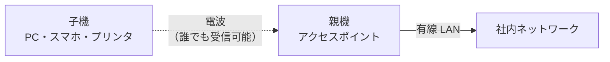

# 5-7 無線LAN

重要度：★★★

## 縮寫展開

| 縮寫／外來語 | 英文全名 | 日文／說明 |
|---|---|---|
| **LAN** | **Local Area Network** | 構内網路 |
| **AP** | **Access Point** | アクセスポイント＝**親機（おやき）** |
| **SSID** | **Service Set Identifier** | 無線網路的識別名稱 |
| **ESSID** | **Extended Service Set Identifier** | 多台 AP 組成同一網路時的識別名稱 |
| **WEP** | **Wired Equivalent Privacy** | 最舊的加密方式，已**危殆化** |
| **WPA** | **Wi-Fi Protected Access** | 補強 WEP 的弱點 |
| **WPA2** | **Wi-Fi Protected Access 2** | **採用 AES** |
| **WPA3** | **Wi-Fi Protected Access 3** | 補強 WPA2 |
| **PSK** | **Pre-Shared Key** | **事前共有鍵**（＝パスフレーズ） |
| **AES** | **Advanced Encryption Standard** | 共通鍵暗号方式（→ 2-2） |
| **RC4** | **Rivest Cipher 4** | WEP 使用的舊演算法 |
| **TKIP** | **Temporal Key Integrity Protocol** | WPA 使用 |
| **CCMP** | **Counter mode with CBC-MAC Protocol** | WPA2 中承載 AES 的協定 |
| **SAE** | **Simultaneous Authentication of Equals** | WPA3 的鍵交換方式 |
| **Wi-Fi Direct** | **Wi-Fi Direct** | 裝置間直連 |
| **ウォードライビング** | **war driving** | 移動中搜尋無線網路 |
| **ウォーチョーキング** | **war chalking** | 用粉筆標記找到的網路 |
| **RADIUS** | **Remote Authentication Dial In User Service** | 認證伺服器協定（→ 5-6） |
| **MAC アドレス** | **Media Access Control address** | 網卡固有位址 |

## 無線LANとは

**不使用 LAN ケーブル（實體網路線，屬於第 1 層 物理層 → 5-6）**就能連上公司內網。代表就是 **Wi-Fi**。
比有線方便，**但同時更容易被竊聽**。

### 為什麼無線特別容易被竊聽

**不是協定比較弱，是「媒體」的性質不同：**

> **有線要竊聽，必須實際接上那條線；無線的電波會穿過牆壁，在停車場就收得到。**

**對照 5-6 學過的東西：**

| | 訊號送給誰 |
|---|---|
| **リピータハブ**（→ 5-6） | 往所有埠複製一份 → 全員收得到 |
| **無線LAN** | **電波往四面八方發送 → 範圍內全員收得到** |

**無線LAN 在本質上就是「所有人共用同一條線」的環境**，跟老式 ハブ 同一個結構。
差別在於：**有線的 ハブ 至少要人進到機房才碰得到，無線的「ハブ」範圍延伸到建築物外面。**

> **所以無線LAN 的所有安全機制都在回答同一個問題：既然誰都收得到，怎麼讓只有該收的人讀得懂。**

## 基本用語

| 用語 | 讀音 | 內容 |
|---|---|---|
| **親機** | **おやき** | ＝**アクセスポイント（AP）**／**無線LANルータ**。一邊用電波接子機，一邊用有線接內網 |
| **子機** | **こき** | 透過無線LAN 通信的機器：PC、スマートフォン、タブレット端末、ゲーム機、プリンタ |
| **SSID** | — | 連接親機時的識別名稱，**透過電波向周圍公開**。又稱 **ESSID** |

**SSID 與 ESSID**：嚴格說 SSID 指單一 AP 的網路名稱，ESSID 用於多台 AP 組成同一網路時。
**但考試上當同義詞處理。**

### ⚠️ 「向周圍公開」的意思

親機會**定期主動發送 ビーコン信号（beacon）**廣播自己的 SSID——所以手機打開 Wi-Fi 才會跳出一串名稱。

> **攻擊者不用做任何事，光是站在那裡就知道你有哪些無線網路。**

### 親機是「邊界」

**子機那側是電波（誰都收得到），親機另一側是實體線路直達內網。**

> **只要有人成功連上無線LAN，他就已經在你的內網裡了。**

## 暗号化の二つの目的

| 目的 | 內容 |
|---|---|
| **通信を傍受されても読めなくする** | 機密性 |
| **第三者が簡単に接続できないようにする** | **アクセス制御** |

### ⚠️ 加密金鑰同時兼任「認證資訊」

> **不知道金鑰的人，根本連不上。**

家裡 Wi-Fi 那串密碼就是 **事前共有鍵（PSK，Pre-Shared Key）／パスフレーズ**。
**它既用來推導加密金鑰，也等於入場券。**

| 模式 | 內容 | 金鑰外洩時 |
|---|---|---|
| **パーソナルモード（WPA2-PSK）** | **全員共用一把 PSK** | **全公司要一起換** |
| **エンタープライズモード** | **IEEE 802.1X ＋ RADIUS**（→ 5-6）。每人有自己的帳號或クライアント証明書 | **停掉那一個帳號就好** |

## 暗号化技術の世代

| | 加密演算法 | 狀態 |
|---|---|---|
| **WEP**（Wired Equivalent Privacy） | **RC4** | **危殆化**（→ 2-1）。**數分鐘內可破解，不可使用** |
| **WPA**（Wi-Fi Protected Access） | **TKIP** | 補強 WEP 的過渡方案 |
| **WPA2** | **AES**（CCMP） | **← 考題最愛問這個對應** |
| **WPA3** | **SAE** | 最新，**但也已發現若干脆弱性** |

**由上到下，從弱到強。**

> **「WPA2 ＝ AES」是必背的對應關係。**

### 「WPA3 也有脆弱性」這件事本身就是考點

這正是 2-1 **危殆化（きたいか）** 的本質：

> **沒有永遠安全的演算法，只有「目前還沒被攻破的」。密碼技術是會過期的。**

## Wi-Fi Direct

**不經過アクセスポイント，裝置之間直接連線的通信技術。**
其中一台臨時扮演 AP 的角色。

**典型場景**：手機直接印到印表機、兩台遊戲機對戰、畫面投影（Miracast）。
**現場沒有任何 Wi-Fi 基地台也能用。**

### ⚠️ 容易誤解的地方

**「查出本機 IPv4，用手機輸入那個 IP 連進去」——那不是 Wi-Fi Direct。**
那仍然**透過路由器／AP 在轉送**，只是沒繞到外網。**Wi-Fi Direct 連 AP 都不經過。**

## SSID ステルス

**讓親機發出的電波不含 SSID 的功能。** 不開啟時親機會持續發送訊號昭告存在。
目的是防止 **不正アクセス** 與 **なりすまし**——知道 SSID 的人**自己手動輸入**來連線。

### ⚠️ 但它比想像中弱很多（考點）

> **SSID 並不是只出現在 ビーコン信号 裡。**

子機連線時會送 **プローブ要求（probe request）**，親機回 **プローブ応答（probe response）**，關聯時還有 **アソシエーション要求（association request）**——
**這些訊框都帶著 SSID，而且是明文。**

**所以攻擊者只要在旁邊等，等到任何一個正規使用者連線的瞬間，SSID 就暴露了。**

**而且它還有反效果：**

> **知道隱藏 SSID 的子機，會走到哪裡都主動大喊「請問 XXX 在不在？」**

因為對方不廣播，只能由子機主動探詢。
**結果是員工帶筆電去咖啡廳，那台筆電就在咖啡廳裡廣播你公司的內部 SSID。**

> **結論：SSID ステルス 只是「気休め（聊勝於無）」，不能取代加密。真正的防線永遠是 WPA2／WPA3。**

## ⚠️ MAC アドレスフィルタリング も不十分

只讓登記過的網卡連線。**看起來合理，但幾乎沒有防護力：**

- **MAC アドレス 可以偽造**
- **它在無線訊框裡是明文傳送的**

**攻擊者只要在旁邊監聽，就能抄到一個合法的 MAC，把自己改成那個。**

> **題目問「以下哪個對策不充分」時，MAC アドレスフィルタリング 與 SSID ステルス 是常見的正解。**

## ⚠️ 頻出の判断原則：「接続を防ぐ」のか「接続後を制御する」のか

**典型的設問**：參加者每次都不同的公開研討會，要**阻止參加者以外的終端連上 AP**，哪個對策有效？

**四個候補裡，只有一個在管「能不能連上」，其餘三個都是「連上之後」的事：**

| 機能 | 管的是什麼 | 對「阻止連線」有效嗎 |
|---|---|---|
| **DHCP サーバ**的 IP 配發範圍 | 連上之後拿到什麼 IP | **✗** |
| **URL フィルタリング** | 連上之後能看哪些網站 | **✗** |
| **事前共有鍵（PSK）を毎回変更する** | **能不能連上** | **○ 正解** |
| **プライバシセパレータ** | 連上之後能不能互相通信 | **✗** |

> **「不知道金鑰就連不上」——這就是本節「加密金鑰同時兼任認證資訊」的直接應用。**
> **每場研討會換一次，是因為上一場的參加者也知道那把鑰匙。**

**解題時先問自己一句：這個機能作用在「連線之前」還是「連線之後」？**

### 這題帶出的三個用語

| 用語 | 英文全名 | 內容 |
|---|---|---|
| **DHCP サーバ** | **Dynamic Host Configuration Protocol** | 機器啟動時**自動配發 IP アドレス** |
| **URL フィルタリング** | **URL filtering** | 限制**能瀏覽哪些網站**，指定 URL 許可／拒否 |
| **プライバシセパレータ** | **privacy separator**（＝**アクセスポイントアイソレーション**／**AP isolation**） | **禁止連到同一台 AP 的機器彼此直接通信** |

**プライバシセパレータ 是公共 Wi-Fi 的標準配備**——咖啡廳裡的人連到同一台 AP，**但彼此看不到對方的電腦**，防的是同一網路內的橫向偷窺。

**它與 5-6 的 VLAN 是同一個思想的微型版：都在切割「連在一起」與「能互相通信」這兩件事。**

## 脅威：ウォードライビング

**開車／騎車帶著天線到處跑，尋找沒設防或加密很弱的無線網路。**
後果是**內部資訊被竊聽**，或伺服器・PC 的情報**洩漏、竄改、刪除**。

**延伸（愛考）：ウォーチョーキング（war chalking）**——找到之後**用粉筆在牆上或人行道畫記號**，告訴同夥這裡有可用的網路。名字來自 chalk（粉筆）。

## 対策まとめ

| 対策 | 重點 |
|---|---|
| **用意された最強の暗号技術を使う** | 盡可能 **WPA2 以上**，最低也要 WPA。**WEP 絕對不可用** |
| **パスフレーズは 20 文字以上** | 破解靠 **ブルートフォース（総当たり）**，**長度每多一字成本指數上升**。呼應 1-3「長度的效果大於複雜度」 |
| **接続ログを収集する** | **不防止任何事**，但沒有它就查不出誰在何時連過、做了什麼 |

**最後一項對應 5-2 的內部對策思想**：**承認有人會進來，所以要留下追蹤的能力。**

## 前因後果

**無線LAN 是 Ch5 裡唯一一個「問題來自物理現實、而非設計選擇」的主題。**

前面幾節的限制都是取捨的結果——ファイアウォール 放棄看內容是為了速度，IDS 只看副本是為了不擋住流量。
**但無線LAN 的根本問題不是任何人選的：電波就是會擴散，這是物理。**

> **你無法讓電波只飛給該收的人。所以唯一的答案是「讓別人收得到但讀不懂」——也就是加密。**

**這解釋了本節的兩個特徵：**

**① 為什麼加密在無線LAN 裡是唯一真正的防線。**
SSID ステルス 想做的是「讓人不知道我在這裡」，MAC アドレスフィルタリング 想做的是「認得出誰是自己人」——
**兩者都試圖繞過「電波誰都收得到」這個前提，所以都失敗了。**
**只有加密是正面回答它的。**

**② 為什麼加密技術會一代一代換。**
WEP → WPA → WPA2 → WPA3 這條線，就是 2-1 **危殆化** 的實物展示。
**而且本節明說了 WPA3 自己也有脆弱性**——這比課本上任何抽象定義都更能說明：

> **「使用最新的加密技術」不是一次性的動作，是一個持續的義務。**

### 與其他節的連結

| 相關 | 連結 |
|---|---|
| **1-4 スニッフィング** | 無線LAN 是竊聽門檻最低的環境 |
| **1-5 なりすまし** | 加密金鑰兼任認證，所以加密也是なりすまし對策 |
| **2-1 危殆化** | WEP→WPA3 是危殆化最清楚的實例 |
| **2-2 共通鍵暗号方式** | WPA2 的 AES |
| **5-6 リピータハブ** | **同一個結構：媒體被所有人共用** |
| **5-6 IEEE 802.1X** | エンタープライズモード 就是它 |

## 待補（考後）

- IEEE 802.11 各規格（a/b/g/n/ac/ax）→ Ch7 回填
- WPA2 的 KRACK 攻擊、WPA3 的 Dragonblood
- 公衆無線LAN 利用時的注意事項（VPN 併用）
- 悪魔の双子（Evil Twin）／偽アクセスポイント
- ANY 接続拒否設定
- DHCP の仕組みと DHCP スヌーピング → Ch7 回填
