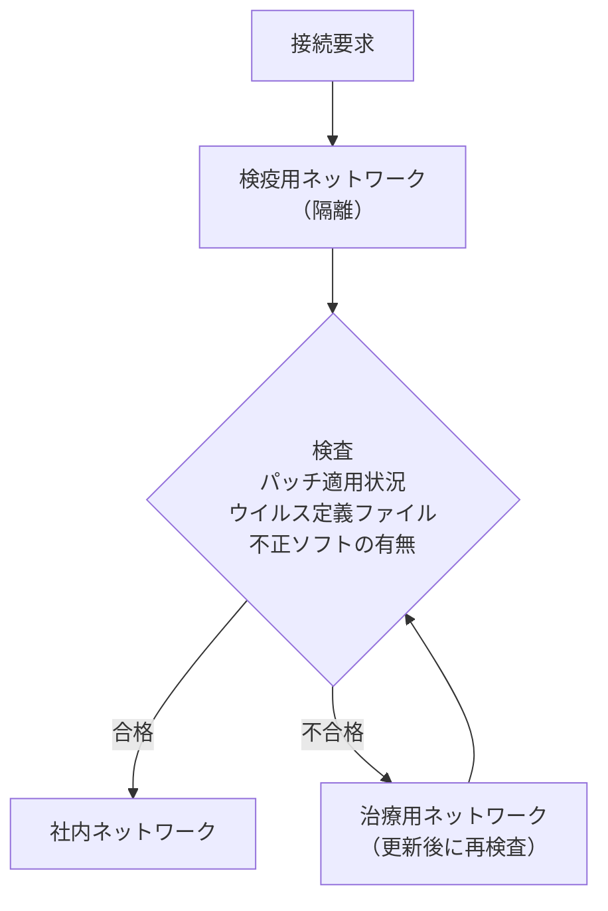
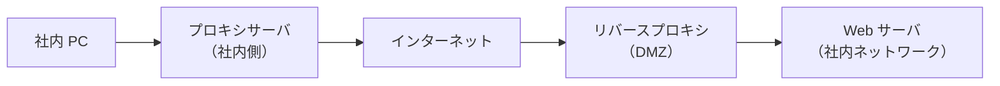
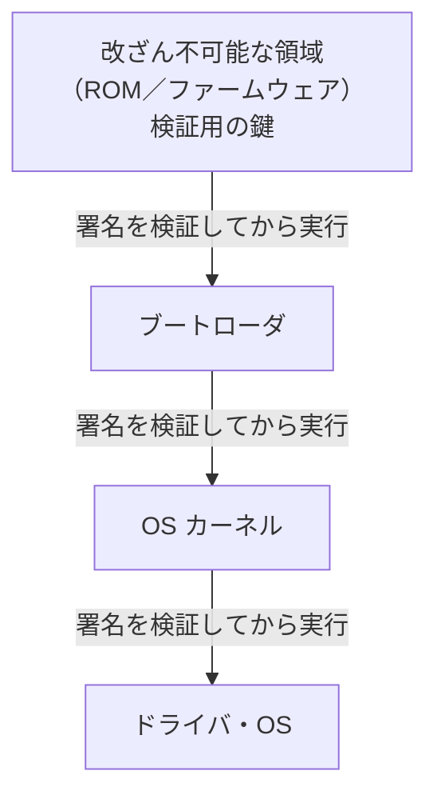

# 5-8 その他の製品

重要度：★★★

## 縮寫展開

| 縮寫／外來語 | 英文全名 | 日文／說明 |
|---|---|---|
| **DLP** | **Data Loss Prevention** | 情報漏洩対策製品 |
| **SIEM** | **Security Information and Event Management**（唸 **シーム**） | ログの統合・相関分析 |
| **UTM** | **Unified Threat Management** | **統合脅威管理** |
| **SSL** | **Secure Sockets Layer** | 已全面廢止，現行為 TLS |
| **TLS** | **Transport Layer Security** | 通信加密協定 |
| **BYOD** | **Bring Your Own Device** | 私物端末の業務利用 |
| **シャドーIT** | **shadow IT** | **無断**で業務利用される機器・サービス |
| **サンクションIT** | **sanctioned IT** | **公司正式許可並管理**的 IT（sanction＝批准） |
| **MDM** | **Mobile Device Management** | 行動裝置管理 |
| **MAM** | **Mobile Application Management** | 行動應用管理 |
| **EDR** | **Endpoint Detection and Response** | 端末の検知・対応 |
| **EPP** | **Endpoint Protection Platform** | 従来型のアンチウイルス |
| **VDI** | **Virtual Desktop Infrastructure** | 仮想デスクトップ基盤 |
| **シンクライアント** | **thin client** | thin＝薄い（終端功能最小化） |
| **ファットクライアント** | **fat client／rich client** | 終端自己處理（一般的 PC） |
| **LAN アナライザ** | **LAN analyzer** | ＝**パケットキャプチャ／プロトコルアナライザ** |
| **ミラーポート** | **mirror port** | 複製通信的埠 |
| **TPM** | **Trusted Platform Module** | ＝**セキュリティチップ** |
| **WORM** | **Write Once Read Many** | 一次寫入、多次讀取 |
| **電子透かし** | でんしすかし／**digital watermark** | 數位浮水印 |
| **耐タンパ性** | たいタンパせい／**tamper resistance** | 抗篡改性 |
| **検疫ネットワーク** | けんえきネットワーク／**quarantine network** | 檢疫網路 |
| **ゼロトラスト** | **zero trust** | — |
| **境界型防御** | きょうかいがたぼうぎょ | 傳統的邊界防禦 |
| **ゼロ知識証明** | ゼロちしきしょうめい／**zero-knowledge proof** | — |
| **リモートワイプ** | **remote wipe** | 遠端抹除 |

---

## 検疫ネットワーク

**PC 連上網路「之前」，先確認它沒被感染的機制。** 「検疫」就是防疫用語的檢疫。

**重點是「連上之前」**（呼應 5-7 的判斷原則）。
**它防的是「自己人帶病進門」**——員工把筆電帶回家用了一週，回來直接插上內網。

## 耐タンパ性

**防止內部被**細工（さいく，動手腳）**、竄改或偽造的性質。**
典型作法：**偵測到被撬開就自我銷毀記憶內容**。

**不只 IC カード**——HSM、ATM、遊戲主機都有。

> **接 2-9 的 所有物認証**：IC カード 能當「持有物」的憑據，前提是**裡面的秘密拿不出來**。
> **耐タンパ性 就是在保證這個前提。**

## 電子透かし（digital watermark）

埋入著作權資訊的技術。**人眼／人耳察覺不到，複製之後仍然留在檔案裡。**

### ⚠️ 方向容易記反

> **它不防止複製，它讓複製品「可以被追蹤」。**

有人散布你的音樂，你可以從那份檔案抽出浮水印**證明來源**。

**又是「検知」而不是「防止」**——跟 **2-5 デジタル署名**、**5-5 WAF** 是同一個模式。
**很多資安機制做的不是阻止壞事發生，而是讓壞事發生後查得出來。**

## DLP（Data Loss Prevention）

| 步驟 | 內容 |
|---|---|
| ① | **檢索組織內部的機密資料在哪** |
| ② | **監視這些檔案的使用狀況** |
| ③ | **限制複製、變更、傳送** |

### 它的特別之處：保護對象變了

> **以前的產品守的是「地方」（邊界、網段），DLP 守的是「資料本身」。**

所以它必須先掃描全組織找出機密資料——**你得先知道要保護什麼。**

**這是 5-2 出口対策 的具體產品**，也是**內部不正對策**的主力（員工自己把檔案寄出去，防火牆完全管不到）。

## SIEM（唸 シーム）

收集來自伺服器、網路機器、資安產品的**ログ**並分析，發現可疑時通知管理者。
為對抗**巧妙化（こうみょうか）**的攻擊，偵測攻擊的**予兆**與異常，並在**リスクが顕在化（けんざいか）**後追溯原因。

### 核心動作：相関分析（そうかんぶんせき）

> **單看任何一台機器的日誌都很正常，把多台的日誌兜在一起才看得出是攻擊。**

| 單獨看 | 合起來看 |
|---|---|
| 凌晨三點登入成功 → 只是加班 | |
| 存取了平常不碰的檔案伺服器 → 只是換部門 | **＝ 1-9 的 APT** |
| 大量資料往外送 → 只是備份 | |

**這正是為什麼需要 SIEM——APT 的特徵就是「每一步都不顯眼」，只能靠跨來源的關聯才抓得到。**

## UTM（統合脅威管理）

**把各種資安產品整合成一台**，讓中小企業能直接使用。
包含 マルウェア対策ソフト、ファイアウォール、IDS、IPS、WAF 等。

| 優點 | 缺點 |
|---|---|
| 價格便宜、**省去自行管理的麻煩** | **拡張性が低い**、**融通が効かない**（→ 5-4 的用詞） |

**追加考點**：**UTM 是單點集中，所以同時是效能瓶頸與 SPOF（単一障害点）**——
**跟 5-6 的 VPN 閘道是同一個問題。**

## SSL/TLS アクセラレータ

**為減輕 Web サーバ 的 CPU 負荷**，把 SSL/TLS 的加解密交給專用產品處理。

**SSL 因發現脆弱性而被 TLS 取代**，現在正式名稱都是 TLS；
**但習慣上仍常稱 SSL アクセラレータ、SSL 証明書。題目寫 SSL/TLS 是同一件事。**

> **這台機器你在 5-5 見過**——它造出「從這裡開始是明文」的界線，**而 WAF 只能放在那條界線之後。**

## プロキシサーバ

設置在內網與外網之間，**代理**內部機器的對外連線。

| 機能 | 內容 |
|---|---|
| **代理アクセス** | 內部 PC 不直接出去。**外部只看得到 Proxy 的 IP，看不到內部結構** |
| **キャッシュ機能** | 看過的網頁暫存，**再次瀏覽直接回快取** → 減少通信量、加快回應 |
| **ウイルスチェック** | 檢查經過的（含快取中的）檔案有無感染 |
| **URL フィルタリング** | 限制能存取哪些網站 |
| **ログ取得** | **誰、何時、看了哪裡** |

**資安上最重要的是第一個與最後一個。**
所有對外通信被迫經過一個點 → **可以在那裡檢查、記錄、阻擋**。
**惡意程式想連 C&C 伺服器也得經過 Proxy**，於是擋得掉——**這是 5-2 出口対策 的實作主力。**

> **「禁止 PC 直接連外網，一律走 Proxy」是企業網路的基本設計。**
> **5-2 那條防火牆規則（遮斷不經過 Proxy 的對外通信）就是在強制執行它。**

## リバースプロキシサーバ

放在網際網路與 Web サーバ 之間，**代理 Web サーバ 接收請求**（例：nginx）。

| 機能 | 內容 |
|---|---|
| **直接攻撃の防止** | 外部無法直接打到 Web サーバ |
| **暗号化処理の肩代わり** | 費時的加解密由它處理，**減輕 Web サーバ 負荷** |
| **負荷分散（ロードバランシング）** | 後面擺多台 Web サーバ，輪流分派請求 |

### 兩種 Proxy 是鏡像關係

| | **フォワードプロキシ**（一般說的 Proxy） | **リバースプロキシ** |
|---|---|---|
| 代理誰 | **內部的客戶端** | **內部的伺服器** |
| 方向 | 內部 → 外部 | **外部 → 內部** |
| 目的 | 管控員工上網 | 隱藏真正的伺服器、負載分散、集中處理 TLS |
| 放哪 | 內網邊界 | **DMZ**（→ 5-3） |

> **兩者都叫 Proxy、都站在中間轉送，但保護的對象完全相反**——**一個保護裡面的人，一個保護裡面的伺服器。**

### 實務上常是同一台機器

| 角色 | 做什麼 |
|---|---|
| **リバースプロキシ** | 代理 Web サーバ 接收請求 |
| **SSL/TLS アクセラレータ** | 在這裡解密 |
| **WAF** | 解密後、送到應用程式前檢查（→ 5-5） |

> **TLS 在哪裡終止，WAF 就放在哪裡——而那個位置通常就是 リバースプロキシ。**

## BYOD・シャドーIT・サンクションIT

**BYOD ＝ 讓員工用自己的裝置從事業務。**

| 優點 | 缺點 |
|---|---|
| 公司**不用購買機器**；員工用習慣的裝置，**效率提升** | **公司資料被帶到外面**，洩漏風險上升 |

### 三者的關係

| | 裝置是誰的 | 公司知不知道 | 在管理之下嗎 |
|---|---|---|---|
| **会社支給端末** | 公司 | ○ | ○ |
| **BYOD** | **員工自己的** | ○ | **○ 有規則、有管理** |
| **シャドーIT** | 自己的裝置／自己找的雲端服務 | **✗ 完全不知情** | **✗** |

> **BYOD 是 サンクションIT 的一種。判斷點永遠是「有沒有經過許可」，不是「裝置屬於誰」。**

### BYOD 的真正導入動機

> **禁止也擋不住員工偷用自己的手機，那不如正式許可、納入管理。**
> **導入 BYOD 的目的之一，就是消滅 シャドーIT。**

**因為 シャドーIT 真正可怕的不是「用了私人裝置」，而是「公司根本不知道有這回事」**——出事了連哪些資料外流都查不出來。

### 對應的機制

| 機制 | 內容 |
|---|---|
| **MDM** | 統一管理裝置：強制加密、強制設密碼、禁止安裝特定 App、派送憑證（→ 5-6） |
| **リモートワイプ** | **遺失時遠端抹除資料** |
| **MAM** | 只管理「業務用 App 與其資料」，**不碰員工的私人區域** |
| **利用規程の策定** | 明文規定可以做什麼、出事怎麼辦 |
| **VDI** | **資料根本不存在終端上** |

## MDM（Mobile Device Management）

**一句話：把一百台裝置當成一台來管的工具。**

| 情境 | 管理者做什麼 |
|---|---|
| 新人報到 | 手機開機、登入 → **Wi-Fi 設定、憑證、信箱、必裝 App 全部自動灌進去** |
| 全員要裝新 App | **管理畫面按一次，100 支同時安裝** |
| 手機掉了 | **遠端上鎖，或リモートワイプ** |
| 員工離職 | 遠端移除公司的資料與設定 |
| 防資料外流 | 統一禁止截圖、禁止複製到私人 App、強制加密 |

### 結構：兩塊

| | 內容 |
|---|---|
| **管理サーバ（管理畫面）** | IT 人員操作，看得到所有裝置、下指令 |
| **端末側の管理用プロファイル／エージェント** | 裝在每台手機裡，**負責聽從並執行指令** |

> **關鍵在第二塊。而裝進去的動作叫「端末登録（enrollment）」，這是整件事的權力來源——登録之前，MDM 什麼也做不了。**

### ⚠️ BYOD 的隱私問題 → MAM

那是員工自己的手機，**你必須請他同意讓公司裝管理設定進去**。
有人會覺得「公司要監控我的私人手機」而抗拒——**這是合理的顧慮。**

> **MDM 管「裝置」，MAM 管「應用程式與資料」。BYOD 的場合用 MAM 比較不會踩到隱私問題。**

## EDR（Endpoint Detection and Response）

**エンドポイント ＝ PC、手機這些「末端的機器」。**

偵測不正當的舉動，快速進行 **インシデント対応**。可**遠端把裝置從網路隔離**、**停用可疑的程式**。

| | **従来のアンチウイルス（EPP）** | **EDR** |
|---|---|---|
| 目標 | **不讓它進來** | **進來之後快速發現、快速處理** |
| 前提 | 擋得住 | **擋不住** |

> **EDR 就是 5-2 那句「侵入は防げない」的產品化。**

## VDI（Virtual Desktop Infrastructure）

**把原本在終端上執行的東西，改到伺服器的仮想環境上執行，只把畫面送回終端。**

| 好處 | 內容 |
|---|---|
| **統一管理** | 機器不由個人管理，**マルウェア定義ファイル、セキュリティパッチ 統一更新** |
| **資料不在終端上** | **被偷、遺失時沒有資料可被竊取** |

### ⚠️ シンクライアント との関係（容易記反）

> **シンクライアント 的「thin」是「薄」——指終端只有最低限度的功能，不做處理。**

| | 處理在哪裡 |
|---|---|
| **ファットクライアント（fat／rich client）** | **在終端上執行**（一般的 PC） |
| **シンクライアント（thin client）** | **在伺服器上執行**，終端只顯示畫面 |

**VDI 與 シンクライアント 是「實作方式」與「概念」的關係：**

> **シンクライアント 是方式的總稱，VDI 是實現它的代表性做法之一。VDI ⊂ シンクライアント，兩者不是對立關係。**

（VDI 的做法是在伺服器上為每個使用者跑一台虛擬機。其他做法還有畫面轉送型、ネットワークブート型。）

**最核心的好處是那句：資料不在終端上**——**這又是「讓前提不成立」的同一個形狀（→ 5-1 ウェブアイソレーション）。**

## LAN アナライザ・ミラーポート

| | 內容 |
|---|---|
| **LAN アナライザ** | 監視並記錄網路上的通信。又稱 **パケットキャプチャ／プロトコルアナライザ** |
| **ミラーポート** | 某個埠收到通信時**同時複製一份送到另一個埠**，供監測與記錄 |

### ⚠️ LAN アナライザ 的雙面性（考點）

> **管理者用它診斷網路故障，攻擊者用同一個工具就是 スニッフィング（→ 1-4）。**
> **工具本身中立，差別只在誰在用。**

**ミラーポート 你在 5-4 見過**——IDS 就是靠它拿到通信的副本。

### 頻出パターン：準備 LAN アナライザ 時的留意事項

**正解的方向：注意不要被惡用於竊聽。**

**三個誤答與它們錯的理由：**

| 誤答的型 | 為什麼錯 |
|---|---|
| 「測定中必須**限制對象外電腦的使用**」 | **LAN アナライザ 不會丟棄封包**。它只看複製品，不碰正本 |
| 「測定時必須**暫時拔掉 LAN ケーブル**」 | **不需要拔**。反而是要把線**插到 ミラーポート 上** |
| 「事先向使用者**周知保管場所與使用方法**」 | **正好相反，不可以周知**（見下） |

> **前兩者錯的理由是同一個——LAN アナライザ 是被動的。**
> **它從 ミラーポート 拿到的是複製品，對正本完全不干涉。**

**這跟 5-4 的 IDS 是完全同一個結構。**
「IDS 只有副本，所以想擋也擋不住」這個性質的另一面，
**就是「想干擾也干擾不了＝不影響通信」。**

### ⚠️ 「周知しておく」變成誤答的題型（值得記住）

「事先向使用者周知」**在一般情況下看起來是良好的管理實務**。但是——

> **LAN アナライザ 是監視工具。公開它放在哪、怎麼用，等於告訴所有人「如何竊聽這個網路」。**

**判別法：**

> **看到「周知しておく」「利用者に知らせる」這類選項，先看對象是什麼。**
> **如果對象是資安工具或監視機制本身，「公開」通常就是錯的。**

## セキュアブート

**目的：防止 OS 啟動「之前」就被動手腳。**

**為什麼重要**：若惡意程式在 OS 之前載入（**ブートキット／ルートキット → 1-2**），
**防毒軟體啟動時環境已被控制**——它看到的一切都可以是假的。

### 機制：逐段驗證署名

**每一段在執行下一段之前，先驗證其デジタル署名**，不合格就停住。

### ⚠️ 這個結構你在 2-6 見過：信頼の連鎖（chain of trust）

| | 信任的起點 | 起點靠什麼保證 |
|---|---|---|
| **PKI（2-6）** | **ルート証明書** | **自己簽自己** |
| **セキュアブート** | **ROM 裡那把鑰匙** | **物理上改不了** |

> **這是 2-6 結論的硬體版：密碼學能傳遞信任，但無法無中生有，總得選一個起點。**

## TPM（Trusted Platform Module）

**＝セキュリティチップ。具耐タンパ性的半導體，焊在主機板上。**

| | 內容 |
|---|---|
| **能做什麼** | 生成並保管**鍵ペア**、計算**ハッシュ**、生成／驗證**デジタル署名**、加解密（RSA 等） |
| **最關鍵的性質** | **秘密鍵永遠不離開晶片** |

### 核心價值

> **磁碟是加密的，而解密金鑰鎖在 TPM 裡面，TPM 焊死在這台主機板上。**
> **所以小偷拔走硬碟插到別台電腦，永遠解不開——因為鑰匙沒跟著走。**

### 與 セキュアブート 的搭檔關係

TPM 保管驗證用的鑰匙、**記錄開機過程的雜湊值**；
**若開機流程被改過，雜湊值就對不上，TPM 就拒絕交出磁碟解密金鑰。**

## WORM（Write Once Read Many）

**與病毒 ワーム（worm，蠕蟲）只是拼法碰巧相同，毫無關係。**

**寫入一次、可重複讀取；寫完無法竄改或刪除。** 例：CD-R、DVD-R、BD-R。

### 資安意義：保護証跡

**攻擊者入侵後的標準動作就是刪除日誌湮滅痕跡，WORM 讓他刪不掉。**

> **接點**：5-1 說「備份一直連著會被 ランサムウェア 一起加密」——
> **WORM 儲存（イミュータブルバックアップ）就是那個問題的答案。寫進去就改不了，勒索軟體也加密不了它。**

## ゼロトラスト

**不是靠「遮斷外部」的 境界型防御（きょうかいがたぼうぎょ）**，
**而是連內部網路的通信也不信任，對所有通信進行檢查與認證。**

> **原則一句話：「決して信頼せず、常に検証する（Never trust, always verify）」**

### 這條線從 5-2 就開始鋪了

| 節 | 往前推了一步 |
|---|---|
| **5-3 DMZ** | 信任從 2 段變 3 段 |
| **5-2 三層対策** | **承認邊界會被突破** |
| **5-6 VLAN** | 在內部也切出邊界 |
| **5-6 IEEE 802.1X** | 信任由「**你是誰**」決定，不由「你插在哪」決定 |
| **5-8 ゼロトラスト** | **把「內部」這個特權徹底廢除** |

## ゼロ知識証明（ゼロちしきしょうめい）

**證明自己知道某個機密，但不用**明言（めいげん，講明）**內容就能證明。**

> **接 2-9 チャレンジレスポンス**——那邊也是「證明我知道密碼，但不把密碼送出去」。
> **Ch2 那句話在這裡第三次出現：讓秘密不需要被送出去。**

---

## 前因後果

**本節表面上是「其他產品」的雜燴，實際上是 Ch5 全章的收束——因為這裡出現的東西，幾乎都在回答前七節留下的問題。**

| 前面留下的問題 | 本節的回答 |
|---|---|
| 5-2「侵入は防げない」 | **EDR**（進來之後快速處理） |
| 5-2 出口対策 要怎麼做 | **DLP**、**プロキシサーバ** |
| 5-1 備份會被一起加密 | **WORM／イミュータブルバックアップ** |
| 5-7 接続ログ 要拿來做什麼 | **SIEM 的相関分析** |
| 1-9 APT 每一步都不顯眼 | **SIEM**（跨來源關聯） |
| 5-5 WAF 要放在哪 | **リバースプロキシ ＋ SSL/TLS アクセラレータ** |
| 中小企業買不起這麼多產品 | **UTM** |

**而全章反覆出現的三個思想，在本節同時到齊：**

### ① 讓前提不成立

**VDI**——不保護終端裡的資料，**讓終端裡根本沒有資料**。
與 **5-1 ウェブアイソレーション**、**2-x セッション鍵**、**ゼロ知識証明** 完全同型。

### ② 防止不了就改成檢知

**電子透かし**——不阻止複製，讓複製品可追蹤。
與 **2-5 デジタル署名**、**5-5 WAF**、**5-7 接続ログ** 同型。

> **很多資安機制做的不是阻止壞事發生，而是讓壞事發生後查得出來。**

### ③ 信任必須有一個無法證明的起點

**セキュアブート 的 ROM**、**TPM 的物理封裝**、**2-6 的 ルート証明書**。

> **三者都是同一件事：信任可以被傳遞和放大，但不能憑空生成。**
> **最後總得有一樣東西，你是靠「物理上改不了」或「約定就這樣」來相信它的。**

### 而 ゼロトラスト 是全章的終點

Ch5 從 **5-2 的「內外之分」** 出發，一路被自己的限制推著走——
DMZ 加一層、三層対策承認邊界會破、VLAN 切內部、802.1X 改用身分、
**最後 ゼロトラスト 把整個出發點推翻：不再有「內部」。**

> **Ch5 的八節，其實是一部「邊界防禦的自我否定史」。**

## 待補（考後）

- SOC（Security Operation Center）／CSIRT → Ch4・Ch8 回填
- XDR・MDR 與 EDR 的關係
- SSL インスペクション（HTTPS を復号して検査）の是非
- ゼロトラストアーキテクチャ（NIST SP 800-207）の具体的構成要素
- CASB（Cloud Access Security Broker）
- ゼロ知識証明 的具體演算法與區塊鏈應用
- 検疫ネットワーク の実装方式（DHCP 方式・認証スイッチ方式・エージェント方式）
