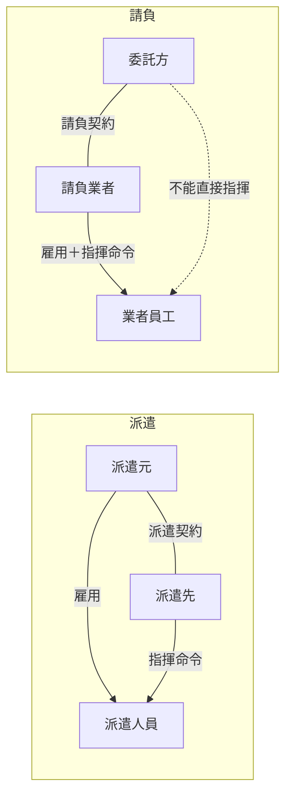

# 6-3 労働関連法規

> 依課本內容以導讀形式重寫，不收錄書上原表與練習問題原文。
> **本節依導讀順序分為 ①〜②。**

## 讀音

| 用語 | 讀音 | 意思 |
|---|---|---|
| 労働基準法 | ろうどうきじゅんほう | 勞動條件的最低標準（「基準」法，不是 6-2 的「基本法」） |
| 法定労働時間 | ほうていろうどうじかん | 1 天 8 小時、1 週 40 小時 |
| 割増賃金 | わりましちんぎん | 加班費 |
| 36協定 | さぶろくきょうてい | 讓加班合法的勞資協定（第 36 條） |
| 届出 | とどけで | 提交（不用核准） |
| 労働基準監督署 | ろうどうきじゅんかんとくしょ | 勞動檢查機關 |
| 就業規則 | しゅうぎょうきそく | 公司內部工作規則 |
| 指揮命令権 | しきめいれいけん | 直接指揮工作者的權利 |
| 労働者派遣 | ろうどうしゃはけん | 派遣（借人） |
| 派遣元／派遣先 | はけんもと／はけんさき | 派遣公司（雇主）／接收派遣人員的公司 |
| 請負 | うけおい | 承攬（買成品） |
| 準委任 | じゅんいにん | 委任執行事務（買專業服務） |
| 出向 | しゅっこう | 保留原公司身分調到別家公司 |
| 出向元／出向先 | しゅっこうもと／しゅっこうさき | 原公司／新公司 |
| 契約不適合責任 | けいやくふてきごうせきにん | 成品不符合約時的修補、減價、賠償責任 |
| 善管注意義務 | ぜんかんちゅういぎむ | 以專業人士應有的注意力執行工作的義務 |
| 偽装請負 | ぎそううけおい | 名為請負、實為派遣的違法狀態 |

---

## 為什麼資安考試要考勞動法

SG 的定位是在一般部門負責資安管理的人，實務上會管理外包、派遣人員。所以要知道：**誰能指揮他們、出事誰負責、做出來的東西屬於誰**。① 是基礎，② 是考試重點。

---

## ① 労働基準法・36協定・就業規則

### 労働基準法：最低標準

- **法定労働時間：1 天 8 小時、1 週 40 小時。**
- 超過要先有 **36協定**，並付加班費。
- 它是**最低標準**，低於它的約定**直接無效**。員工自願說「加班不用錢」也無效。

### 36協定：讓加班合法的手續

1. 公司跟**勞工代表**（工會，或過半數員工的代表）簽協定
2. **提交**給労働基準監督署
3. 提交後才能讓員工加班

**陷阱**：只簽沒交 → 加班違法。提交是「届出」，**不需要核准**，交了就生效。
加班上限原則：**每月 45 小時、每年 360 小時**。

### 就業規則

公司內部的工作規則（上下班時間、休假、懲戒等）。**員工 10 人以上**必須制定並提交労働基準監督署。

> 跟資安的接點：違反資安規定的**懲戒**（Ch4 人的對策）要寫進就業規則才能執行。

---

## ② 派遣・請負・準委任・出向

分法看兩個問題：**誰可以直接指揮工作者？工作沒做好誰負責？**

### 四種契約

| 契約 | 一句話 | 例子 |
|---|---|---|
| 労働者派遣 | **借人**：派遣元把人借給你，你直接指揮 | 派遣工程師到你公司，你安排他每天做什麼 |
| 請負 | **買成品**：只管結果，過程由對方決定 | 委託系統公司「3 月交出會計系統」 |
| 準委任 | **買專業服務**：盡專業水準執行，不保證結果 | 資安診斷、系統監控維運（像看醫生：盡力治療但不保證治好） |
| 出向 | 保留原公司身分，到別家公司工作 | 母公司員工調到子公司 |

### 比較表（考試核心）

| | 派遣 | 請負 | 準委任 | 出向 |
|---|---|---|---|---|
| 誰指揮工作者 | **派遣先** | **請負業者** | **受託者** | **出向先** |
| 完成責任 | ❌ | ✅ | ❌ | ❌ |
| 成品有瑕疵 | — | **契約不適合責任** | — | — |
| 受託方的義務 | — | — | **善管注意義務** | — |

### 陷阱一：偽装請負

簽的是請負，委託方卻**直接指揮對方員工**（例：主管直接走到承包商工程師座位要他加班）。實質上是派遣但沒走派遣手續 → **違法**。要求必須**透過請負業者的負責人轉達**。

### 陷阱二：派遣的雜項規則

| 規則 | 內容 |
|---|---|
| 期間 | 同一人在同一部門**不能超過 3 年** |
| 36協定提交 | **派遣元**（雇主是派遣元） |
| 就業規則 | 適用**派遣元**的 |
| 指揮命令 | **派遣先** |

> **雇用相關（36協定、就業規則）找派遣元；工作相關（指揮命令）找派遣先。**

### 陷阱三：程式的著作權歸誰（無特別約定時）

| 契約 | 著作權 | 理由 |
|---|---|---|
| 請負 | **請負業者** | 對方員工在對方指揮下寫的 → 對方的職務著作 |
| 派遣 | **派遣先** | 在你的指揮下寫的 → 你的職務著作 |

> **誰指揮，著作權就是誰的**（6-1 職務著作的延伸）。所以委託開發時要在合約寫明著作權轉讓給委託方。

---

## 前因後果

- **整節只有一條主線：指揮命令權在誰手上。** 它決定了契約類型（派遣 vs 請負）、是否違法（偽装請負）、著作權歸屬（職務著作）。
- **為什麼要嚴格區分派遣和請負？** 派遣法對派遣人員有保護規定（期間限制、雇主責任）。如果公司用請負的名義行派遣之實，就能逃避這些責任，所以偽装請負被禁止。
- **雇用和指揮分離**是派遣的本質：雇主（派遣元）負責勞動法上的義務，使用者（派遣先）負責日常指揮。考題就是在問「這件事屬於雇用面還是工作面」。
- **跟 Ch3、Ch4 的接點**：外包管理（委託先管理）要在合約中明定資安要求、著作權歸屬、保密義務；懲戒要寫進就業規則。
- **跟 6-1 的接點**：職務著作 → 著作權歸屬。

## 待補（考後）

- 書上 6-3 的重要度★標記
- 準委任的著作權歸屬（原則同請負，歸受託方）是否課本有明確寫
- 出向的雇用關係細節（在籍出向 vs 転籍）
- 其他勞動相關：フレックスタイム制（flextime）、裁量労働制、テレワーク（telework）時的資安規定
- 下請法（したうけほう）等外包相關法規

---

# Ch6 のまとめ

| 節 | 一句話 |
|---|---|
| 6-1 | 智財權三大類：著作權（表現，自動發生）、產業財產權（發明與品牌，申請＋公開）、營業秘密（藏好，三要件） |
| 6-2 | 基本法定方向（無罰則）→ 刑法、不正アクセス禁止法提早處罰 → 個人情報保護法管資料流程 → 其他法律各管一塊 → 倫理補法律的不足 |
| 6-3 | 指揮命令權決定一切：派遣 vs 請負、偽装請負、著作權歸屬 |

**貫穿全章的兩個想法：**
1. **「管理好」是法律保護的前提**：營業秘密要有秘密管理性；個資外洩時加密就免報告。資安措施同時是法律上的證據與免責條件。
2. **誰做的 ≠ 誰擁有**：職務著作、派遣的著作權都看指揮關係，不看實際動手的人。
