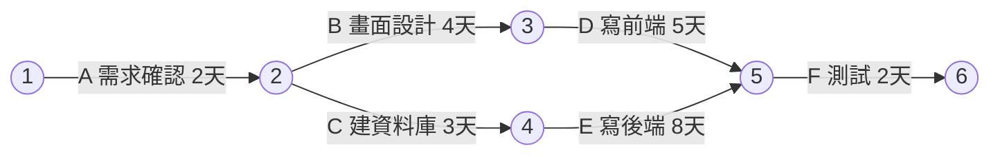

# 8-1 プロジェクトマネジメント

重要度：★★★

> 依課本內容以導讀形式重寫，不收錄書上原表、圖與練習問題原文。
> **本節依導讀順序分為 ①〜②。**

## 縮寫展開

| 縮寫／外來語 | 英文全名 | 說明 |
|---|---|---|
| **プロジェクト** | **project** | 有期限、產出獨特成果的業務 |
| **PMBOK** | **Project Management Body of Knowledge** | 專案管理知識體系 |
| **PMI** | **Project Management Institute** | 美國專案管理協會 |
| **デファクトスタンダード** | **de facto standard** | 事實上的標準 |
| **スコープ** | **scope** | 工作範圍 |
| **ステークホルダ** | **stakeholder** | 利害關係人 |
| **アローダイアグラム** | **arrow diagram** | 箭線圖 |
| **PERT** | **Program Evaluation and Review Technique** | ＝アローダイアグラム（PERT 図） |
| **ダミー作業** | **dummy activity** | 時間 0 的虛擬作業 |
| **クリティカルパス** | **critical path** | 要徑 |

## 讀音

| 用語 | 讀音 |
|---|---|
| 定常業務 | ていじょうぎょうむ |
| 一時的 | いちじてき |
| 独自 | どくじ |
| 統合 | とうごう |
| 資源 | しげん |
| 品質 | ひんしつ |
| 調達 | ちょうたつ |
| 最短所要時間 | さいたんしょようじかん |
| PERT 図 | パートず |

---

## 本節的位置

系統多半用專案做出來。規劃階段沒把資安放進去，做出來的系統先天不良，事後補又貴又難。

---

## ① プロジェクト與 PMBOK

| | プロジェクト | 定常業務 |
|---|---|---|
| 期間 | 有期限，目的達成就結束（一時的） | 持續 |
| 產出 | 獨特（独自）的成果 | 重複 |
| 團隊 | 臨時組成 | 固定部門 |
| 例子 | 建置新官網、導入 ISMS 認證、導入新會計系統 | 每天備份、每週更新防毒定義檔、每月結帳 |

> 「重複持續進行」是定常業務的特徵，常被當誘答。

**PMBOK ガイド**：美國 PMI 整理的最佳實務集。**不是國際標準，是デファクトスタンダード**。分成 10 個知識領域，各自以 PDCA 持續改善。

### 10 個知識領域（五組記）

| 組 | 領域 | 管什麼 | 例子（開發網購系統） |
|---|---|---|---|
| 鐵三角 | スコープ | 工作範圍，不多不少 | 做會員功能、不做點數功能 |
| | タイム | 時程 | 6 個月進度表 |
| | コスト | 預算 | 控制在 500 萬內 |
| 品質 | 品質 | 品質目標 | 頁面 2 秒內載完 |
| 人 | ステークホルダ | 找出**誰**是關係人、決定聯絡方式 | 客戶、使用者、外包商 |
| | 資源 | 組團隊、培養成員 | 找 3 位工程師、資安訓練 |
| | コミュニケーション | 資訊**怎麼**流通 | 每週進度會議 |
| 外部與不確定 | **調達** | 從外部**購買**、簽約與管理 | 資安診斷委外、簽約 |
| | リスク | 找出風險、想對策 | 主要工程師離職怎麼辦 |
| 總管 | **統合** | 統籌整個生命週期，**變更要求**時協調成本與時程 | 客戶臨時加需求，評估影響 |

---

## ② アローダイアグラム與クリティカルパス

- 箭頭＝一件工作（標天數）；圓圈＝分界點，進入的工作**全部完成**後下一件才能開始；虛線＝ダミー作業（時間 0，只表示要等）。

### 例子：開發小網站

| 路徑 | 天數 |
|---|---|
| A → B → D → F | 13 |
| A → C → E → F | **15**（要徑） |

- **クリティカルパス**：最花時間的路徑。
- **最短所要時間**：專案最快完成的時間＝**要徑的長度**（15 天）。

> 反直覺：「最短」所要時間看「最長」路徑。最慢的那條決定全體。

### 題型

**延遲**
| 變化 | 結果 |
|---|---|
| E（要徑上）延 1 天 | 全體 16 天 |
| B（非要徑）延 1 天 | 那條 14 天，全體仍 15 天 |
| C 延 2 天（3→5） | 全體 17 天 |
| D 延 3 天（5→8） | 上面那條變 16 天，**成為新要徑**，全體 16 天 |

**縮短（陷阱）**：E 從 8 天縮為 4 天 → 下面那條 11 天，但上面那條 13 天成為新要徑 → 全體 13 天，**只縮短 2 天，不是 4 天**。

> 縮短或延遲後都要**重算所有路徑**，因為要徑可能換人。

---

## 前因後果

- **專案的本質是「暫時、獨特」**，所以需要一套管理方法（PMBOK）來處理沒做過的事；定常業務則靠 8-2 的服務管理。8-1 管「做出來」，8-2 管「做出來之後穩定運作」。
- **PMBOK 與 ITIL（8-2）都是デファクトスタンダード**，不是國際標準，考題愛在這裡設陷阱。
- **要徑分析的思維跟 7-1 直列系統一樣**：整體被最弱（最慢）的一環決定。改善不在要徑上的地方沒有用。
- **資安的接點**：リスク管理（Ch3 的風險評估思路）、調達（外包時的資安要求，接 3-4 外部委託先管理、6-3 請負與派遣）。

## 待補（考後）

- 書上 8-1 開頭說明的完整頁面確認（知識領域表的下半頁）
- WBS（Work Breakdown Structure）、ガントチャート（Gantt chart）
- EVM（Earned Value Management）
- PMBOK 第 7 版的原則導向變化
